# SANS cross-species integrative transcriptomics — reproducibility record

- **Date:** 2026-07-19
- **Model:** claude-opus-4-8
- **SPARQL endpoint:** https://apps.okn.us/federation/sparql
- **Generated by:** mcp-okn v0.1.0
- **Study active window:** 2026-07-19 07:06–07:38 UTC (32m 40s)
- **Contents:** 28 queries

## Prompt

Conduct a reproducible, cross-species integrative transcriptomics study to identify molecular mechanisms and therapeutic hypotheses for Spaceflight-Associated Neuro-ocular Syndrome (SANS), the neuro-ocular syndrome affecting the retina, optic nerve, and optic disc in astronauts.
Follow the `/okn-bioanalysis` workflow and produce the final report using `/okn-report-style`.
Objectives

1. Identify relevant transcriptomics datasets
   * Find human and animal (mouse, rat, or other vertebrate) spaceflight studies related to the retina, optic nerve, visual system, neuroinflammation, intracranial pressure, or SANS.
   * Include appropriate ground controls and, when available, simulated microgravity datasets.
2. Perform cross-species integration
   * Map orthologous genes across species.
   * Identify conserved differentially expressed genes, pathways, biological processes, and regulatory networks.
   * Rank genes by consistency across datasets, species, and experimental conditions.
3. Mechanistic interpretation
   * Identify significantly enriched pathways, GO terms, molecular functions, cellular components, and upstream regulators.
   * Highlight mechanisms involving neuroinflammation, vascular remodeling, extracellular matrix organization, oxidative stress, mitochondrial dysfunction, axonal injury, retinal degeneration, and cerebrospinal fluid or intracranial pressure regulation.
4. Countermeasure discovery
   * Identify drugs, small molecules, or other interventions that could reverse the observed transcriptomic signature.
   * Prioritize compounds whose known gene-expression effects are anti-correlated with the spaceflight-induced signature.
   * Include existing FDA-approved drugs, investigational compounds, and nutraceuticals where supported by evidence.
   * Rank candidates based on transcriptomic reversal strength, biological plausibility, and available evidence.
5. Evidence validation
   * Search the PubMed and PaperClip MCP tools for supporting and conflicting evidence.
   * For each major hypothesis and candidate countermeasure:
      * summarize supporting studies,
      * summarize contradictory or negative findings,
      * identify evidence gaps,
      * assess overall confidence.
6. Knowledge graph integration
   * Integrate evidence across all relevant knowledge graphs available through mcp-okn.
   * Use cross-graph joins whenever they provide additional evidence (e.g., pathways, diseases, drugs, gene sets, phenotypes, publications, or ontologies).
   * Document which knowledge graphs contributed to each conclusion.

## Notes

Analysis and report produced in a single Cowork session. All 28 logged queries are non-exploratory and row-returning; every knowledge graph credited in the report's Sources table has at least one logged query here, including the spoke-genelab x spoke-okn bridge (query 14), which was run verbatim from the crosswalk catalogue's skeleton rather than hard-coded. Query 28 is the end-of-analysis re-verification. Schema probes, namespace probes and shape-checking queries were marked exploratory and are deliberately absent.

## Knowledge graphs used

- `spoke-genelab` — <https://purl.org/okn/frink/kg/spoke-genelab>
- `spoke-okn` — <https://purl.org/okn/frink/kg/spoke-okn>
- `prokn` — <https://purl.org/okn/frink/kg/prokn>
- `rdkg` — <https://purl.org/okn/frink/kg/rdkg>
- `digcfdekg` — <https://purl.org/okn/frink/kg/digcfdekg>
- `ubergraph` — <https://purl.org/okn/frink/kg/ubergraph>
- `oard-kg` — <https://purl.org/okn/frink/kg/oard-kg>

## Replicator specification

### A. Dataset selection (spoke-genelab)

1. **Vetted contrasts.** Do NOT hand-pick studies. Call `get_valid_contrasts(include_confounded=False)`. It applies:
   - *Rule 1 (direction).* Keep an assay only when `factor_space_1 = "Space Flight"` AND `factor_space_2 = "Ground Control"`. With this orientation group 1 = Space Flight, so **log2fc > 0 means UP in spaceflight**.
   - *Rule 2 (comparability).* Keep only if `material_id_1 = material_id_2` AND, after stripping condition labels ("Space Flight", "Ground Control", "Basal Control", "Vivarium Control", "Cell Culture Control", case-insensitive) and anchored group codes `^(GC|FLT|VIV|BSL|CC)(_C[0-9]+)?$`, `factors_1` and `factors_2` hold the same covariate set.
   - Verified result on 2026-07-19: **188 clean contrasts, 492 confounded assays excluded**.
2. **SANS-relevance filter.** Resolve every `material_id_1` (UBERON/CL) to a label via `ubergraph` `rdfs:label` (logged query 1) and keep four arms:
   - OCULAR: UBERON_0000966 retina, UBERON_0000970 eye, UBERON_0004548 left eye — 5 assays (OSD-100, 162, 194, 255, 397)
   - CNS: UBERON_0000955 brain, UBERON_0002037 cerebellum, UBERON_0002812 left cerebral hemisphere, UBERON_0002961 archicortex/hippocampus, UBERON_0014890 right cerebellar hemisphere — 12 assays (OSD-352, 525, 561, 562, 563, 564, 612, 613)
   - CARDIOVASC: UBERON_0000948 heart, UBERON_0002080 heart right ventricle — 5 assays (OSD-347, 580, 599)
   - FLYHEAD: UBERON_0000033 head — 4 assays (OSD-207)
   Total **26 assays / 17 OSDR studies**. Assay IRIs are enumerated verbatim in the VALUES blocks of queries 2–13.
3. **Excluded by construction.** No optic-nerve tissue exists in the vetted set. No simulated-microgravity (hindlimb-unloading / HDTBR) arm survives Rule 2, because those appear as an arm covariate; the requested simulated-microgravity comparison is therefore NOT covered.

### B. Differential expression

- Reified pattern: `?stmt rdf:subject ?assay ; rdf:predicate gl:MEASURED_DIFFERENTIAL_EXPRESSION_ASmMG ; rdf:object ?gene ; gl:log2fc ?l ; gl:adj_p_value ?p`, with `?gene gl:symbol ?symbol ; gl:taxonomy ?taxonomy`.
- **Primary threshold:** `FILTER(?adj_p <= 0.05 && ABS(?log2fc) >= 1)`.
- **Declared deviation (ocular arm only):** the 5 ocular assays give 38 rows at the primary threshold, too sparse to rank, so the ocular arm was additionally pulled at `FILTER(?adj_p <= 0.05)` with no fold cut (queries 7–11, one assay at a time; the pooled 5-assay form times out and the pooled 4-assay form exhausts endpoint memory). Every downstream row carries a `strict` flag recording whether it also met |log2FC| >= 1.
- Species present: `NCBITaxon_10090` (Mus musculus) and `NCBITaxon_7227` (Drosophila melanogaster). No human OSDR transcriptome exists in this federation.
- Verified totals: 4,819 unique (assay, gene) DE rows; 1,713 mouse and 2,704 fly genes.

### C. Cross-species projection

- Pull the full ortholog map per species with `gl:IS_ORTHOLOG_MGiG` restricted to `gl:taxonomy` = 10090 / 7227 on the left and 9606 on the right (queries 12–13): **22,899 mouse and 19,324 fly edges**.
- **Collapse** to one row per (OSDR study, human gene) with `scripts/collapse_orthologs.py` semantics — representative = max |log2FC|, plus an ambiguity count and a mean-rule sensitivity value. Model genes with no human ortholog are dropped (1,976 genes) and that number is reported.
- **Fan-out penalty (critical).** `fanout(model gene) = |{human genes it maps to}|`. Cross-species credit (`xspecies_ok`) is granted ONLY when a gene has >= 1 mouse study AND >= 1 fly study AND the fly gene's `fanout <= 3`. Without this, one fly gene fanning to dozens of human paralogues manufactures false conservation (this is what produces the identical values seen for GRIA4/GRID2/GRIK2, CABP1/2/5, SLC22A2/4/13 in the unfiltered ranking).
- Result: **3,118 human genes**, 3,769 (study x gene) rows.

### D. Ranking and tiering

```
score = 2.5*n_mouse_studies + 3.0*n_tissues + 4.0*mouse_systems + 6.0*xspecies_ok
      + 3.5*in_ocular + 2.0*dir_consistency*n_studies + 1.5*n_strict
      + 2*log10(max_abs_lfc.clip(lower=0.1) + 1)
```
where `mouse_systems` = count of {ocular, CNS, cardiovascular} in which the gene is DE, `dir_consistency` = max(n_up, n_down)/n_studies. Ties broken by n_mouse_studies then max |log2FC|. **Tier A** = ranks 1–40, **Tier B** = 41–150, **Tier C** = the rest.
- **Conserved SANS core** = `(mouse_systems >= 2) OR xspecies_ok` = **169 genes** (96 multi-system, 85 cross-species, overlapping).

### E. Cross-KG joins (all from the tools, none hard-coded)

| Join | Recipe | Verified |
|---|---|---|
| spoke-genelab x spoke-okn | `get_join_strategy` crosswalk **C4**: Entrez node-IRI `http://www.ncbi.nlm.nih.gov/gene/{id}`, direct, no bridge. Skeleton query run verbatim (logged query 14). | **16,326** shared gene nodes — exactly the catalogue value, zero drift |
| spoke-genelab x prokn | No verified gene crosswalk (`get_join_strategy` returns only a CL cell-type join, n=1). GO/Reactome reached by **exact gene-symbol match** on prokn `rdfs:label` — a label join, more fragile than an id join; declared as moderate confidence. | 75/169 core genes reach a GO annotation; 61/169 reach Reactome |
| -> rdkg | Entrez node-IRI in `identifiers.org/ncbigene/{id}` form; `bl:related_to` to disease, `bl:treats` from drug. `probe_namespaces` shows `treats` objects span MONDO / Orphanet / OMIM / rdaccelerate — no namespace pinned. | 104/169 genes, 449 diseases, 1,908 drugs |
| -> digcfdekg | Entrez node-IRI `http://www.ncbi.nlm.nih.gov/gene/{id}`, `dig:geneToTrait`. | 166/169 genes, 2,943 traits |
| -> oard-kg | MONDO disease IRI; **reified** — HP term may sit on `bl:subject` OR `bl:object`, so both positions are UNIONed. | 414 rows, 400 HP terms |
| -> ubergraph | OBO term IRI, `rdfs:label`. | 35 tissue terms resolved |

### F. Enrichment (hypergeometric + Benjamini-Hochberg, explicit backgrounds)

- **GO (all three aspects, run in full).** prokn path: `?gene rdfs:label ?symbol ; sio:SIO_010078 ?prot` then `?prot obo:RO_0002331 ?go` (BP) UNION `obo:RO_0002327` (MF) UNION `up:partOf` (CC).
  - Background **N = 8,290** prokn genes with >= 1 GO annotation via an encoded protein (query 18). Signature **n = 75**.
  - Category sizes **K** counted over the whole prokn universe for the 92 terms hit by >= 3 core genes (query 17). Terms with k < 3 not tested.
  - p = `hypergeom.sf(k-1, N, K, n)`; fold = k / (n*K/N); BH across all 104 tested categories (GO + Reactome pooled is NOT done — each family is corrected within itself: 92 GO, 12 Reactome).
- **Reactome (separate family, run in full).** prokn path: `?prot obo:RO_0000056 ?pw . ?pw a up:Pathway . FILTER(CONTAINS(STR(?pw),"R-HSA"))`.
  - Background **N = 6,032**, signature **n = 61**, K per pathway from query 20 (12 pathways with k >= 3).
- **Trait (broad / GWAS-style).** digcfdekg `geneToTrait`. Background **N = 21,710** genes with any trait edge (query 25), signature **n = 166**. Test panel pre-specified as: every ocular/pressure-related trait with k >= 8 (regex on the label: retin|optic|eye|ocular|glaucoma|myopi|refract|intraocul|macula|vision|visual|intracranial|cerebrospinal) UNION the 25 largest overlaps overall = **62 traits** (query 26 supplies K). FDR is therefore **within-panel, not genome-wide**.
- **Declared skips.** Chemical-set and adverse-outcome-pathway enrichment: skipped — the question is therapeutic, not exposure-toxicological, and those graphs key on chemicals, not on the spaceflight gene signature. Phenotype (HPO) enrichment as a statistical test: skipped — the reachable HPO layer is disease-level EHR co-occurrence with no comparable gene-level background; used descriptively instead.

### G. Countermeasure layer and its evidence rungs

- **Attempted and abandoned:** connectivity-map-style signature reversal via spoke-okn `UPREGULATES_CuG` / `DOWNREGULATES_CdG`. Query 15 returns only **44 rows over 7 chemicals** (hexachlorophene, fluorouracil, pentobarbital, chlordecone, thiabendazole, resorcinol, phenytoin, phenolphthalein) for the whole 169-gene core. These are **toxicogenomic perturbations from chemical-safety screening, not therapeutics**, and far too sparse to compute an anti-correlation. Any reversal score built on them would be an artefact. Objective 4's "rank by transcriptomic reversal strength" is therefore **NOT met** by these data, and the report says so.
- **Substituted:** target-based druggability + disease-anchored repurposing.
  - prokn compound -> gene: `?compound obo:RO_0002213 ?gene` (positively regulates) / `obo:RO_0002212` (negatively regulates), `?compound a obo:NCIT_C43366`, optional `rep:Phase`. 1,303 rows, 40 targets, 1,008 compounds — **all at the medicinal-chemistry probe rung** (measured bioactivity, no clinical phase attached). Chemical tractability only.
  - rdkg gene -> disease -> `bl:treats` -> drug: the only rung that reaches approved agents. Surfaces **acetazolamide** (via PRSS56/CHAT -> angle-closure glaucoma) and **idebenone** (via MFN2 -> Leber hereditary optic neuropathy).
- **Evidence-rung labels used in the report:** approved therapeutic > investigational > medicinal-chemistry probe > toxicogenomic perturbation.

### H. Verified quantities (all re-checked live at the end; zero drift)

| Quantity | Value |
|---|---|
| Clean contrasts / confounded excluded | 188 / 492 |
| SANS panel assays / OSDR studies | 26 / 17 |
| DE observations (assay x gene) | 4,819 |
| Mouse / fly DE genes | 1,713 / 2,704 |
| Mouse / fly ortholog edges | 22,899 / 19,324 |
| Human genes after projection | 3,118 |
| Conserved SANS core | 169 (96 multi-system, 85 cross-species) |
| spoke-genelab x spoke-okn shared gene nodes | 16,326 (catalogue value 16,326) |
| CNS-arm DE genes, final re-verification | 1,092 over 10 contributing assays (matches the local computation exactly) |
| GO terms tested / significant | 92 / 30 |
| Reactome pathways tested / significant | 12 / 9 |
| Traits tested / significant | 62 / 41 |
| Top enrichment | proton motive force-driven ATP synthesis, 61.4x, FDR 6.0e-7 |
| Top ocular trait | Leber hereditary optic neuropathy, 6.45x, FDR 6.5e-7 |

### I. Limitations that constrain reproduction

1. No human spaceflight transcriptome exists in this federation — every molecular claim is ortholog-inferred from mouse/fly.
2. No optic-nerve tissue in the vetted contrasts; optic-nerve statements are inferred from retina and CNS.
3. The ocular arm relies on a relaxed threshold and is dominated by one assay (OSD-100, 191 of ~576 ocular rows).
4. The prokn join is an exact gene-symbol label match, not an identifier join.
5. Ortholog projection is lossy; histone and solute-carrier paralogue blocks enter the ranking as families, not independent evidence.
6. Trait FDR is within a hypothesis-guided 62-trait panel.
7. Disease/trait/phenotype edges are observational associations (literature curation, GWAS, EHR co-occurrence) — not causal.
8. Endpoint constraints shape the code: no global ORDER BY; the relaxed ocular pull must be one assay at a time; large results auto-save to file and are processed in pandas.
9. KG contents are versioned snapshots (see the report's Sources table) and will drift.

## SPARQL queries

#### Query 1

_2026-07-19T07:06:16+00:00 · `ubergraph`_

```sparql
PREFIX rdfs: <http://www.w3.org/2000/01/rdf-schema#>
# Tissue/cell-type inventory of the vetted Space-Flight-vs-Ground-Control contrasts
# in spoke-genelab: resolve each UBERON / CL identifier to its ontology label.
SELECT DISTINCT ?tissue ?label WHERE {
  VALUES ?tissue {
    <http://purl.obolibrary.org/obo/CL_0000000> <http://purl.obolibrary.org/obo/CL_0000056>
    <http://purl.obolibrary.org/obo/UBERON_0000033> <http://purl.obolibrary.org/obo/UBERON_0000468>
    <http://purl.obolibrary.org/obo/UBERON_0000948> <http://purl.obolibrary.org/obo/UBERON_0000955>
    <http://purl.obolibrary.org/obo/UBERON_0000966> <http://purl.obolibrary.org/obo/UBERON_0000970>
    <http://purl.obolibrary.org/obo/UBERON_0001003> <http://purl.obolibrary.org/obo/UBERON_0001155>
    <http://purl.obolibrary.org/obo/UBERON_0001158> <http://purl.obolibrary.org/obo/UBERON_0001377>
    <http://purl.obolibrary.org/obo/UBERON_0001385> <http://purl.obolibrary.org/obo/UBERON_0001386>
    <http://purl.obolibrary.org/obo/UBERON_0001388> <http://purl.obolibrary.org/obo/UBERON_0001389>
    <http://purl.obolibrary.org/obo/UBERON_0001911> <http://purl.obolibrary.org/obo/UBERON_0002037>
    <http://purl.obolibrary.org/obo/UBERON_0002080> <http://purl.obolibrary.org/obo/UBERON_0002106>
    <http://purl.obolibrary.org/obo/UBERON_0002107> <http://purl.obolibrary.org/obo/UBERON_0002168>
    <http://purl.obolibrary.org/obo/UBERON_0002369> <http://purl.obolibrary.org/obo/UBERON_0002370>
    <http://purl.obolibrary.org/obo/UBERON_0002371> <http://purl.obolibrary.org/obo/UBERON_0002548>
    <http://purl.obolibrary.org/obo/UBERON_0002812> <http://purl.obolibrary.org/obo/UBERON_0002961>
    <http://purl.obolibrary.org/obo/UBERON_0004538> <http://purl.obolibrary.org/obo/UBERON_0004539>
    <http://purl.obolibrary.org/obo/UBERON_0004548> <http://purl.obolibrary.org/obo/UBERON_0006727>
    <http://purl.obolibrary.org/obo/UBERON_0007023> <http://purl.obolibrary.org/obo/UBERON_0014890>
    <http://purl.obolibrary.org/obo/UBERON_8000002>
  }
  GRAPH <https://purl.org/okn/frink/kg/ubergraph> {
    ?tissue rdfs:label ?label .
  }
}
```

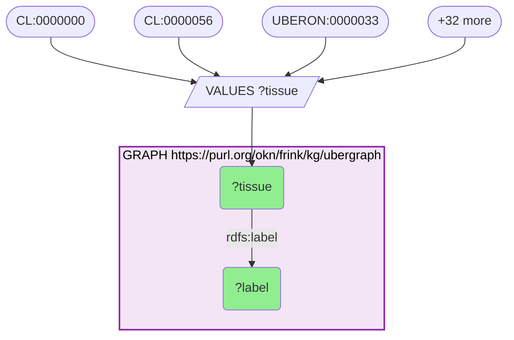

_35 row(s)_

#### Query 2

_2026-07-19T07:07:24+00:00 · `spoke-genelab`_

```sparql
PREFIX rdf: <http://www.w3.org/1999/02/22-rdf-syntax-ns#>
PREFIX gl: <https://purl.org/okn/frink/kg/spoke-genelab/schema/>
# Study / mission provenance for the 26 vetted SANS-relevant spaceflight contrasts
# (ocular, CNS, cardiovascular, and Drosophila head tissues).
SELECT DISTINCT ?assay ?study ?project_title ?material ?technology ?mission ?space_program ?flight_program ?start_date ?end_date
WHERE {
  VALUES ?assay {
    <https://purl.org/okn/frink/kg/spoke-genelab/node/OSD-100-061ffc525c9e17c392b5ed0b4e770133>
    <https://purl.org/okn/frink/kg/spoke-genelab/node/OSD-162-8d9c16a7a8374294c91e68646804fdd6>
    <https://purl.org/okn/frink/kg/spoke-genelab/node/OSD-194-7c13deab3d43973b1f8c841dbe0ee047>
    <https://purl.org/okn/frink/kg/spoke-genelab/node/OSD-255-d6bf4f1469f0ee64c788fee473c04477>
    <https://purl.org/okn/frink/kg/spoke-genelab/node/OSD-397-fcaa50b1d47e999e62e9b5c47dbb8e87>
    <https://purl.org/okn/frink/kg/spoke-genelab/node/OSD-352-afd8850e6da09ca718e931905c6569d1>
    <https://purl.org/okn/frink/kg/spoke-genelab/node/OSD-525-06da2a92957b8396556fb0af4aec6537>
    <https://purl.org/okn/frink/kg/spoke-genelab/node/OSD-561-7d663c7ebf1e58f048ff65d1d5c8f174>
    <https://purl.org/okn/frink/kg/spoke-genelab/node/OSD-561-88e39e1da986726e6bf35b80ff03d568>
    <https://purl.org/okn/frink/kg/spoke-genelab/node/OSD-562-1ccd55b102224b7b67cf506acf014264>
    <https://purl.org/okn/frink/kg/spoke-genelab/node/OSD-562-375e9dd0fbbaa2c659010f23b51ca73d>
    <https://purl.org/okn/frink/kg/spoke-genelab/node/OSD-562-b939fbe8d320aca8146a11c2c3ee1401>
    <https://purl.org/okn/frink/kg/spoke-genelab/node/OSD-563-90f07ddf134a1c4eb2b3bd13673e2728>
    <https://purl.org/okn/frink/kg/spoke-genelab/node/OSD-564-3d5c4773f0c1e95ff63e2798906c2277>
    <https://purl.org/okn/frink/kg/spoke-genelab/node/OSD-612-6345c5c7bcabe53264da1a63ae723b94>
    <https://purl.org/okn/frink/kg/spoke-genelab/node/OSD-613-6bc16dad3df8e92daec6c022196a9f49>
    <https://purl.org/okn/frink/kg/spoke-genelab/node/OSD-613-b41c0dfcfe90893067d80500887b987f>
    <https://purl.org/okn/frink/kg/spoke-genelab/node/OSD-347-c29f16b5cd5b5764e1cffecf6d91cf36>
    <https://purl.org/okn/frink/kg/spoke-genelab/node/OSD-347-fdbe1cd9dd8c9b24ba22defae84cff75>
    <https://purl.org/okn/frink/kg/spoke-genelab/node/OSD-580-41e436e99325c15f6e66c4c3aff42ac4>
    <https://purl.org/okn/frink/kg/spoke-genelab/node/OSD-580-9ceb7dab5b0bad650995af3e34edaad9>
    <https://purl.org/okn/frink/kg/spoke-genelab/node/OSD-599-621963480c79760998ad99ecc59f72a6>
    <https://purl.org/okn/frink/kg/spoke-genelab/node/OSD-207-46bf2f458dd003f328af5b6f7f7566b2>
    <https://purl.org/okn/frink/kg/spoke-genelab/node/OSD-207-6abfb081980c44e130a5c0f940551ef2>
    <https://purl.org/okn/frink/kg/spoke-genelab/node/OSD-207-b85a532693b63036252b8f9e7c546d9f>
    <https://purl.org/okn/frink/kg/spoke-genelab/node/OSD-207-ba2f9251efb7e9053a8dd97f9b3b0245>
  }
  GRAPH <https://purl.org/okn/frink/kg/spoke-genelab> {
    ?study gl:PERFORMED_SpAS ?assay ;
           gl:project_title ?project_title .
    ?assay gl:material_1 ?material ;
           gl:technology ?technology .
    OPTIONAL {
      ?mission gl:CONDUCTED_MIcS ?study .
      OPTIONAL { ?mission gl:space_program ?space_program }
      OPTIONAL { ?mission gl:flight_program ?flight_program }
      OPTIONAL { ?mission gl:start_date ?start_date }
      OPTIONAL { ?mission gl:end_date ?end_date }
    }
  }
}
```

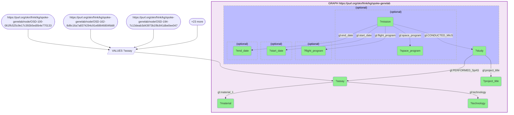

_26 row(s)_

#### Query 3

_2026-07-19T07:07:44+00:00 · `spoke-genelab`_

```sparql
PREFIX rdf: <http://www.w3.org/1999/02/22-rdf-syntax-ns#>
PREFIX gl: <https://purl.org/okn/frink/kg/spoke-genelab/schema/>
# OCULAR panel: differentially expressed genes (adj_p <= 0.05, |log2FC| >= 1) in
# eye / left eye / retina from vetted Space-Flight-vs-Ground-Control contrasts.
# log2fc > 0 = UP in spaceflight.
SELECT ?assay ?symbol ?taxonomy ?gene ?log2fc ?adj_p
WHERE {
  VALUES ?assay {
    <https://purl.org/okn/frink/kg/spoke-genelab/node/OSD-100-061ffc525c9e17c392b5ed0b4e770133>
    <https://purl.org/okn/frink/kg/spoke-genelab/node/OSD-162-8d9c16a7a8374294c91e68646804fdd6>
    <https://purl.org/okn/frink/kg/spoke-genelab/node/OSD-194-7c13deab3d43973b1f8c841dbe0ee047>
    <https://purl.org/okn/frink/kg/spoke-genelab/node/OSD-255-d6bf4f1469f0ee64c788fee473c04477>
    <https://purl.org/okn/frink/kg/spoke-genelab/node/OSD-397-fcaa50b1d47e999e62e9b5c47dbb8e87>
  }
  GRAPH <https://purl.org/okn/frink/kg/spoke-genelab> {
    ?stmt rdf:subject ?assay ;
          rdf:predicate gl:MEASURED_DIFFERENTIAL_EXPRESSION_ASmMG ;
          rdf:object ?gene ;
          gl:log2fc ?log2fc ;
          gl:adj_p_value ?adj_p .
    ?gene gl:symbol ?symbol ;
          gl:taxonomy ?taxonomy .
    FILTER(?adj_p <= 0.05 && ABS(?log2fc) >= 1)
  }
}
```

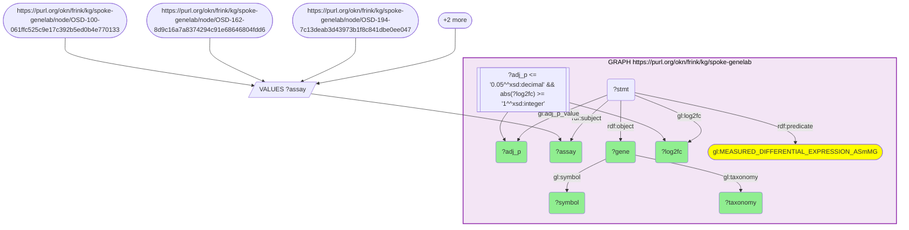

_38 row(s)_

#### Query 4

_2026-07-19T07:08:08+00:00 · `spoke-genelab`_

```sparql
PREFIX rdf: <http://www.w3.org/1999/02/22-rdf-syntax-ns#>
PREFIX gl: <https://purl.org/okn/frink/kg/spoke-genelab/schema/>
# CNS panel: differentially expressed genes (adj_p <= 0.05, |log2FC| >= 1) in brain,
# cerebellum, cerebral hemisphere and hippocampus from vetted Space-Flight-vs-Ground-Control
# contrasts. log2fc > 0 = UP in spaceflight.
SELECT ?assay ?symbol ?taxonomy ?gene ?log2fc ?adj_p
WHERE {
  VALUES ?assay {
    <https://purl.org/okn/frink/kg/spoke-genelab/node/OSD-352-afd8850e6da09ca718e931905c6569d1>
    <https://purl.org/okn/frink/kg/spoke-genelab/node/OSD-525-06da2a92957b8396556fb0af4aec6537>
    <https://purl.org/okn/frink/kg/spoke-genelab/node/OSD-561-7d663c7ebf1e58f048ff65d1d5c8f174>
    <https://purl.org/okn/frink/kg/spoke-genelab/node/OSD-561-88e39e1da986726e6bf35b80ff03d568>
    <https://purl.org/okn/frink/kg/spoke-genelab/node/OSD-562-1ccd55b102224b7b67cf506acf014264>
    <https://purl.org/okn/frink/kg/spoke-genelab/node/OSD-562-375e9dd0fbbaa2c659010f23b51ca73d>
    <https://purl.org/okn/frink/kg/spoke-genelab/node/OSD-562-b939fbe8d320aca8146a11c2c3ee1401>
    <https://purl.org/okn/frink/kg/spoke-genelab/node/OSD-563-90f07ddf134a1c4eb2b3bd13673e2728>
    <https://purl.org/okn/frink/kg/spoke-genelab/node/OSD-564-3d5c4773f0c1e95ff63e2798906c2277>
    <https://purl.org/okn/frink/kg/spoke-genelab/node/OSD-612-6345c5c7bcabe53264da1a63ae723b94>
    <https://purl.org/okn/frink/kg/spoke-genelab/node/OSD-613-6bc16dad3df8e92daec6c022196a9f49>
    <https://purl.org/okn/frink/kg/spoke-genelab/node/OSD-613-b41c0dfcfe90893067d80500887b987f>
  }
  GRAPH <https://purl.org/okn/frink/kg/spoke-genelab> {
    ?stmt rdf:subject ?assay ;
          rdf:predicate gl:MEASURED_DIFFERENTIAL_EXPRESSION_ASmMG ;
          rdf:object ?gene ;
          gl:log2fc ?log2fc ;
          gl:adj_p_value ?adj_p .
    ?gene gl:symbol ?symbol ;
          gl:taxonomy ?taxonomy .
    FILTER(?adj_p <= 0.05 && ABS(?log2fc) >= 1)
  }
}
```

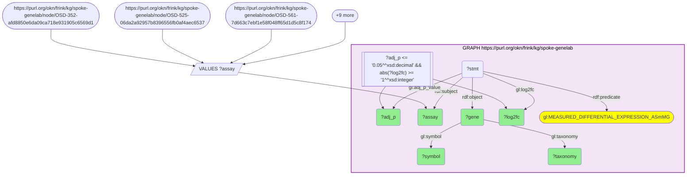

_1156 row(s)_

#### Query 5

_2026-07-19T07:08:38+00:00 · `spoke-genelab`_

```sparql
PREFIX rdf: <http://www.w3.org/1999/02/22-rdf-syntax-ns#>
PREFIX gl: <https://purl.org/okn/frink/kg/spoke-genelab/schema/>
# CARDIOVASCULAR panel: differentially expressed genes (adj_p <= 0.05, |log2FC| >= 1) in
# heart and heart right ventricle from vetted Space-Flight-vs-Ground-Control contrasts.
# Relevant to the cephalad fluid shift / vascular-remodelling arm of SANS.
SELECT ?assay ?symbol ?taxonomy ?gene ?log2fc ?adj_p
WHERE {
  VALUES ?assay {
    <https://purl.org/okn/frink/kg/spoke-genelab/node/OSD-347-c29f16b5cd5b5764e1cffecf6d91cf36>
    <https://purl.org/okn/frink/kg/spoke-genelab/node/OSD-347-fdbe1cd9dd8c9b24ba22defae84cff75>
    <https://purl.org/okn/frink/kg/spoke-genelab/node/OSD-580-41e436e99325c15f6e66c4c3aff42ac4>
    <https://purl.org/okn/frink/kg/spoke-genelab/node/OSD-580-9ceb7dab5b0bad650995af3e34edaad9>
    <https://purl.org/okn/frink/kg/spoke-genelab/node/OSD-599-621963480c79760998ad99ecc59f72a6>
  }
  GRAPH <https://purl.org/okn/frink/kg/spoke-genelab> {
    ?stmt rdf:subject ?assay ;
          rdf:predicate gl:MEASURED_DIFFERENTIAL_EXPRESSION_ASmMG ;
          rdf:object ?gene ;
          gl:log2fc ?log2fc ;
          gl:adj_p_value ?adj_p .
    ?gene gl:symbol ?symbol ;
          gl:taxonomy ?taxonomy .
    FILTER(?adj_p <= 0.05 && ABS(?log2fc) >= 1)
  }
}
```

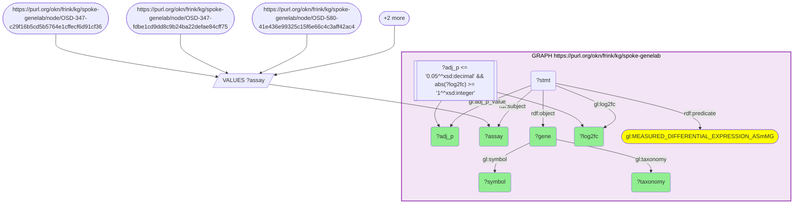

_597 row(s)_

#### Query 6

_2026-07-19T07:08:50+00:00 · `spoke-genelab`_

```sparql
PREFIX rdf: <http://www.w3.org/1999/02/22-rdf-syntax-ns#>
PREFIX gl: <https://purl.org/okn/frink/kg/spoke-genelab/schema/>
# DROSOPHILA HEAD panel (invertebrate CNS + compound eye): differentially expressed genes
# (adj_p <= 0.05, |log2FC| >= 1) from vetted Space-Flight-vs-Ground-Control contrasts.
# Provides an evolutionarily distant species arm for the cross-species comparison.
SELECT ?assay ?symbol ?taxonomy ?gene ?log2fc ?adj_p
WHERE {
  VALUES ?assay {
    <https://purl.org/okn/frink/kg/spoke-genelab/node/OSD-207-46bf2f458dd003f328af5b6f7f7566b2>
    <https://purl.org/okn/frink/kg/spoke-genelab/node/OSD-207-6abfb081980c44e130a5c0f940551ef2>
    <https://purl.org/okn/frink/kg/spoke-genelab/node/OSD-207-b85a532693b63036252b8f9e7c546d9f>
    <https://purl.org/okn/frink/kg/spoke-genelab/node/OSD-207-ba2f9251efb7e9053a8dd97f9b3b0245>
  }
  GRAPH <https://purl.org/okn/frink/kg/spoke-genelab> {
    ?stmt rdf:subject ?assay ;
          rdf:predicate gl:MEASURED_DIFFERENTIAL_EXPRESSION_ASmMG ;
          rdf:object ?gene ;
          gl:log2fc ?log2fc ;
          gl:adj_p_value ?adj_p .
    ?gene gl:symbol ?symbol ;
          gl:taxonomy ?taxonomy .
    FILTER(?adj_p <= 0.05 && ABS(?log2fc) >= 1)
  }
}
```

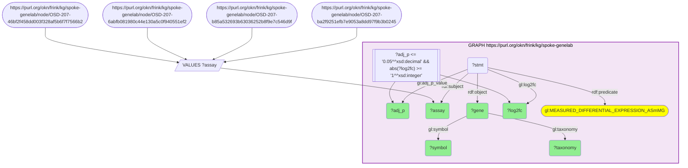

_4002 row(s)_

#### Query 7

_2026-07-19T07:10:02+00:00 · `spoke-genelab`_

```sparql
PREFIX rdf: <http://www.w3.org/1999/02/22-rdf-syntax-ns#>
PREFIX gl: <https://purl.org/okn/frink/kg/spoke-genelab/schema/>
# OCULAR relaxed (adj_p <= 0.05), one assay at a time to stay inside endpoint limits.
# OSD-397 - Rodent Research 1, LEFT RETINA (mouse), Space Flight vs Ground Control.
SELECT ?symbol ?taxonomy ?gene ?log2fc ?adj_p
WHERE {
  GRAPH <https://purl.org/okn/frink/kg/spoke-genelab> {
    ?stmt rdf:subject <https://purl.org/okn/frink/kg/spoke-genelab/node/OSD-397-fcaa50b1d47e999e62e9b5c47dbb8e87> ;
          rdf:predicate gl:MEASURED_DIFFERENTIAL_EXPRESSION_ASmMG ;
          rdf:object ?gene ;
          gl:log2fc ?log2fc ;
          gl:adj_p_value ?adj_p .
    ?gene gl:symbol ?symbol ;
          gl:taxonomy ?taxonomy .
    FILTER(?adj_p <= 0.05)
  }
}
```


_50 row(s)_

#### Query 8

_2026-07-19T07:10:12+00:00 · `spoke-genelab`_

```sparql
PREFIX rdf: <http://www.w3.org/1999/02/22-rdf-syntax-ns#>
PREFIX gl: <https://purl.org/okn/frink/kg/spoke-genelab/schema/>
# OCULAR relaxed (adj_p <= 0.05), single assay.
# OSD-194 - Rodent Research 3, LEFT RETINA (mouse), Space Flight vs Ground Control.
SELECT ?symbol ?taxonomy ?gene ?log2fc ?adj_p
WHERE {
  GRAPH <https://purl.org/okn/frink/kg/spoke-genelab> {
    ?stmt rdf:subject <https://purl.org/okn/frink/kg/spoke-genelab/node/OSD-194-7c13deab3d43973b1f8c841dbe0ee047> ;
          rdf:predicate gl:MEASURED_DIFFERENTIAL_EXPRESSION_ASmMG ;
          rdf:object ?gene ;
          gl:log2fc ?log2fc ;
          gl:adj_p_value ?adj_p .
    ?gene gl:symbol ?symbol ;
          gl:taxonomy ?taxonomy .
    FILTER(?adj_p <= 0.05)
  }
}
```


_2 row(s)_

#### Query 9

_2026-07-19T07:10:20+00:00 · `spoke-genelab`_

```sparql
PREFIX rdf: <http://www.w3.org/1999/02/22-rdf-syntax-ns#>
PREFIX gl: <https://purl.org/okn/frink/kg/spoke-genelab/schema/>
# OCULAR relaxed (adj_p <= 0.05), single assay.
# OSD-255 - Rodent Research 9 (JAXA), RIGHT RETINA (mouse), Space Flight vs Ground Control.
SELECT ?symbol ?taxonomy ?gene ?log2fc ?adj_p
WHERE {
  GRAPH <https://purl.org/okn/frink/kg/spoke-genelab> {
    ?stmt rdf:subject <https://purl.org/okn/frink/kg/spoke-genelab/node/OSD-255-d6bf4f1469f0ee64c788fee473c04477> ;
          rdf:predicate gl:MEASURED_DIFFERENTIAL_EXPRESSION_ASmMG ;
          rdf:object ?gene ;
          gl:log2fc ?log2fc ;
          gl:adj_p_value ?adj_p .
    ?gene gl:symbol ?symbol ;
          gl:taxonomy ?taxonomy .
    FILTER(?adj_p <= 0.05)
  }
}
```

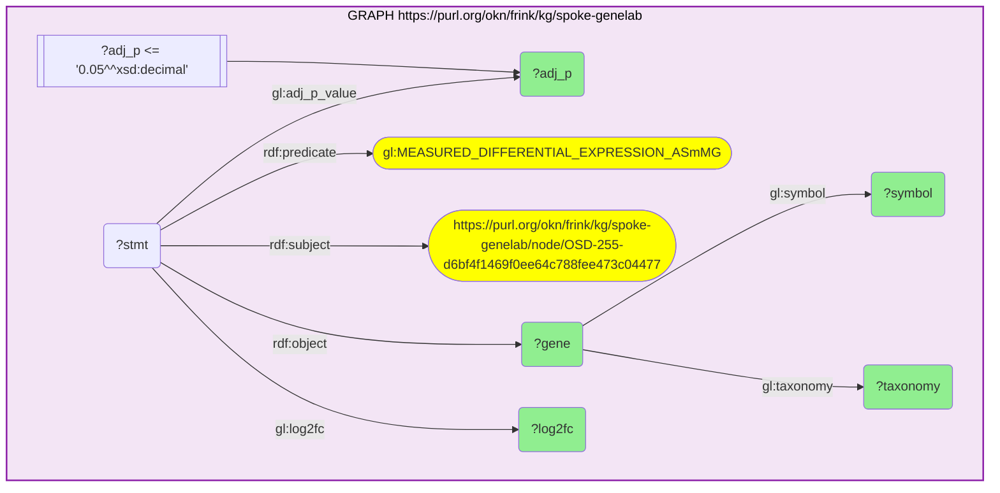

_327 row(s)_

#### Query 10

_2026-07-19T07:10:28+00:00 · `spoke-genelab`_

```sparql
PREFIX rdf: <http://www.w3.org/1999/02/22-rdf-syntax-ns#>
PREFIX gl: <https://purl.org/okn/frink/kg/spoke-genelab/schema/>
# OCULAR relaxed (adj_p <= 0.05), single assay.
# OSD-100 - Rodent Research 1, LEFT EYE (mouse), Space Flight vs Ground Control.
SELECT ?symbol ?taxonomy ?gene ?log2fc ?adj_p
WHERE {
  GRAPH <https://purl.org/okn/frink/kg/spoke-genelab> {
    ?stmt rdf:subject <https://purl.org/okn/frink/kg/spoke-genelab/node/OSD-100-061ffc525c9e17c392b5ed0b4e770133> ;
          rdf:predicate gl:MEASURED_DIFFERENTIAL_EXPRESSION_ASmMG ;
          rdf:object ?gene ;
          gl:log2fc ?log2fc ;
          gl:adj_p_value ?adj_p .
    ?gene gl:symbol ?symbol ;
          gl:taxonomy ?taxonomy .
    FILTER(?adj_p <= 0.05)
  }
}
```

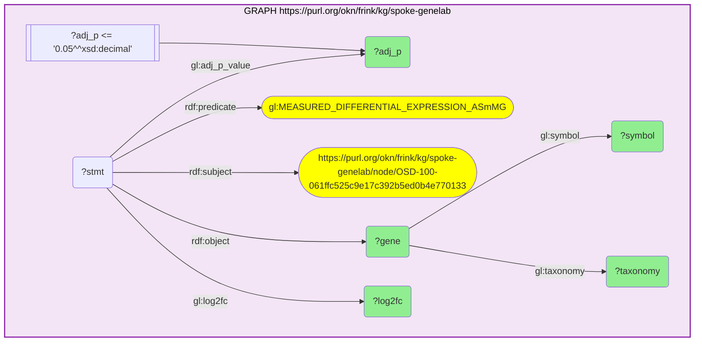

_191 row(s)_

#### Query 11

_2026-07-19T07:10:40+00:00 · `spoke-genelab`_

```sparql
PREFIX rdf: <http://www.w3.org/1999/02/22-rdf-syntax-ns#>
PREFIX gl: <https://purl.org/okn/frink/kg/spoke-genelab/schema/>
# OCULAR relaxed (adj_p <= 0.05), single assay.
# OSD-162 - Rodent Research 3, WHOLE EYE (mouse), Space Flight vs Ground Control.
SELECT ?symbol ?taxonomy ?gene ?log2fc ?adj_p
WHERE {
  GRAPH <https://purl.org/okn/frink/kg/spoke-genelab> {
    ?stmt rdf:subject <https://purl.org/okn/frink/kg/spoke-genelab/node/OSD-162-8d9c16a7a8374294c91e68646804fdd6> ;
          rdf:predicate gl:MEASURED_DIFFERENTIAL_EXPRESSION_ASmMG ;
          rdf:object ?gene ;
          gl:log2fc ?log2fc ;
          gl:adj_p_value ?adj_p .
    ?gene gl:symbol ?symbol ;
          gl:taxonomy ?taxonomy .
    FILTER(?adj_p <= 0.05)
  }
}
```


_6 row(s)_

#### Query 12

_2026-07-19T07:13:25+00:00 · `spoke-genelab`_

```sparql
PREFIX gl: <https://purl.org/okn/frink/kg/spoke-genelab/schema/>
# Cross-species projection map: every MOUSE gene -> human ortholog edge in spoke-genelab.
# Used to lift the mouse spaceflight signature onto human Entrez ids for integration
# with the human-keyed KGs (prokn, rdkg, spoke-okn, digcfdekg).
SELECT ?mouse_gene ?mouse_symbol ?human_gene ?human_symbol
WHERE {
  GRAPH <https://purl.org/okn/frink/kg/spoke-genelab> {
    ?mouse_gene gl:IS_ORTHOLOG_MGiG ?human_gene ;
                gl:symbol ?mouse_symbol ;
                gl:taxonomy <http://purl.obolibrary.org/obo/NCBITaxon_10090> .
    ?human_gene gl:symbol ?human_symbol ;
                gl:taxonomy <http://purl.obolibrary.org/obo/NCBITaxon_9606> .
  }
}
```

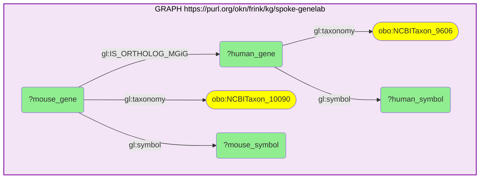

_22899 row(s)_

#### Query 13

_2026-07-19T07:13:37+00:00 · `spoke-genelab`_

```sparql
PREFIX gl: <https://purl.org/okn/frink/kg/spoke-genelab/schema/>
# Cross-species projection map: every DROSOPHILA gene -> human ortholog edge in spoke-genelab.
# Used to lift the Drosophila head / heart spaceflight signature onto human Entrez ids so
# the fly arm can be compared with the rodent arm on a common gene space.
SELECT ?fly_gene ?fly_symbol ?human_gene ?human_symbol
WHERE {
  GRAPH <https://purl.org/okn/frink/kg/spoke-genelab> {
    ?fly_gene gl:IS_ORTHOLOG_MGiG ?human_gene ;
              gl:symbol ?fly_symbol ;
              gl:taxonomy <http://purl.obolibrary.org/obo/NCBITaxon_7227> .
    ?human_gene gl:symbol ?human_symbol ;
                gl:taxonomy <http://purl.obolibrary.org/obo/NCBITaxon_9606> .
  }
}
```

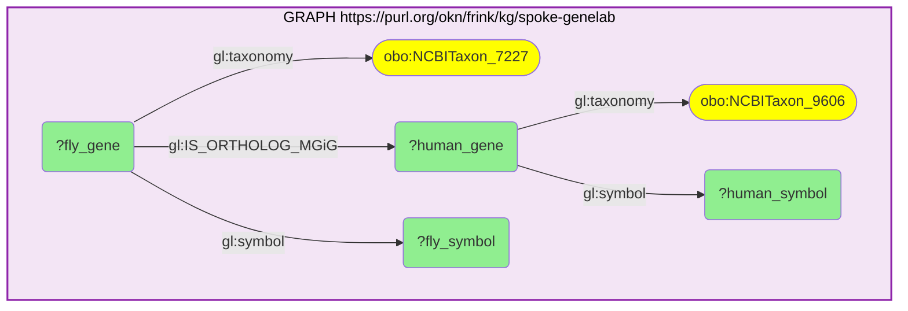

_19324 row(s)_

#### Query 14

_2026-07-19T07:17:21+00:00 · `spoke-genelab`, `spoke-okn`_

```sparql
SELECT (COUNT(DISTINCT ?gene) AS ?n) WHERE {
  GRAPH <https://purl.org/okn/frink/kg/spoke-genelab> { ?gene a <https://w3id.org/biolink/vocab/Gene> . }
  GRAPH <https://purl.org/okn/frink/kg/spoke-okn> { ?gene a <https://w3id.org/biolink/vocab/Gene> . }
}
```

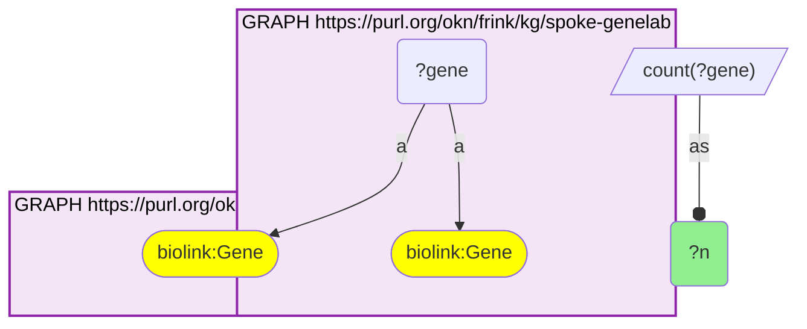

_1 row(s)_

#### Query 15

_2026-07-19T07:18:12+00:00 · `spoke-okn`_

```sparql
PREFIX rdfs: <http://www.w3.org/2000/01/rdf-schema#>
PREFIX so: <https://purl.org/okn/frink/kg/spoke-okn/schema/>
# COUNTERMEASURE DISCOVERY (signature reversal), built on the verified spoke-genelab x spoke-okn
# Entrez node-IRI join (crosswalk C4, 16,326 shared gene nodes).
# For the 169-gene conserved SANS core, retrieve every compound that UP- or DOWN-regulates
# each gene in spoke-okn's compound-gene perturbation layer. NOTE: this layer is a
# TOXICOGENOMIC / PHARMACOGENOMIC PERTURBATION record, not evidence of therapeutic benefit;
# reversal is scored downstream by comparing perturbation direction against the spaceflight direction.
SELECT ?gene ?gene_symbol ?compound ?compound_label ?effect ?max_phase
WHERE {
  VALUES ?e { 187 358 383 406 444 489 498 509 513 514 522 539 767 768 793 794 990 1103 1159 1350 1628 1647 1734
    1737 2035 2194 2258 2487 2570 2893 2895 2898 2914 3012 3017 3067 3099 3164 3241 3309 3320 3786 3993 4081 4482
    4488 4635 4665 4707 4783 4878 5033 5138 5708 5889 5935 6017 6029 6227 6441 6518 6582 6583 6588 6646 6745 6900
    6999 7038 7092 7137 7184 7220 7314 7388 7695 7737 7873 7920 8013 8110 8292 8335 8339 8343 8344 8346 8347 8349
    8445 8567 9022 9390 9455 9478 9520 9531 9735 9927 9945 10090 10130 10476 10632 11010 11185 11224 11346 23139
    23467 23646 23753 24147 25873 25994 27122 27159 27232 51050 51168 51181 51312 51475 53405 54443 54869 55843
    56001 56154 56344 56603 56729 60386 65083 79006 79174 79442 79845 80021 80115 80150 81796 83394 83932 84268
    84449 85446 90249 93035 126393 133690 135138 140902 161003 171024 196385 200150 219699 267020 339453 348980
    375940 388531 440567 441282 548596 646960 677832 100130827 }
  BIND(IRI(CONCAT("http://www.ncbi.nlm.nih.gov/gene/", STR(?e))) AS ?gene)
  GRAPH <https://purl.org/okn/frink/kg/spoke-okn> {
    ?gene rdfs:label ?gene_symbol .
    { ?compound so:UPREGULATES_CuG ?gene . BIND("UPREGULATES" AS ?effect) }
    UNION
    { ?compound so:DOWNREGULATES_CdG ?gene . BIND("DOWNREGULATES" AS ?effect) }
    OPTIONAL { ?compound rdfs:label ?compound_label }
    OPTIONAL { ?compound so:max_phase ?max_phase }
  }
}
```

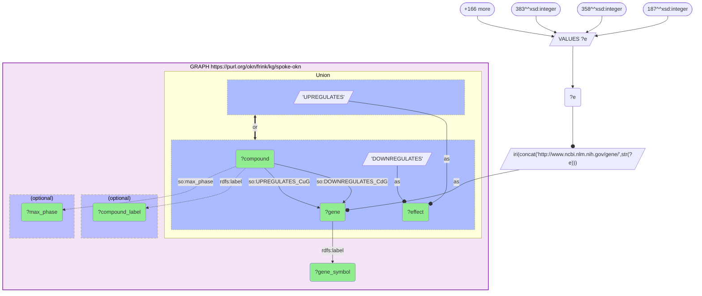

_44 row(s)_

#### Query 16

_2026-07-19T07:19:03+00:00 · `prokn`_

```sparql
PREFIX rdfs: <http://www.w3.org/2000/01/rdf-schema#>
PREFIX sio: <http://semanticscience.org/resource/>
PREFIX obo: <http://purl.obolibrary.org/obo/>
PREFIX up: <http://purl.uniprot.org/core/>
# GO annotation of the 169-gene conserved SANS core, via prokn's gene -> UniProt protein -> GO route.
# Three GO aspects in one pull: RO_0002331 'involved in' (BP), RO_0002327 'enables' (MF),
# up:partOf (CC). Gene symbols are matched on prokn's rdfs:label (exact symbol match).
SELECT DISTINCT ?symbol ?prot ?aspect ?go ?go_label
WHERE {
  VALUES ?symbol { "ABHD16A" "AKR1B15" "ANLN" "APLNR" "AQP1" "ARG1" "ARHGAP15" "ARNTL" "ASPH" "ASRGL1" "ATP2A3"
    "ATP5F1A" "ATP5F1C" "ATP5F1D" "ATP5F1E" "ATP5MG" "ATP5MGL" "ATP5PD" "ATP5PF" "ATP5PO" "BAG3" "BAIAP2L2" "CA8"
    "CA9" "CABP1" "CABP2" "CABP5" "CALB1" "CALB2" "CAPSL" "CDC6" "CHAT" "CHIA" "CKMT1A" "CKMT1B" "CLIC3" "CLIC5"
    "CNTN2" "COLQ" "COX7C" "CRELD2" "CYP26B1" "DBP" "DCXR" "DIO2" "DKK3" "DLAT" "DMBT1L1" "DNAH10" "DPF3" "DYRK2"
    "EPB41" "EPS8L1" "FASN" "FGF13" "FJX1" "FRZB" "GABRR2" "GADD45A" "GFPT2" "GLIPR1" "GNMT" "GRIA4" "GRID2"
    "GRIK2" "GRM4" "H2AC4" "H2AC8" "H2BC10" "H2BC21" "H2BC4" "H2BC5" "H2BC6" "H2BC7" "H2BC8" "HCN1" "HDC" "HIGD1A"
    "HK2" "HOMER2" "HPCAL1" "HSP90AA1" "HSP90B1" "HSPA5" "HSPB6" "INMT" "KCNQ3" "KNTC1" "LLGL2" "LRRC2" "MAB21L1"
    "MADD" "MANF" "MAST2" "METRN" "MFN2" "MSRA" "MSX2" "MYL4" "MYO15A" "NAB2" "NDUFB1" "NFIL3" "NOL6" "NPEPPS"
    "NPPA" "NPTXR" "NR4A1" "NR4A3" "NXF2" "P4HA1" "PACRG" "PDE2A" "PDIA6" "PI15" "PITPNM3" "PKHD1L1" "PLD3" "PLD5"
    "PRSS56" "PSMD2" "R3HDML" "RAD51C" "RBM3" "RETN" "RGS9BP" "RLBP1" "RN7SL1" "RNF113A" "RNF122" "RPAIN" "RPL35"
    "RPL36" "RPS21" "SBK3" "SDF2L1" "SFTPD" "SLC22A13" "SLC22A2" "SLC22A4" "SLC25A19" "SLC25A37" "SLC2A5"
    "SLCO5A1" "SLN" "SNORA53" "SOAT1" "SPRTN" "SSR1" "STOML3" "SYNPO" "SYNPO2" "TDO2" "TEX15" "TG" "TLL1"
    "TMEM240" "TMEM62" "TNNI3" "TRPC1" "UBB" "UNC5A" "UNC5B" "UQCRH" "UQCRHL" "UST" "ZFHX2" "ZNF136" "ZNF333" }
  GRAPH <https://purl.org/okn/frink/kg/prokn> {
    ?gene rdfs:label ?symbol ; sio:SIO_010078 ?prot .
    { ?prot obo:RO_0002331 ?go . BIND("BP" AS ?aspect) }
    UNION
    { ?prot obo:RO_0002327 ?go . BIND("MF" AS ?aspect) }
    UNION
    { ?prot up:partOf ?go . BIND("CC" AS ?aspect) }
    OPTIONAL { ?go rdfs:label ?go_label }
  }
}
```

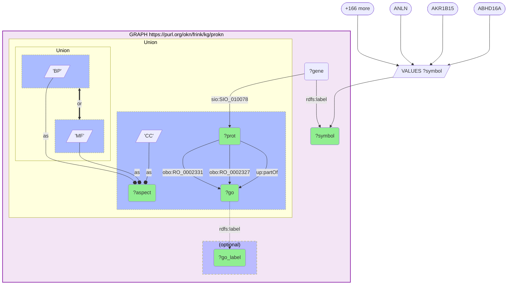

_1658 row(s)_

#### Query 17

_2026-07-19T07:19:53+00:00 · `prokn`_

```sparql
PREFIX rdfs: <http://www.w3.org/2000/01/rdf-schema#>
PREFIX sio: <http://semanticscience.org/resource/>
PREFIX obo: <http://purl.obolibrary.org/obo/>
PREFIX up: <http://purl.uniprot.org/core/>
# Enrichment denominators, part 1: category size K = number of DISTINCT prokn genes annotated to
# each GO term that the conserved SANS core hits at least 3 times (92 terms, all three aspects).
SELECT ?go (COUNT(DISTINCT ?gene) AS ?K)
WHERE {
  VALUES ?go { obo:GO_0005515 obo:GO_0016020 obo:GO_0005829 obo:GO_0005886 obo:GO_0005737 obo:GO_0005634
    obo:GO_0046872 obo:GO_0005739 obo:GO_0070062 obo:GO_0016787 obo:GO_0000166 obo:GO_0005783 obo:GO_0006811
    obo:GO_0042802 obo:GO_0005654 obo:GO_0005615 obo:GO_0005524 obo:GO_0005576 obo:GO_0005789 obo:GO_0016740
    obo:GO_0007165 obo:GO_0008270 obo:GO_0045202 obo:GO_0043025 obo:GO_0003723 obo:GO_0005743 obo:GO_0005759
    obo:GO_0016323 obo:GO_0009986 obo:GO_0030424 obo:GO_0005509 obo:GO_0055085 obo:GO_0006457 obo:GO_0006629
    obo:GO_0034220 obo:GO_1902600 obo:GO_0042470 obo:GO_0016324 obo:GO_0048471 obo:GO_0006915 obo:GO_0015986
    obo:GO_0005788 obo:GO_0042776 obo:GO_0016491 obo:GO_0003779 obo:GO_0005216 obo:GO_0016887 obo:GO_0022857
    obo:GO_0038023 obo:GO_0045296 obo:GO_0046933 obo:GO_0016746 obo:GO_0001666 obo:GO_0051301 obo:GO_0030425
    obo:GO_0060078 obo:GO_0006754 obo:GO_0043066 obo:GO_0007268 obo:GO_0005794 obo:GO_0005730 obo:GO_0031625
    obo:GO_0045766 obo:GO_0030154 obo:GO_0019904 obo:GO_0030165 obo:GO_0030496 obo:GO_0051289 obo:GO_0006954
    obo:GO_0044183 obo:GO_0006836 obo:GO_0006813 obo:GO_0051082 obo:GO_0051087 obo:GO_0006974 obo:GO_0071260
    obo:GO_0031965 obo:GO_0071320 obo:GO_0071805 obo:GO_0005267 obo:GO_0090090 obo:GO_0005198 obo:GO_0003824
    obo:GO_0005741 obo:GO_0005856 obo:GO_0009925 obo:GO_0045211 obo:GO_0002376 obo:GO_0043204 obo:GO_0014069
    obo:GO_0043005 obo:GO_0051213 }
  GRAPH <https://purl.org/okn/frink/kg/prokn> {
    ?gene rdfs:label ?sym ; sio:SIO_010078 ?prot .
    { ?prot obo:RO_0002331 ?go } UNION { ?prot obo:RO_0002327 ?go } UNION { ?prot up:partOf ?go }
  }
}
GROUP BY ?go
```

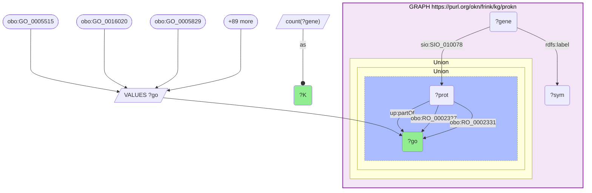

_92 row(s)_

#### Query 18

_2026-07-19T07:20:00+00:00 · `prokn`_

```sparql
PREFIX rdfs: <http://www.w3.org/2000/01/rdf-schema#>
PREFIX sio: <http://semanticscience.org/resource/>
PREFIX obo: <http://purl.obolibrary.org/obo/>
PREFIX up: <http://purl.uniprot.org/core/>
# Enrichment denominator, part 2: the EXPLICIT background N = number of DISTINCT prokn genes
# carrying at least one GO annotation of any aspect through an encoded UniProt protein.
SELECT (COUNT(DISTINCT ?gene) AS ?N_go_annotated_genes)
WHERE {
  GRAPH <https://purl.org/okn/frink/kg/prokn> {
    ?gene rdfs:label ?sym ; sio:SIO_010078 ?prot .
    { ?prot obo:RO_0002331 ?go } UNION { ?prot obo:RO_0002327 ?go } UNION { ?prot up:partOf ?go }
  }
}
```

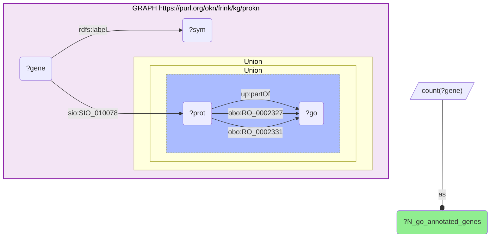

_1 row(s)_

#### Query 19

_2026-07-19T07:20:21+00:00 · `prokn`_

```sparql
PREFIX rdfs: <http://www.w3.org/2000/01/rdf-schema#>
PREFIX sio: <http://semanticscience.org/resource/>
PREFIX obo: <http://purl.obolibrary.org/obo/>
PREFIX up: <http://purl.uniprot.org/core/>
# REACTOME pathway family (a separate enrichment family from GO, run in full):
# human Reactome pathways in which the 169-gene conserved SANS core participates,
# via prokn gene -> UniProt protein -> RO_0000056 'participates in' -> up:Pathway.
SELECT DISTINCT ?symbol ?pw ?pw_label
WHERE {
  VALUES ?symbol { "ABHD16A" "AKR1B15" "ANLN" "APLNR" "AQP1" "ARG1" "ARHGAP15" "ARNTL" "ASPH" "ASRGL1" "ATP2A3"
    "ATP5F1A" "ATP5F1C" "ATP5F1D" "ATP5F1E" "ATP5MG" "ATP5MGL" "ATP5PD" "ATP5PF" "ATP5PO" "BAG3" "BAIAP2L2" "CA8"
    "CA9" "CABP1" "CABP2" "CABP5" "CALB1" "CALB2" "CAPSL" "CDC6" "CHAT" "CHIA" "CKMT1A" "CKMT1B" "CLIC3" "CLIC5"
    "CNTN2" "COLQ" "COX7C" "CRELD2" "CYP26B1" "DBP" "DCXR" "DIO2" "DKK3" "DLAT" "DMBT1L1" "DNAH10" "DPF3" "DYRK2"
    "EPB41" "EPS8L1" "FASN" "FGF13" "FJX1" "FRZB" "GABRR2" "GADD45A" "GFPT2" "GLIPR1" "GNMT" "GRIA4" "GRID2"
    "GRIK2" "GRM4" "H2AC4" "H2AC8" "H2BC10" "H2BC21" "H2BC4" "H2BC5" "H2BC6" "H2BC7" "H2BC8" "HCN1" "HDC" "HIGD1A"
    "HK2" "HOMER2" "HPCAL1" "HSP90AA1" "HSP90B1" "HSPA5" "HSPB6" "INMT" "KCNQ3" "KNTC1" "LLGL2" "LRRC2" "MAB21L1"
    "MADD" "MANF" "MAST2" "METRN" "MFN2" "MSRA" "MSX2" "MYL4" "MYO15A" "NAB2" "NDUFB1" "NFIL3" "NOL6" "NPEPPS"
    "NPPA" "NPTXR" "NR4A1" "NR4A3" "NXF2" "P4HA1" "PACRG" "PDE2A" "PDIA6" "PI15" "PITPNM3" "PKHD1L1" "PLD3" "PLD5"
    "PRSS56" "PSMD2" "R3HDML" "RAD51C" "RBM3" "RETN" "RGS9BP" "RLBP1" "RN7SL1" "RNF113A" "RNF122" "RPAIN" "RPL35"
    "RPL36" "RPS21" "SBK3" "SDF2L1" "SFTPD" "SLC22A13" "SLC22A2" "SLC22A4" "SLC25A19" "SLC25A37" "SLC2A5"
    "SLCO5A1" "SLN" "SNORA53" "SOAT1" "SPRTN" "SSR1" "STOML3" "SYNPO" "SYNPO2" "TDO2" "TEX15" "TG" "TLL1"
    "TMEM240" "TMEM62" "TNNI3" "TRPC1" "UBB" "UNC5A" "UNC5B" "UQCRH" "UQCRHL" "UST" "ZFHX2" "ZNF136" "ZNF333" }
  GRAPH <https://purl.org/okn/frink/kg/prokn> {
    ?gene rdfs:label ?symbol ; sio:SIO_010078 ?prot .
    ?prot obo:RO_0000056 ?pw .
    ?pw a up:Pathway .
    FILTER(CONTAINS(STR(?pw), "R-HSA"))
    OPTIONAL { ?pw rdfs:label ?pw_label }
  }
}
```

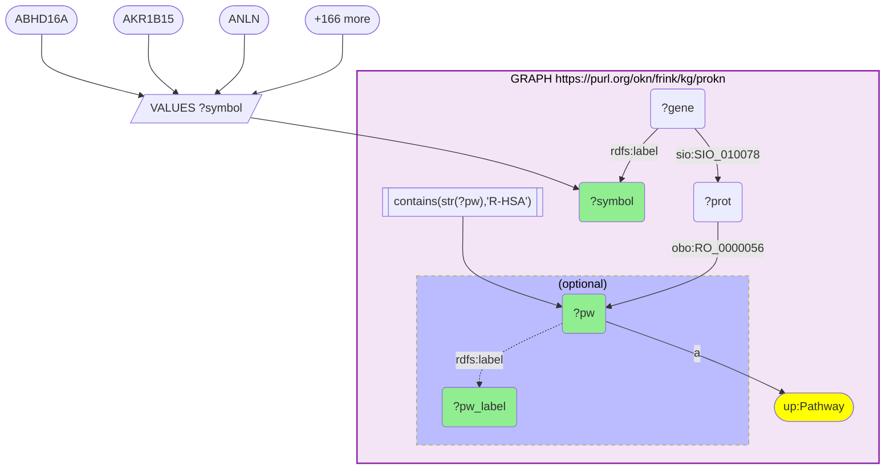

_473 row(s)_

#### Query 20

_2026-07-19T07:20:41+00:00 · `prokn`_

```sparql
PREFIX rdfs: <http://www.w3.org/2000/01/rdf-schema#>
PREFIX sio: <http://semanticscience.org/resource/>
PREFIX obo: <http://purl.obolibrary.org/obo/>
PREFIX up: <http://purl.uniprot.org/core/>
# Reactome enrichment denominators: category size K per candidate pathway, plus the explicit
# background N (all prokn genes participating in >=1 human Reactome pathway).
SELECT ?pw (COUNT(DISTINCT ?gene) AS ?K)
WHERE {
  VALUES ?pw {
    <https://identifiers.org/reactome/R-HSA-163210> <https://identifiers.org/reactome/R-HSA-5578775>
    <https://identifiers.org/reactome/R-HSA-6798695> <https://identifiers.org/reactome/R-HSA-68867>
    <https://identifiers.org/reactome/R-HSA-68949>  <https://identifiers.org/reactome/R-HSA-69017>
    <https://identifiers.org/reactome/R-HSA-8852276> <https://identifiers.org/reactome/R-HSA-8949613>
    <https://identifiers.org/reactome/R-HSA-9010553> <https://identifiers.org/reactome/R-HSA-977225>
    <https://identifiers.org/reactome/R-HSA-983168> <https://identifiers.org/reactome/R-HSA-9837999>
  }
  GRAPH <https://purl.org/okn/frink/kg/prokn> {
    ?gene rdfs:label ?sym ; sio:SIO_010078 ?prot .
    ?prot obo:RO_0000056 ?pw .
  }
}
GROUP BY ?pw
```

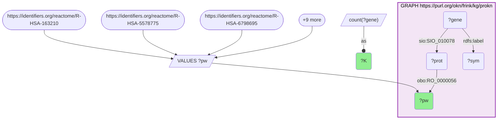

_12 row(s)_

#### Query 21

_2026-07-19T07:20:47+00:00 · `prokn`_

```sparql
PREFIX rdfs: <http://www.w3.org/2000/01/rdf-schema#>
PREFIX sio: <http://semanticscience.org/resource/>
PREFIX obo: <http://purl.obolibrary.org/obo/>
PREFIX up: <http://purl.uniprot.org/core/>
# Reactome background N: DISTINCT prokn genes participating in at least one human Reactome pathway.
SELECT (COUNT(DISTINCT ?gene) AS ?N_reactome_genes)
WHERE {
  GRAPH <https://purl.org/okn/frink/kg/prokn> {
    ?gene rdfs:label ?sym ; sio:SIO_010078 ?prot .
    ?prot obo:RO_0000056 ?pw .
    ?pw a up:Pathway .
    FILTER(CONTAINS(STR(?pw), "R-HSA"))
  }
}
```

```mermaid
graph TD
classDef projected fill:lightgreen;
classDef literal fill:orange;
classDef iri fill:yellow;
  v1("?N_reactome_genes"):::projected 
  v5("?gene")
  v4("?prot")
  v3("?pw")
  v6("?sym")
  subgraph graph0["GRAPH https://purl.org/okn/frink/kg/prokn"]
    style graph0 fill:#f3e5f5,stroke:#8e24aa,stroke-width:2px,color:#000;
    graph0c2(["up:Pathway"]):::iri 
    graph0f0[["contains(str(?pw),'R-HSA')"]]
    graph0f0 --> v3
    v3 --"a"--> graph0c2
    v4 --"obo:RO_0000056"--> v3
    v5 --"sio:SIO_010078"--> v4
    v5 --"rdfs:label"--> v6
  end
  bind0[/"count(?gene)"/]
  bind0 --as--o v1
```

_1 row(s)_

#### Query 22

_2026-07-19T07:22:33+00:00 · `prokn`_

```sparql
PREFIX rdfs: <http://www.w3.org/2000/01/rdf-schema#>
PREFIX obo: <http://purl.obolibrary.org/obo/>
PREFIX up: <http://purl.uniprot.org/core/>
PREFIX rep: <https://w3id.org/reproduceme#>
# DRUGGABILITY of the conserved SANS core (countermeasure targets): compounds in prokn that
# positively (RO_0002213) or negatively (RO_0002212) regulate each core gene, with the compound's
# maximum clinical phase. Evidence layer = phase: 4 approved, 1-3 investigational,
# no phase = medicinal-chemistry probe with measured bioactivity (potential, unvalidated).
SELECT DISTINCT ?symbol ?compound ?compound_label ?direction ?phase
WHERE {
  VALUES ?symbol { "AQP1" "CA8" "CA9" "HSPA5" "HSP90AA1" "HSP90B1" "PDIA6" "MANF" "SSR1" "SDF2L1" "CRELD2"
    "ATP5F1A" "ATP5F1C" "ATP5F1D" "ATP5F1E" "ATP5PO" "ATP5PD" "ATP5PF" "ATP5MG" "UQCRH" "COX7C" "NDUFB1" "MFN2"
    "HIGD1A" "SLC25A37" "CKMT1A" "CKMT1B" "ARNTL" "DBP" "NFIL3" "NR4A1" "NR4A3" "GADD45A" "MSRA" "BAG3" "UBB"
    "HSPB6" "APLNR" "UNC5B" "NPPA" "TRPC1" "ATP2A3" "PDE2A" "RLBP1" "PRSS56" "CALB1" "CALB2" "HCN1" "KCNQ3"
    "GRIA4" "GRIK2" "GRID2" "GRM4" "CHAT" "HDC" "DIO2" "TG" "FASN" "HK2" "SOAT1" "P4HA1" "GFPT2" "TDO2" "ARG1"
    "DLAT" "CYP26B1" "SLC2A5" "SLC22A2" "SLC22A4" "PSMD2" "NPEPPS" "DYRK2" "MADD" "MAST2" "SBK3" "CDC6" "RAD51C" }
  GRAPH <https://purl.org/okn/frink/kg/prokn> {
    ?gene a up:Gene ; rdfs:label ?symbol .
    { ?compound obo:RO_0002213 ?gene . BIND("positively regulates" AS ?direction) }
    UNION
    { ?compound obo:RO_0002212 ?gene . BIND("negatively regulates" AS ?direction) }
    ?compound a obo:NCIT_C43366 .
    OPTIONAL { ?compound rdfs:label ?compound_label }
    OPTIONAL { ?compound rep:Phase ?phase }
  }
}
```

```mermaid
graph TD
classDef projected fill:lightgreen;
classDef literal fill:orange;
classDef iri fill:yellow;
  v4("?compound"):::projected 
  v5("?compound_label"):::projected 
  v3("?direction"):::projected 
  v2("?gene")
  v6("?phase"):::projected 
  v1("?symbol"):::projected 
  bind0[/"VALUES ?symbol"/]
  bind0-->v1
  bind00(["AQP1"])
  bind00 --> bind0
  bind01(["CA8"])
  bind01 --> bind0
  bind02(["CA9"])
  bind02 --> bind0
  bind0more([+74 more])
  bind0more --> bind0
  subgraph graph0["GRAPH https://purl.org/okn/frink/kg/prokn"]
    style graph0 fill:#f3e5f5,stroke:#8e24aa,stroke-width:2px,color:#000;
    graph0c6(["obo:NCIT_C43366"]):::iri 
    graph0c2(["up:Gene"]):::iri 
    v2 --"a"--> graph0c2
    v2 --"rdfs:label"--> v1
    subgraph uniongraph00[" Union "]
    style uniongraph00 color:#000;
    subgraph uniongraph00l[" "]
      style uniongraph00l fill:#abf,stroke-dasharray: 3 3;
      v4 --"obo:RO_0002212"--> v2
      graph0bind1[/"'negatively regulates'"/]
      graph0bind1 --as--o v3
    end
    subgraph uniongraph00r[" "]
      style uniongraph00r fill:#abf,stroke-dasharray: 3 3;
      v4 --"obo:RO_0002213"--> v2
      graph0bind2[/"'positively regulates'"/]
      graph0bind2 --as--o v3
    end
    uniongraph00r <== or ==> uniongraph00l
    end
    v4 --"a"--> graph0c6
    subgraph optionalgraph00["(optional)"]
    style optionalgraph00 fill:#bbf,stroke-dasharray: 5 5,color:#000;
      v4 -."rdfs:label".-> v5
    end
    subgraph optionalgraph01["(optional)"]
    style optionalgraph01 fill:#bbf,stroke-dasharray: 5 5,color:#000;
      v4 -."rep:Phase".-> v6
    end
  end
```

_1303 row(s)_

#### Query 23

_2026-07-19T07:23:24+00:00 · `rdkg`_

```sparql
PREFIX bl: <https://w3id.org/biolink/vocab/>
PREFIX rdfs: <http://www.w3.org/2000/01/rdf-schema#>
# CURATED (rare / Mendelian) disease linkage + repurposing layer, rdkg.
# Step 1: for each conserved SANS core gene (Entrez node-IRI, identifiers.org form),
# the diseases rdkg relates it to; step 2: drugs that TREAT those diseases.
# rdkg's `treats` objects span MONDO / Orphanet / OMIM / rdaccelerate, so no namespace is pinned.
SELECT DISTINCT ?symbol ?disease ?disease_label ?drug ?drug_label
WHERE {
  VALUES ?e { 187 358 383 406 444 489 498 509 513 514 522 539 767 768 793 794 990 1103 1159 1350 1628 1647 1734
    1737 2035 2194 2258 2487 2570 2893 2895 2898 2914 3012 3017 3067 3099 3164 3241 3309 3320 3786 3993 4081 4482
    4488 4635 4665 4707 4783 4878 5033 5138 5708 5889 5935 6017 6029 6227 6441 6518 6582 6583 6588 6646 6745 6900
    6999 7038 7092 7137 7184 7220 7314 7388 7695 7737 7873 7920 8013 8110 8292 8335 8339 8343 8344 8346 8347 8349
    8445 8567 9022 9390 9455 9478 9520 9531 9735 9927 9945 10090 10130 10476 10632 11010 11185 11224 11346 23139
    23467 23646 23753 24147 25873 25994 27122 27159 27232 51050 51168 51181 51312 51475 53405 54443 54869 55843
    56001 56154 56344 56603 56729 60386 65083 79006 79174 79442 79845 80021 80115 80150 81796 83394 83932 84268
    84449 85446 90249 93035 126393 133690 135138 140902 161003 171024 196385 200150 219699 267020 339453 348980
    375940 388531 440567 441282 548596 646960 677832 100130827 }
  BIND(IRI(CONCAT("http://identifiers.org/ncbigene/", STR(?e))) AS ?gene)
  GRAPH <https://purl.org/okn/frink/kg/rdkg> {
    ?gene rdfs:label ?symbol ; bl:related_to ?disease .
    ?disease rdfs:label ?disease_label .
    OPTIONAL { ?drug bl:treats ?disease . OPTIONAL { ?drug rdfs:label ?drug_label } }
  }
}
```

```mermaid
graph TD
classDef projected fill:lightgreen;
classDef literal fill:orange;
classDef iri fill:yellow;
  v3("?disease"):::projected 
  v4("?disease_label"):::projected 
  v6("?drug"):::projected 
  v7("?drug_label"):::projected 
  v2("?e")
  v1("?gene")
  v5("?symbol"):::projected 
  bind0[/"VALUES ?e"/]
  bind0-->v2
  bind00(["187^^xsd:integer"])
  bind00 --> bind0
  bind01(["358^^xsd:integer"])
  bind01 --> bind0
  bind02(["383^^xsd:integer"])
  bind02 --> bind0
  bind0more([+166 more])
  bind0more --> bind0
  bind1[/"iri(concat('http://identifiers.org/ncbigene/',str(?e)))"/]
  v2 --o bind1
  bind1 --as--o v1
  subgraph graph0["GRAPH https://purl.org/okn/frink/kg/rdkg"]
    style graph0 fill:#f3e5f5,stroke:#8e24aa,stroke-width:2px,color:#000;
    v1 --"bl:related_to"--> v3
    v3 --"rdfs:label"--> v4
    v1 --"rdfs:label"--> v5
    subgraph optionalgraph00["(optional)"]
    style optionalgraph00 fill:#bbf,stroke-dasharray: 5 5,color:#000;
      v6 -."bl:treats".-> v3
      subgraph optionalgraph01["(optional)"]
      style optionalgraph01 fill:#bbf,stroke-dasharray: 5 5,color:#000;
        v6 -."rdfs:label".-> v7
      end
    end
  end
```

_11885 row(s)_

#### Query 24

_2026-07-19T07:24:12+00:00 · `digcfdekg`_

```sparql
PREFIX rdfs: <http://www.w3.org/2000/01/rdf-schema#>
PREFIX dig: <https://purl.org/okn/frink/kg/digcfdekg/schema/>
# BROAD (GWAS-style) trait linkage - digcfdekg geneToTrait for the conserved SANS core.
# Declared as the permissive counterpart to rdkg's curated Mendelian sets: broad polygenic
# sets are near-null by construction, so this is reported as a calibration, not a negative result.
SELECT DISTINCT ?symbol ?trait ?trait_label
WHERE {
  VALUES ?e { 187 358 383 406 444 489 498 509 513 514 522 539 767 768 793 794 990 1103 1159 1350 1628 1647 1734
    1737 2035 2194 2258 2487 2570 2893 2895 2898 2914 3012 3017 3067 3099 3164 3241 3309 3320 3786 3993 4081 4482
    4488 4635 4665 4707 4783 4878 5033 5138 5708 5889 5935 6017 6029 6227 6441 6518 6582 6583 6588 6646 6745 6900
    6999 7038 7092 7137 7184 7220 7314 7388 7695 7737 7873 7920 8013 8110 8292 8335 8339 8343 8344 8346 8347 8349
    8445 8567 9022 9390 9455 9478 9520 9531 9735 9927 9945 10090 10130 10476 10632 11010 11185 11224 11346 23139
    23467 23646 23753 24147 25873 25994 27122 27159 27232 51050 51168 51181 51312 51475 53405 54443 54869 55843
    56001 56154 56344 56603 56729 60386 65083 79006 79174 79442 79845 80021 80115 80150 81796 83394 83932 84268
    84449 85446 90249 93035 126393 133690 135138 140902 161003 171024 196385 200150 219699 267020 339453 348980
    375940 388531 440567 441282 548596 646960 677832 100130827 }
  BIND(IRI(CONCAT("http://www.ncbi.nlm.nih.gov/gene/", STR(?e))) AS ?gene)
  GRAPH <https://purl.org/okn/frink/kg/digcfdekg> {
    ?gene dig:geneToTrait ?trait .
    OPTIONAL { ?gene rdfs:label ?symbol }
    OPTIONAL { ?trait rdfs:label ?trait_label }
  }
}
```

```mermaid
graph TD
classDef projected fill:lightgreen;
classDef literal fill:orange;
classDef iri fill:yellow;
  v2("?e")
  v1("?gene")
  v4("?symbol"):::projected 
  v3("?trait"):::projected 
  v5("?trait_label"):::projected 
  bind0[/"VALUES ?e"/]
  bind0-->v2
  bind00(["187^^xsd:integer"])
  bind00 --> bind0
  bind01(["358^^xsd:integer"])
  bind01 --> bind0
  bind02(["383^^xsd:integer"])
  bind02 --> bind0
  bind0more([+166 more])
  bind0more --> bind0
  bind1[/"iri(concat('http://www.ncbi.nlm.nih.gov/gene/',str(?e)))"/]
  v2 --o bind1
  bind1 --as--o v1
  subgraph graph0["GRAPH https://purl.org/okn/frink/kg/digcfdekg"]
    style graph0 fill:#f3e5f5,stroke:#8e24aa,stroke-width:2px,color:#000;
    v1 --"dig:geneToTrait"--> v3
    subgraph optionalgraph00["(optional)"]
    style optionalgraph00 fill:#bbf,stroke-dasharray: 5 5,color:#000;
      v1 -."rdfs:label".-> v4
    end
    subgraph optionalgraph01["(optional)"]
    style optionalgraph01 fill:#bbf,stroke-dasharray: 5 5,color:#000;
      v3 -."rdfs:label".-> v5
    end
  end
```

_12950 row(s)_

#### Query 25

_2026-07-19T07:24:22+00:00 · `digcfdekg`_

```sparql
PREFIX dig: <https://purl.org/okn/frink/kg/digcfdekg/schema/>
# digcfdekg trait-linkage denominators: N = distinct genes carrying ANY geneToTrait edge
# (the explicit background for the broad trait test), and the total number of distinct traits.
SELECT (COUNT(DISTINCT ?gene) AS ?N_trait_genes) (COUNT(DISTINCT ?trait) AS ?n_traits)
WHERE {
  GRAPH <https://purl.org/okn/frink/kg/digcfdekg> { ?gene dig:geneToTrait ?trait . }
}
```

```mermaid
graph TD
classDef projected fill:lightgreen;
classDef literal fill:orange;
classDef iri fill:yellow;
  v2("?N_trait_genes"):::projected 
  v5("?gene")
  v1("?n_traits"):::projected 
  v6("?trait")
  subgraph graph0["GRAPH https://purl.org/okn/frink/kg/digcfdekg"]
    style graph0 fill:#f3e5f5,stroke:#8e24aa,stroke-width:2px,color:#000;
    v5 --"dig:geneToTrait"--> v6
  end
  bind0[/"count(?gene)"/]
  bind0 --as--o v2
  bind1[/"count(?trait)"/]
  bind1 --as--o v1
```

_1 row(s)_

#### Query 26

_2026-07-19T07:25:08+00:00 · `digcfdekg`_

```sparql
PREFIX dig: <https://purl.org/okn/frink/kg/digcfdekg/schema/>
# Trait-set sizes K over the whole digcfdekg gene universe, for the pre-specified 62-trait test
# panel (all ocular / pressure-relevant traits with k>=8 plus the 25 largest overlaps overall).
SELECT ?trait (COUNT(DISTINCT ?gene) AS ?K)
WHERE {
  VALUES ?trait {
    <http://purl.obolibrary.org/obo/MONDO_0001703> <http://purl.obolibrary.org/obo/MONDO_0005150>
    <http://purl.obolibrary.org/obo/MONDO_0005266> <http://www.orpha.net/ORDO/Orphanet_101435>
    <http://www.orpha.net/ORDO/Orphanet_104> <http://www.orpha.net/ORDO/Orphanet_156165>
    <http://www.orpha.net/ORDO/Orphanet_156168> <http://www.orpha.net/ORDO/Orphanet_156171>
    <http://www.orpha.net/ORDO/Orphanet_156174> <http://www.orpha.net/ORDO/Orphanet_183557>
    <http://www.orpha.net/ORDO/Orphanet_519266> <http://www.orpha.net/ORDO/Orphanet_519284>
    <http://www.orpha.net/ORDO/Orphanet_519302> <http://www.orpha.net/ORDO/Orphanet_519306>
    <http://www.orpha.net/ORDO/Orphanet_519311> <http://www.orpha.net/ORDO/Orphanet_519315>
    <http://www.orpha.net/ORDO/Orphanet_519319> <http://www.orpha.net/ORDO/Orphanet_519325>
    <http://www.orpha.net/ORDO/Orphanet_519329> <http://www.orpha.net/ORDO/Orphanet_520814>
    <http://www.orpha.net/ORDO/Orphanet_520817> <http://www.orpha.net/ORDO/Orphanet_522504>
    <http://www.orpha.net/ORDO/Orphanet_522524> <http://www.orpha.net/ORDO/Orphanet_522528>
    <http://www.orpha.net/ORDO/Orphanet_522538> <http://www.orpha.net/ORDO/Orphanet_522570>
    <http://www.orpha.net/ORDO/Orphanet_522572> <http://www.orpha.net/ORDO/Orphanet_71862>
    <http://www.orpha.net/ORDO/Orphanet_791> <http://www.orpha.net/ORDO/Orphanet_98553>
    <http://www.orpha.net/ORDO/Orphanet_98567> <http://www.orpha.net/ORDO/Orphanet_98618>
    <https://purl.org/okn/frink/kg/digcfdekg/node/trait/ae99105b1d5880597eb7>
    <https://purl.org/okn/frink/kg/digcfdekg/node/trait/e400916c9394f952ebfe>
    <https://purl.org/okn/frink/kg/digcfdekg/node/trait/ebf7f76ec638dff57195>
    <https://purl.org/okn/frink/kg/digcfdekg/node/trait/f6dc687b1cb06ce3b517>
    <https://purl.org/okn/frink/kg/digcfdekg/node/trait/f76329af0589ccc14f2b>
    <http://www.orpha.net/ORDO/Orphanet_98053> <http://www.orpha.net/ORDO/Orphanet_71859>
    <http://www.orpha.net/ORDO/Orphanet_98006> <http://www.orpha.net/ORDO/Orphanet_611314>
    <https://purl.org/okn/frink/kg/digcfdekg/node/trait/8a55fbbd2f871eea292d>
    <http://www.orpha.net/ORDO/Orphanet_68367> <http://www.orpha.net/ORDO/Orphanet_183497>
    <http://www.orpha.net/ORDO/Orphanet_206656> <http://www.orpha.net/ORDO/Orphanet_206634>
    <http://www.orpha.net/ORDO/Orphanet_93890>
    <https://purl.org/okn/frink/kg/digcfdekg/node/trait/7153de2afff9f0479804>
    <http://www.orpha.net/ORDO/Orphanet_183512> <http://www.orpha.net/ORDO/Orphanet_68381>
    <http://www.orpha.net/ORDO/Orphanet_98472> <http://www.orpha.net/ORDO/Orphanet_101998>
    <http://www.orpha.net/ORDO/Orphanet_87277> <http://www.orpha.net/ORDO/Orphanet_68385>
    <http://www.orpha.net/ORDO/Orphanet_79200> <http://www.orpha.net/ORDO/Orphanet_183757>
    <http://www.orpha.net/ORDO/Orphanet_183763> <http://www.orpha.net/ORDO/Orphanet_102369>
    <http://www.orpha.net/ORDO/Orphanet_183530>
    <https://purl.org/okn/frink/kg/digcfdekg/node/trait/b4fdd3bf98fb702c4abe>
    <http://www.orpha.net/ORDO/Orphanet_223713> <http://www.orpha.net/ORDO/Orphanet_68380>
  }
  GRAPH <https://purl.org/okn/frink/kg/digcfdekg> { ?gene dig:geneToTrait ?trait . }
}
GROUP BY ?trait
```

```mermaid
graph TD
classDef projected fill:lightgreen;
classDef literal fill:orange;
classDef iri fill:yellow;
  v1("?K"):::projected 
  v5("?gene")
  v2("?trait"):::projected 
  bind0[/"VALUES ?trait"/]
  bind0-->v2
  bind00(["MONDO:0001703"])
  bind00 --> bind0
  bind01(["MONDO:0005150"])
  bind01 --> bind0
  bind02(["MONDO:0005266"])
  bind02 --> bind0
  bind0more([+59 more])
  bind0more --> bind0
  subgraph graph0["GRAPH https://purl.org/okn/frink/kg/digcfdekg"]
    style graph0 fill:#f3e5f5,stroke:#8e24aa,stroke-width:2px,color:#000;
    v5 --"dig:geneToTrait"--> v2
  end
  bind1[/"count(?gene)"/]
  bind1 --as--o v1
```

_62 row(s)_

#### Query 27

_2026-07-19T07:27:09+00:00 · `oard-kg`_

```sparql
PREFIX bl: <https://w3id.org/biolink/vocab/>
PREFIX rdf: <http://www.w3.org/1999/02/22-rdf-syntax-ns#>
PREFIX rdfs: <http://www.w3.org/2000/01/rdf-schema#>
# PHENOTYPE (HP) layer via oard-kg, the richest disease->phenotype supplier.
# oard-kg is REIFIED and the HP term may sit on biolink:subject OR biolink:object, so both
# positions are UNIONed. Anchored on the MONDO diseases that rdkg links to the conserved SANS core:
# Leber hereditary optic neuropathy, dominant optic atrophy, anophthalmia-microphthalmia,
# Bothnia retinal dystrophy, retinitis punctata albescens.
# EHR co-occurrence: observational, not causal.
SELECT DISTINCT ?disease ?hp ?hp_label
WHERE {
  VALUES ?disease {
    <http://purl.obolibrary.org/obo/MONDO_0010788> <http://purl.obolibrary.org/obo/MONDO_0008134>
    <http://purl.obolibrary.org/obo/MONDO_0020147> <http://purl.obolibrary.org/obo/MONDO_0011838>
    <http://purl.obolibrary.org/obo/MONDO_0018877> <http://purl.obolibrary.org/obo/MONDO_0014320>
  }
  GRAPH <https://purl.org/okn/frink/kg/oard-kg> {
    { ?stmt bl:subject ?disease ; bl:object ?hp . }
    UNION
    { ?stmt bl:subject ?hp ; bl:object ?disease . }
    FILTER(CONTAINS(STR(?hp), "/HP_"))
    OPTIONAL { ?hp rdfs:label ?hp_label }
  }
}
```

```mermaid
graph TD
classDef projected fill:lightgreen;
classDef literal fill:orange;
classDef iri fill:yellow;
  v1("?disease"):::projected 
  v2("?hp"):::projected 
  v4("?hp_label"):::projected 
  v3("?stmt")
  bind0[/"VALUES ?disease"/]
  bind0-->v1
  bind00(["MONDO:0010788"])
  bind00 --> bind0
  bind01(["MONDO:0008134"])
  bind01 --> bind0
  bind02(["MONDO:0020147"])
  bind02 --> bind0
  bind0more([+3 more])
  bind0more --> bind0
  subgraph graph0["GRAPH https://purl.org/okn/frink/kg/oard-kg"]
    style graph0 fill:#f3e5f5,stroke:#8e24aa,stroke-width:2px,color:#000;
    graph0f0[["contains(str(?hp),'/HP_')"]]
    graph0f0 --> v2
    subgraph uniongraph00[" Union "]
    style uniongraph00 color:#000;
      v3 --"bl:object"--> v1
      v3 --"bl:subject"--> v2
    subgraph uniongraph00r[" "]
      style uniongraph00r fill:#abf,stroke-dasharray: 3 3;
      v3 --"bl:object"--> v2
      v3 --"bl:subject"--> v1
    end
    end
    subgraph optionalgraph00["(optional)"]
    style optionalgraph00 fill:#bbf,stroke-dasharray: 5 5,color:#000;
      v2 -."rdfs:label".-> v4
    end
  end
```

_414 row(s)_

#### Query 28

_2026-07-19T07:38:56+00:00 · `spoke-genelab`_

```sparql
PREFIX rdf: <http://www.w3.org/1999/02/22-rdf-syntax-ns#>
PREFIX gl: <https://purl.org/okn/frink/kg/spoke-genelab/schema/>
# FINAL VERIFICATION (re-run at the end of the analysis, expect zero drift):
# the number of DISTINCT model-organism genes called differentially expressed
# (adj_p <= 0.05, |log2FC| >= 1) across the CNS arm of the SANS panel, and the
# number of DISTINCT assays contributing them.
SELECT (COUNT(DISTINCT ?gene) AS ?cns_de_genes) (COUNT(DISTINCT ?assay) AS ?assays)
WHERE {
  VALUES ?assay {
    <https://purl.org/okn/frink/kg/spoke-genelab/node/OSD-352-afd8850e6da09ca718e931905c6569d1>
    <https://purl.org/okn/frink/kg/spoke-genelab/node/OSD-525-06da2a92957b8396556fb0af4aec6537>
    <https://purl.org/okn/frink/kg/spoke-genelab/node/OSD-561-7d663c7ebf1e58f048ff65d1d5c8f174>
    <https://purl.org/okn/frink/kg/spoke-genelab/node/OSD-561-88e39e1da986726e6bf35b80ff03d568>
    <https://purl.org/okn/frink/kg/spoke-genelab/node/OSD-562-1ccd55b102224b7b67cf506acf014264>
    <https://purl.org/okn/frink/kg/spoke-genelab/node/OSD-562-375e9dd0fbbaa2c659010f23b51ca73d>
    <https://purl.org/okn/frink/kg/spoke-genelab/node/OSD-562-b939fbe8d320aca8146a11c2c3ee1401>
    <https://purl.org/okn/frink/kg/spoke-genelab/node/OSD-563-90f07ddf134a1c4eb2b3bd13673e2728>
    <https://purl.org/okn/frink/kg/spoke-genelab/node/OSD-564-3d5c4773f0c1e95ff63e2798906c2277>
    <https://purl.org/okn/frink/kg/spoke-genelab/node/OSD-612-6345c5c7bcabe53264da1a63ae723b94>
    <https://purl.org/okn/frink/kg/spoke-genelab/node/OSD-613-6bc16dad3df8e92daec6c022196a9f49>
    <https://purl.org/okn/frink/kg/spoke-genelab/node/OSD-613-b41c0dfcfe90893067d80500887b987f>
  }
  GRAPH <https://purl.org/okn/frink/kg/spoke-genelab> {
    ?stmt rdf:subject ?assay ;
          rdf:predicate gl:MEASURED_DIFFERENTIAL_EXPRESSION_ASmMG ;
          rdf:object ?gene ;
          gl:log2fc ?log2fc ;
          gl:adj_p_value ?adj_p .
    FILTER(?adj_p <= 0.05 && ABS(?log2fc) >= 1)
  }
}
```

```mermaid
graph TD
classDef projected fill:lightgreen;
classDef literal fill:orange;
classDef iri fill:yellow;
  v6("?adj_p")
  v5("?assay")
  v1("?assays"):::projected 
  v2("?cns_de_genes"):::projected 
  v9("?gene")
  v7("?log2fc")
  v8("?stmt")
  bind0[/"VALUES ?assay"/]
  bind0-->v5
  bind00(["https://purl.org/okn/frink/kg/spoke-genelab/node/OSD-352-afd8850e6da09ca718e931905c6569d1"])
  bind00 --> bind0
  bind01(["https://purl.org/okn/frink/kg/spoke-genelab/node/OSD-525-06da2a92957b8396556fb0af4aec6537"])
  bind01 --> bind0
  bind02(["https://purl.org/okn/frink/kg/spoke-genelab/node/OSD-561-7d663c7ebf1e58f048ff65d1d5c8f174"])
  bind02 --> bind0
  bind0more([+9 more])
  bind0more --> bind0
  subgraph graph0["GRAPH https://purl.org/okn/frink/kg/spoke-genelab"]
    style graph0 fill:#f3e5f5,stroke:#8e24aa,stroke-width:2px,color:#000;
    graph0c2(["gl:MEASURED_DIFFERENTIAL_EXPRESSION_ASmMG"]):::iri 
    graph0f0[["?adj_p <= '0.05^^xsd:decimal' && abs(?log2fc) >= '1^^xsd:integer'"]]
    graph0f0 --> v6
    graph0f0 --> v7
    v8 --"rdf:predicate"--> graph0c2
    v8 --"rdf:object"--> v9
    v8 --"rdf:subject"--> v5
    v8 --"gl:adj_p_value"--> v6
    v8 --"gl:log2fc"--> v7
  end
  bind1[/"count(?gene)"/]
  bind1 --as--o v2
  bind2[/"count(?assay)"/]
  bind2 --as--o v1
```

_1 row(s)_
