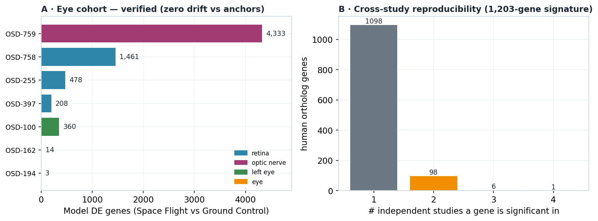
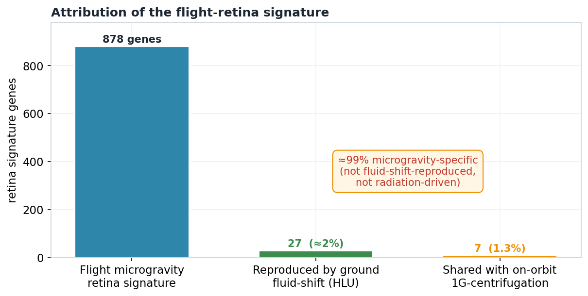
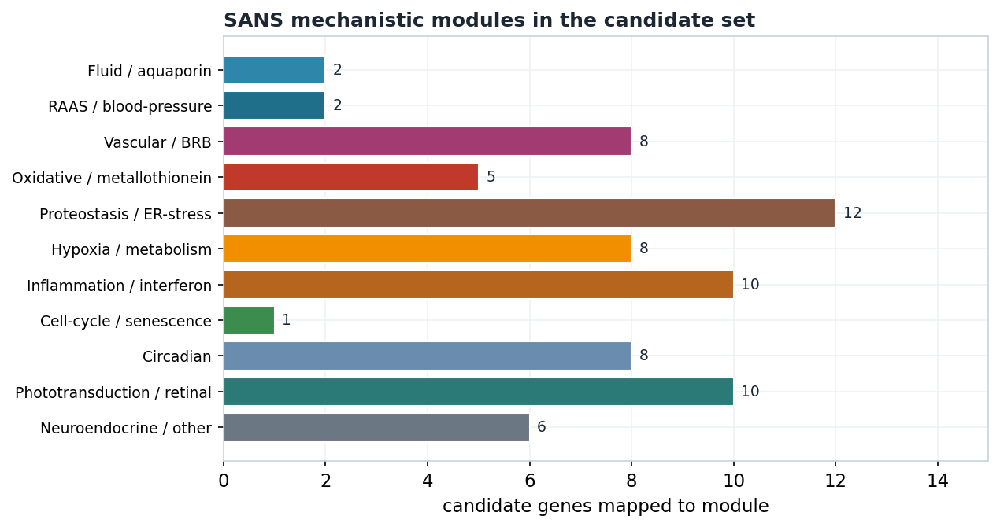
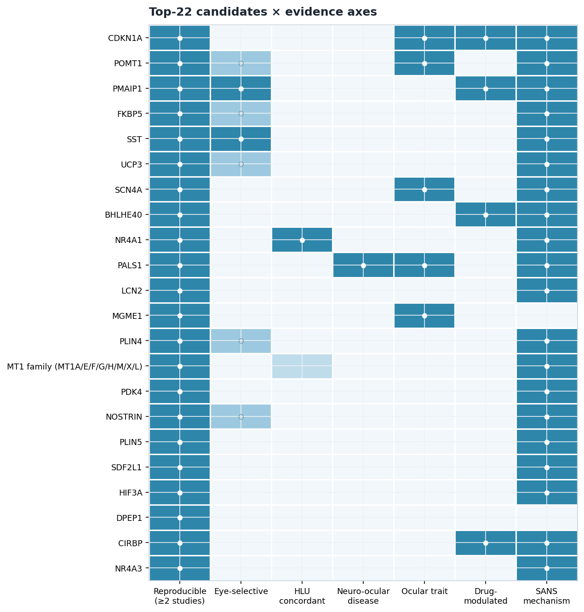

# Molecular Hypotheses for Spaceflight-Associated Neuro-ocular Syndrome (SANS)

### A cross-species integrative transcriptomics map on the Proto-OKN / FRINK federation

**Prepared for:** Peter · **Date:** 2026-07-04 · **Endpoint:** Proto-OKN / FRINK federated SPARQL (`https://apps.okn.us/federation/sparql`) · **Model:** claude-opus-4-8

> **Framing (non-negotiable).** All eye omics are **mouse RNA-Seq**; human relevance is obtained by projecting mouse genes to human orthologs (`IS_ORTHOLOG_MGiG`). **Every human-level statement is mouse-derived and ortholog-inferred** — this is *hypothesis generation, not clinical inference*.

---

## 1. Executive summary

This report maps the ocular spaceflight response and generates a ranked set of molecular hypotheses for **Spaceflight-Associated Neuro-ocular Syndrome (SANS)** by querying NASA GeneLab/OSDR mouse eye omics in the **spoke-genelab** knowledge graph and integrating the result across the Proto-OKN / FRINK federation. Seven mouse eye studies were anchored on the **Space-Flight-vs-Ground-Control** contrast (direction rule) with a materials + non-condition-factor comparability rule, and projected to human orthologs; all cross-KG integration is on **Entrez gene / UBERON tissue only** (OSD study accessions are a federation island).

The cohort rebuilt **exactly** against the verified anchors (zero drift) and yields a **1,203-gene human-ortholog signature** (adj_p ≤ 0.05 in ≥ 1 study). Its reproducible core — a **54-gene retina ∩ optic-nerve** set spanning two independent tissues from two independent studies — braids six coherent programs: **oxidative stress** (metallothionein MT1 family ↑, PMAIP1 ↑, TXNIP ↑), **proteostasis / ER stress** (CIRBP ↑, FKBP5 ↑, HSPA5/HSPA8/HSPH1 ↓), **hypoxia / metabolism** (HIF3A ↑, PDK4 ↑, UCP3 ↑, PLIN4/5 ↑), **neuroinflammation** (LCN2 ↑, IRF7 ↑, type-I interferon), **cell-cycle stress** (CDKN1A/p21 ↑), and a **fluid / vascular / blood-retinal-barrier** module (AQP1 ↑, AQP5 ↑, renin REN ↑, AGTR2 ↑, VEGFA ↓, APLNR ↓, NOSTRIN ↑, and the apical-polarity gene **PALS1 ↑**).

Two orthogonal controls sharpen causal attribution. The ground **hindlimb-unloading fluid-shift analog** (OSD-203) reproduces only **≈ 2 %** of the flight-retina signature, and the **on-orbit 1G-centrifugation control** abolishes **≈ 99 %** of it — indicating the core response is **microgravity-specific**, not merely cephalad fluid shift and not radiation-driven. The top-ranked mechanistic candidate is **PALS1 (MPP5)** — detected in three studies (up in retina OSD-255 and optic nerve OSD-759, down in retina OSD-758; predominantly up but sign-labile between the two retina studies), a Crumbs-complex blood-retinal-barrier gene, and a bona-fide neuro-ocular disease gene (optic atrophy, retinal detachment).

---

## 2. Sources used

Eight knowledge graphs were queried. **spoke-genelab** is the primary differential-expression source; the rest supply cross-KG context on the **shared Entrez gene / UBERON tissue** keys. Direct-Entrez joins are high-confidence; prokn's Entrez→HGNC Wikidata bridge is lower-confidence and was **avoided**. Versions are the exact FRINK releases pinned 2026-07-04 (`get_kg_version`).

| KG (shortname) | Version | Role in this map | Entity types | Join / confidence |
|---|---|---|---|---|
| **spoke-genelab** | v0.0.2 | **Primary:** mouse eye differential expression (`MEASURED_DIFFERENTIAL_EXPRESSION_ASmMG`) + mouse→human ortholog (`IS_ORTHOLOG_MGiG`) | genes, expression, anatomy | source |
| **spoke-okn** | v0.0.6 | Disease associations (`ASSOCIATES_DaG`), gene markers, compound up/down-regulation, drug→disease (`TREATS_CtD`) | disease, drug | Entrez node-IRI (direct, verified 16,326) |
| **rdkg** | v0.0.1 | Rare disease → **HPO phenotype** (`has_phenotype`) → anatomy | disease, phenotype | Entrez via identifiers.org (direct, 9,034) |
| **digcfdekg** | v0.0.1 | **Statistical** gene→trait / gene-set enrichment (PIGEAN/EAGGL) | traits, gene sets | Entrez node-IRI (direct, 19,747) |
| **prokn** | v0.0.5 | GO / Reactome / pathway hub | pathway, GO | Entrez→HGNC via Wikidata (**bridged — avoided**) |
| **biobricks-aopwiki** | v0.0.4 | Adverse Outcome Pathways | AOP | Entrez exactMatch (sparse key-event path — not used) |
| **gene-expression-atlas-okn** | v0.0.3 | Terrestrial baseline expression (retina/eye; **optic nerve absent**) | expression | UBERON (direct, 27 tissues) |
| **ubergraph** | v0.0.2 | Ontology bridge (tissue / taxon closure) | ontology | bridge |

**Checked but not contributory:** formal GO/Reactome (prokn) required the lower-confidence Wikidata bridge and was substituted with digcfdekg trait enrichment; aopwiki's key-event→gene path is too sparse to anchor AOPs; gene-expression-atlas gives no optic-nerve baseline.

---

## 3. Cohort, study design & rules

Two rules define every spaceflight contrast. **Direction rule:** keep an assay only when `factor_space_1 = "Space Flight"` AND `factor_space_2 = "Ground Control"` (group 1 = spaceflight ⇒ `log2fc > 0` = up in flight; reversed / Basal / Vivarium / SF-vs-SF dropped). **Comparability rule:** pool/compare assays only within identical `(material_id_1, material_id_2, cleaned factors_1, cleaned factors_2)` after stripping condition labels and anchored group codes. **Thresholds:** significance `adj_p ≤ 0.05` (primary), effect size `|log2fc| ≥ 1` reported alongside; `|log2fc| ≥ 10` flagged as near-zero-count artifact. **Ortholog collapsing:** max |log2fc| for 1:many/many:1 (mean-rule sensitivity: 14 genes differ, 0 sign flips).

The cohort rebuilt live to **exactly** match the verified anchors:

| OSD | Tissue | UBERON | Valid SF-vs-GC assays | Model DE genes | Human orthologs |
|---|---|---|---:|---:|---:|
| OSD-759 | optic nerve | 0004904 | 4 | 4,333 | 4,021 |
| OSD-758 | retina | 0000966 | 4 | 1,461 | 1,366 |
| OSD-255 | retina | 0000966 | 1 | 478 | 489 |
| OSD-397 | retina | 0000966 | 1 | 208 | 214 |
| OSD-194 | retina | 0000966 | 1 | 3 | 1 (sparse) |
| OSD-100 | left eye | 0004548 | 1 | 360 | 373 |
| OSD-162 | eye | 0000970 | 1 | 14 | 12 |

OSD-758 (retina) and OSD-759 (optic nerve) each carry four **distinct-gravity** SF-vs-GC assays — `uG`, `0.33G`, `0.66G`, `1G by centrifugation` (each vs `1G on Earth`) — treated as separate comparability groups. The **uG (microgravity)** arm is the primary SANS contrast; **1G-by-centrifugation** is the on-orbit gravity-restored control (§5.3).

---

## 4. Confidence tiers

Candidates are ranked by an integrated priority score over reproducibility, effect size, eye-selectivity, HLU concordance, neuro-ocular disease/phenotype, ocular trait, vascular/fluid disease, druggability, and SANS-core mechanism; tiers summarise the dominant evidence.

| Tier | Definition | Interpretation |
|---|---|---|
| **A — reproducible** | Significant in **≥ 2 independent studies**, consistent direction | Established core of the ocular spaceflight response |
| **B — mechanistic** | Single-study but high SANS relevance (fluid / vascular / BRB module) | Strong mechanistic hypothesis; corroboration desirable |
| **C — supporting** | Single-study, systemic or supporting role | Hypothesis-generating |

Reproducibility distribution (distinct human genes): **4 studies → 1 (HSPA8) · 3 → 6 · 2 → 98 · 1 → 1,098** — 105 genes in ≥ 2 studies, of which **49 are consistent-direction**. Notably, the most *broadly detected* genes (HSPA8 in 4 studies; INMT, RBM3, PALS1 and others in 3) are directionally **mixed** across tissues, so cross-tissue *co-detection* and *directional consistency* are distinct axes; the cleanest reproducible set is the 49-gene consistent-direction backbone plus the within-retina consensus. Tier A (≥ 2 studies) = 98 candidates (after collapsing metallothionein paralogs); Tier B (fluid/vascular/BRB single-study) = 8.

---

## 5. Findings by axis

### 5.1 Per-tissue signatures & cross-study consensus

The strongest reproducibility signal is the **retina ∩ optic-nerve cross-tissue core (54 genes co-detected in both OSD-758 retina and OSD-759 optic nerve; 42 of them in the same direction)**: metallothioneins (MT1 family ↑), chaperones (HSPA8 ↓, HSPH1 ↓, CIRBP ↑, FKBP5 ↑, SDF2L1 ↓), hypoxia/metabolism (HIF3A ↑, PDK4 ↑, UCP3 ↑, PLIN4/5 ↑), inflammation (LCN2 ↑), CDKN1A/p21 ↑, and endothelial NOSTRIN ↑. A stricter **within-retina consensus** across the three informative retina studies gives four cleanly consistent genes — **IRF7 ↑, SCN4A ↑, NR4A3 ↓, STC1 ↓**. Across all tissues, **49 genes** form a consistent-direction reproducible backbone. The most *broadly detected* genes are directionally mixed: the chaperone **HSPA8** is significant in four studies (net down), and **PALS1** in three (up in retina OSD-255 and optic nerve OSD-759, down in retina OSD-758) — a reminder that breadth of detection and directional consistency are separate.

### 5.2 Tissue specificity — systemic vs eye-selective

Against ~19 non-eye spoke-genelab tissues: **417 systemic · 685 intermediate · 101 eye-selective**. The reproducible stress core (MT1, LCN2, CIRBP, CDKN1A, IRF7, PDK4, HIF3A) is **systemic** — the conserved organism-wide spaceflight response, also present in the eye. The **eye-selective** fraction is enriched for phototransduction (SAG, RCVRN, GUCA1A, GNAT2, CNGB3) and a few selective responders (SST, PMAIP1). This supports a **two-tier model**: a systemic microgravity stress *driver* producing injury where local *vulnerability* is high. (The optic nerve has no terrestrial GXA baseline, so no tissue-matched control is claimed for it.)

### 5.3 Fluid-shift attribution & microgravity-vs-radiation

The **hindlimb-unloading fluid-shift analog** (OSD-203, non-irradiated loading main effect) gives a 107-gene retina signature that overlaps the flight signature in only **27 genes (≈ 2 %)**; where they overlap, effect sizes correlate (Spearman ρ = 0.63, p < 0.001; 63 % same-direction), but the overlap is a **muscle/metabolic module** (SLC2A4/GLUT4, sarcomeric genes, FABP4) and the oxidative metallothionein program is **reversed**. The **on-orbit 1G-centrifugation control** (radiation + launch + housing, no microgravity) collapses the retinal response from 878 to **46 genes**, sharing only **7 (1.3 %)**, and the entire SANS-relevant stress core (MT1, LCN2, CIRBP, CDKN1A, FKBP5, HIF3A, PDK4, HSPA5/8, XBP1, PMAIP1) is **absent**. ⇒ **≈ 99 %** of the microgravity signature is microgravity-specific.

### 5.4 Mechanistic modules → SANS features

Functional/trait enrichment via **digcfdekg** (direct join) independently recovers the axes: a "Rare disorder of the visual organs / ophthalmic disorder" set (AQP1, AQP5, PALS1, VEGFA, POMT1, CDKN1A, SERPINH1, SCN4A, MGME1, AIRE), rare neurologic disease, and — matching the fluid theme — hematocrit/blood-volume, serum urate/urea and chronic-kidney-disease traits, plus lipid and inflammatory traits. The **fluid** (AQP1/AQP5 ↑; RAAS REN/AGTR2 ↑; NPPC ↓) and **vascular/BRB** (VEGFA ↓ with HIF3A ↑; APLNR ↓; NOSTRIN ↑; PALS1 ↑) modules are the most SANS-apt.

### 5.5 Disease & phenotype linkage

**rdkg (rare disease → HPO):** 20 signature genes lie in the neuro-ocular disease universe (208 genes; optic atrophy / optic-disc-nerve / retinal-degeneration-detachment / macular / papilloedema) — over-representation **1.56×** (20 vs 12.8 expected; hypergeometric p = 0.032; descriptive). **PALS1** links to optic atrophy, optic-disc changes and retinal detachment; **FZD4** to familial exudative vitreoretinopathy (retinal vascular); **GNAT2/CNGB3/GUCA1A** to cone phototransduction. **spoke-okn:** a **vascular / hypertension** axis directly relevant to SANS fluid-pressure physiology — REN, CCL2, CDKN1A, AGTR2 → hypertension / cerebrovascular disease; LCN2 → CKD; POMT1 → glaucoma/myopia.

### 5.6 Countermeasure / target hypotheses

spoke-okn's therapeutic edges are sparse and its compound→gene layer is **toxicogenomic** (chemicals that perturb expression, not therapeutics), so countermeasure hypotheses are **mechanism-derived**: (i) modulating the ocular **renin-angiotensin balance** (AT1/AT2 — AGTR2/AT2 may be a protective arm); (ii) **oxidative-stress mitigation** (metallothionein/NOXA program); (iii) **vascular / blood-retinal-barrier stabilisation** (VEGFA/HIF3A, apelin, PALS1); and — the cleanest signal in the data — **in-orbit artificial gravity**, which the 1G-centrifugation control shows can abolish the ocular transcriptional response.

---

## 6. Discussion

**A convergent stress physiology.** Read together, the reproducible core is a recognizable injury cascade — a hypoxia/metabolic switch feeding an oxidative buffer, a proteostatic response, a cell-cycle brake, neuroinflammation, and a fluid/vascular/barrier module — co-detected in two independent tissues (42 of the 54-gene retina∩optic-nerve core in the same direction). A notable detail is a **proteostasis dissociation**: the cold-shock proteins CIRBP and RBM3 rise while the canonical heat-shock/UPR chaperones (HSPA5/BiP, HSPA8, HSPH1, XBP1) fall, a torpor-like translational reprogramming rather than a classical heat-shock defense.

**The central tension.** That ground fluid-shift unloading reproduces only ~2 %, and on-orbit radiation/launch only ~1 %, of the flight signature seems to challenge the fluid-shift model of SANS — but the two live at different levels. SANS as a *clinical* syndrome is a problem of orbital fluid mechanics and pressure; a transcriptome reports a *cellular stress state*. Disc edema can arise from fluid/pressure dynamics without a transcriptional footprint, so a weak fluid-shift overlap does not exclude fluid shift clinically — it says the measured molecular layer is separate and, per the controls, **microgravity-specific** (direct gravitational unloading/mechanotransduction), not merely a downstream fluid-shift response.

**Mechanistic threads worth testing.** Aquaporins rise (AQP1 retina, AQP5 optic nerve) but **not AQP4**, the glymphatic channel — implying AQP4 involvement, if any, is post-transcriptional, and nominating specific water channels to assay at the protein level. The renin-angiotensin finding (REN ↑, AGTR2 ↑) engages the fluid/pressure axis, but AGTR2/AT2 generally *opposes* the AT1 pressor arm, so its rise may be **compensatory** — the AT1/AT2 balance, not blanket RAAS activation, is the interesting variable. The paradoxical **VEGFA ↓** in optic nerve has a candidate cause in the co-occurring **HIF3A ↑** (an atypical HIF isoform that represses classical HIF targets including VEGFA), which — with APLNR ↓, NPPC ↓ and NOSTRIN ↑ — reads as coordinated vascular-tone/permeability dysregulation. **PALS1** is the cleanest bridge from spaceflight expression to a structural neuro-ocular disease mechanism (Crumbs/BRB polarity; optic atrophy/retinal detachment disease gene).

**Artificial gravity and the human-susceptibility hypothesis.** The 1G-centrifugation control abolishing the signature is direct molecular support that in-orbit artificial gravity could pre-empt the ocular response — the most actionable finding — though the partial-gravity arms were **non-monotonic** (optic-nerve 0.33G > uG), cautioning against assuming fractional (lunar/Martian) gravity is automatically protective. Finally, faint echoes of the human one-carbon/folate SANS-susceptibility hypothesis appear (MTRR ↓ in retina, PRODH ↑) — far too sparse to corroborate, but a pre-registered place to look in human/larger datasets.

**Testable predictions.** (1) In-orbit artificial gravity prevents the ocular transcriptional response; (2) aquaporin water-handling is perturbed via AQP1/AQP5 (and AQP4 trafficking) not AQP4 transcription; (3) Crumbs/BRB integrity is disrupted, PALS1 first; (4) optic-nerve VEGFA is HIF3A-dependently suppressed; (5) the ocular AT1/AT2 balance shifts; (6) partial gravity does not monotonically protect the eye.

---

## 7. Full ranked candidates

The complete machine-readable ranking is **`SANS_ocular_spaceflight_candidates.xlsx`** (sheets: Ranked Candidates, Full Signature, Cohort Verification, Fluid-shift & Radiation, Methods & Rules; 1,196 ranked rows). The interactive, sortable/filterable version is embedded in **`SANS_ocular_spaceflight_report.html`**.

**Representative slice — top candidates and mechanistic tier:**

| Gene (human) | Mouse | Tissue(s) | Dir. | Studies | Eye-selectivity | Module | Disease/phenotype | Tier |
|---|---|---|---|---|---|---|---|---|
| **PALS1** | Pals1 | retina + optic nerve | ↑ (2/3) | 3 | systemic | BRB / apical polarity | optic atrophy, retinal detachment (rdkg); ocular trait | A |
| **CDKN1A** | Cdkn1a | retina + optic nerve | ↑ | 2 | systemic | cell-cycle / senescence | hypertension (spoke-okn); ocular trait | A |
| **POMT1** | Pomt1 | retina + optic nerve | ↓ | 2 | intermediate | glycosylation / retina | myopia, glaucoma; ocular trait | A |
| **LCN2** | Lcn2 | retina + optic nerve | ↑ | 2 | systemic | inflammation / injury | CKD (spoke-okn) | A |
| **FKBP5** | Fkbp5 | retina + optic nerve | ↑ | 2 | intermediate | glucocorticoid / proteostasis | — | A |
| **MT1 family** | Mt1/Mt2 | retina + optic nerve | ↑ | 2 | systemic | oxidative / metallothionein | — | A |
| **HIF3A** | Hif3a | retina + optic nerve | ↑ | 2 | systemic | hypoxia | — | A |
| **NOSTRIN** | Nostrin | retina + optic nerve | ↑ | 2 | intermediate | vascular / eNOS | — | A |
| **AQP5** | Aqp5 | optic nerve | ↑ | 1 | intermediate | fluid / aquaporin | ocular trait | B |
| **AQP1** | Aqp1 | retina | ↑ | 1 | systemic | fluid / aquaporin | ocular trait | B |
| **REN** | Ren1 | eye | ↑ | 1 | intermediate | RAAS / blood-pressure | hypertension, cerebrovascular (spoke-okn) | B |
| **AGTR2** | Agtr2 | retina | ↑ | 1 | eye-selective | RAAS / blood-pressure | — | B |
| **VEGFA** | Vegfa | optic nerve | ↓ | 1 | systemic | vascular / angiogenesis | ocular trait | B |
| **APLNR** | Aplnr | optic nerve | ↓ | 1 | intermediate | vascular / apelin | — | B |
| **FZD4** | Fzd4 | retina | ↑ | 1 | systemic | retinal vascular / Wnt | familial exudative vitreoretinopathy (rdkg) | B |

---

## 8. Caveats, uncertainties, and likely undercounts

1. **Mouse-only, ortholog-inferred.** No human ocular spaceflight omics were used; every human-gene statement is projected from mouse via `IS_ORTHOLOG_MGiG`. Treat all disease/phenotype/drug links as mouse-derived hypotheses.
2. **Small n.** Three retina studies carry the informative signal; OSD-194 is essentially null (2 artefactual genes). Optic-nerve depth comes from a single study (OSD-759, 4 gravity arms).
3. **Microgravity/radiation/launch are partially confounded in flight** — addressed with the on-orbit 1G-centrifugation control but not fully separable; the HLU retina analog is noisy (lens/muscle contamination), so the 2 % fluid-shift overlap is a lower bound.
4. **No optic-nerve terrestrial baseline** (gene-expression-atlas lacks optic-nerve records), so no tissue-matched control expression is claimed for it.
5. **No blood tissue in the KG** — a hematologic/fluid-volume comparison was substituted with immune organs (spleen, thymus, bone marrow).
6. **Transcriptomics only** — no protein, methylation integration, or functional validation.
7. **Functional enrichment is direct-join (digcfdekg) rather than prokn GO/Reactome**, which would require the lower-confidence Entrez→HGNC Wikidata bridge; aopwiki AOPs were not anchored (sparse key-event path).
8. **Over-representation statistics are descriptive** — the rdkg neuro-ocular universe is dominated by one broad syndromic-ID disease, so the 1.56× (p = 0.032) enrichment is hypothesis-sharpening, not confirmation.
9. **Extreme |log2fc| ≥ 10** (near-zero-count DESeq2 artefacts) were flagged and down-weighted; the systemic-tissue recurrence table captured 1,233 of 1,244 genes (≤ 11 mid-list genes may be mislabelled eye-selective — no effect on headline findings or top candidates).

---

## 9. Reproducibility

Every SPARQL query (verbatim, with graphs hit and row counts), the detailed discussion, and a data-to-claim **provenance map** are preserved in **`SANS_reproducibility_transcript.md`** (generated via `create_chat_transcript`); the rules, thresholds and join-confidence are in **`SANS_reproducibility_appendix.md`**. KG versions (§2) are pinned via `get_kg_version`. The ranked candidate table ships as **`SANS_ocular_spaceflight_candidates.xlsx`** and the study design and prompt are in **`SANS_case_study_design.md`** and **`SANS_study_run_prompt.md`**. Re-running against the same KG versions reproduces the counts (the cohort table in §3 was reproduced live with zero drift).
