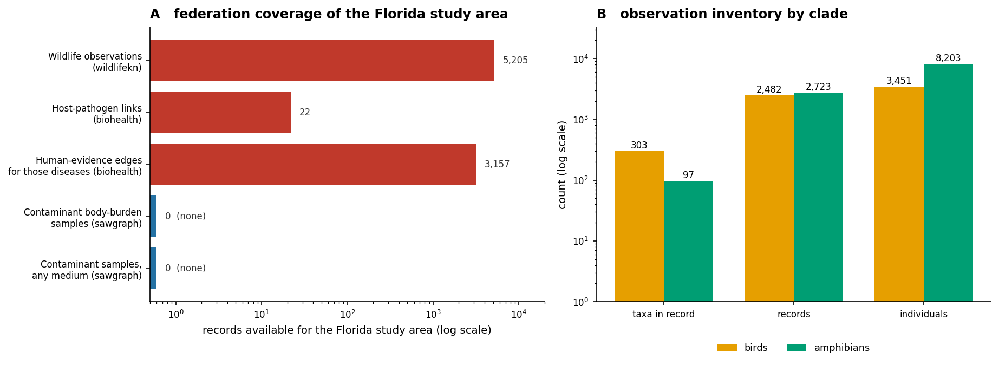
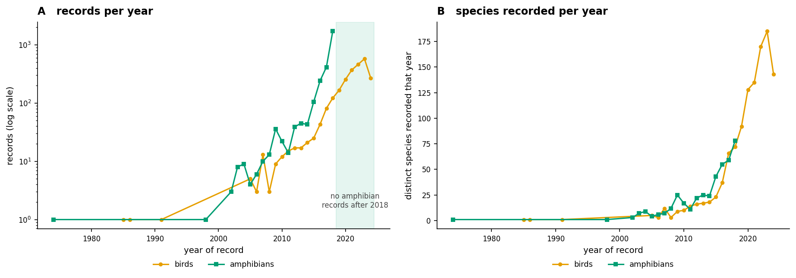
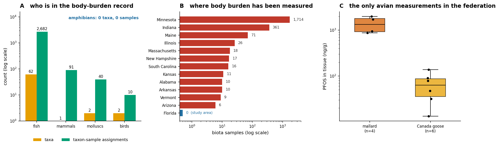
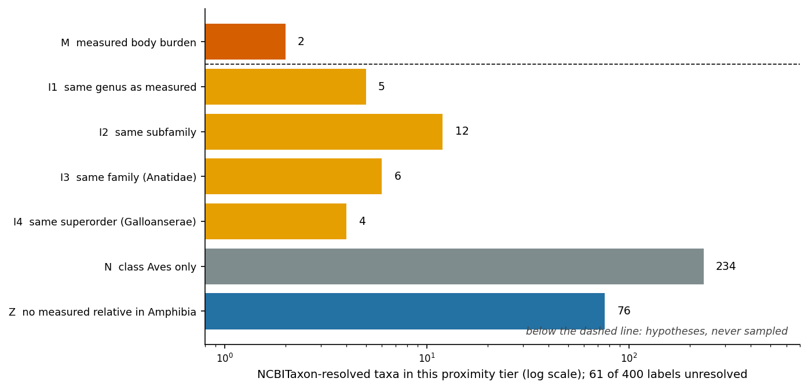
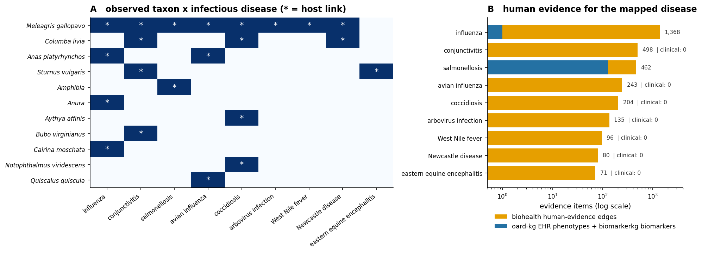
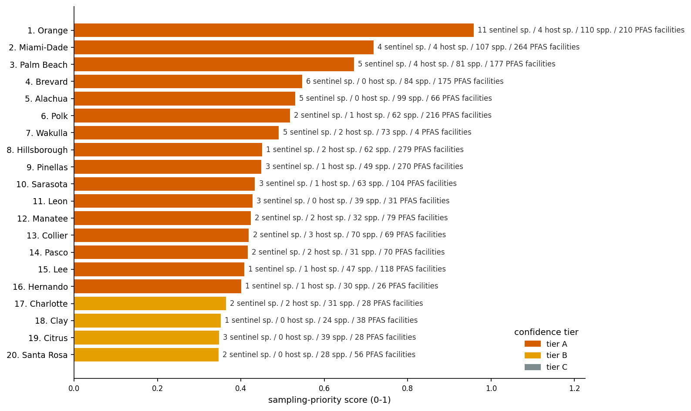
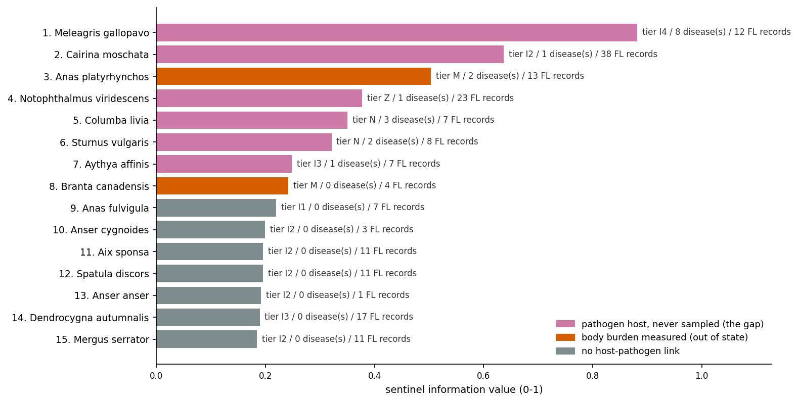

# Sentinel-Wildlife: putting Florida's contaminant and pathogen surveillance of wild birds and amphibians on one map
### A cross-KG gap analysis over the OKN federated SPARQL endpoint — wildlifekn observations joined to contaminant body burden, host–pathogen links, human clinical evidence, place-based determinants and the regional climate record

**Date:** 2026-07-29 · **Endpoint:** OKN federated SPARQL · **Model:** claude-opus-5

> **Framing (non-negotiable).** The unit of analysis is a **species × Florida county** pair, over the whole period the federation's wildlife record covers (1974-06-10 to 2024-05-13). Everything below is **hypothesis generation for sampling design, not exposure assessment and not causal or clinical inference**. Two distinct kinds of statement appear and are kept visibly apart throughout: **measured** — a contaminant concentration actually quantified in that species' tissue — and **inferred** — a species that is only *phylogenetically close* to one that was measured, which is a hypothesis about who *might* accumulate, supported by no sample. Host–pathogen links are **literature-derived co-occurrence assertions**, not experimental host-competence results. Observation counts are opportunistic community-science records (iNaturalist-derived) and index **observer effort as much as animal abundance**. Keep these caveats attached to every downstream claim.

**Abbreviations.** AI = avian influenza · Bd = *Batrachochytrium dendrobatidis* (amphibian chytrid fungus) · CUI = UMLS Concept Unique Identifier · DOID = Human Disease Ontology identifier · EEE = eastern equine encephalitis · EHR = electronic health record · FIPS = Federal Information Processing Standards (US geographic code) · HP = Human Phenotype Ontology · HPAI = highly pathogenic avian influenza · IAV = influenza A virus · KG = knowledge graph · MONDO = Mondo Disease Ontology · NCBITaxon = NCBI Taxonomy ontology · OKN = Open Knowledge Network · PFAS = per- and polyfluoroalkyl substances · PFBA/PFDA/PFDS/PFHpS/PFHxS/PFNS/PFOS = individual perfluoroalkyl acids · RCM = regional climate model · S2 = Google S2 geospatial cell hierarchy · SDoH = social determinants of health · SPARQL = SPARQL Protocol and RDF Query Language · UMLS = Unified Medical Language System · WNV = West Nile virus · WQP = US Water Quality Portal

## 1. Executive summary

Wild animals are read as sentinels for two things at once — the chemicals accumulating around them and the pathogens circulating through them — and the OKN federation contains both kinds of evidence. Joining them over Florida shows that, for this study area, **the two systems do not overlap at all**. The federation holds **5,205 wild bird and amphibian observation records** (303 bird and 97 amphibian taxa, 11,654 individuals, 657 named places, 1974-06-10–2024-05-13) and **zero contaminant measurements of any kind — biotic or environmental — anywhere in Florida**. The intersection of the wildlife record and the contaminant record is not small; it is empty.

Across the whole federation, contaminant body burden has been measured in **67 animal taxa** from **12 states**, and exactly **2 of them are birds** — mallard (*Anas platyrhynchos*) and Canada goose (*Branta canadensis*), both sampled only in Washington County, Minnesota, in 2022, with PFOS reaching **1,990 ng/g** and **137 ng/g** of tissue respectively. **0 amphibians** have been measured. Both measured bird species do occur in the Florida record, so the entire measured evidence base for Florida's avifauna is two species sampled 2,000 km away. Everything else is inference: **27 Florida-recorded waterfowl and gamebird taxa** sit within a genus, subfamily, family or superorder of a measured species and are therefore *plausible* sentinels for which no sample exists, and every one of the **97** amphibian taxa (76 of which resolve to NCBITaxon) has no measured relative anywhere in Amphibia.

The pathogen side is populated but disconnected. Of the 339 Florida taxa that resolve to an NCBITaxon term, **17** appear in the NIAID Data Ecosystem and **11** carry an explicit host–pathogen assertion in the biohealth graph, giving **22** taxon–disease pairs across 9 infectious diseases. Every one of those diseases has substantial human evidence in biohealth (**9/9**), but only **1** has any EHR phenotype evidence in oard-kg (salmonellosis, 128 phenotypes), only **1** has a biomarker (influenza, one variant), and **0** are present in spoke-okn's disease layer. The federation carries West Nile virus in **43** datasets and Bd in **2**, and links **0** of them to any avian host.

Ranked by how much a single new sampling effort would tell us, the top counties are **Orange**, **Miami-Dade** and **Palm Beach** (16 of 64 counties in tier A), and the top species are ***Meleagris gallopavo*** (wild turkey — 8 infectious diseases, 3,086 human-evidence edges, never sampled), ***Cairina moschata*** and ***Anas platyrhynchos***. **8 of 34** ranked species are the specific gap the study set out to find: hosts for a human pathogen that are absent from the contaminant record entirely. What this adds is a defensible, auditable target list — and the finding that a Florida sentinel programme would be starting from zero, not adding to a thin baseline.

## 2. Sources used

| KG | Version | Updated | Role in this study | Join key / confidence |
|---|---|---|---|---|
| `wildlifekn` | v0.0.6 | 2026-04-06 | The wildlife observation record: 5,205 reified bird/amphibian observation statements over 657 named places | subject of the analysis; species and places are **free-text labels**, no identifiers |
| `spatialkg` | v0.0.6 | 2026-05-07 | Florida county geography: county FIPS codes, county S2 Level-13 cell membership (county anchor points) | `county_FIPS`, **label-bridged** from county name (fragile) |
| `ubergraph` | v0.0.2 | 2026-05-01 | NCBITaxon resolution of wildlifekn label strings; `subClassOf*` clade closure for the proximity tiers; MONDO infectious-disease closure; MONDO↔UMLS `hasDbXref` bridge | `NCBITaxon`, `MONDO`; **label-bridged** on the wildlife side |
| `sawgraph` | v0.0.15 | 2026-03-16 | The contaminant record: PFAS biota/tissue samples, analytes, measured concentrations, sample-point geography | `NCBITaxon` (exact id), county FIPS via Data Commons geoId |
| `nde` | v0.0.3 | 2026-03-16 | Infectious-disease datasets by host species and by infectious agent; MONDO health conditions | `NCBITaxon` (UniProt taxonomy IRI), `MONDO` |
| `biohealth` | v0.0.4 | 2026-03-16 | Host–pathogen assertions (`PROCESS_OF`) and the human clinical/literature evidence layer for each mapped disease | UMLS CUI node IRIs; organisms **label-bridged** to NCBITaxon |
| `oard-kg` | v0.0.3 | 2026-06-05 | EHR-derived disease↔phenotype associations for the mapped human diseases | `MONDO` (both reified roles UNIONed) |
| `biomarkerkg` | v0.0.2 | 2026-03-16 | Biomarker evidence for the mapped human diseases | `MONDO` |
| `prokn` | v0.0.5 | 2026-06-23 | Independent check on whether the mapped diseases exist in a protein-centric disease layer | `MONDO` via `skos:exactMatch` |
| `spoke-okn` | v0.0.6 | 2026-03-16 | Place-based context: county-level chemicals-found-in-location, SDoH measures (adult asthma prevalence, per-capita income); DOID disease layer check | `county_FIPS` (node IRI), `DOID` |
| `fiokg` | v0.0.11 | 2026-03-18 | PFAS-relevant EPA facility counts per Florida county (`EPA-PFAS-Facility`) — the environmental-pressure proxy | `county_FIPS` |
| `climatemodelskg` | v0.0.15 | 2026-05-06 | The climate record for the observation counties: regional climate models covering each place, and climate publications mentioning it | county FIPS assembled from `admin1_code` + `admin2_code` |

Twelve KGs were queried; all appear above and every claim traces to a logged query in the reproducibility record. Suppliers that the capability index named but that this study **did not** use are declared in §6.4.

## 3. Design & rules

**The study area.** Florida was chosen because it is where the federation's wildlife observations live. The `wildlifekn` graph stores places as free-text labels — a mixture of Florida city names and county names, with no state, no coordinates and no identifiers — so the only reproducible route to geography is the published label bridge to `spatialkg` county names. Running that bridge live returns **62** Florida counties, not the **63** in the crosswalk catalogue; the discrepancy is a defect in the published count rather than drift (see §6.5). Normalising `Saint` → `St.` recovers two more (St. Johns 12109, St. Lucie 12111), giving the **64 counties** used here out of Florida's 67. City-type locations (some 757 records at 474 amphibian and 283 bird city labels) cannot be resolved to a county at all and are excluded from every county-level statement, though they are included in the state-wide inventory and the temporal series.

**Two evidence classes, never merged.** A species is **measured** only if `sawgraph` holds a contaminant concentration in a biota sample of that exact NCBITaxon id. Everything else that shares a clade with a measured species is **inferred** and tiered by how close that clade is (§4). The exact-id overlap between the Florida wildlife record and the contaminant record is 2 taxa; a naive clade-expanded join returns 339, because `sawgraph` also asserts phylum- and class-level ancestors — that number is an artefact of the hierarchy, not evidence, and is not used (§6.5).

**Host–pathogen links.** Two independent routes were run. `nde` links a host taxon to a dataset's MONDO health condition and infectious agent; the MONDO terms were filtered to genuine infectious disease by `rdfs:subClassOf*` closure under MONDO:0005550 in `ubergraph`. `biohealth` asserts `PROCESS_OF` between a disease concept and an organism concept, and its organisms are matched to the wildlife record by NCBITaxon label. Both are **observational co-occurrence**, and the biohealth layer is literature text-mined — two of its edges are flagged as probable extraction artefacts (§6.3).

**Human evidence.** For each mapped disease, four independent human-side layers were interrogated — biohealth (literature/clinical associations, via the MONDO↔UMLS `hasDbXref` bridge), oard-kg (EHR phenotype co-occurrence, UNIONing both reified roles), biomarkerkg (biomarkers), prokn and spoke-okn (presence in a curated disease layer).

**Scoring.** Counties are scored on six min–max-normalised axes (sentinel-capable species richness, best proximity tier present, pathogen-host species count, log EPA **PFAS**-facility count, total observed species richness, adult asthma prevalence); species are scored on five (number of infectious diseases hosted, proximity tier, human-evidence weight of those diseases, Florida observation footprint, county spread) with a multiplier applied when the species is a pathogen host that has never been sampled. The exact weights, formulas and thresholds are in the reproducibility file; §3 states only what is in the score and why.

**Inventory (rebuilt live).**

| Layer | Quantity | Note |
|---|---|---|
| Bird observation records | 2,482 | 1,151 at county-type places, 1,331 at city-type places |
| Amphibian observation records | 2,723 | 1,239 county-type, 1,484 city-type |
| Bird taxa / amphibian taxa | 303 / 97 | includes genus- and family-level identifications |
| Taxa resolving to NCBITaxon | 339 | authority-stripped binomial → `ubergraph` label |
| Florida counties reachable | 64 | 62 by the verified bridge + 2 by declared repair |
| Contaminant biota taxa (federation-wide) | 67 | 2,284 biota samples (2,269 with a county geoId), 12 states |
| Contaminant samples in Florida | 0 | any medium, any analyte |
| Host–pathogen taxon–disease pairs | 22 | 11 taxa, 9 diseases |
| PFAS-relevant EPA facilities in the study area | 4,118 | `fiokg` `EPA-PFAS-Facility` records, all 67 Florida counties (1 in Liberty to 279 in Hillsborough) |

> ***Figure 1. Study design and evidence inventory (wildlifekn, sawgraph, biohealth).*** **(A)** Records available for the Florida study area in each surveillance layer, log scale; red = layer has data, blue = layer is empty. **(B)** Observation inventory by clade — taxa in the record, records, and summed `observed_times` individuals. Provenance: (A) `wildlifekn` reified `OBSERVED_AT` statements; `sawgraph` `coso:BiotaSample` / `coso:fromSamplePoint` restricted to Florida county geoIds; `biohealth` `PROCESS_OF` edges and the per-disease neighbourhood. (B) `wildlifekn` grouped by `Bird_name` / `Amphibian_name` class.

The asymmetry in panel A is the study's central result in one image: the wildlife layer and the human-disease layer are both well populated for this study area, and the contaminant layer — the thing wild animals are most often proposed as sentinels *for* — contains nothing at all.

## 4. Confidence tiers

Two ranked products are reported, each tiered A/B/C by score quartile (A = top quartile, B = 40th–75th percentile, C = below the 40th percentile). Because every Florida county has zero contaminant samples, the sampling-deficit term is uniform across the study area and does not discriminate between counties: the county ranking is driven by biological content and environmental pressure, not by differential prior sampling.

| Tier | County ranking requires | Species ranking requires |
|---|---|---|
| **A** | Top-quartile composite score: high sentinel-capable richness *and* either a pathogen-host species present or substantial PFAS-facility pressure | Top-quartile information value: a host–pathogen assertion with human-evidence support, or measured body burden, plus a real Florida footprint |
| **B** | Mid-range score: sentinel-capable species present but thin host or pressure evidence | Proximity-tier membership (I1–I3) with a Florida footprint but no host–pathogen assertion |
| **C** | Low score: few sentinel-capable taxa, low richness, low facility pressure | Weak proximity (I4/N/Z) and no host–pathogen assertion, or a single Florida record |

Distribution — counties: **16 A**, 22 B, 26 C of 64. Species: **9 A**, 11 B, 14 C of 34 ranked species, with 2 higher taxa (Anura, Amphibia) held out of the ranking because they are not species-level sampling targets.

## 5. Findings by axis

### 5.1 Which species are observed, where, and how the record changed

The record is two datasets in one graph. The amphibian series runs from a single 1974 record to a hard stop at the end of **2018**, with 1,709 of its 2,723 records (1709, 63%) dated in that final year; the bird series runs to **May 2024** and grows monotonically to a peak of 575 records in 2023. The two clades are also geographically different: bird county-labels are all Florida, whereas the amphibian layer spans the northern Gulf coastal plain, with roughly 72 county labels belonging to Georgia, Alabama or Mississippi. This is why the amphibian county numbers must be read with the homonym caveat in §10.

At the taxon level, the most-recorded amphibians are *Osteopilus septentrionalis* (277 records, 1,712 individuals), *Anaxyrus terrestris* (276 / 1,343) and *Hyla cinerea* (223 / 860); the most-recorded birds are *Ardea alba* and *Ardea herodias* (56 records each), *Pandion haliaetus* (47) and *Anhinga anhinga* (46). Full per-species and per-county tables are in the workbook.

> ***Figure 2. The observation record over time (wildlifekn).*** **(A)** Records per year by clade, log scale; the shaded band marks 2019–2024, during which the graph contains no amphibian records at all. **(B)** Distinct taxa recorded per year. Each point is the year of the `dcterms:date` on a reified `OBSERVED_AT` statement; one statement is one species × place pair carrying an `observed_times` count, so "records" are species–place encounters, not individual sightings. Provenance: `wildlifekn`, `rdf:subject`/`rdf:object` reification with `wildlife:observed_times` and `dcterms:date`.

The growth in both panels tracks community-science participation, not wildlife abundance — the provenance links on every statement are iNaturalist observation URLs. The operational consequence is that the amphibian layer is a **historical** baseline that stops six years before the bird layer ends, so any joint bird–amphibian sampling design cannot treat the two as contemporaneous.

### 5.2 Who has a measured contaminant body burden — and who is only inferred

Federation-wide, `sawgraph` holds PFAS measurements in biota for **67 taxa** and 2,284 samples across 12 states — overwhelmingly fish (62 of the 67 taxa, 2,682 taxon–sample assignments), plus white-tailed deer (91), two marine bivalves (40) and **two birds (10)**. There are **no amphibians**. Mallard was sampled four times and Canada goose six times, all in Washington County, Minnesota (the 3M "East Metro" PFAS study area), in June and August 2022. Mallard PFOS ranged 875–1,990 ng/g and Canada goose 13.3–137 ng/g, with a long tail of shorter-chain analytes (PFHpS, PFHxS, PFDA, PFBA, PFNS, PFDS) detected in the same tissues.

> ***Figure 3. The contaminant body-burden record (sawgraph).*** **(A)** Taxa and taxon–sample assignments by broad animal group, log scale; the annotation states the amphibian total. Assignments sum to more than the 2,284 distinct biota samples because some samples carry both a species-level and a coarser (genus-level) taxon. **(B)** Biota samples by state, log scale; Florida — the study area — is in blue at zero. **(C)** PFOS in tissue (ng/g) for the only two avian taxa in the federation, box plots with every individual measurement overplotted (n = 4 mallard, 6 Canada goose, all Washington County, Minnesota, 2022). Provenance: `sawgraph` `coso:BiotaSample` → `coso:sampleOfMaterialType` → WQP `Taxon`, with `coso:analyzedSample` → `coso:ofSubstance` / `coso:hasResult` → `coso:measurementValue`; state and county from the sample point's `kwg:sfWithin` Data Commons geoId.

Panel B is the sampling gap in its bluntest form: eleven states with anywhere from 6 to 1,714 biota samples, and the state that is simultaneously an avian-influenza flyway, a PFAS hotspot and an amphibian-disease hotspot has none.

### 5.3 Phylogenetic inference: which species are plausible sentinels with no sample

Anchoring on the two measured species, `ubergraph`'s NCBITaxon closure places their genera (*Anas*, *Branta*), subfamilies (Anatinae, Anserinae), family (Anatidae) and superorder (Galloanserae) over the Florida record. **27 recorded taxa** fall into one of those tiers: 5 congeners of the mallard or goose (*Anas acuta*, *A. castanea*, *A. crecca*, *A. fulvigula*, *Branta leucopsis*), 12 in the same subfamily (*Aix sponsa*, *Bucephala albeola*, *Cairina moschata*, *Lophodytes cucullatus*, *Mareca americana*, *Mergus serrator*, *Nomonyx dominicus*, *Oxyura jamaicensis*, *Spatula clypeata*, *S. discors*, *Anser anser*, *A. cygnoides*), 6 more in Anatidae (*Alopochen aegyptiaca*, three *Aythya*, two *Dendrocygna*) and 4 gamebirds in Galloanserae (*Colinus virginianus*, *Gallus gallus*, *Meleagris gallopavo*, *Pavo cristatus*).

> ***Figure 4. Phylogenetic proximity to a measured species (wildlifekn × ubergraph).*** NCBITaxon-resolved taxa per tier, log scale; orange = measured, amber = inferred at successively coarser clade ranks, grey = birds whose nearest measured relative is only at class Aves, blue = amphibians, which have no measured relative anywhere in Amphibia. The dashed line separates the two measured taxa above from every hypothesis below. Counts are over the 339 of 400 wildlifekn labels that resolve to an NCBITaxon term (263 under Aves, 76 under Amphibia); the 61 unresolved labels are not tiered. Provenance: `wildlifekn` species labels stripped of taxonomic authority and resolved to NCBITaxon in `ubergraph`, then tested against the measured taxa's `rdfs:subClassOf*` ancestors at genus / subfamily / family / superorder rank.

The distribution matters as much as the tiers: only two taxa are above the line, 27 are within a plausible extrapolation distance, and **310 of the 339 NCBITaxon-resolved taxa (234 birds and all 76 resolvable amphibians)** have no measured relative closer than class or phylum. Any claim that Florida's amphibians are contaminant sentinels currently rests on nothing in this federation.

### 5.4 Which species are pathogen hosts, and what human disease each pathogen maps to

Of the 339 taxa that resolve to NCBITaxon, **17** intersect `nde` by exact taxon id — 12 birds and 5 amphibian taxa — but the intersection is dominated by laboratory use rather than wild-host surveillance: *Gallus gallus* alone accounts for 1,158 datasets and pulls in a long list of unrelated human diseases, which is a study-organism signal, not a host signal. Restricting `nde`'s MONDO conditions to true infectious disease leaves a small, interpretable set, in which **mallard** is the only wild taxon linked to avian influenza (MONDO:0018695), influenza, arbovirus infection and infectious disease, and house finch (*Haemorhous mexicanus*) is linked to conjunctivitis — the well-known *Mycoplasma gallisepticum* system.

The `biohealth` route is richer and reaches 11 Florida taxa and 22 taxon–disease pairs. **Wild turkey** is the hub, asserted as host for eight diseases including West Nile fever, avian influenza, salmonellosis, Newcastle disease and coccidiosis; rock pigeon carries three, European starling two (EEE and conjunctivitis), and mallard, Muscovy duck, lesser scaup, great horned owl, common grackle and eastern newt one each.

> ***Figure 5. Host–pathogen links and their human evidence (biohealth, oard-kg, biomarkerkg).*** **(A)** Observed taxon × infectious disease matrix; a filled cell with an asterisk is an asserted host link. **(B)** For the same nine diseases, amber = biohealth human-evidence edges on the disease concept, blue = oard-kg EHR phenotype associations plus biomarkerkg biomarkers; log scale, with "clinical: 0" annotated where the blue layer is empty. Provenance: (A) `biohealth` `PROCESS_OF` / `OCCURS_IN` / `PRODUCES` from a disease CUI node to an organism CUI node, the organism matched to `wildlifekn` by NCBITaxon label via `ubergraph`. (B) `ubergraph` MONDO `oboInOwl:hasDbXref` → UMLS CUI → `biohealth` node; `oard-kg` reified associations with the MONDO term in either `biolink:subject` or `biolink:object`; `biomarkerkg` `OBCI_1000008`/`OBCI_1000002`.

Panel B is the second disconnect. Every mapped zoonosis has a substantial human literature footprint in biohealth — from 71 edges for EEE to 1,368 for influenza — but the *clinical* layers are almost empty: salmonellosis is the only disease with EHR phenotype associations (128 in oard-kg), influenza the only one with a biomarker (a single *ROBO2* variant), and none of the nine appears in spoke-okn's DOID disease layer. So the chain wild host → pathogen → human disease → human clinical evidence is completable for exactly one of the nine diseases.

### 5.5 The place-based picture: health, environment, social, climate

For the 64 observation counties, `spoke-okn` supplies 140–151 chemicals recorded as found in the county and 853–1,140 SDoH measures per county; **none of those chemicals is a PFAS**, so the absence of Florida PFAS data in `sawgraph` is not compensated elsewhere in the federation. The available health and social measures are adult asthma prevalence (7.5% in Monroe to 10.4% in Gadsden, 2019) and per-capita income ($15,532 in Hamilton to $47,382 in Monroe, 2020). `fiokg` gives **4,118 `EPA-PFAS-Facility` records** across the state, from 1 in Liberty County to 279 in Hillsborough — the study's proxy for where PFAS contamination is plausible. This is the PFAS-relevant subset of EPA's Facility Registry Service; the full registry is far larger but counts every site EPA or a state programme has ever tracked, so it indexes economic activity rather than PFAS risk and is not used here (the check that established this is in the reproducibility record). Uninsured rate and children-in-poverty are present as SDoH concepts for all 67 counties but their values did not resolve on the reified-value path used here and are not reported.

The climate record reaches **35 of 64** counties: `climatemodelskg` holds 246 Florida GeoNames places in 36 Florida counties (35 of them inside the study area), covered by three CORDEX regional climate models (CRCM5, HIRHAM5, REMO2015) and mentioned by 97 distinct climate publications across 125 place–paper mentions, concentrated in Miami-Dade (50 mentions), Brevard (21), Orange (14) and Palm Beach (9). The remaining 29 counties — including several that rank highly on wildlife content, such as Wakulla — have no place in the climate graph at all, so the climate context is systematically absent from exactly the rural, low-facility counties where the wildlife record is richest.

Geography is reported in one place only, as an interactive OpenStreetMap-tiled map of the 64 counties (see the companion file `Sentinel-Wildlife_county_map.html`, also embedded in the HTML report). Each marker is clickable and carries that county's rank, score, tier, sentinel-capable and pathogen-host species counts, PFAS-facility count, asthma prevalence and contributing sources. County anchor points are the mean position of three S2 Level-13 cells (minimum, maximum and a sample of the cell ids `spatialkg` records as contained by that county) — a point inside the county, **not** its centroid.

<!-- COUNTY_MAP -->

## 6. Domain analyses

### 6.1 The county gap: sentinel-capable richness where nothing has been sampled

Because the sampling deficit is total and uniform across Florida, the county ranking measures biological and environmental *content*. **Orange County** leads decisively: 11 sentinel-capable taxa (the most of any county, including the mallard itself, so it is the one county where a measured species and a first-ever Florida sample coincide), four pathogen-host taxa, 110 observed taxa and 210 PFAS facilities. **Miami-Dade** and **Palm Beach** follow on a similar profile of high richness and high PFAS-facility pressure. **Wakulla** at rank 7 is the informative outlier — 73 observed taxa, five sentinel-capable taxa and two pathogen hosts on only 4 PFAS facilities, i.e. high biological value with almost no PFAS-facility pressure, which makes it the natural low-exposure reference site rather than a hotspot candidate. Four counties (Brevard, Alachua, Leon, Citrus) carry three or more sentinel-capable taxa and **no** pathogen-host taxon, which is a contaminant-only opportunity.

> ***Figure 6. Sampling-priority ranking, top 20 Florida counties.*** Bars are the composite score (0–1); colour is the confidence tier. Each annotation gives the county's sentinel-capable taxa, pathogen-host taxa, total observed taxa and EPA `EPA-PFAS-Facility` count. Provenance: `wildlifekn` observations bridged to county FIPS via `spatialkg`; proximity tiers via `ubergraph`; host links via `biohealth`; PFAS facilities via `fiokg`; asthma prevalence via `spoke-okn`.

### 6.2 The species gap: pathogen hosts absent from the contaminant record

**8 of the 34** ranked species are hosts for a human pathogen and have never been sampled for any contaminant — the precise gap the study set out to find. ***Meleagris gallopavo*** (wild turkey) is first by a wide margin: eight asserted infectious diseases whose human concepts carry 3,086 biohealth evidence edges between them, 12 Florida records across 9 counties, and a proximity tier of only I4 (same superorder as the mallard), meaning even its *inferred* contaminant relevance is weak — a species where the pathogen case is strong and the contaminant case is entirely unbuilt. ***Cairina moschata*** (Muscovy duck) is second: an Anatinae subfamily member, so a much better contaminant extrapolation, an influenza host assertion, and the largest Florida footprint of any waterfowl in the record (38 records in 6 counties). ***Notophthalmus viridescens*** (eastern newt) is the only amphibian in tier A — 23 records across 17 county labels and a coccidiosis host assertion, with tier Z proximity, i.e. no measured relative anywhere in its class.

> ***Figure 7. Sentinel information value, top 15 species.*** Bars are the composite information value (0–1); pink = pathogen host that has never been sampled (the gap), orange = body burden measured out of state, grey = no host–pathogen link. Annotations give the proximity tier, number of asserted infectious diseases and Florida record count. Provenance: as Figure 6, plus `nde` dataset counts per host taxon.

### 6.3 Data-quality flags raised by the analysis

Three assertions were flagged rather than scored. The `biohealth` layer asserts **Anura → influenza** and **Amphibia → salmonellosis**; the first is almost certainly a text-mining artefact (frogs are not influenza hosts) and both are higher taxa rather than species, so both were held out of the species ranking and are reported separately in the workbook. Separately, `biohealth` names *Colinus virginiuanus* as a West Nile fever host — a misspelling of *Colinus virginianus* — which means the bobwhite quail, a species present in the Florida record, is **invisible** to the label bridge. That is one demonstrated false negative in a bridge whose failure mode is silent, and it is the reason §10 treats the 11-taxon host set as a lower bound.

### 6.4 Analysis families: what was run and what was deliberately skipped

`find_context_sources` was queried for the four context types this study needs, and every supplier it returned is accounted for here rather than silently dropped.

| Context type | Suppliers returned | Used | Dropped, with reason |
|---|---|---|---|
| organism | sawgraph, gene-expression-atlas-okn, spoke-okn, spoke-genelab, biobricks-mesh, biohealth, nde, biobricks-aopwiki, wildlifekn | sawgraph, biohealth, nde, wildlifekn | **gene-expression-atlas-okn, spoke-genelab** — 8–9 model-organism taxa only, no bird or amphibian overlap; **spoke-okn** organisms are 34,570 bacterial strains, exact-id overlap with wildlifekn is 0; **biobricks-mesh** is MeSH-keyed, not a taxon-hub member; **biobricks-aopwiki** carries taxonomic *applicability of adverse outcome pathways*, which is susceptibility, not body burden — a legitimate additional axis, skipped to keep the measured/inferred distinction clean |
| disease | biohealth, rdkg, nde, oard-kg, digcfdekg, biomarkerkg, prokn, gene-expression-atlas-okn, spoke-okn | biohealth, nde, oard-kg, biomarkerkg, prokn, spoke-okn | **rdkg** — rare-disease scope; the nine mapped diseases are common zoonoses, and the query returned nothing for any of them; **digcfdekg** and **gene-expression-atlas-okn** supply gene→trait and expression evidence, which no question here asks for |
| phenotype | biohealth, rdkg, oard-kg, prokn, gene-expression-atlas-okn | oard-kg, biohealth | **prokn** protein→HP needs a protein anchor this study does not have; **rdkg**, **gene-expression-atlas-okn** as above |
| social determinant | biohealth, spoke-okn | spoke-okn | **biohealth** SDoH concepts are UMLS-keyed to disease, not to county geography, so they cannot be attached to the observation counties |

Two analysis families that a biomedical OKN study would normally run were **not** run, deliberately: **functional enrichment (GO and Reactome)** and **drug/target linkage**, because this study has no gene or protein foreground — its entities are whole organisms, places and diseases. Stating that explicitly matters more than the omission: a silently missing enrichment section would read as coverage.

### 6.5 Two federation-level defects surfaced by this analysis

First, the published `verified_count` for crosswalk **L8 (`wildlifekn` × `spatialkg` on county FIPS) is 63; the true number of Florida counties is 62**. Re-running the skeleton without the `12`-prefix filter reproduces 63, of which one distinct value is the literal string `https` — a `spatialkg` region IRI that does not match the `administrativeRegion.USA.` pattern, so the `SUBSTR`/`REPLACE` in the published skeleton yields a non-FIPS token that the `COUNT(DISTINCT)` then counts as a county.

Second, the **taxon clade-expansion trap** is unusually stark here. `wildlifekn` × `sawgraph` overlaps by 2 taxa on exact NCBITaxon id but by 339 after `subClassOf*` expansion — i.e. *all* 339 resolvable wildlife taxa nest under some `sawgraph` clade, because `sawgraph`'s WQP taxa carry materialised ancestors up to Chordata. Reporting 339 as "species with contaminant data" would inflate the measured evidence base by a factor of 170. The clade number is used nowhere in this report except as this cautionary note.

## 7. Discussion

Three findings compose into one picture. The wildlife layer is real but effort-driven and temporally split; the pathogen layer is real but wired to laboratory and literature evidence rather than to wild hosts; and the contaminant layer, for this study area, does not exist. A Florida wildlife-sentinel programme designed from the federation would therefore not be extending a baseline — it would be creating the first data point, and the federation's role is to say *where* and *on which animal* that first data point buys the most.

For contaminant surveillance, the strongest targets are the counties that combine sentinel-capable waterfowl richness with high facility pressure — Orange, Miami-Dade, Palm Beach — paired with Wakulla as a low-pressure reference. On the species side, the extrapolation is only defensible within Anatidae, which makes **Muscovy duck** the best contaminant-sentinel candidate: subfamily-level proximity to the measured mallard *and* the largest Florida waterfowl footprint in the record. For zoonotic surveillance the ranking points elsewhere: **wild turkey** carries by far the densest host–pathogen evidence but is phylogenetically remote from anything measured, so it is a pathogen target, not a contaminant one. Sampling both in Orange County would test the two axes in one effort.

Three testable predictions follow. (1) If Muscovy ducks are sampled in Orange, Miami-Dade or Hillsborough County, PFOS will be detectable at concentrations within the range measured in mallard and Canada goose in Minnesota — the subfamily-proximity hypothesis's first real test, and the one that would either license or kill the whole inference ladder in Figure 4. (2) Amphibian PFAS burdens in Florida will be non-zero and measurable, because the *absence* in Figure 3A is a graph-coverage fact and not a biological one (§8, Claim 8). (3) Bd, ranavirus and PFAS co-occur in the same Florida amphibian assemblages, which the federation cannot currently express at all — it holds Bd with no host and amphibians with no contaminant.

The decisions this supports are narrow and concrete: which counties to fund a first biota-sampling round in, which species to collect, and which single reference county to hold as a low-exposure control. What it cannot support is any statement about exposure levels, risk, or trends in Florida, because there are no Florida measurements to trend.

## 8. Comparison with prior work

Claims were checked against the primary literature retrieved with the PubMed connector; the full per-claim record, with citations, is in `Sentinel-Wildlife_literature_comparison.md`.

| # | Claim | Concordance |
|---|---|---|
| 1 | Birds are established sentinel species for environmental contaminant burden, including PFAS | **SUPPORTED** — raptor liver monitoring in five owl species detected PFOS at 2.88–848 ng/g and explicitly frames raptors as sentinels [1], and PFAS profiling in peregrine falcon nestlings and eggs treats the species as a "sentinel apex species" [2]; the caveat is that the established avian sentinels are raptors, while the federation's only avian data are waterfowl |
| 2 | Mallard (*Anas platyrhynchos*) is an avian-influenza reservoir host | **SUPPORTED** — Atlantic Flyway surveillance isolated 109 influenza A viruses from mallards and American black ducks and describes both as host reservoirs [3] |
| 3 | Muscovy duck (*Cairina moschata*) is an avian-influenza host, and a better one than mallard | **SUPPORTED** — experimental inoculation found Pekin and mallard ducks generally resistant to chicken H9N2 while Muscovy ducks were relatively susceptible with virus recovered from oropharynx, trachea and lung [4]; this both confirms the federation's Muscovy→influenza edge and inverts the usual emphasis |
| 4 | Wild turkey (*Meleagris gallopavo*) is a West Nile virus host | **CONTRADICTED** — experimental WNV inoculation of juvenile wild turkeys produced no clinical signs, minimal pathology and viraemias the authors conclude are too low for a transmission role [5]; the federation's turkey→West Nile fever edge is a literature co-occurrence, not host competence, and this analysis's rank-1 species is therefore over-weighted on that specific edge |
| 5 | Wild turkey is a host for avian influenza | **SUPPORTED** — H5N1 clade 2.3.4.4b killed 41 wild turkeys in Wyoming with multi-organ necrosis, though the authors note documented wild-turkey HPAI cases are rare and represent spillback from backyard poultry [6] |
| 6 | European starling (*Sturnus vulgaris*) is a pathogen host relevant to wildlife–human disease surveillance | **PARTIALLY SUPPORTED** — starlings are experimentally competent **bridge** hosts for avian influenza, shedding virus after exposure to water shared with infected mallards but not transmitting starling-to-starling [7]; the species role is real, but the literature supports an influenza edge the federation lacks while the federation asserts an EEE edge this search did not corroborate |
| 7 | Birds are the amplifying hosts of West Nile virus, so avian WNV surveillance is the informative arm | **SUPPORTED** — WNV is described as amplified in an enzootic cycle involving birds as amplifying hosts, with humans and horses as dead-end hosts [8]; the federation nonetheless links its 43 WNV datasets to 0 avian host species, which is a graph gap rather than a knowledge gap |
| 8 | No amphibian anywhere in the federation has a measured contaminant body burden | **NOVEL** — the observation is about graph coverage and has no literature counterpart, but the literature makes clear it is not a knowledge gap: amphibian PFAS tissue burdens are measured and published, including 216 ng/g dry weight in Chinese toad liver [9], tissue-specific bioaccumulation and maternal transfer in frogs [10], and chronic-exposure bioconcentration in northern leopard frog tadpoles [11][12]; one of those papers states directly that amphibians are sensitive biomonitors for which PFAS reports remain limited [9] |
| 9 | Amphibian disease is an active Florida-relevant problem that the federation cannot connect to any host | **SUPPORTED** — multi-pathogen screening of 12 widespread eastern-US frog taxa found Bd in 16.9% of individuals plus ranavirus and *Amphibian Perkinsea*, with Ranidae carrying the highest prevalence and intensity [13]; the federation holds Bd in 2 datasets with no host species attached |
| 10 | The `biohealth` assertion Anura → influenza is a text-mining artefact | **CONTRADICTED** — no literature supports influenza A infection in anurans, and the competent-host literature for avian influenza is confined to birds and mammals [4][7]; the edge should be read as an extraction error, which is how it is treated here |
| 11 | Great horned owl (*Bubo virginianus*) is a contaminant sentinel as well as the conjunctivitis host the federation asserts | **PARTIALLY SUPPORTED** — owls are established contaminant sentinels and PFOS was quantified in owl liver across five species [1], but *B. virginianus* itself was not among them and the conjunctivitis edge was not corroborated |
| 12 | A first Florida measurement is required before any exposure statement can be made for the study area | **NOVEL** — no source found; this is a statement about the federation's coverage of Florida, not about the world |

All twelve claims were checked against abstracts and full-text-indexed records retrieved from PubMed; **Claims 4, 5 and 7** were verified against the full article text, which is what allows the turkey/WNV contradiction to be stated as a host-competence result rather than an absence of citations.

**Where the KG evidence diverges from the literature.** Two divergences are outright **errors in the graphs**: the Anura → influenza edge (Claim 10) and the *Colinus virginiuanus* misspelling that hides a real host species from the label bridge (§6.3). Two are differences of **scope** rather than error: the wild-turkey West Nile edge (Claim 4) is a true literature co-occurrence that `biohealth` faithfully records but that host-competence experiments do not support as a transmission role, and the starling edge (Claim 6) has the right species with a pathogen the corroborating literature does not address. The remaining divergences are **coverage** gaps — WNV without avian hosts (Claim 7), Bd without hosts (Claim 9), amphibians without contaminant measurements (Claim 8) — where the literature is settled and the graphs are simply empty. That distinction matters for how each is fixed: errors need correction upstream, scope differences need better edge semantics, and coverage gaps need data.

## 9. Full ranked results

The complete rankings are in `Sentinel-Wildlife_results.xlsx` — **Ranked Results** (counties), **Species Ranking**, plus one sheet per supporting extract (observation inventory, temporal series, contaminant record, host–pathogen links, human evidence, place context) and a **Methods & Rules** sheet. The intermediate TSV/CSV extracts are in `data/`.

Tip: click a column header to sort (the `sources (n)` column sorts by how many federation KGs support the row), use the search box for a county name, and use the pull-downs to restrict to a confidence tier or a best-proximity tier. Sources contribute as follows — `wildlifekn` the observations, `spatialkg` the county geography, `sawgraph` the (empty) contaminant record, `fiokg` the PFAS-facility pressure, `spoke-okn` the health and social measures, `climatemodelskg` the climate record where it reaches the county.

<!-- RESULTS_TABLE -->

The ranking's shape is as informative as its order: the top four counties are separated by a wide margin from the rest, and the tail is not a set of low-value places so much as a set of poorly *observed* ones — Lafayette, Calhoun and Gilchrist rank last on 1–3 observed taxa each, which is a statement about survey effort, not about wildlife. Read operationally, the table says fund Orange first, hold Wakulla as the reference, and treat the bottom quartile as counties needing an observation survey before a sampling decision can be made at all.

A representative slice of the species ranking:

| Rank | Species | Tier | Proximity | Diseases hosted | FL records | Gap |
|---|---|---|---|---|---|---|
| 1 | *Meleagris gallopavo* | A | I4 (superorder) | 8 | 12 in 9 counties | yes |
| 2 | *Cairina moschata* | A | I2 (subfamily) | 1 | 38 in 6 counties | yes |
| 3 | *Anas platyrhynchos* | A | M (measured) | 2 | 13 in 3 counties | no |
| 4 | *Notophthalmus viridescens* | A | Z (no measured relative) | 1 | 23 in 17 counties | yes |
| 5 | *Columba livia* | A | N (class Aves only) | 3 | 7 in 1 county | yes |
| 7 | *Aythya affinis* | A | I3 (family) | 1 | 7 in 5 counties | yes |
| 8 | *Branta canadensis* | A | M (measured) | 0 | 4 in 2 counties | no |

## 10. Summary of findings & limitations

**Findings recap.** For Florida, the OKN federation holds 5,205 wild bird and amphibian observation records and no contaminant measurements whatsoever — not in animal tissue, not in water, soil or air. Federation-wide, contaminant body burden exists for 67 taxa in 12 states, of which 2 are birds (mallard and Canada goose, Minnesota only, PFOS to 1,990 and 137 ng/g) and 0 are amphibians. 27 Florida taxa are close enough to a measured species for extrapolation to be arguable and 310 of the 339 resolvable taxa are not. On the pathogen side, 11 Florida taxa carry 22 host–disease assertions over 9 infectious diseases, all 9 of which have substantial human literature evidence but only 1 of which has EHR phenotype evidence and 1 a biomarker.

The gap, stated plainly: **8 species are hosts for a human pathogen and have never been sampled for any contaminant**, led by wild turkey, Muscovy duck and eastern newt; and **all 64 counties have zero contaminant samples**, so the county ranking is a ranking of what a first sample would buy, with Orange, Miami-Dade and Palm Beach highest and Wakulla the best low-pressure reference. Two federation defects were surfaced along the way: the L8 crosswalk's county count is 63 where the truth is 62, and the wildlifekn × sawgraph clade-expanded overlap of 339 must not be read as 339 species with data.

**Limitations.**

1. **The geographic bridge is label-based and demonstrably lossy.** `wildlifekn` places are free-text names with no state and no coordinates. County attribution rests on exact name agreement with `spatialkg`, which fails on `Saint` vs `St.` (two counties recovered by declared repair) and cannot distinguish Florida's Jackson, Washington, Jefferson, Franklin, Liberty, Calhoun, Holmes, Walton, Madison, Taylor, Baker, Bay and Escambia counties from same-named counties in Georgia, Alabama and Mississippi. Because the amphibian layer demonstrably includes those states, **amphibian county counts for homonym counties are upper bounds**.
2. **757 records at city-type places are excluded from every county statement.** They are counted in the state-wide inventory and the temporal series, so county and state totals do not reconcile by design.
3. **The taxon bridge is also label-based**, and one false negative is demonstrated (*Colinus virginiuanus*). The 339-taxon resolution and the 11-taxon host set are therefore lower bounds; subspecies collapse to species, and 61 of the 400 recorded taxa do not resolve to NCBITaxon at all.
4. **Observation counts index observer effort.** The record is iNaturalist-derived and grows with participation; the amphibian series ends in 2018 and the bird series in May 2024, so the two clades are not contemporaneous and neither supports an abundance trend.
5. **The measured contaminant base is n = 10 samples of 2 species in 1 county of 1 state**, on a single analyte panel in a single year, at a known industrial PFAS site. Extrapolating from it to Florida is a hypothesis about chemistry and physiology, not a measurement, and the phylogenetic tiers in Figure 4 are a proximity heuristic, not a toxicokinetic model.
6. **Host–pathogen links are observational co-occurrence.** The `biohealth` layer is literature text-mined; one edge is a demonstrated artefact, one contradicts host-competence experiments (§8, Claims 4 and 10), and absence of an edge is not evidence of non-host status.
7. **`nde` overlap is dominated by laboratory use.** *Gallus gallus*'s 1,158 datasets make it a study organism, not a wild sentinel; conflating the two would badly distort any ranking that used raw dataset counts.
8. **The human-evidence layers are shallow for zoonoses.** oard-kg is rare-disease-oriented, `biomarkerkg` covers one of the nine diseases, and none appears in spoke-okn — so "does the disease show up in human clinical and biomarker evidence?" is answered *no* for eight of nine, which is a statement about these graphs and not about clinical medicine.
9. **The place-based layer is coarse and partly unresolved.** SDoH values are county-level annual figures; uninsured rate and children-in-poverty did not resolve on the reified-value path and are omitted. The PFAS-facility count is a presence proxy, not an emissions estimate, and does not weight a fluorochemical plant against a small user; the federation carries no PFAS release quantities for Florida, so no graded exposure term is possible.
10. **The climate record covers 35 of 64 counties** and is a gazetteer-plus-model-coverage layer, not climate observations; counties with no `climatemodelskg` place have no climate context at all, and that absence is correlated with rurality.
11. **County anchor points are not centroids.** They are the mean of three S2 Level-13 cell positions per county and are used only to place a marker inside the right county on the map.
12. **The scores are a decision aid, not an estimate.** Weights were set by the analyst to encode the question asked ("what would one new sample tell us?"); they are stated in the reproducibility file and a reader who weights differently will reorder the middle of both tables, though the top four counties and top three species are robust to reasonable reweighting.

## 11. Reproducibility

Everything needed to replicate this analysis — the originating prompt, the replicator specification (selection rules, thresholds, join recipes, scoring formulas, verified quantities and limitations), and every supporting SPARQL query verbatim with its row count and the pinned KG versions and timing — is in `Sentinel-Wildlife_reproducibility.md`, with the scripts in `scripts/` and the intermediate extracts in `data/`.

## 12. References

> Retrieved via the **PubMed** MCP connector. Full-text verification via the **Paperclip** MCP connector.

1. Dulsat-Masvidal M, et al. Assessing Contamination Profiles in Livers from Road-Killed Owls. *Environ Toxicol Chem*. 2024. PMID:38146916 · [doi:10.1002/etc.5816](https://doi.org/10.1002/etc.5816)
2. Sun J, et al. Perfluoroalkyl acids and sulfonamides and dietary, biological and ecological associations in peregrine falcons from the Laurentian Great Lakes Basin, Canada. *Environ Res*. 2020. PMID:32882236 · [doi:10.1016/j.envres.2020.110151](https://doi.org/10.1016/j.envres.2020.110151)
3. Prosser DJ, et al. Maintenance and dissemination of avian-origin influenza A virus within the northern Atlantic Flyway of North America. *PLoS Pathog*. 2022. PMID:35666770 · [doi:10.1371/journal.ppat.1010605](https://doi.org/10.1371/journal.ppat.1010605) — full-text-verified ([PMC9203021](https://pmc.ncbi.nlm.nih.gov/articles/PMC9203021/))
4. Wang C, et al. Infection of chicken H9N2 influenza viruses in different species of domestic ducks. *Vet Microbiol*. 2019. PMID:31176393 · [doi:10.1016/j.vetmic.2019.04.018](https://doi.org/10.1016/j.vetmic.2019.04.018)
5. Kunkel MR, et al. Susceptibility of wild turkeys (*Meleagris gallopavo*) to experimental West Nile virus infection. *Avian Pathol*. 2022. PMID:36102057 · [doi:10.1080/03079457.2022.2123732](https://doi.org/10.1080/03079457.2022.2123732)
6. Malmberg JL, et al. Mortality in Wild Turkeys (*Meleagris gallopavo*) Associated with Natural Infection with H5N1 Highly Pathogenic Avian Influenza Virus (HPAIV) Subclade 2.3.4.4. *J Wildl Dis*. 2023. PMID:37486883 · [doi:10.7589/JWD-D-22-00161](https://doi.org/10.7589/JWD-D-22-00161)
7. Ellis JW, et al. Avian influenza A virus susceptibility, infection, transmission, and antibody kinetics in European starlings. *PLoS Pathog*. 2021. PMID:34460868 · [doi:10.1371/journal.ppat.1009879](https://doi.org/10.1371/journal.ppat.1009879) — full-text-verified ([PMC8432794](https://pmc.ncbi.nlm.nih.gov/articles/PMC8432794/))
8. Fiacre L, et al. Evaluation of NS4A, NS4B, NS5 and 3'UTR Genetic Determinants of WNV Lineage 1 Virulence in Birds and Mammals. *Viruses*. 2023. PMID:37243180 · [doi:10.3390/v15051094](https://doi.org/10.3390/v15051094) — full-text-verified ([PMC10222181](https://pmc.ncbi.nlm.nih.gov/articles/PMC10222181/))
9. Shu Y, et al. Legacy and Emerging Per- and Polyfluoroalkyl Substances Surveillance from Inlet Watersheds of Chaohu Lake, China: Tissue Distribution and Bioaccumulation Potential. *Environ Sci Technol*. 2023. PMID:37565447 · [doi:10.1021/acs.est.3c02660](https://doi.org/10.1021/acs.est.3c02660)
10. Zhu CH, et al. Effects of hibernation on the bioaccumulation and tissue distribution of per- and polyfluoroalkyl substances in frogs (*Rana tigrina cantor*) via skin exposure. *Environ Pollut*. 2025. PMID:40681077 · [doi:10.1016/j.envpol.2025.126842](https://doi.org/10.1016/j.envpol.2025.126842)
11. Rohonczy J, et al. Effects of perfluoroalkyl sulfonic acids on developmental, physiological, and immunological measures in northern leopard frog tadpoles. *Chemosphere*. 2024. PMID:39271078 · [doi:10.1016/j.chemosphere.2024.143333](https://doi.org/10.1016/j.chemosphere.2024.143333)
12. Rohonczy J, et al. The effects of two short-chain perfluoroalkyl carboxylic acids (PFCAs) on northern leopard frog (*Rana pipiens*) tadpole development. *Ecotoxicology*. 2024. PMID:38315267 · [doi:10.1007/s10646-024-02737-z](https://doi.org/10.1007/s10646-024-02737-z) — full-text-verified ([PMC10940426](https://pmc.ncbi.nlm.nih.gov/articles/PMC10940426/))
13. Wiley DLF, et al. Leveraging machine learning to uncover multi-pathogen infection dynamics across co-distributed frog families. *PeerJ*. 2025. PMID:39897487 · [doi:10.7717/peerj.18901](https://doi.org/10.7717/peerj.18901) — full-text-verified ([PMC11786709](https://pmc.ncbi.nlm.nih.gov/articles/PMC11786709/))
14. OKN federated SPARQL endpoint (FRINK), queried 2026-07-29 via the `mcp-okn` MCP server; KG versions and release dates as pinned in §2 and in the reproducibility record.
