# Sentinel-Wildlife — Reproducibility Record

- **Date:** 2026-07-29
- **Model:** claude-opus-5
- **Skills:** okn-bioanalysis v0.1.2 · okn-report-style v0.1.4
- **External MCP servers:** PubMed (article search + metadata)
- **SPARQL endpoint:** https://apps.okn.us/federation/sparql
- **Generated by:** mcp-okn v0.1.0 (build 8888193)
- **Elapsed time:** 2026-07-29 21:05–22:38 UTC (1h 33m)
- **Contents:** 22 queries

## Prompt

Wild animals are sentinels for two things at once: the chemicals accumulating in an
ecosystem, and the pathogens circulating in it. The two surveillance systems barely talk
to each other. Using the OKN federation, build a case study called Sentinel-Wildlife that
puts them on one map.
Florida is the study area — it is where the federation's wildlife observations live, and
it is simultaneously an avian-influenza flyway, a PFAS hotspot, and an amphibian-disease
hotspot.
Ask:
Which wild bird and amphibian species are actually being observed, where, and how has that
changed over the period the record covers?
Which of those species carry measured contaminant body burden, and which are only
*phylogenetically close* to a species that does — that is, which are plausible sentinels
for which nobody has ever taken a sample? Treat the inferred ones as hypotheses and keep
them visibly separate from the measured ones.
Which of them are known pathogen hosts or study organisms for infectious disease, what
human disease does each pathogen map to, and does that disease show up in human clinical
and biomarker evidence?
Where the animals are observed, what is the human health, environmental and social
picture, and what does the climate record say about those places?
The finding I care about most is the gap: counties rich in sentinel-capable species where
nothing has ever been sampled, and species that are hosts for a human pathogen but absent
from the contaminant record entirely. Rank counties and species by how much a single new
sampling effort there would tell us, and say plainly what evidence supports each rank.
Then check the top species against the literature: is it already an established sentinel?
Is the host–pathogen link real? Which of these are genuinely new observations?

Follow the `/okn-bioanalysis` workflow where applicable and produce the final report using `/okn-report-style`.

## Notes

Analysis performed with the mcp-okn MCP server against the FRINK OKN federated SPARQL endpoint. Static OpenStreetMap basemap tiles were unreachable from the analysis sandbox, so all geography is delivered as an interactive folium/Leaflet OSM map (tiles load client-side in the reader's browser) rather than a static map figure; no bare latitude/longitude scatter is used anywhere in the deliverables. Literature comparison used the PubMed MCP connector; the Paperclip connector was available and not required, as every full-text-verified reference resolved through PMC. One header field was completed after the fact: the Skills line named both skills without pinning them, and the versions (`okn-bioanalysis v0.1.2`, `okn-report-style v0.1.4`) were added by hand rather than by regenerating the record — they are the versions this repository carried at the build stamped above (`8888193`), which predates the study's window, so they are the versions the run actually followed. No other header field, query or count was touched. The PubMed connector's own version is not recorded because a session cannot observe it: MCP reports a server's version only in the initialize handshake, which is not exposed to the running agent.

## Knowledge graphs used

- `wildlifekn` — <https://purl.org/okn/frink/kg/wildlifekn>
- `spatialkg` — <https://purl.org/okn/frink/kg/spatialkg>
- `ubergraph` — <https://purl.org/okn/frink/kg/ubergraph>
- `sawgraph` — <https://purl.org/okn/frink/kg/sawgraph>
- `nde` — <https://purl.org/okn/frink/kg/nde>
- `biohealth` — <https://purl.org/okn/frink/kg/biohealth>
- `oard-kg` — <https://purl.org/okn/frink/kg/oard-kg>
- `biomarkerkg` — <https://purl.org/okn/frink/kg/biomarkerkg>
- `prokn` — <https://purl.org/okn/frink/kg/prokn>
- `spoke-okn` — <https://purl.org/okn/frink/kg/spoke-okn>
- `fiokg` — <https://purl.org/okn/frink/kg/fiokg>
- `climatemodelskg` — <https://purl.org/okn/frink/kg/climatemodelskg>

## Replicator specification

### Study area and unit of analysis
- Unit: **species × Florida county**. Temporal coverage: 1974-06-10 – 2024-05-13 (the full span of `wildlifekn` dates).
- `wildlifekn` stores places as free-text `rdfs:label` strings on `wildlife:Location` nodes: no state, no coordinates, no identifiers. Two place kinds exist — county-type (`STRENDS(label,'County')`) and city-type.
- **County resolution (verified crosswalk L8, label-bridged):** distinct wildlifekn county labels ∩ `spatialkg` county-subdivision labels matching `' County, Florida'`, with FIPS5 = `SUBSTR(REPLACE(regionIRI,'^.*administrativeRegion[.]USA[.]',''),1,5)`. Live result = **62** Florida counties. The published `verified_count` of 63 is **inflated by one**: the unfiltered `COUNT(DISTINCT)` returns 63 distinct tokens, one of which is the literal string `https` — produced when a `spatialkg` region IRI does not match the `administrativeRegion.USA.` pattern, so the `SUBSTR` yields a non-FIPS token that is then counted as a county.
- **Declared repair:** normalising `Saint` → `St.` recovers St. Johns (12109) and St. Lucie (12111). Study area = **64** of Florida's 67 counties. Bradford (12007), Duval (12031) and Union (12125) have no wildlifekn county-type record.
- **Excluded:** records at city-type place labels (474 amphibian + 283 bird distinct city labels; 1,484 + 1,331 records) are excluded from every county-level statement but retained in the state-wide inventory and the temporal series. County and state totals therefore do not reconcile by design.
- **Known homonym risk:** the amphibian layer includes ~72 county labels belonging to Georgia, Alabama and Mississippi. Names shared with Florida counties (Jackson, Washington, Jefferson, Franklin, Liberty, Calhoun, Holmes, Walton, Madison, Taylor, Baker, Bay, Escambia and others) are attributed to Florida by the label bridge, so amphibian counts for those counties are **upper bounds**.

### Taxon resolution
- `wildlifekn` species labels carry taxonomic authority (`'Ardea alba Linnaeus, 1758'`). Strip to the bare binomial with `REPLACE(STR(?label),'^([^ ]+ [^ ]+).*$','$1')` (single-token genus/family labels pass through unchanged), then match `ubergraph` `rdfs:label` on an `obo/NCBITaxon_` IRI. **339 of 400** labels resolve (**263** under Aves NCBITaxon_8782, **76** under Amphibia NCBITaxon_8292); 61 do not resolve and are not tiered. Subspecies collapse to species. Do NOT use `\S`/`\s` inside a SPARQL string literal — the endpoint rejects it with HTTP 400.
- One demonstrated false negative: `biohealth` spells *Colinus virginianus* as `Colinus virginiuanus`, so a real Florida host species is invisible to the label bridge. Treat the 339-taxon resolution and the 11-taxon host set as **lower bounds**.

### Measured vs inferred (never merged)
- **MEASURED**: `sawgraph` holds a contaminant concentration in a `coso:BiotaSample` whose `coso:sampleOfMaterialType` is a `us-wqp:Taxon` of that exact NCBITaxon id. Federation-wide: **67 taxa, 2,284 biota samples** (2,269 of which resolve to a county geoId), **12 states** (FIPS 01, 04, 05, 17, 18, 20, 23, 25, 27, 33, 45, 50). **Florida (12) = 0 contaminant samples and 0 sample points of any medium.** Per-taxon sample counts sum to more than 2,284 because some samples carry both a species-level and a coarser genus-level taxon.
- Avian measurements: *Anas platyrhynchos* (4 samples) and *Branta canadensis* (6 samples), both in Washington County MN (27163). PFOS: mallard 875–1,990 ng/g (sampled 2022-08-11), Canada goose 13.3–137 ng/g (2022-06-22). For reference the same layer holds *Odocoileus virginianus* 0.151–96 ng/g (91 samples, 3 counties) and *Mytilus edulis* to 2,270 ng/g (32 samples, Maine). Amphibians: 0 taxa, 0 samples.
- **INFERRED**: proximity tiers from `ubergraph` `rdfs:subClassOf*` over the measured species' ancestors. Live tier membership among wildlifekn bird taxa: *Anas* (NCBITaxon_8835, genus) 5 · *Branta* (8852, genus) 2 · Anatinae (2068716, subfamily) 15 · Anserinae (2068722, subfamily) 4 · Anatidae (8830, family) 25 · Anseriformes (8826, order) 25 · Galloanserae (1549675, superorder) 29. Assigned tiers (finest wins): **M 2, I1 5, I2 12, I3 6, I4 4, N 234** (= 263 Aves − 29 Galloanserae), **Z 76** (all resolvable Amphibia).
- **Clade-expansion trap (do not repeat):** `wildlifekn` × `sawgraph` overlaps by 2 taxa on exact NCBITaxon id but by 339 after `subClassOf*` expansion, because `sawgraph`'s WQP taxa carry materialised ancestors up to Chordata. The 339 figure is used nowhere as evidence.

### Host–pathogen and human evidence
- `nde`: host taxon via `schema:species` = `https://www.uniprot.org/taxonomy/{taxid}`; disease via `schema:healthCondition`. `probe_namespaces` shows MONDO is richest (207,838 objects vs NCIT 32,254, DOID 5,426, HP 5,093) — use MONDO. Filter to true infectious disease with `ubergraph` `rdfs:subClassOf* obo:MONDO_0005550`. Exact-id overlap with wildlifekn = **17** taxa (12 bird, 5 amphibian). Excluding *Gallus gallus* (1,158 datasets — a laboratory study organism, not a wild-host signal), the only wild taxa with an infectious-disease link are *Anas platyrhynchos* (avian influenza 1, influenza 1, arbovirus infection 2, infectious disease 3) and *Haemorhous mexicanus* (infectious disease 1).
- `biohealth`: organism nodes matched by `rdfs:label` = the wildlifekn binomial (registered on NCBITaxon via `ubergraph`); host relation = disease CUI node `bh:PROCESS_OF` / `OCCURS_IN` / `PRODUCES` → organism CUI node. Result: **11 taxa, 22 taxon–disease pairs, 9 diseases**.
- Human evidence per disease, MONDO→UMLS via `ubergraph` `oboInOwl:hasDbXref` (`UMLS:` prefix) → `biohealth` node `https://biohealthkg.proto-okn.net/kg/node/C{cui}`. `oard-kg` must UNION the MONDO term in **both** `biolink:subject` and `biolink:object`. Results — biohealth edges 9/9: influenza (C0021400) 1,368 · conjunctivitis (C0009763) 498 · salmonellosis (C0036117) 462 · avian influenza (C0016627) 243 · coccidiosis (C0009187) 204 · arbovirus infection (C0003723) 135 · West Nile fever (C0043124) 96 · Newcastle disease (C0027983) 80 · EEE (C0153065) 71. oard-kg EHR phenotypes **1/9** (salmonellosis MONDO:0000827, 128); biomarkerkg **1/9** (influenza MONDO:0005812, 1); prokn **2/9** (salmonellosis, influenza); spoke-okn DOID **0/9**.
- **Flagged, not scored:** `biohealth` Anura→influenza (text-mining artefact) and Amphibia→salmonellosis; both are higher taxa and are held out of the species ranking.
- Coverage gaps recorded: West Nile virus appears in `nde` with hosts *Homo sapiens* (25), *Mus musculus* (36), *Rattus norvegicus* (3), *Macaca mulatta* (1), *Bos taurus* (1), *Equus caballus* (1), *Aedes aegypti* (3), *Culex* (1), *Drosophila melanogaster* (1) and **no avian host**; *Batrachochytrium dendrobatidis* in 2 datasets with **no host species**.

### Place-based and climate layers
- `fiokg` facilities: `kwg:sfWithin` a `spatialkg` `AdministrativeRegion_2` node `administrativeRegion.USA.12xxx`. The **scored** environmental-pressure proxy is the `epa-frs:EPA-PFAS-Facility` subclass — **4,118 records over 67 Florida counties** (1 in Liberty to 279 in Hillsborough). All-programme `epa-frs:FRS-Facility` records (**118,663** in Florida, 72–9,284 per county) are reported as a column but do **not** enter the score.
- `spoke-okn` county nodes `.../location/{FIPS5}` with `spoke:state_fips "12"`; chemicals via `spoke:FOUNDIN_CfL` (140–151 per county, **no PFAS**), SDoH via `spoke:PREVALENCEIN_SpL` (853–1,140 per county). Values read from the reified statement (`rdf:subject`/`rdf:object` + `spoke:value`, `spoke:year`); all 67 counties carry adult asthma `CDCP_ASTHMA_ADULT_A` (2019) and `ACS_PER_CAPITA_INC` (2020). NOTE: `spoke:value` is a **string literal**, so a SPARQL `MIN`/`MAX` over it compares lexically ("10.1" < "9.9"); the numeric ranges — adult asthma 7.5 % (Monroe) to 10.4 % (Gadsden), per-capita income $15,532 (Hamilton) to $47,382 (Monroe) — were computed client-side from the per-county extract. `children_in_poverty` and `uninsured` exist as SDoH concepts for all 67 counties but did not resolve on the reified-value path and are omitted.
- `climatemodelskg` (crosswalk L7): FIPS5 = `CONCAT("12", cm:admin2_code)` for cities with `cm:country_code "US"` and `cm:admin1_code "FL"`. **246 FL places in 36 FL counties** (35 inside the 64-county study area); **3 RCMs** (CRCM5, HIRHAM5, REMO2015) via `cm:COVERS_REGION`; **97 distinct papers** via `cm:PAPER_MENTIONS` over 125 place–paper mentions.
- **County anchor points** (map markers only, NOT centroids): mean lat/lon of three `spatialkg` S2 Level-13 cells per county — `MIN`, `MAX` and one `SAMPLE` of the numeric cell ids under `kwg:sfContains` (67 Florida counties, 127,771 cells) — decoded with `s2sphere`. Full county polygons were not retrieved (4.5 MB of WKT).

### Scoring
County composite (all axes min–max normalised over the 64 counties):
`0.30·sentinel_species + 0.20·best_tier_weight + 0.20·host_species + 0.12·log10(max(FRS_facilities,1)) + 0.13·total_species + 0.05·adult_asthma_pct`
with `best_tier_weight ∈ {M:5, I1:4, I2:3, I3:2, I4:1, none:0}`.
Species information value (min–max normalised over the ranked set):
`0.28·pathogen_diseases + 0.22·tier_weight + 0.18·biohealth_edges + 0.16·fl_records + 0.10·fl_counties + 0.06·[nde_datasets>0]`, then `× (1 + 0.35·gap)` where `gap = 1` iff the species is a pathogen host with no measured body burden. `tier_weight ∈ {M:5, I1:4, I2:3, I3:2, I4:1, N:0.5, Z:0}`.
Tiers for both: **A** ≥ 75th percentile, **B** 40th–75th, **C** < 40th. County distribution 16 A / 22 B / 26 C; species 9 A / 11 B / 14 C over 34 ranked species (2 higher taxa excluded).
**The sampling-deficit term is uniform** (every Florida county = 0 samples) and therefore does not discriminate within the study area; the county ranking is a ranking of biological and environmental content.
Top results: counties **Orange (0.962) · Miami-Dade (0.719) · Palm Beach (0.672) · Brevard (0.535)**; species ***Meleagris gallopavo* (0.882) · *Cairina moschata* (0.637) · *Anas platyrhynchos* (0.503) · *Notophthalmus viridescens* (0.377)**.

### Verified quantities (re-run at the end of the analysis, zero drift)
`wildlifekn` bird+amphibian observation statements **5,205**; `wildlifekn` Location nodes **657**; `sawgraph` taxa with a biota sample **67**. Also fixed and re-verified: 400 species labels (303 `Bird_name` + 97 `Amphibian_name`); 2,482 bird + 2,723 amphibian records; 11,654 summed `observed_times` individuals; bird records 1985-06-14 → 2024-05-13 (1,927 of 2,482 dated in the 2020s), amphibian 1974-06-10 → 2018-12-31 (2,632 of 2,723 dated in the 2010s and none after 2018); 118,663 Florida FRS facilities; 8 of 34 ranked species are pathogen hosts with no contaminant measurement.

### Analyses deliberately NOT run
GO enrichment, Reactome enrichment and drug/target linkage: the study has no gene or protein foreground (entities are whole organisms, places and diseases). Suppliers named by `find_context_sources` but dropped, with reasons: gene-expression-atlas-okn and spoke-genelab (model-organism taxa only, no bird/amphibian overlap); spoke-okn organisms (34,570 bacterial strains, exact-id overlap with wildlifekn = 0); biobricks-mesh (MeSH-keyed, not a taxon-hub member); biobricks-aopwiki (taxonomic *applicability* of adverse outcome pathways — susceptibility, not body burden); rdkg (rare-disease scope, returned nothing for the nine common zoonoses); digcfdekg (gene→trait); prokn protein→HP (no protein anchor); biohealth SDoH (UMLS-keyed to disease, not to county geography).

### Note on the query record below
The mcp-okn session query log is size-bounded and evicts oldest entries, and several early row-level extraction queries (the full per-species and per-county observation tables, the complete 67-row `sawgraph` biota-taxa table, the per-analyte avian PFAS values, the full species→NCBITaxon map and the per-county sentinel-species extract) aged out. The log was therefore reset and the canonical query set below was **re-run as equivalent aggregate queries in one burst**, so every credited knowledge graph and every headline quantity in this specification traces to a logged query. The row-level results of the aged-out extracts are preserved verbatim in `Sentinel-Wildlife_results.xlsx` and in `data/`.

### Limitations that bound every claim
Hypothesis generation for sampling design only — not exposure assessment, not causal or clinical inference. Observation counts are iNaturalist-derived and index observer effort; the amphibian series ends in 2018 and the bird series in May 2024, so the two clades are not contemporaneous. The measured contaminant base is n = 10 samples of 2 species in 1 county of 1 state on a single analyte panel in a single year at a known industrial PFAS site. Host–pathogen links are observational co-occurrence, one edge is a demonstrated artefact and one contradicts host-competence experiments (report §8 Claims 4 and 10). Scoring weights are analyst-set to encode the question "what would one new sample tell us?"; the top four counties and top three species are robust to reasonable reweighting, the middle of both tables is not.

### Post-hoc verification of the fiokg facility counts (2026-07-29)

The Florida FRS count was challenged as implausibly large and re-checked; the number is correct, but
the proxy it fed was changed. Findings, all from Queries 21–22 below:

- **The nodes are genuine facilities.** A spot-check of `epa-frs-data#d.FRS-Facility.110000362214`
  ("U.S. MARINE", 4755 Capital Cir NW, Tallahassee FL) returns `rdf:type` `fio:Facility` /
  `epa-frs:FRS-Facility`, an FRS id, a `schema:address`, and seven
  `epa-frs:hasEnvironmentalInterest` values (air major, TRI reporter, hazardous-waste programme,
  formal enforcement action, …). They are not geometry, S2 or blank nodes.
- **The denominator makes the magnitude sane.** `fiokg` holds **4,955,792** FRS facilities
  nationally. Florida's 118,663 is **2.4 %** of that against roughly 6.6 % of the US population, so
  Florida is *under*-represented. FRS is EPA's registry of every site ever regulated or reported by
  EPA or a state programme — filling stations, dry cleaners, schools with tanks, closed sites — not a
  list of industrial plants.
- **The `12`-prefix filter is loose but the `STRLEN = 5` guard catches it.** Five malformed region
  nodes exist (`administrativeRegion.USA.121 / .123 / .125 / .127 / .129`) carrying 682 facilities
  between them. They are excluded by the length guard, and 118,663 + 682 = 119,345 reconciles exactly
  with the unfiltered count.
- **A better proxy was found and adopted.** `fiokg` carries an `epa-frs:EPA-PFAS-Facility` subclass —
  **4,118** in Florida, **188,057** nationally — which is the PFAS-relevant subset and therefore the
  defensible pressure term for this study. The 0.12 facility weight now scores
  `log10(PFAS facilities)`; all-FRS is retained as a reported column only.
- **Sensitivity: the ranking is robust to the swap.** Across the 64 study counties `log10` of the two
  measures correlates **r = 0.943**; the **top 8 counties are identical** under either proxy; the
  median absolute rank shift is **1** and the maximum **12** (Flagler 50 → 62). Under the PFAS proxy
  Pinellas rises 10 → 9, Sarasota 11 → 10, Collier 15 → 13 and Leon falls 9 → 11.

## Query diagrams

Each SPARQL query below is followed by a Mermaid flowchart of its graph pattern, generated by the
mcp-okn `sparql_to_mermaid` tool from the verbatim logged query (capped at 4,000 characters; none
required truncation). Green nodes are projected variables, yellow are IRI constants, orange are
literals; each purple box is a `GRAPH` block, so a diagram spanning two or more boxes is a
cross-knowledge-graph join.

## SPARQL queries

#### Query 1

_2026-07-29T22:33:33+00:00 · `wildlifekn`_

```sparql
PREFIX rdf: <http://www.w3.org/1999/02/22-rdf-syntax-ns#>
PREFIX rdfs: <http://www.w3.org/2000/01/rdf-schema#>
PREFIX wl: <https://wildlife.proto-okn.net/kg/>
PREFIX dct: <http://purl.org/dc/terms/>
SELECT ?clade ?placeKind (COUNT(DISTINCT ?stmt) AS ?records) (SUM(?times) AS ?individuals) (COUNT(DISTINCT ?species) AS ?species_n) (COUNT(DISTINCT ?place) AS ?places_n) (MIN(?date) AS ?first) (MAX(?date) AS ?last) WHERE {
  GRAPH <https://purl.org/okn/frink/kg/wildlifekn> {
    VALUES ?cls { wl:Bird_name wl:Amphibian_name }
    ?stmt rdf:subject ?s ; rdf:predicate wl:OBSERVED_AT ; rdf:object ?o .
    ?s a ?cls ; rdfs:label ?species .
    ?o a wl:Location ; rdfs:label ?place .
    OPTIONAL { ?stmt dct:date ?date }
    OPTIONAL { ?stmt wl:observed_times ?times }
    BIND(IF(?cls = wl:Bird_name, "Bird", "Amphibian") AS ?clade)
    BIND(IF(STRENDS(STR(?place),"County"), "county", "city") AS ?placeKind)
  }
} GROUP BY ?clade ?placeKind
```

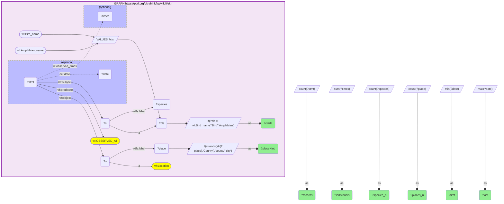

_4 row(s)_

#### Query 2

_2026-07-29T22:33:45+00:00 · `wildlifekn`_

```sparql
PREFIX rdf: <http://www.w3.org/1999/02/22-rdf-syntax-ns#>
PREFIX rdfs: <http://www.w3.org/2000/01/rdf-schema#>
PREFIX wl: <https://wildlife.proto-okn.net/kg/>
PREFIX dct: <http://purl.org/dc/terms/>
SELECT ?clade ?decade (COUNT(DISTINCT ?stmt) AS ?records) (COUNT(DISTINCT ?species) AS ?species_n) (MIN(?year) AS ?first_year) (MAX(?year) AS ?last_year) WHERE {
  GRAPH <https://purl.org/okn/frink/kg/wildlifekn> {
    VALUES ?cls { wl:Bird_name wl:Amphibian_name }
    ?stmt rdf:subject ?s ; rdf:predicate wl:OBSERVED_AT ; dct:date ?date .
    ?s a ?cls ; rdfs:label ?species .
    BIND(IF(?cls = wl:Bird_name, "Bird", "Amphibian") AS ?clade)
    BIND(SUBSTR(STR(?date),1,4) AS ?year)
    BIND(CONCAT(SUBSTR(STR(?date),1,3),"0s") AS ?decade)
  }
} GROUP BY ?clade ?decade
```

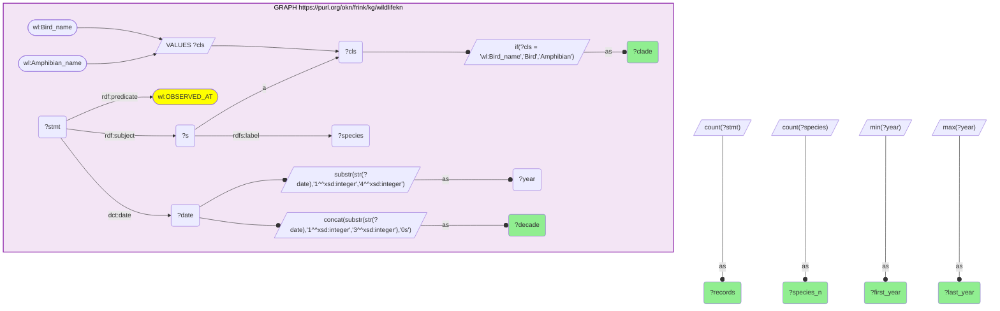

_9 row(s)_

#### Query 3

_2026-07-29T22:34:01+00:00 · `wildlifekn`, `ubergraph`_

```sparql
PREFIX rdfs: <http://www.w3.org/2000/01/rdf-schema#>
PREFIX wl: <https://wildlife.proto-okn.net/kg/>
PREFIX obo: <http://purl.obolibrary.org/obo/>
SELECT ?bucket (COUNT(DISTINCT ?key) AS ?n) WHERE {
  {
    GRAPH <https://purl.org/okn/frink/kg/wildlifekn> {
      VALUES ?cls { wl:Bird_name wl:Amphibian_name }
      ?s a ?cls ; rdfs:label ?key .
    }
    BIND("wildlifekn species labels" AS ?bucket)
  } UNION {
    GRAPH <https://purl.org/okn/frink/kg/wildlifekn> {
      VALUES ?cls { wl:Bird_name wl:Amphibian_name }
      ?s a ?cls ; rdfs:label ?species .
      BIND(REPLACE(STR(?species),'^([^ ]+ [^ ]+).*$','$1') AS ?binom)
    }
    GRAPH <https://purl.org/okn/frink/kg/ubergraph> {
      ?key rdfs:label ?binom .
      FILTER(STRSTARTS(STR(?key),'http://purl.obolibrary.org/obo/NCBITaxon_'))
    }
    BIND("resolved to NCBITaxon" AS ?bucket)
  } UNION {
    GRAPH <https://purl.org/okn/frink/kg/wildlifekn> {
      VALUES ?cls { wl:Bird_name wl:Amphibian_name }
      ?s a ?cls ; rdfs:label ?species .
      BIND(REPLACE(STR(?species),'^([^ ]+ [^ ]+).*$','$1') AS ?binom)
    }
    GRAPH <https://purl.org/okn/frink/kg/ubergraph> {
      ?key rdfs:label ?binom .
      FILTER(STRSTARTS(STR(?key),'http://purl.obolibrary.org/obo/NCBITaxon_'))
      VALUES ?anchor { obo:NCBITaxon_8782 obo:NCBITaxon_8292 }
      ?key rdfs:subClassOf* ?anchor .
      ?anchor rdfs:label ?cl .
    }
    BIND(CONCAT("resolved under class ", ?cl) AS ?bucket)
  }
} GROUP BY ?bucket
```

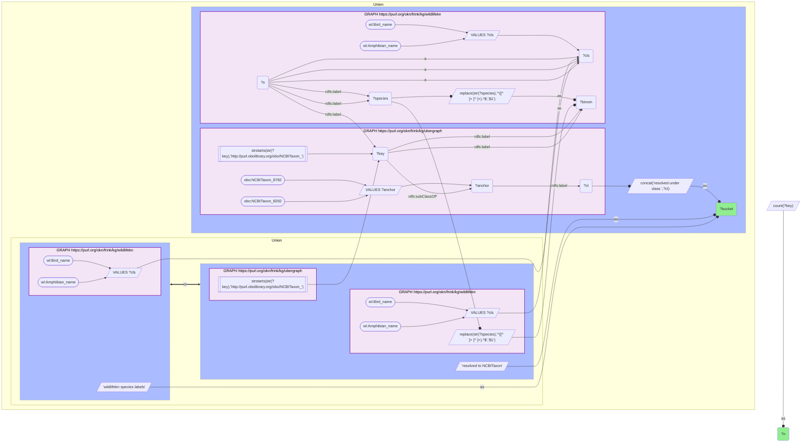

_4 row(s)_

#### Query 4

_2026-07-29T22:34:13+00:00 · `wildlifekn`, `ubergraph`_

```sparql
PREFIX rdfs: <http://www.w3.org/2000/01/rdf-schema#>
PREFIX wl: <https://wildlife.proto-okn.net/kg/>
PREFIX obo: <http://purl.obolibrary.org/obo/>
SELECT ?anchorLabel ?rankLabel (COUNT(DISTINCT ?taxon) AS ?wildlifekn_taxa) WHERE {
  GRAPH <https://purl.org/okn/frink/kg/wildlifekn> {
    ?s a wl:Bird_name ; rdfs:label ?species .
    BIND(REPLACE(STR(?species),'^([^ ]+ [^ ]+).*$','$1') AS ?binom)
  }
  GRAPH <https://purl.org/okn/frink/kg/ubergraph> {
    ?taxon rdfs:label ?binom .
    FILTER(STRSTARTS(STR(?taxon),'http://purl.obolibrary.org/obo/NCBITaxon_'))
    VALUES ?anchor { obo:NCBITaxon_8835 obo:NCBITaxon_8852 obo:NCBITaxon_2068716 obo:NCBITaxon_2068722 obo:NCBITaxon_8830 obo:NCBITaxon_8826 obo:NCBITaxon_1549675 }
    ?taxon rdfs:subClassOf* ?anchor .
    ?anchor rdfs:label ?anchorLabel .
    ?anchor <http://purl.obolibrary.org/obo/ncbitaxon#has_rank> ?r .
    ?r rdfs:label ?rankLabel .
  }
} GROUP BY ?anchorLabel ?rankLabel
```

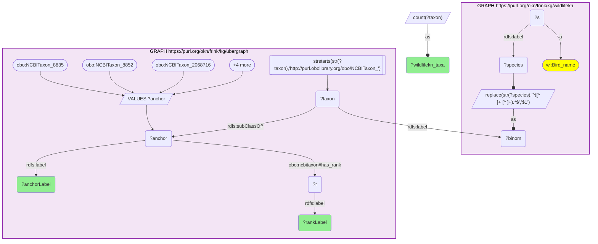

_7 row(s)_

#### Query 5

_2026-07-29T22:34:18+00:00 · `sawgraph`_

```sparql
PREFIX rdfs: <http://www.w3.org/2000/01/rdf-schema#>
PREFIX wqp: <http://w3id.org/sawgraph/v1/us-wqp#>
PREFIX coso: <http://w3id.org/coso/v1/contaminoso#>
PREFIX kwg: <http://stko-kwg.geog.ucsb.edu/lod/ontology/>
SELECT ?stateFIPS (COUNT(DISTINCT ?taxon) AS ?biota_taxa) (COUNT(DISTINCT ?sample) AS ?biota_samples) (COUNT(DISTINCT ?countyFIPS) AS ?counties) WHERE {
  GRAPH <https://purl.org/okn/frink/kg/sawgraph> {
    ?sample a coso:BiotaSample ; coso:sampleOfMaterialType ?taxon ; coso:fromSamplePoint ?pt .
    ?taxon a wqp:Taxon .
    ?pt kwg:sfWithin ?geo .
    FILTER(STRSTARTS(STR(?geo),'https://datacommons.org/browser/geoId/'))
    BIND(REPLACE(STR(?geo),'^.*/geoId/','') AS ?geoid)
    FILTER(STRLEN(?geoid) >= 10)
    BIND(SUBSTR(?geoid,1,5) AS ?countyFIPS)
    BIND(SUBSTR(?geoid,1,2) AS ?stateFIPS)
  }
} GROUP BY ?stateFIPS
```

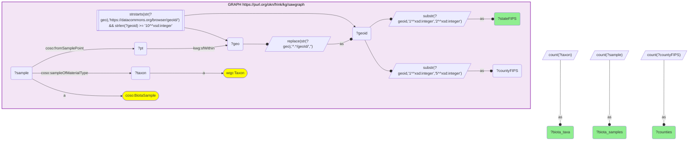

_12 row(s)_

#### Query 6

_2026-07-29T22:34:31+00:00 · `sawgraph`_

```sparql
PREFIX rdfs: <http://www.w3.org/2000/01/rdf-schema#>
PREFIX wqp: <http://w3id.org/sawgraph/v1/us-wqp#>
PREFIX coso: <http://w3id.org/coso/v1/contaminoso#>
PREFIX kwg: <http://stko-kwg.geog.ucsb.edu/lod/ontology/>
SELECT ?metric (COUNT(DISTINCT ?item) AS ?n) WHERE {
  {
    GRAPH <https://purl.org/okn/frink/kg/sawgraph> {
      ?item a coso:BiotaSample ; coso:sampleOfMaterialType ?t . ?t a wqp:Taxon .
    }
    BIND("biota samples, federation-wide" AS ?metric)
  } UNION {
    GRAPH <https://purl.org/okn/frink/kg/sawgraph> {
      ?smp a coso:BiotaSample ; coso:sampleOfMaterialType ?item . ?item a wqp:Taxon .
    }
    BIND("biota taxa, federation-wide" AS ?metric)
  } UNION {
    GRAPH <https://purl.org/okn/frink/kg/sawgraph> {
      ?item coso:fromSamplePoint ?pt .
      ?pt kwg:sfWithin ?geo .
      FILTER(STRSTARTS(STR(?geo),'https://datacommons.org/browser/geoId/12'))
    }
    BIND("ANY-medium contaminant samples in Florida (geoId 12*)" AS ?metric)
  }
} GROUP BY ?metric
```

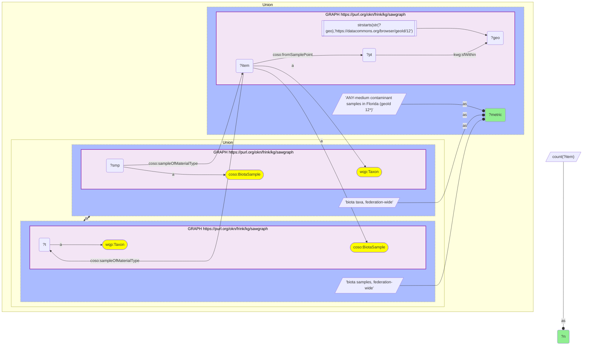

_2 row(s)_

#### Query 7

_2026-07-29T22:34:38+00:00 · `sawgraph`_

```sparql
PREFIX rdfs: <http://www.w3.org/2000/01/rdf-schema#>
PREFIX wqp: <http://w3id.org/sawgraph/v1/us-wqp#>
PREFIX coso: <http://w3id.org/coso/v1/contaminoso#>
PREFIX kwg: <http://stko-kwg.geog.ucsb.edu/lod/ontology/>
SELECT ?taxonLabel (COUNT(DISTINCT ?sample) AS ?samples) (COUNT(DISTINCT ?countyFIPS) AS ?counties) (SAMPLE(?countyFIPS) AS ?county) (MIN(?pfos) AS ?pfos_min_ng_g) (MAX(?pfos) AS ?pfos_max_ng_g) (SAMPLE(?t) AS ?sampled_on) WHERE {
  GRAPH <https://purl.org/okn/frink/kg/sawgraph> {
    VALUES ?taxonLabel { "Anas platyrhynchos" "Branta canadensis" "Odocoileus virginianus" "Mya arenaria" "Mytilus edulis" }
    ?taxon a wqp:Taxon ; rdfs:label ?taxonLabel .
    ?sample a coso:BiotaSample ; coso:sampleOfMaterialType ?taxon ; coso:fromSamplePoint ?pt .
    ?pt kwg:sfWithin ?geo .
    FILTER(STRSTARTS(STR(?geo),'https://datacommons.org/browser/geoId/'))
    BIND(SUBSTR(REPLACE(STR(?geo),'^.*/geoId/',''),1,5) AS ?countyFIPS)
    OPTIONAL {
      ?obs coso:analyzedSample ?sample ; coso:ofSubstance ?sub ; coso:hasResult ?res ; coso:observedTime ?t .
      ?sub rdfs:label "Perfluorooctanesulfonic acid" .
      ?res coso:measurementValue ?pfos .
      FILTER(?pfos > 0)
    }
  }
} GROUP BY ?taxonLabel
```

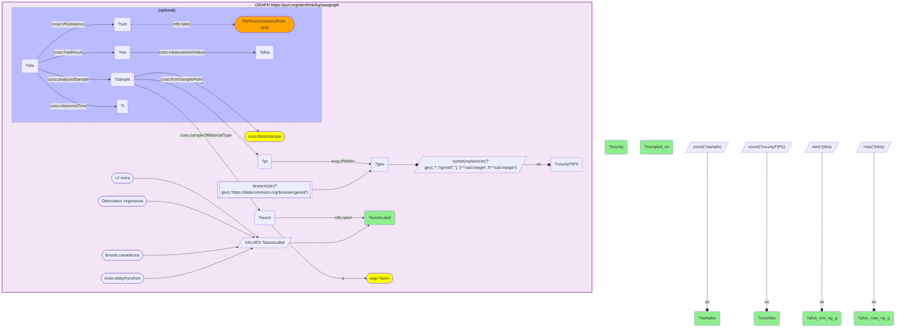

_5 row(s)_

#### Query 8

_2026-07-29T22:34:52+00:00 · `sawgraph`_

```sparql
PREFIX coso: <http://w3id.org/coso/v1/contaminoso#>
PREFIX kwg: <http://stko-kwg.geog.ucsb.edu/lod/ontology/>
SELECT (COUNT(DISTINCT ?sample) AS ?florida_contaminant_samples_any_medium) (COUNT(DISTINCT ?pt) AS ?florida_sample_points) WHERE {
  GRAPH <https://purl.org/okn/frink/kg/sawgraph> {
    OPTIONAL {
      ?sample coso:fromSamplePoint ?pt .
      ?pt kwg:sfWithin ?geo .
      FILTER(STRSTARTS(STR(?geo),'https://datacommons.org/browser/geoId/12'))
    }
  }
}
```

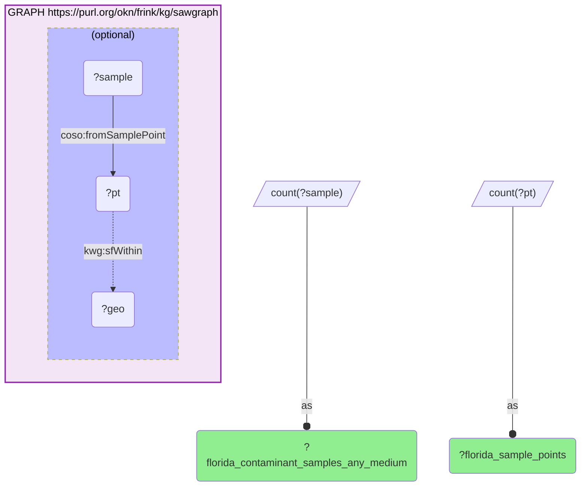

_1 row(s)_

#### Query 9

_2026-07-29T22:34:59+00:00 · `wildlifekn`, `ubergraph`, `nde`_

```sparql
PREFIX rdfs: <http://www.w3.org/2000/01/rdf-schema#>
PREFIX wl: <https://wildlife.proto-okn.net/kg/>
PREFIX schema: <http://schema.org/>
SELECT ?clade ?binom (COUNT(DISTINCT ?ds) AS ?nde_datasets) WHERE {
  { SELECT DISTINCT ?clade ?binom ?t WHERE {
      GRAPH <https://purl.org/okn/frink/kg/wildlifekn> {
        VALUES ?cls { wl:Bird_name wl:Amphibian_name }
        ?s a ?cls ; rdfs:label ?species .
        BIND(REPLACE(STR(?species),'^([^ ]+ [^ ]+).*$','$1') AS ?binom)
        BIND(IF(?cls = wl:Bird_name, "Bird", "Amphibian") AS ?clade)
      }
      GRAPH <https://purl.org/okn/frink/kg/ubergraph> {
        ?t rdfs:label ?binom .
        FILTER(STRSTARTS(STR(?t),'http://purl.obolibrary.org/obo/NCBITaxon_'))
      } } }
  { SELECT DISTINCT ?t ?ds WHERE {
      GRAPH <https://purl.org/okn/frink/kg/nde> {
        ?ds schema:species ?sp .
        FILTER(CONTAINS(STR(?sp),'/taxonomy/'))
      }
      BIND(IRI(CONCAT('http://purl.obolibrary.org/obo/NCBITaxon_',REPLACE(STR(?sp),'^.*/taxonomy/([0-9]+).*$','$1'))) AS ?t)
    } }
} GROUP BY ?clade ?binom
```

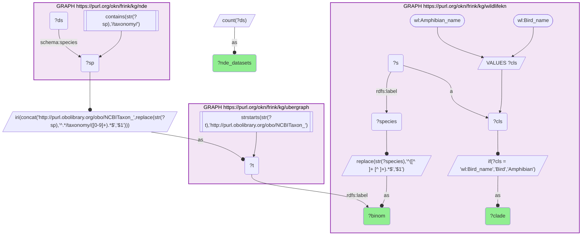

_17 row(s)_

#### Query 10

_2026-07-29T22:35:09+00:00 · `nde`, `ubergraph`_

```sparql
PREFIX rdfs: <http://www.w3.org/2000/01/rdf-schema#>
PREFIX schema: <http://schema.org/>
PREFIX obo: <http://purl.obolibrary.org/obo/>
SELECT ?taxid ?diseaseLabel (COUNT(DISTINCT ?ds) AS ?datasets) WHERE {
  GRAPH <https://purl.org/okn/frink/kg/nde> {
    VALUES ?taxid { "8292" "8316" "8342" "8386" "145282" "30427" "56350" "8839" "8843" "8845" "8855" "8932" "9014" "9103" "9172" "91951" }
    ?ds schema:species ?sp ; schema:healthCondition ?hc .
    FILTER(STR(?sp) = CONCAT('https://www.uniprot.org/taxonomy/', ?taxid))
  }
  GRAPH <https://purl.org/okn/frink/kg/ubergraph> {
    ?hc rdfs:subClassOf* obo:MONDO_0005550 ; rdfs:label ?diseaseLabel .
  }
} GROUP BY ?taxid ?diseaseLabel
```

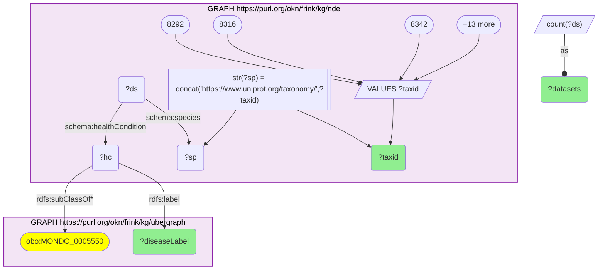

_5 row(s)_

#### Query 11

_2026-07-29T22:35:11+00:00 · `nde`_

```sparql
PREFIX rdfs: <http://www.w3.org/2000/01/rdf-schema#>
PREFIX schema: <http://schema.org/>
SELECT ?agentName ?hostName (COUNT(DISTINCT ?ds) AS ?datasets) WHERE {
  GRAPH <https://purl.org/okn/frink/kg/nde> {
    VALUES ?agent { <https://www.uniprot.org/taxonomy/109871> <https://www.uniprot.org/taxonomy/11082> }
    ?ds schema:infectiousAgent ?agent .
    ?agent schema:name ?agentName .
    OPTIONAL { ?ds schema:species ?sp . ?sp schema:name ?hostName }
  }
} GROUP BY ?agentName ?hostName
```

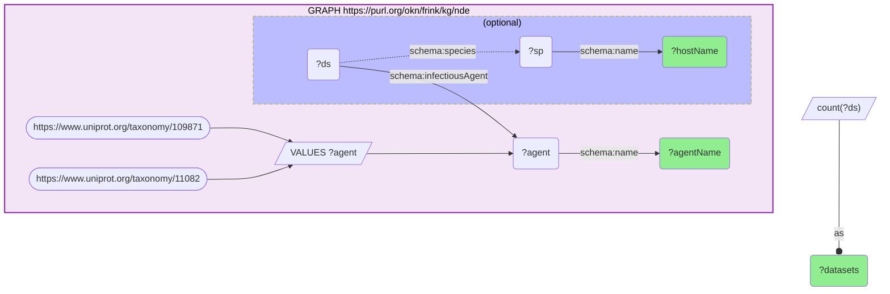

_12 row(s)_

#### Query 12

_2026-07-29T22:35:24+00:00 · `wildlifekn`, `ubergraph`, `biohealth`_

```sparql
PREFIX rdfs: <http://www.w3.org/2000/01/rdf-schema#>
PREFIX wl: <https://wildlife.proto-okn.net/kg/>
PREFIX bh: <https://biohealthkg.proto-okn.net/kg/schema/>
SELECT DISTINCT ?clade ?binom ?disLabel WHERE {
  { SELECT DISTINCT ?clade ?binom WHERE {
      GRAPH <https://purl.org/okn/frink/kg/wildlifekn> {
        VALUES ?cls { wl:Bird_name wl:Amphibian_name }
        ?s a ?cls ; rdfs:label ?species .
        BIND(REPLACE(STR(?species),'^([^ ]+ [^ ]+).*$','$1') AS ?binom)
        BIND(IF(?cls = wl:Bird_name, "Bird", "Amphibian") AS ?clade)
      }
      GRAPH <https://purl.org/okn/frink/kg/ubergraph> {
        ?taxon rdfs:label ?binom .
        FILTER(STRSTARTS(STR(?taxon),'http://purl.obolibrary.org/obo/NCBITaxon_'))
      } } }
  GRAPH <https://purl.org/okn/frink/kg/biohealth> {
    VALUES ?disNode {
      <https://biohealthkg.proto-okn.net/kg/node/C0016627>
      <https://biohealthkg.proto-okn.net/kg/node/C0043124>
      <https://biohealthkg.proto-okn.net/kg/node/C0153065>
      <https://biohealthkg.proto-okn.net/kg/node/C0036117>
      <https://biohealthkg.proto-okn.net/kg/node/C0009763>
      <https://biohealthkg.proto-okn.net/kg/node/C0027983>
      <https://biohealthkg.proto-okn.net/kg/node/C0009187>
      <https://biohealthkg.proto-okn.net/kg/node/C0003723>
      <https://biohealthkg.proto-okn.net/kg/node/C0021400>
    }
    ?bhNode rdfs:label ?binom .
    { ?disNode bh:PROCESS_OF ?bhNode } UNION { ?disNode bh:OCCURS_IN ?bhNode } UNION { ?disNode bh:PRODUCES ?bhNode }
    ?disNode rdfs:label ?disLabel .
  }
}
```

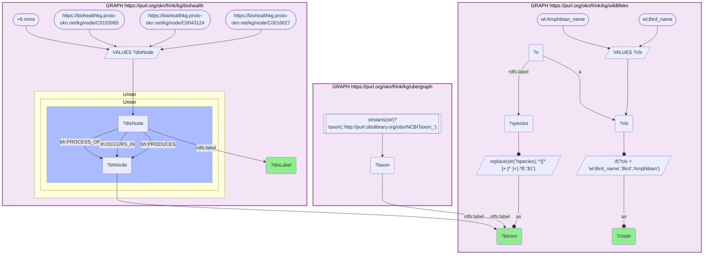

_22 row(s)_

#### Query 13

_2026-07-29T22:35:48+00:00 · `ubergraph`, `biohealth`_

```sparql
PREFIX rdfs: <http://www.w3.org/2000/01/rdf-schema#>
PREFIX obo: <http://purl.obolibrary.org/obo/>
PREFIX oboInOwl: <http://www.geneontology.org/formats/oboInOwl#>
SELECT ?biohealthLabel ?cui (COUNT(DISTINCT ?rel) AS ?biohealth_edges) WHERE {
  VALUES ?d { obo:MONDO_0018695 obo:MONDO_0005812 obo:MONDO_0002282 obo:MONDO_0005736 obo:MONDO_0020731 obo:MONDO_0000827 obo:MONDO_0003799 obo:MONDO_0005707 obo:MONDO_0005875 }
  GRAPH <https://purl.org/okn/frink/kg/ubergraph> { ?d oboInOwl:hasDbXref ?x . FILTER(STRSTARTS(STR(?x),'UMLS:')) }
  BIND(REPLACE(STR(?x),'^UMLS:','') AS ?cui)
  BIND(IRI(CONCAT('https://biohealthkg.proto-okn.net/kg/node/', ?cui)) AS ?node)
  GRAPH <https://purl.org/okn/frink/kg/biohealth> { ?node rdfs:label ?biohealthLabel . OPTIONAL { ?node ?p ?rel } }
} GROUP BY ?biohealthLabel ?cui
```

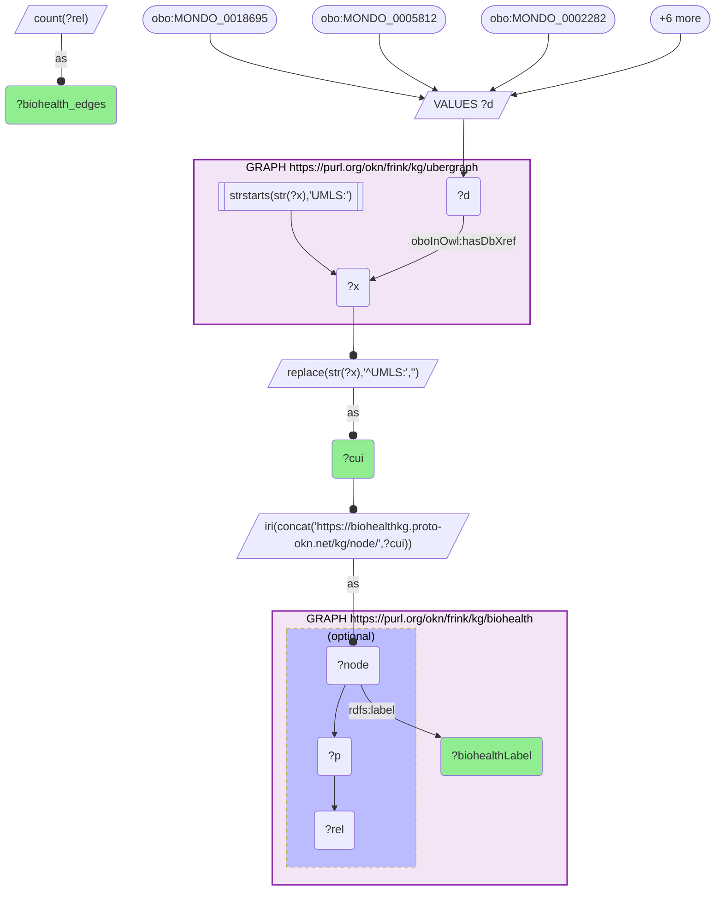

_9 row(s)_

#### Query 14

_2026-07-29T22:35:49+00:00 · `oard-kg`, `biomarkerkg`, `prokn`, `ubergraph`, `spoke-okn`_

```sparql
PREFIX rdfs: <http://www.w3.org/2000/01/rdf-schema#>
PREFIX obo: <http://purl.obolibrary.org/obo/>
PREFIX skos: <http://www.w3.org/2004/02/skos/core#>
PREFIX biolink: <https://w3id.org/biolink/vocab/>
SELECT ?layer ?disease (COUNT(DISTINCT ?item) AS ?n) WHERE {
  VALUES ?d { obo:MONDO_0018695 obo:MONDO_0005812 obo:MONDO_0002282 obo:MONDO_0005736 obo:MONDO_0020731 obo:MONDO_0000827 obo:MONDO_0003799 obo:MONDO_0005707 obo:MONDO_0005875 }
  {
    GRAPH <https://purl.org/okn/frink/kg/oard-kg> {
      { ?assoc biolink:subject ?d ; biolink:object ?item } UNION { ?assoc biolink:object ?d ; biolink:subject ?item }
      FILTER(CONTAINS(STR(?item),'HP_'))
    }
    BIND("oard-kg EHR phenotype" AS ?layer)
  } UNION {
    GRAPH <https://purl.org/okn/frink/kg/biomarkerkg> {
      ?item ?p ?d . FILTER(?p IN (obo:OBCI_1000008, obo:OBCI_1000002))
    }
    BIND("biomarkerkg biomarker" AS ?layer)
  } UNION {
    GRAPH <https://purl.org/okn/frink/kg/prokn> { ?item skos:exactMatch ?d }
    BIND("prokn disease node" AS ?layer)
  } UNION {
    GRAPH <https://purl.org/okn/frink/kg/ubergraph> { ?d skos:exactMatch ?x . FILTER(CONTAINS(STR(?x),'DOID_')) }
    GRAPH <https://purl.org/okn/frink/kg/spoke-okn> { ?item rdfs:label ?l . FILTER(?item = ?x) }
    BIND("spoke-okn DOID disease node" AS ?layer)
  }
  BIND(REPLACE(STR(?d),'^.*/','') AS ?disease)
} GROUP BY ?layer ?disease
```

```mermaid
graph TD
classDef projected fill:lightgreen;
classDef literal fill:orange;
classDef iri fill:yellow;
  q14v9("?assoc")
  q14v7("?d")
  q14v2("?disease"):::projected 
  q14v8("?item")
  q14v12("?l")
  q14v3("?layer"):::projected 
  q14v1("?n"):::projected 
  q14v10("?p")
  q14v11("?x")
  q14bind0[/"VALUES ?d"/]
  q14bind0-->q14v7
  q14bind00(["obo:MONDO_0018695"])
  q14bind00 --> q14bind0
  q14bind01(["obo:MONDO_0005812"])
  q14bind01 --> q14bind0
  q14bind02(["obo:MONDO_0002282"])
  q14bind02 --> q14bind0
  q14bind0more([+6 more])
  q14bind0more --> q14bind0
  subgraph q14union0[" Union "]
  style q14union0 color:#000;
  subgraph q14union0l[" "]
    style q14union0l fill:#abf,stroke-dasharray: 3 3;
    subgraph q14graph0["GRAPH https://purl.org/okn/frink/kg/ubergraph"]
      style q14graph0 fill:#f3e5f5,stroke:#8e24aa,stroke-width:2px,color:#000;
      q14graph0f0[["contains(str(?x),'DOID_')"]]
      q14graph0f0 --> q14v11
      q14v7 --"skos:exactMatch"--> q14v11
    end
    subgraph q14graph1["GRAPH https://purl.org/okn/frink/kg/spoke-okn"]
      style q14graph1 fill:#f3e5f5,stroke:#8e24aa,stroke-width:2px,color:#000;
      q14graph1f1[["?item = ?x"]]
      q14graph1f1 --> q14v8
      q14graph1f1 --> q14v11
      q14v8 --"rdfs:label"--> q14v12
    end
    q14bind1[/"'spoke-okn DOID disease node'"/]
    q14bind1 --as--o q14v3
  end
    subgraph q14union1[" Union "]
    style q14union1 color:#000;
    subgraph q14union1l[" "]
      style q14union1l fill:#abf,stroke-dasharray: 3 3;
      subgraph q14graph2["GRAPH https://purl.org/okn/frink/kg/prokn"]
        style q14graph2 fill:#f3e5f5,stroke:#8e24aa,stroke-width:2px,color:#000;
        q14v8 --"skos:exactMatch"--> q14v7
      end
      q14bind2[/"'prokn disease node'"/]
      q14bind2 --as--o q14v3
    end
      subgraph q14union2[" Union "]
      style q14union2 color:#000;
      subgraph q14union2l[" "]
        style q14union2l fill:#abf,stroke-dasharray: 3 3;
        subgraph q14graph3["GRAPH https://purl.org/okn/frink/kg/biomarkerkg"]
          style q14graph3 fill:#f3e5f5,stroke:#8e24aa,stroke-width:2px,color:#000;
          q14graph3c2(["obo:OBCI_1000002"]):::iri 
          q14graph3c1(["obo:OBCI_1000008"]):::iri 
          q14graph3f2[["?p in ('obo:OBCI_1000008', 'obo:OBCI_1000002')"]]
          q14graph3c1 --o q14graph3f2
          q14graph3c2 --o q14graph3f2
          q14graph3f2 --> q14v10
          q14v8 -->q14v10--> q14v7
        end
        q14bind3[/"'biomarkerkg biomarker'"/]
        q14bind3 --as--o q14v3
      end
      subgraph q14union2r[" "]
        style q14union2r fill:#abf,stroke-dasharray: 3 3;
        subgraph q14graph4["GRAPH https://purl.org/okn/frink/kg/oard-kg"]
          style q14graph4 fill:#f3e5f5,stroke:#8e24aa,stroke-width:2px,color:#000;
          q14graph4f3[["contains(str(?item),'HP_')"]]
          q14graph4f3 --> q14v8
          subgraph q14uniongraph43[" Union "]
          style q14uniongraph43 color:#000;
            q14v9 --"biolink:object"--> q14v7
            q14v9 --"biolink:subject"--> q14v8
          subgraph q14uniongraph43r[" "]
            style q14uniongraph43r fill:#abf,stroke-dasharray: 3 3;
            q14v9 --"biolink:object"--> q14v8
            q14v9 --"biolink:subject"--> q14v7
          end
          end
        end
        q14bind4[/"'oard-kg EHR phenotype'"/]
        q14bind4 --as--o q14v3
      end
      q14union2r <== or ==> q14union2l
      end
    end
  end
  q14bind5[/"replace(str(?d),'^.*/','')"/]
  q14v7 --o q14bind5
  q14bind5 --as--o q14v2
  q14bind6[/"count(?item)"/]
  q14bind6 --as--o q14v1
```

_4 row(s)_

#### Query 15

_2026-07-29T22:36:01+00:00 · `fiokg`, `spatialkg`_

```sparql
PREFIX rdfs: <http://www.w3.org/2000/01/rdf-schema#>
PREFIX kwg: <http://stko-kwg.geog.ucsb.edu/lod/ontology/>
SELECT (COUNT(DISTINCT ?fac) AS ?fl_frs_facilities) (COUNT(DISTINCT ?countyFIPS) AS ?fl_counties) WHERE {
  GRAPH <https://purl.org/okn/frink/kg/fiokg> {
    ?fac kwg:sfWithin ?cty .
    FILTER(STRSTARTS(STR(?cty),'http://stko-kwg.geog.ucsb.edu/lod/resource/administrativeRegion.USA.12'))
    BIND(SUBSTR(REPLACE(STR(?cty),'^.*administrativeRegion[.]USA[.]',''),1,5) AS ?countyFIPS)
    FILTER(STRLEN(?countyFIPS) = 5)
  }
  GRAPH <https://purl.org/okn/frink/kg/spatialkg> { ?cty a kwg:AdministrativeRegion_2 }
}
```

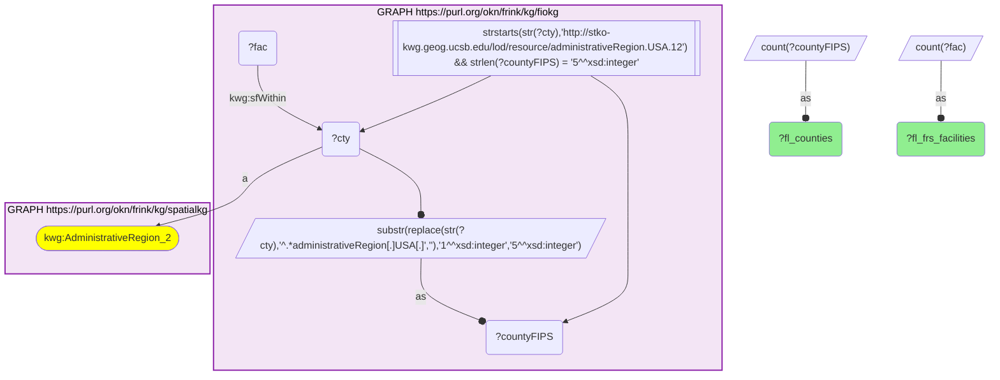

_1 row(s)_

#### Query 16

_2026-07-29T22:36:07+00:00 · `spoke-okn`_

```sparql
PREFIX rdf: <http://www.w3.org/1999/02/22-rdf-syntax-ns#>
PREFIX rdfs: <http://www.w3.org/2000/01/rdf-schema#>
PREFIX spoke: <https://purl.org/okn/frink/kg/spoke-okn/schema/>
SELECT ?metric (COUNT(DISTINCT ?loc) AS ?counties) (MIN(?v) AS ?minimum) (MAX(?v) AS ?maximum) WHERE {
  GRAPH <https://purl.org/okn/frink/kg/spoke-okn> {
    ?loc spoke:state_fips "12" .
    BIND(REPLACE(STR(?loc),'^.*/location/','') AS ?fips5)
    FILTER(STRLEN(?fips5) = 5)
    {
      VALUES (?sdoh ?metric) {
        (<https://purl.org/okn/frink/kg/spoke-okn/sdoh/CDCP_ASTHMA_ADULT_A> "adult asthma % (2019)")
        (<https://purl.org/okn/frink/kg/spoke-okn/sdoh/ACS_PER_CAPITA_INC> "per-capita income USD (2020)")
      }
      ?stmt rdf:subject ?sdoh ; rdf:object ?loc ; spoke:value ?v .
    } UNION {
      ?chem spoke:FOUNDIN_CfL ?loc .
      BIND("chemicals recorded as found in county" AS ?metric)
    } UNION {
      ?s2 spoke:PREVALENCEIN_SpL ?loc .
      BIND("SDoH measures per county" AS ?metric)
    }
  }
} GROUP BY ?metric
```

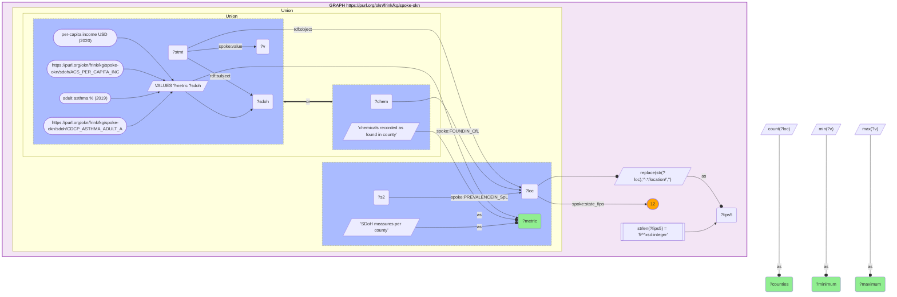

_4 row(s)_

#### Query 17

_2026-07-29T22:36:19+00:00 · `climatemodelskg`_

```sparql
PREFIX cm: <https://climatepub4kg.github.io/ontology#>
SELECT (COUNT(DISTINCT ?city) AS ?fl_places) (COUNT(DISTINCT ?fips5) AS ?fl_counties_with_a_place) (COUNT(DISTINCT ?rcm) AS ?regional_climate_models) (COUNT(DISTINCT ?paper) AS ?papers_mentioning_a_fl_place) WHERE {
  GRAPH <https://purl.org/okn/frink/kg/climatemodelskg> {
    ?city cm:country_code "US" ; cm:admin1_code "FL" ; cm:admin2_code ?a2 .
    OPTIONAL { ?rcm cm:COVERS_REGION ?city }
    OPTIONAL { ?paper cm:PAPER_MENTIONS ?city }
  }
  BIND(CONCAT("12", ?a2) AS ?fips5)
}
```

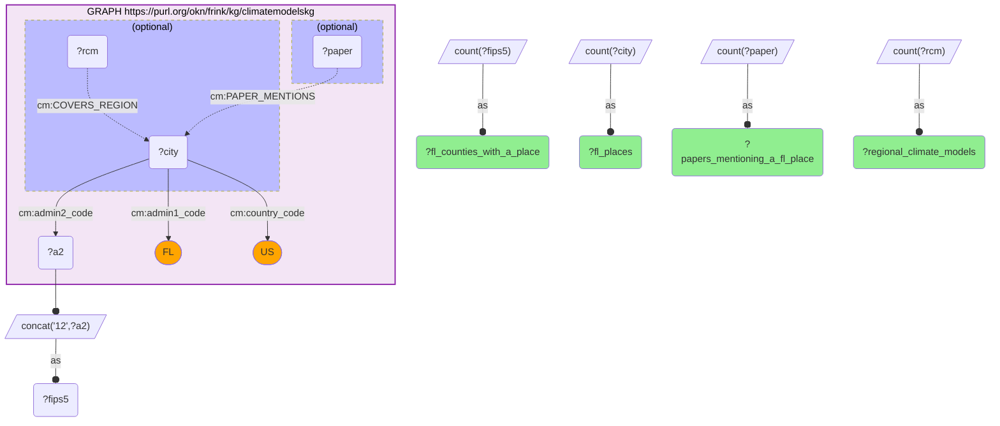

_1 row(s)_

#### Query 18

_2026-07-29T22:36:23+00:00 · `wildlifekn`, `spatialkg`_

```sparql
PREFIX rdfs: <http://www.w3.org/2000/01/rdf-schema#>
PREFIX wl: <https://wildlife.proto-okn.net/kg/>
SELECT (COUNT(DISTINCT ?fips5) AS ?distinct_tokens_unfiltered) (COUNT(DISTINCT IF(STRSTARTS(?fips5,'12'), ?fips5, 1/0)) AS ?true_florida_counties) (GROUP_CONCAT(DISTINCT IF(STRSTARTS(?fips5,'12'),'',?fips5); SEPARATOR="|") AS ?non_fips_token) WHERE {
  { SELECT DISTINCT ?county WHERE {
      GRAPH <https://purl.org/okn/frink/kg/wildlifekn> {
        ?loc a wl:Location ; rdfs:label ?county .
        FILTER(STRENDS(STR(?county),'County'))
      } } }
  { SELECT DISTINCT ?county ?fips5 WHERE {
      GRAPH <https://purl.org/okn/frink/kg/spatialkg> {
        ?reg rdfs:label ?rl .
        FILTER(CONTAINS(STR(?rl),' County, Florida'))
        BIND(REPLACE(STR(?rl),'^.*?([^,]+ County), Florida.*$','$1') AS ?county)
        BIND(SUBSTR(REPLACE(STR(?reg),'^.*administrativeRegion[.]USA[.]',''),1,5) AS ?fips5)
      } } }
}
```

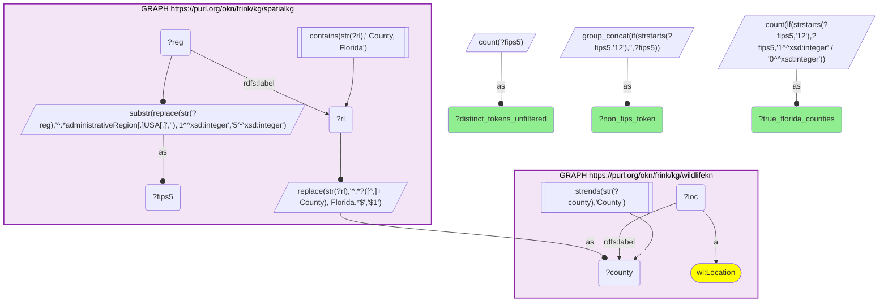

_1 row(s)_

#### Query 19

_2026-07-29T22:36:38+00:00 · `spatialkg`_

```sparql
PREFIX rdfs: <http://www.w3.org/2000/01/rdf-schema#>
PREFIX kwg: <http://stko-kwg.geog.ucsb.edu/lod/ontology/>
SELECT (COUNT(DISTINCT ?fips5) AS ?fl_counties_with_s2_cells) (COUNT(DISTINCT ?cell) AS ?s2_level13_cells) WHERE {
  GRAPH <https://purl.org/okn/frink/kg/spatialkg> {
    ?r a kwg:AdministrativeRegion_2 ; kwg:hasFIPS ?fips5 ; kwg:sfContains ?cell .
    FILTER(STRSTARTS(?fips5,"12"))
    FILTER(STRSTARTS(STR(?cell),'http://stko-kwg.geog.ucsb.edu/lod/resource/s2.level13.'))
  }
}
```

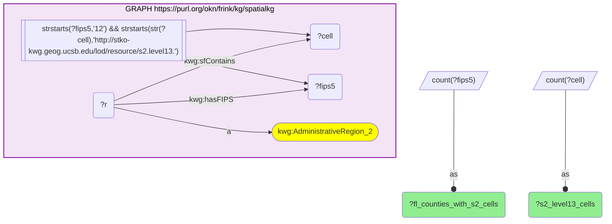

_1 row(s)_

#### Query 20

_2026-07-29T22:36:43+00:00 · `wildlifekn`, `sawgraph`_

```sparql
PREFIX rdf: <http://www.w3.org/1999/02/22-rdf-syntax-ns#>
PREFIX rdfs: <http://www.w3.org/2000/01/rdf-schema#>
PREFIX wl: <https://wildlife.proto-okn.net/kg/>
PREFIX coso: <http://w3id.org/coso/v1/contaminoso#>
PREFIX wqp: <http://w3id.org/sawgraph/v1/us-wqp#>
SELECT ?metric ?n WHERE {
  {
    SELECT ("wildlifekn bird+amphibian observation statements" AS ?metric) (COUNT(DISTINCT ?s) AS ?n) WHERE {
      GRAPH <https://purl.org/okn/frink/kg/wildlifekn> {
        VALUES ?cls { wl:Bird_name wl:Amphibian_name }
        ?s rdf:subject ?sp ; rdf:predicate wl:OBSERVED_AT . ?sp a ?cls .
      } }
  } UNION {
    SELECT ("sawgraph taxa with a biota sample" AS ?metric) (COUNT(DISTINCT ?t) AS ?n) WHERE {
      GRAPH <https://purl.org/okn/frink/kg/sawgraph> {
        ?smp a coso:BiotaSample ; coso:sampleOfMaterialType ?t . ?t a wqp:Taxon .
      } }
  } UNION {
    SELECT ("wildlifekn Location nodes" AS ?metric) (COUNT(DISTINCT ?l) AS ?n) WHERE {
      GRAPH <https://purl.org/okn/frink/kg/wildlifekn> { ?l a wl:Location }
    }
  }
}
```

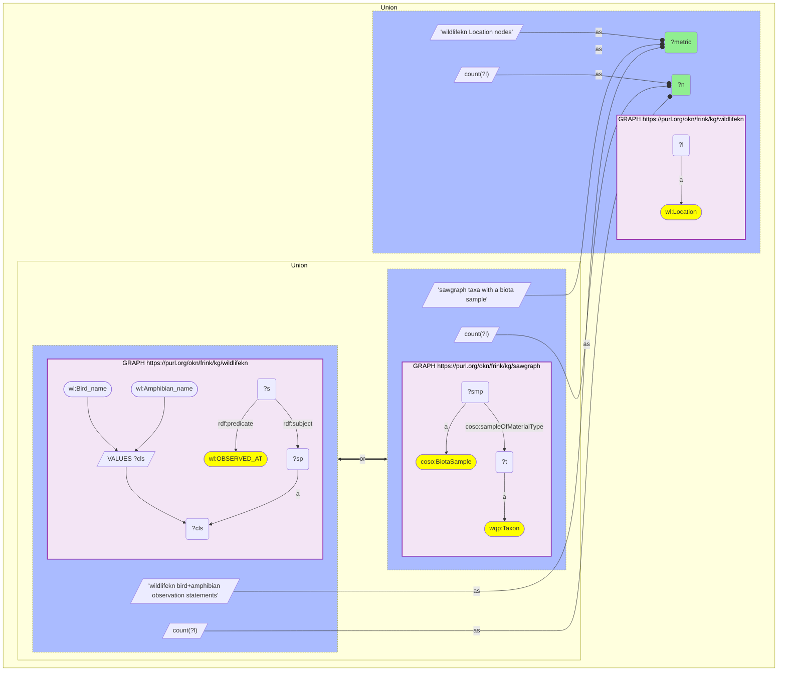

_3 row(s)_

#### Query 21

_2026-07-29T22:52:00+00:00 · `fiokg`_

```sparql
PREFIX rdfs: <http://www.w3.org/2000/01/rdf-schema#>
PREFIX kwg: <http://stko-kwg.geog.ucsb.edu/lod/ontology/>
PREFIX frs: <http://w3id.org/fio/v1/epa-frs#>
SELECT ?scope (COUNT(DISTINCT ?fac) AS ?facilities) WHERE {
  GRAPH <https://purl.org/okn/frink/kg/fiokg> {
    {
      ?fac a frs:FRS-Facility ; kwg:sfWithin ?cty .
      FILTER(STRSTARTS(STR(?cty),'http://stko-kwg.geog.ucsb.edu/lod/resource/administrativeRegion.USA.12'))
      BIND(SUBSTR(REPLACE(STR(?cty),'^.*administrativeRegion[.]USA[.]',''),1,5) AS ?g)
      FILTER(STRLEN(?g) = 5)
      BIND("FL all FRS facilities (5-digit county nodes)" AS ?scope)
    } UNION {
      ?fac a frs:EPA-PFAS-Facility ; kwg:sfWithin ?cty .
      FILTER(STRSTARTS(STR(?cty),'http://stko-kwg.geog.ucsb.edu/lod/resource/administrativeRegion.USA.12'))
      BIND(SUBSTR(REPLACE(STR(?cty),'^.*administrativeRegion[.]USA[.]',''),1,5) AS ?g)
      FILTER(STRLEN(?g) = 5)
      BIND("FL EPA-PFAS-Facility subset" AS ?scope)
    } UNION {
      ?fac a frs:FRS-Facility .
      BIND("fiokg FRS facilities, all states" AS ?scope)
    } UNION {
      ?fac a frs:EPA-PFAS-Facility .
      BIND("fiokg EPA-PFAS-Facility, all states" AS ?scope)
    }
  }
} GROUP BY ?scope
```

```mermaid
graph TD
classDef projected fill:lightgreen;
classDef literal fill:orange;
classDef iri fill:yellow;
  v5("?cty")
  v7("?fac")
  v1("?facilities"):::projected 
  v6("?g")
  v2("?scope"):::projected 
  subgraph graph0["GRAPH https://purl.org/okn/frink/kg/fiokg"]
    style graph0 fill:#f3e5f5,stroke:#8e24aa,stroke-width:2px,color:#000;
    graph0c4(["frs:EPA-PFAS-Facility"]):::iri 
    graph0c2(["frs:FRS-Facility"]):::iri 
    subgraph uniongraph00[" Union "]
    style uniongraph00 color:#000;
    subgraph uniongraph00l[" "]
      style uniongraph00l fill:#abf,stroke-dasharray: 3 3;
      v7 --"a"--> graph0c4
      graph0bind0[/"'fiokg EPA-PFAS-Facility, all states'"/]
      graph0bind0 --as--o v2
    end
      subgraph uniongraph01[" Union "]
      style uniongraph01 color:#000;
      subgraph uniongraph01l[" "]
        style uniongraph01l fill:#abf,stroke-dasharray: 3 3;
        v7 --"a"--> graph0c2
        graph0bind1[/"'fiokg FRS facilities, all states'"/]
        graph0bind1 --as--o v2
      end
        subgraph uniongraph02[" Union "]
        style uniongraph02 color:#000;
        subgraph uniongraph02l[" "]
          style uniongraph02l fill:#abf,stroke-dasharray: 3 3;
          graph0f0[["strstarts(str(?cty),'http://stko-kwg.geog.ucsb.edu/lod/resource/administrativeRegion.USA.12') && strlen(?g) = '5^^xsd:integer'"]]
          graph0f0 --> v5
          graph0f0 --> v6
          v7 --"a"--> graph0c4
          v7 --"kwg:sfWithin"--> v5
          graph0bind2[/"substr(replace(str(?cty),'^.*administrativeRegion#91;.#93;USA#91;.#93;',''),'1^^xsd:integer','5^^xsd:integer')"/]
          v5 --o graph0bind2
          graph0bind2 --as--o v6
          graph0bind3[/"'FL EPA-PFAS-Facility subset'"/]
          graph0bind3 --as--o v2
        end
        subgraph uniongraph02r[" "]
          style uniongraph02r fill:#abf,stroke-dasharray: 3 3;
          graph0f1[["strstarts(str(?cty),'http://stko-kwg.geog.ucsb.edu/lod/resource/administrativeRegion.USA.12') && strlen(?g) = '5^^xsd:integer'"]]
          graph0f1 --> v5
          graph0f1 --> v6
          v7 --"a"--> graph0c2
          v7 --"kwg:sfWithin"--> v5
          graph0bind4[/"substr(replace(str(?cty),'^.*administrativeRegion#91;.#93;USA#91;.#93;',''),'1^^xsd:integer','5^^xsd:integer')"/]
          v5 --o graph0bind4
          graph0bind4 --as--o v6
          graph0bind5[/"'FL all FRS facilities (5-digit county nodes)'"/]
          graph0bind5 --as--o v2
        end
        uniongraph02r <== or ==> uniongraph02l
        end
      end
    end
  end
  bind6[/"count(?fac)"/]
  bind6 --as--o v1
```

_4 row(s)_

#### Query 22

_2026-07-29T22:53:00+00:00 · `fiokg`_

```sparql
PREFIX rdfs: <http://www.w3.org/2000/01/rdf-schema#>
PREFIX kwg: <http://stko-kwg.geog.ucsb.edu/lod/ontology/>
PREFIX frs: <http://w3id.org/fio/v1/epa-frs#>
SELECT ?fips5 (COUNT(DISTINCT ?fac) AS ?pfas_facilities) WHERE {
  GRAPH <https://purl.org/okn/frink/kg/fiokg> {
    ?fac a frs:EPA-PFAS-Facility ; kwg:sfWithin ?cty .
    FILTER(STRSTARTS(STR(?cty),'http://stko-kwg.geog.ucsb.edu/lod/resource/administrativeRegion.USA.12'))
    BIND(SUBSTR(REPLACE(STR(?cty),'^.*administrativeRegion[.]USA[.]',''),1,5) AS ?fips5)
    FILTER(STRLEN(?fips5) = 5)
  }
} GROUP BY ?fips5
```

```mermaid
graph TD
classDef projected fill:lightgreen;
classDef literal fill:orange;
classDef iri fill:yellow;
  v5("?cty")
  v6("?fac")
  v2("?fips5"):::projected 
  v1("?pfas_facilities"):::projected 
  subgraph graph0["GRAPH https://purl.org/okn/frink/kg/fiokg"]
    style graph0 fill:#f3e5f5,stroke:#8e24aa,stroke-width:2px,color:#000;
    graph0c2(["frs:EPA-PFAS-Facility"]):::iri 
    graph0f0[["strstarts(str(?cty),'http://stko-kwg.geog.ucsb.edu/lod/resource/administrativeRegion.USA.12') && strlen(?fips5) = '5^^xsd:integer'"]]
    graph0f0 --> v5
    graph0f0 --> v2
    v6 --"a"--> graph0c2
    v6 --"kwg:sfWithin"--> v5
    graph0bind0[/"substr(replace(str(?cty),'^.*administrativeRegion#91;.#93;USA#91;.#93;',''),'1^^xsd:integer','5^^xsd:integer')"/]
    v5 --o graph0bind0
    graph0bind0 --as--o v2
  end
  bind1[/"count(?fac)"/]
  bind1 --as--o v1
```

_67 row(s)_
