# Supply-Chain-Fragility — Reproducibility Record

- **Date:** 2026-07-29
- **Model:** claude-opus-5
- **Skills:** okn-report-style v0.1.5
- **External MCP servers:** PubMed · WebSearch
- **SPARQL endpoint:** https://apps.okn.us/federation/sparql
- **Generated by:** mcp-okn v0.1.0 (build 23a8f38)
- **Study active window:** 2026-07-30 03:36–03:43 UTC (6m 48s)
- **Contents:** 21 queries · 21 query diagrams

## Prompt

Two conversations about industrial resilience never meet. One is about physical capacity —
who can actually make things, where, and with how many people. The other is about software
— which packages everything quietly depends on, and how badly maintained they are. Neither
one asks who lives in the places that would absorb the failure.
Using the OKN federation, build a case study called Supply-Chain-Fragility that joins all
three.
Ask:
Where is U.S. small and medium manufacturing capacity, by industry and by county? How old
are these firms, how many people do they employ, and which industries are so
geographically concentrated that a single county failing would take the sector with it?
For the same industries, where is the regulated industrial footprint? Which counties carry
the environmental burden of an industry without capturing its employment — and which are
the reverse?
How fragile is the software layer? Build out the dependency graph and find the packages
that everything else rests on: large blast radius, heavy vulnerability load, thin
maintenance, restrictive licensing. Then attach industry, so the question becomes which
sectors inherit which fragile dependencies.
Who lives in the manufacturing counties? What is their health burden, their rurality,
their service availability, their institutional capacity — and does the geography of
fragility line up with the geography of vulnerability, or cut against it?
The short list I want at the end is the intersection: industries that are BOTH
geographically concentrated AND resting on fragile software — the systemic risks that
neither an economic analysis nor a cybersecurity analysis would surface on its own —
together with the counties that would feel it. Say clearly which of these conclusions the
data supports strongly and which are suggestive given how small some of the industry
linkages are.
Check the fragile packages and concentrated industries against current supply-chain
security reporting, and the health findings against the occupational and community health
literature for those industries. Produce the final report using `/okn-report-style`.

## Notes

Layer-1 (sudokn), layer-2 (fiokg) and layer-4 (spoke-okn/ruralkg) results are joined end-to-end inside the graphs. Layer 3 (securechainkg) is joined to the others only by NAICS co-classification and by a 20-name organisation bridge; its attachment to specific industries is an explicitly labelled analyst inference. The query log was reset before this final pass because the server-side log is size-capped and had dropped the earliest establishing queries; every query below was re-run verbatim against the same pinned graph versions.

## Knowledge graphs used

- `sudokn` — <https://purl.org/okn/frink/kg/sudokn>
- `fiokg` — <https://purl.org/okn/frink/kg/fiokg>
- `securechainkg` — <https://purl.org/okn/frink/kg/securechainkg>
- `spatialkg` — <https://purl.org/okn/frink/kg/spatialkg>
- `spoke-okn` — <https://purl.org/okn/frink/kg/spoke-okn>
- `ruralkg` — <https://purl.org/okn/frink/kg/ruralkg>

## Replicator specification

### 1. Scope and universe

* **Unit of analysis:** 6-digit NAICS industry × US county, 48 contiguous states + DC.
* **Industry universe:** the **36 six-digit NAICS `332xxx` codes** carried by `sudokn`
  (fabricated metal product manufacturing). `sudokn`'s 2- and 3-digit codes (`333`, `326`,
  `3231`, `339`, `313`, `321`, …) are **excluded**: they are almost entirely North Carolina
  firms — a state-specific ingest artefact — and would register as perfectly concentrated for
  a data-provenance reason rather than an industrial one. Verified: 36 of `sudokn`'s 62 codes
  are six-digit 332xxx.
* **EPA universe:** for whole-sector totals, **every** six-digit `332xxx` code in `fiokg`
  (61 codes, including codes `sudokn` does not carry, e.g. 332116, 332212). Per-industry
  tables are restricted to the 36 shared codes. This is why the sector total (27,200
  facilities / 2,130 counties) exceeds the sum of the 36-code per-industry rows.

### 2. Join keys actually used

| From | To | Predicate path | Verified |
|---|---|---|---|
| `sudokn` firm | NAICS | `SUDOKN:hasPrimaryNAICSClassifier` → `…/NAICS%20{code}-individual` | 15,571 firms, 36 codes |
| `sudokn` firm | ZIP5 | `SUDOKN:organizationLocatedIn` → `schema:postalCode` | 56,208 address triples |
| `sudokn` firm | state | `SUDOKN:organizationLocatedIn` / `SUDOKN:locatedInState` / `rdfs:label` | 51 US states + DC |
| `fiokg` facility | NAICS | `epa-frs:hasRecord`\|`hasSupplementalRecord` → record → `epa-frs:ofPrimaryIndustry` | 27,200 facilities |
| `fiokg` facility | county FIPS | `kwg:sfWithin` → `administrativeRegion.USA.{FIPS5}` | 2,130 counties |
| `fiokg` facility | ZIP5 | `schema:address` literal, regex `[^0-9]([0-9]{5})(-[0-9]{4})?[^0-9]*(US)?\s*$` | crosswalk source |
| county FIPS | label | `spatialkg` `AdministrativeRegion_2` `rdfs:label` | — |
| state FIPS | label | `spatialkg` `AdministrativeRegion_1` `kwg:hasFIPS` + `rdfs:label` | 49 states matched |
| county FIPS | SDoH | `spoke-okn` `/location/{FIPS5}` as `rdf:object` of a `PREVALENCEIN_SpL` reified statement | 84 variables, ≤3,192 counties |
| county FIPS | population / RUCC | `ruralkg` `settlementtype:censusCounty` → KWG county IRI; `population`, `hasRUCC` | 2013 vintage |
| ZIP5 | lat/long | `spoke-okn` `/location/{ST}-{ZIP}` `sp:latitude` / `sp:longitude` | county centroids |

**CRITICAL IRI NOTE.** `sudokn` stores `postalCode` in the **https** `schema.org` form. A
bracketed `<https://schema.org/postalCode>` is canonicalised to `http` by the endpoint and
silently matches **nothing**. Every query here names it as a variable:
`BIND(IRI(CONCAT('https://schema.org/','postalCode')) AS ?pp) . ?addr ?pp ?zip`. The same
trick (or `FILTER(STRENDS(STR(?p),'schema.org/address'))`) is used on the `fiokg` side.

**`sudokn` has no county.** `SUDOKN:locatedInCounty` is declared but **empty** (0 triples),
and `SUDOKN:hasZipcodeValue`, `USPostalCode` and `PostalAddress/hasTextValue` are all
unpopulated. The federation's registered county route for `sudokn` is a computed S2 bridge
(crosswalk SU2) requiring per-point injection. This study uses a cheaper, fully in-SPARQL
alternative instead — see §3.

**`fiokg` NAICS is on records, not facilities.** `epa-frs:ofPrimaryIndustry` hangs off
permit/registration *records*; facilities carry only the coarse `fio:ofIndustry` (2-digit).
Querying `?facility epa-frs:ofPrimaryIndustry ?x` returns records, which carry no geography —
that is why the county count comes back 0 on the naive path. The correct path is
`?facility (hasRecord|hasSupplementalRecord) ?record . ?record ofPrimaryIndustry ?naics`.

### 3. ZIP5 → county crosswalk (the study's own construction)

```
SELECT ?zip (SAMPLE(?f5) AS ?fips) WHERE {
  GRAPH fiokg {
    ?rec  epa-frs:ofPrimaryIndustry ?ind .          # NAICS 33xxxx (manufacturing) only
    ?fac  epa-frs:hasRecord|hasSupplementalRecord ?rec ;
          kwg:sfWithin ?reg ;                        # county FIPS5
          <…/address> ?addr .                        # ZIP inline in the address literal
  }
} GROUP BY ?zip HAVING(COUNT(DISTINCT ?f5) = 1)      # keep only unambiguous ZIPs
```

* **Rule:** a ZIP is assigned to a county only if **every** manufacturing-sector EPA facility
  in that ZIP sits in the same county. Multi-county ZIPs are dropped, not split.
* **Verified placement:** 13,277 of 15,571 `sudokn` NAICS-332 firms (85.3%) into 1,705
  counties. The unplaced 15% are firms in county-straddling ZIPs or in ZIPs hosting no
  NAICS-33 facility; they skew urban-fringe, so county concentration may be *slightly*
  overstated.
* This crosswalk is re-derived inline in **every** county-grain query rather than
  materialised, so all county results are reproducible from the endpoint alone.

### 4. Concentration index (sample-size corrected)

Raw HHI rewards small samples, so it is normalised against a null model. For an industry with
*n* placed firms drawn from the whole-sector county distribution *p*:

```
E[HHI | n] = 1/n + (1 − 1/n) · Σp²
concentration index = observed HHI / E[HHI | n]
effective counties  = 1 / observed HHI
```

* **Verified sector baseline:** Σp² = **0.00644361** over 13,277 firms in 1,705 counties
  → **155 effective counties**.
* Index ≈ 1.0 means "no more clustered than the sector as a whole"; 2.0 = twice as clustered
  as chance.
* **Tiers:** concentrated ≥ 2.0 · moderate 1.5–2.0 · diffuse < 1.5.
* HHI is also computed at **ZIP3** and **state** grain for comparison; every industry is more
  concentrated at county than at state grain, so state-grain screening understates narrowness.
* Industries with **< 60 placed firms** are excluded from the joint ranking.

### 5. Software fragility

**Package level (KG-grounded).**
* Blast radius = `COUNT(DISTINCT ?dependent)` where
  `?dependent hasSoftwareVersion ?dv . ?dv dependsOn ?tv . ?target hasSoftwareVersion ?tv`,
  excluding self-dependency. This is **direct in-degree**, a strict lower bound on transitive
  exposure; transitive closure over 29,574,574 `dependsOn` edges exceeds the endpoint budget
  and was **deliberately skipped** (declared in report §6).
* CVE load = `COUNT(DISTINCT ?cve)` over `?tv vulnerableTo ?cve`; vulnerable-version share =
  vulnerable versions / total versions.
* Package fragility score = `100 · (0.5·rank_pct(blast) + 0.3·rank_pct(CVEs) + 0.2·rank_pct(vulnVersionShare))`
  over the top-60-by-blast set.
* Licence family from `schema:license` IRI tail; copyleft regex
  `^(A?GPL|LGPL|EUPL|SSPL|CDDL|MS-RL|OSL)` case-insensitive. Graph-wide: 5,018,025 licence
  triples over 294 distinct licences.
* **Maintainer thinness is NOT measurable.** `schema:contributor` covers **679 of 803,769**
  packages (0.084%), on a GitHub C/C++ slice with counts rounded to the nearest hundred, and a
  join from that slice into the dependency graph returns **zero rows** (those Software nodes
  carry no `hasSoftwareVersion`). No proxy was substituted.
* **Known graph error:** `matplotlib` is recorded as `AGPL-3.0-only`. It is not. The copyleft
  inventory is a lower bound.

**Industry attachment — TWO ROUTES, both reported separately.**

*Route A — hardware name bridge (KG-grounded, thin).* `securechainkg`'s NAICS-classified
manufacturer slice (8,326 organisations) and its hardware/software slice **share no instance
IRIs**: `?hw schema:manufacturer ?org . ?org SUDOKN:hasPrimaryNAICSClassifier ?n` returns
**0**. A normalised-name match (`LCASE(REPLACE(label,'[^A-Za-z0-9]',''))`) between the two
slices yields **20 organisation names → 21 (NAICS, vendor) pairs → 10,373 hardware products**.
Hardware CVEs are then read from `?hv vulnerableTo ?cve` (graph-wide: 22,668 CVEs on 58,836
vulnerable hardware versions). Inside NAICS 332 the bridge reaches only Baxter and GE
HealthCare (332710), Avery Dennison (332999) and General Dynamics (332994).

*Route B — process-technology map (ANALYST INFERENCE, the study's weakest link).* **No edge in
the federation joins the software dependency graph to a NAICS code.** Each of the 36
industries was mapped by hand from its NAICS process definition to the packages that process
needs. The mapping is reproduced verbatim below so a disagreeing reader can substitute their
own and re-run `scripts/compute_indices.py`.

```
332710 ezdxf pyserial pygcode cadquery trimesh pymodbus pylogix opencv-python
332721 ezdxf pyserial pygcode pymodbus pylogix opencv-python
332722 ezdxf pyserial pygcode pymodbus opencv-python
332117 numpy-stl trimesh meshio pymodbus opencv-python
332111 meshio pymodbus python-snap7 opencv-python
332112 meshio pymodbus python-snap7
332114 ezdxf pymodbus pylogix
332119 ezdxf pyserial pymodbus pylogix opencv-python
332216 ezdxf pyserial pygcode opencv-python
332215 ezdxf opencv-python
332311 ezdxf ifcopenshell shapely pymodbus
332312 ezdxf ifcopenshell shapely pyserial pymodbus
332313 ezdxf shapely pyserial pymodbus
332321 ezdxf ifcopenshell shapely
332322 ezdxf pyserial pymodbus shapely
332323 ezdxf ifcopenshell shapely
332410 meshio ezdxf asyncua pymodbus
332420 meshio ezdxf asyncua pymodbus
332431 opencv-python pymodbus pylogix asyncua
332439 opencv-python pymodbus pylogix
332510 ezdxf pyserial opencv-python
332613 pyserial pymodbus opencv-python
332618 pyserial pymodbus opencv-python
332811 asyncua pymodbus python-snap7 pyads opcua
332812 asyncua pymodbus python-snap7 pyads opcua opencv-python
332813 asyncua pymodbus python-snap7 pyads opcua bacpypes opencv-python
332911 ezdxf meshio asyncua pymodbus pylogix
332912 ezdxf meshio asyncua pymodbus pylogix
332913 ezdxf meshio pymodbus
332919 ezdxf meshio asyncua pymodbus
332991 opencv-python pyserial pymodbus
332992 opencv-python pymodbus pylogix asyncua
332993 opencv-python pymodbus pylogix asyncua
332994 ezdxf cadquery opencv-python pymodbus
332996 ezdxf shapely asyncua pymodbus python-snap7
332999 ezdxf pyserial pymodbus opencv-python
```

OT/PLC-facing set (used for the "OT depth" term): `pymodbus python-snap7 pylogix pycomm3
pyads asyncua opcua canopen python-can bacpypes`.

Industry software-fragility score:
```
raw = 3.0·(# OT packages) + 1.5·(CVEs on the stack) + 2.0·(# stack packages resting on a
      top-blast hub) + 8.0·[Route-A hardware CVE bridge fires]
score = 100 · raw / max(raw)          # tertiles → low / moderate / high
```
Weights are arbitrary within an order of magnitude. This is stated as a limitation, not
smoothed over.

### 6. Joint risk and the short list

A hard conjunction of both axes yields almost nothing because they are **negatively**
correlated (Spearman ρ = **−0.16**, n = 26 industries with ≥ 60 placed firms). Therefore:
```
joint risk = 100 · percentile(concentration index) · percentile(software score)
short list = top 8 by joint risk        (among the 26 eligible industries)
```
**Evidence tiers** grade the concentration axis only (the axis measured end-to-end in the
graphs): **A** = ≥100 placed firms and index ≥1.5 (7 industries) · **B** = ≥40 placed and
index ≥1.3 (9) · **C** = otherwise (20). No industry qualifies as "both axes independently
verified", and the report does not claim one does.

**Short list (top 8 by joint risk):** 332811 metal heat treating (68.0, tier A) · 332111 iron
and steel forging (62.1, A) · 332722 bolt/nut/screw/rivet/washer (53.3, A) · 332911 industrial
valve (46.2, A) · 332912 fluid power valve and hose fitting (44.4, B) · 332996 fabricated pipe
and pipe fitting (42.6, A) · 332813 electroplating/plating/anodizing (42.3, B) · 332721
precision turned product (39.1, B).

### 7. Population layer

Two operationalisations of "manufacturing county", reported side by side because they diverge:
* **Per-capita intensity** = 100,000 · NAICS-332 facilities / `ruralkg` county population.
  Tiers: high ≥ 15 · mid 5–15 · low < 5 (669 / 1,019 / 434 counties).
* **Share of the regulated base** = NAICS-332 facilities / all `fiokg` FRS facilities in the
  county. Tiers: dependent ≥ 2% · moderate 0.8–2% · marginal < 0.8% (278 / 752 / 1,092).

SDoH values are parsed from `sp:value` with `REPLACE(STR(?v),'^([0-9]+[.]?[0-9]*).*$','$1')`
(the field packs a quartile or sub-index in parentheses after the number, e.g.
`73.032043113(1.0)`), then cast to `xsd:double` and averaged per (variable, tier). Counties
with no `spoke-okn` match are dropped **per variable**, so n differs by row.

**Polarity warning.** `primary care physicians` and `mental health providers` are *population
per provider* — higher is worse. Figure 7 annotates every variable `[+ = worse]`,
`[+ = better]` or `[context]` for this reason.

### 8. Verified quantities

| Quantity | Value |
|---|---|
| `sudokn` NAICS-332 firms / recorded employment | 15,571 / 324,853 |
| firms with an establishment year | 574 (3.7%) |
| firms placed in a county / counties | 13,277 / 1,705 |
| whole-sector county HHI / effective counties | 0.00644361 / 155 |
| `fiokg` NAICS-332 facilities / counties | 27,200 / 2,130 |
| `securechainkg` packages / versions / dependency edges | 803,769 / 8,545,123 / 29,574,574 |
| CVEs / CWE types / vulnerable software versions | 312,388 / 741 / 79,476 |
| packages with contributor data | 679 (0.084%) |
| licence triples / distinct licences | 5,018,025 / 294 |
| numpy direct dependents | 70,032 (8.7% of all packages) |
| hardware CVEs / vulnerable hardware versions | 22,668 / 58,836 |
| name-bridge organisations / NAICS pairs / hardware products | 20 / 21 / 10,373 |
| industrial packages profiled / resting on a hub | 26 / 13 |
| most concentrated industry | 332911, index 3.68, 18.5 effective counties, 18.3% in one county |
| Spearman ρ (concentration vs software) | −0.16 (n = 26) |

### 9. Limitations that bound every downstream claim

1. `sudokn` is a **web-crawled directory, not a census**: 187 Illinois fabricated-metal firms
   against 1,428 EPA-regulated facilities. All cross-state employment comparison — and the
   whole burden-to-employment ratio — is confounded by coverage, and is reported as a
   data-coverage finding rather than an economic one.
2. Firm age covers 3.7% of firms.
3. The industry↔software link is an **analyst inference** (§5, Route B); the KG-grounded
   bridge reaches only four NAICS 332 firms.
4. Maintainer thinness is **unmeasurable** in this federation as loaded.
5. Licence data is sparse and contains at least one confirmed error.
6. Blast radius is direct, not transitive — all figures are lower bounds and the *ranking*
   could shift, not only the magnitudes.
7. The ZIP5 crosswalk drops 15% of firms, non-randomly (urban-fringe).
8. County SDoH is **cross-sectional and ecological** — it describes county populations, not
   manufacturing workers, and supports no occupational attribution.
9. CVE counts reflect **disclosure effort**, not risk.
10. Facility counts are **permits**, not plants or output.
11. Coverage is the 48 contiguous states + DC (`spatialkg` loads no AK/HI/territories).
12. Graph snapshots span 2026-03-18 to 2026-06-08, and `ruralkg` population/RUCC are 2013
    vintage, so rates mix reference periods.

### 10. Artefacts

* `scripts/compute_indices.py` — concentration correction, software scoring, joint rank,
  short list, `stats.json`.
* `scripts/make_figures.py` — Figures 1–10.
* `scripts/build_deliverables.py` — interactive HTML (rendered from the Markdown template in
  `data/`), the OpenStreetMap folium map, and the 20-sheet workbook.
* `data/*.csv` — every extract behind a figure or table, including the county centroid and
  county basemap extracts.
* One extract is **not** covered by a logged query in this record: the 2,011-county basemap
  point set used as Figure 4's grey background. It was produced by the *same* logged ZIP5
  crosswalk + `spoke-okn` ZIP-centroid pattern as the county-centroid extract, differing only
  in the absence of a `VALUES ?fips` restriction, and it carries no reported number.
* **OpenStreetMap raster tiles are unreachable from the analysis sandbox** (the HTTP proxy
  blocks `tile.openstreetmap.org`), so Figure 4's static basemap is built from the
  federation's own county coverage. The HTML report's interactive folium map loads real OSM
  tiles in the reader's browser.

## SPARQL queries

#### Query 1

_2026-07-30T03:36:17+00:00 · `sudokn`_

```sparql
PREFIX S: <http://asu.edu/semantics/SUDOKN/>
PREFIX xsd: <http://www.w3.org/2001/XMLSchema#>
SELECT ?naics (COUNT(DISTINCT ?company) AS ?firms)
       (SUM(?ev) AS ?empSum) (COUNT(?ev) AS ?empN) (MAX(?ev) AS ?empMax)
WHERE {
  GRAPH <https://purl.org/okn/frink/kg/sudokn> {
    ?company S:hasPrimaryNAICSClassifier ?nc .
    OPTIONAL { ?company S:hasNumberOfEmployees ?e
               FILTER(REGEX(STR(?e),'^[0-9]+$'))
               BIND(xsd:double(STR(?e)) AS ?ev) }
    BIND(REPLACE(STR(?nc),'^.*NAICS%20([0-9]+)-individual$','$1') AS ?naics)
    FILTER(STRSTARTS(?naics,'332') && STRLEN(?naics)=6)
  }
}
GROUP BY ?naics ORDER BY DESC(?firms)
```

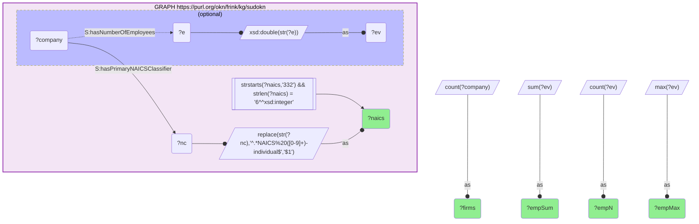

_36 row(s)_

#### Query 2

_2026-07-30T03:36:24+00:00 · `sudokn`_

```sparql
PREFIX S: <http://asu.edu/semantics/SUDOKN/>
SELECT ?decade (COUNT(DISTINCT ?company) AS ?firms)
WHERE {
  GRAPH <https://purl.org/okn/frink/kg/sudokn> {
    ?company S:hasOrganizationYearOfEstablishment ?y .
    FILTER(REGEX(STR(?y),'^[0-9]{4}$'))
    BIND(CONCAT(SUBSTR(STR(?y),1,3),'0s') AS ?decade)
  }
}
GROUP BY ?decade ORDER BY ?decade
```

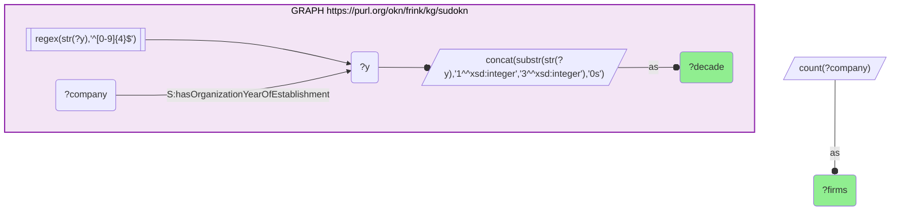

_17 row(s)_

#### Query 3

_2026-07-30T03:37:09+00:00 · `sudokn`_

```sparql
PREFIX S: <http://asu.edu/semantics/SUDOKN/>
PREFIX rdfs: <http://www.w3.org/2000/01/rdf-schema#>
SELECT ?naics ?totUS (SUM(?sq) AS ?hhiState) (MAX(?n) AS ?topStateFirms) (COUNT(?state) AS ?nStates)
WHERE {
  {
    SELECT ?naics ?state (COUNT(DISTINCT ?c) AS ?n) WHERE {
      GRAPH <https://purl.org/okn/frink/kg/sudokn> {
        ?c S:hasPrimaryNAICSClassifier ?nc ;
           S:organizationLocatedIn/S:locatedInState/rdfs:label ?state .
        BIND(REPLACE(STR(?nc),'^.*NAICS%20([0-9]+)-individual$','$1') AS ?naics)
        FILTER(STRSTARTS(?naics,'332') && STRLEN(?naics)=6)
      }
      VALUES ?state { "Alabama" "Alaska" "Arizona" "Arkansas" "California" "Colorado" "Connecticut" "Delaware" "District of Columbia" "Florida" "Georgia" "Hawaii" "Idaho" "Illinois" "Indiana" "Iowa" "Kansas" "Kentucky" "Louisiana" "Maine" "Maryland" "Massachusetts" "Michigan" "Minnesota" "Mississippi" "Missouri" "Montana" "Nebraska" "Nevada" "New Hampshire" "New Jersey" "New Mexico" "New York" "North Carolina" "North Dakota" "Ohio" "Oklahoma" "Oregon" "Pennsylvania" "Rhode Island" "South Carolina" "South Dakota" "Tennessee" "Texas" "Utah" "Vermont" "Virginia" "Washington" "West Virginia" "Wisconsin" "Wyoming" }
    } GROUP BY ?naics ?state
  }
  {
    SELECT ?naics (COUNT(DISTINCT ?c2) AS ?totUS) WHERE {
      GRAPH <https://purl.org/okn/frink/kg/sudokn> {
        ?c2 S:hasPrimaryNAICSClassifier ?nc2 ;
            S:organizationLocatedIn/S:locatedInState/rdfs:label ?state2 .
        BIND(REPLACE(STR(?nc2),'^.*NAICS%20([0-9]+)-individual$','$1') AS ?naics)
        FILTER(STRSTARTS(?naics,'332') && STRLEN(?naics)=6)
      }
      VALUES ?state2 { "Alabama" "Alaska" "Arizona" "Arkansas" "California" "Colorado" "Connecticut" "Delaware" "District of Columbia" "Florida" "Georgia" "Hawaii" "Idaho" "Illinois" "Indiana" "Iowa" "Kansas" "Kentucky" "Louisiana" "Maine" "Maryland" "Massachusetts" "Michigan" "Minnesota" "Mississippi" "Missouri" "Montana" "Nebraska" "Nevada" "New Hampshire" "New Jersey" "New Mexico" "New York" "North Carolina" "North Dakota" "Ohio" "Oklahoma" "Oregon" "Pennsylvania" "Rhode Island" "South Carolina" "South Dakota" "Tennessee" "Texas" "Utah" "Vermont" "Virginia" "Washington" "West Virginia" "Wisconsin" "Wyoming" }
    } GROUP BY ?naics
  }
  BIND((?n/?totUS)*(?n/?totUS) AS ?sq)
}
GROUP BY ?naics ?totUS ORDER BY DESC(?hhiState)
```

```mermaid
graph TD
classDef projected fill:lightgreen;
classDef literal fill:orange;
classDef iri fill:yellow;
  q2v15("?c")
  q2v17("?c2")
  q2v3("?hhiState"):::projected 
  q2v12("?n")
  q2v1("?nStates"):::projected 
  q2v5("?naics"):::projected 
  q2v14("?nc")
  q2v16("?nc2")
  q2v11("?sq")
  q2v13("?state")
  q2v18("?state2")
  q2v2("?topStateFirms"):::projected 
  q2v4("?totUS"):::projected 
  subgraph q2graph0["GRAPH https://purl.org/okn/frink/kg/sudokn"]
    style q2graph0 fill:#f3e5f5,stroke:#8e24aa,stroke-width:2px,color:#000;
    q2graph0f0[["strstarts(?naics,'332') && strlen(?naics) = '6^^xsd:integer'"]]
    q2graph0f0 --> q2v5
    q2v15 --"S:organizationLocatedIn/S:locatedInState/rdfs:label"--> q2v13
    q2v15 --"S:hasPrimaryNAICSClassifier"--> q2v14
    q2graph0bind0[/"replace(str(?nc),'^.*NAICS%20(#91;0-9#93;+)-individual$','$1')"/]
    q2v14 --o q2graph0bind0
    q2graph0bind0 --as--o q2v5
  end
  q2bind1[/"VALUES ?state"/]
  q2bind1-->q2v13
  q2bind10(["Alabama"])
  q2bind10 --> q2bind1
  q2bind11(["Alaska"])
  q2bind11 --> q2bind1
  q2bind12(["Arizona"])
  q2bind12 --> q2bind1
  q2bind1more([+48 more])
  q2bind1more --> q2bind1
  q2bind2[/"count(?c2)"/]
  q2bind2 --as--o q2v12
  subgraph q2graph1["GRAPH https://purl.org/okn/frink/kg/sudokn"]
    style q2graph1 fill:#f3e5f5,stroke:#8e24aa,stroke-width:2px,color:#000;
    q2graph1f1[["strstarts(?naics,'332') && strlen(?naics) = '6^^xsd:integer'"]]
    q2graph1f1 --> q2v5
    q2v17 --"S:organizationLocatedIn/S:locatedInState/rdfs:label"--> q2v18
    q2v17 --"S:hasPrimaryNAICSClassifier"--> q2v16
    q2graph1bind3[/"replace(str(?nc2),'^.*NAICS%20(#91;0-9#93;+)-individual$','$1')"/]
    q2v16 --o q2graph1bind3
    q2graph1bind3 --as--o q2v5
  end
  q2bind4[/"VALUES ?state2"/]
  q2bind4-->q2v18
  q2bind40(["Alabama"])
  q2bind40 --> q2bind4
  q2bind41(["Alaska"])
  q2bind41 --> q2bind4
  q2bind42(["Arizona"])
  q2bind42 --> q2bind4
  q2bind4more([+48 more])
  q2bind4more --> q2bind4
  q2bind5[/"count(?c2)"/]
  q2bind5 --as--o q2v4
  q2bind6[/"?n / ?totUS * ?n / ?totUS"/]
  q2v12 --o q2bind6
  q2v4 --o q2bind6
  q2bind6 --as--o q2v11
  q2bind7[/"count(?c2)"/]
  q2bind7 --as--o q2v3
```

_36 row(s)_

#### Query 4

_2026-07-30T03:37:23+00:00 · `sudokn`_

```sparql
PREFIX S: <http://asu.edu/semantics/SUDOKN/>
PREFIX rdfs: <http://www.w3.org/2000/01/rdf-schema#>
SELECT ?naics ?totUS (SUM(?sq) AS ?hhiZip3) (MAX(?n) AS ?topZip3Firms) (COUNT(?z3) AS ?nZip3)
WHERE {
  {
    SELECT ?naics ?z3 (COUNT(DISTINCT ?c) AS ?n) WHERE {
      GRAPH <https://purl.org/okn/frink/kg/sudokn> {
        BIND(IRI(CONCAT('https://schema.org/','postalCode')) AS ?pp)
        ?c S:hasPrimaryNAICSClassifier ?nc ; S:organizationLocatedIn ?a .
        ?a ?pp ?z0 ; S:locatedInCountry/rdfs:label ?cl .
        FILTER(?cl IN ("US","United States"))
        BIND(REPLACE(STR(?nc),'^.*NAICS%20([0-9]+)-individual$','$1') AS ?naics)
        FILTER(STRSTARTS(?naics,'332') && STRLEN(?naics)=6)
        BIND(REPLACE(STR(?z0),'[^0-9]','') AS ?d)
        FILTER(STRLEN(?d)=4 || STRLEN(?d)=5 || STRLEN(?d)=9)
        BIND(SUBSTR(IF(STRLEN(?d)=4, CONCAT('0',?d), ?d),1,3) AS ?z3)
      }
    } GROUP BY ?naics ?z3
  }
  {
    SELECT ?naics (COUNT(DISTINCT ?c2) AS ?totUS) WHERE {
      GRAPH <https://purl.org/okn/frink/kg/sudokn> {
        BIND(IRI(CONCAT('https://schema.org/','postalCode')) AS ?pp2)
        ?c2 S:hasPrimaryNAICSClassifier ?nc2 ; S:organizationLocatedIn ?a2 .
        ?a2 ?pp2 ?z02 ; S:locatedInCountry/rdfs:label ?cl2 .
        FILTER(?cl2 IN ("US","United States"))
        BIND(REPLACE(STR(?nc2),'^.*NAICS%20([0-9]+)-individual$','$1') AS ?naics)
        FILTER(STRSTARTS(?naics,'332') && STRLEN(?naics)=6)
        BIND(REPLACE(STR(?z02),'[^0-9]','') AS ?d2)
        FILTER(STRLEN(?d2)=4 || STRLEN(?d2)=5 || STRLEN(?d2)=9)
      }
    } GROUP BY ?naics
  }
  BIND((?n/?totUS)*(?n/?totUS) AS ?sq)
}
GROUP BY ?naics ?totUS ORDER BY DESC(?hhiZip3)
```

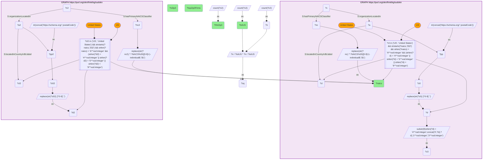

_36 row(s)_

#### Query 5

_2026-07-30T03:37:33+00:00 · `fiokg`_

```sparql
PREFIX frs: <http://w3id.org/fio/v1/epa-frs#>
PREFIX kwg: <http://stko-kwg.geog.ucsb.edu/lod/ontology/>
SELECT ?naics (COUNT(DISTINCT ?fac) AS ?facilities) (COUNT(DISTINCT ?fips) AS ?counties)
WHERE {
  GRAPH <https://purl.org/okn/frink/kg/fiokg> {
    ?rec frs:ofPrimaryIndustry ?ind .
    BIND(REPLACE(STR(?ind),'^.*naics#NAICS-([0-9]+)$','$1') AS ?naics)
    FILTER(STRSTARTS(?naics,'332') && STRLEN(?naics)=6)
    ?fac frs:hasRecord|frs:hasSupplementalRecord ?rec ; kwg:sfWithin ?reg .
    FILTER(STRSTARTS(STR(?reg),'http://stko-kwg.geog.ucsb.edu/lod/resource/administrativeRegion.USA.'))
    BIND(REPLACE(STR(?reg),'^.*administrativeRegion[.]USA[.]','') AS ?fips)
    FILTER(STRLEN(?fips)=5)
  }
}
GROUP BY ?naics ORDER BY DESC(?facilities)
```

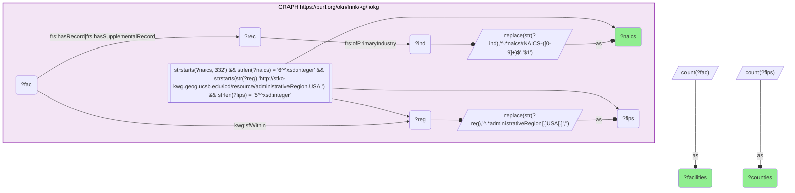

_61 row(s)_

#### Query 6

_2026-07-30T03:38:08+00:00 · `fiokg`, `sudokn`_

```sparql
PREFIX S: <http://asu.edu/semantics/SUDOKN/>
PREFIX frs: <http://w3id.org/fio/v1/epa-frs#>
PREFIX kwg: <http://stko-kwg.geog.ucsb.edu/lod/ontology/>
SELECT ?naics ?placed (SUM(?sq) AS ?hhiCounty) (MAX(?n) AS ?topCountyFirms) (COUNT(?fips) AS ?nCounties)
WHERE {
  {
    SELECT ?naics ?fips (COUNT(DISTINCT ?company) AS ?n) WHERE {
      {
        SELECT ?zip (SAMPLE(?f5) AS ?fips) WHERE {
          GRAPH <https://purl.org/okn/frink/kg/fiokg> {
            ?rec frs:ofPrimaryIndustry ?ind .
            BIND(REPLACE(STR(?ind),'^.*naics#NAICS-([0-9]+)$','$1') AS ?nc0)
            FILTER(STRSTARTS(?nc0,'33') && STRLEN(?nc0)=6)
            ?fac frs:hasRecord|frs:hasSupplementalRecord ?rec ; kwg:sfWithin ?reg ; ?ap ?addr .
            FILTER(STRENDS(STR(?ap),'schema.org/address'))
            FILTER(STRSTARTS(STR(?reg),'http://stko-kwg.geog.ucsb.edu/lod/resource/administrativeRegion.USA.'))
            BIND(REPLACE(STR(?reg),'^.*administrativeRegion[.]USA[.]','') AS ?f5)
            FILTER(STRLEN(?f5)=5)
            BIND(REPLACE(STR(?addr),'^.*[^0-9]([0-9]{5})(-[0-9]{4})?[^0-9]*(US)?\\s*$','$1') AS ?zip)
            FILTER(STRLEN(?zip)=5)
          }
        } GROUP BY ?zip HAVING(COUNT(DISTINCT ?f5)=1)
      }
      GRAPH <https://purl.org/okn/frink/kg/sudokn> {
        BIND(IRI(CONCAT('https://schema.org/','postalCode')) AS ?pp)
        ?company S:hasPrimaryNAICSClassifier ?ncl ; S:organizationLocatedIn ?a .
        ?a ?pp ?z0 .
        BIND(REPLACE(STR(?ncl),'^.*NAICS%20([0-9]+)-individual$','$1') AS ?naics)
        FILTER(STRSTARTS(?naics,'332') && STRLEN(?naics)=6)
        BIND(REPLACE(STR(?z0),'[^0-9]','') AS ?d)
        BIND(IF(STRLEN(?d)=4, CONCAT('0',?d), SUBSTR(?d,1,5)) AS ?zip)
      }
    } GROUP BY ?naics ?fips
  }
  {
    SELECT ?naics (COUNT(DISTINCT ?c2) AS ?placed) WHERE {
      {
        SELECT ?zip (SAMPLE(?g5) AS ?fips2) WHERE {
          GRAPH <https://purl.org/okn/frink/kg/fiokg> {
            ?rec2 frs:ofPrimaryIndustry ?ind2 .
            BIND(REPLACE(STR(?ind2),'^.*naics#NAICS-([0-9]+)$','$1') AS ?nc2)
            FILTER(STRSTARTS(?nc2,'33') && STRLEN(?nc2)=6)
            ?fac2 frs:hasRecord|frs:hasSupplementalRecord ?rec2 ; kwg:sfWithin ?reg2 ; ?ap2 ?addr2 .
            FILTER(STRENDS(STR(?ap2),'schema.org/address'))
            FILTER(STRSTARTS(STR(?reg2),'http://stko-kwg.geog.ucsb.edu/lod/resource/administrativeRegion.USA.'))
            BIND(REPLACE(STR(?reg2),'^.*administrativeRegion[.]USA[.]','') AS ?g5)
            FILTER(STRLEN(?g5)=5)
            BIND(REPLACE(STR(?addr2),'^.*[^0-9]([0-9]{5})(-[0-9]{4})?[^0-9]*(US)?\\s*$','$1') AS ?zip)
            FILTER(STRLEN(?zip)=5)
          }
        } GROUP BY ?zip HAVING(COUNT(DISTINCT ?g5)=1)
      }
      GRAPH <https://purl.org/okn/frink/kg/sudokn> {
        BIND(IRI(CONCAT('https://schema.org/','postalCode')) AS ?pp2)
        ?c2 S:hasPrimaryNAICSClassifier ?ncl2 ; S:organizationLocatedIn ?a2 .
        ?a2 ?pp2 ?z02 .
        BIND(REPLACE(STR(?ncl2),'^.*NAICS%20([0-9]+)-individual$','$1') AS ?naics)
        FILTER(STRSTARTS(?naics,'332') && STRLEN(?naics)=6)
        BIND(REPLACE(STR(?z02),'[^0-9]','') AS ?d2)
        BIND(IF(STRLEN(?d2)=4, CONCAT('0',?d2), SUBSTR(?d2,1,5)) AS ?zip)
      }
    } GROUP BY ?naics
  }
  BIND((?n/?placed)*(?n/?placed) AS ?sq)
}
GROUP BY ?naics ?placed ORDER BY DESC(?hhiCounty)
```

```mermaid
graph TD
classDef projected fill:lightgreen;
classDef literal fill:orange;
classDef iri fill:yellow;
  q5v28("?a")
  q5v43("?a2")
  q5v19("?addr")
  q5v34("?addr2")
  q5v16("?ap")
  q5v31("?ap2")
  q5v42("?c2")
  q5v27("?company")
  q5v23("?d")
  q5v38("?d2")
  q5v18("?f5")
  q5v22("?fac")
  q5v37("?fac2")
  q5v13("?fips")
  q5v29("?fips2")
  q5v33("?g5")
  q5v3("?hhiCounty"):::projected 
  q5v20("?ind")
  q5v35("?ind2")
  q5v12("?n")
  q5v1("?nCounties"):::projected 
  q5v5("?naics"):::projected 
  q5v15("?nc0")
  q5v30("?nc2")
  q5v25("?ncl")
  q5v40("?ncl2")
  q5v4("?placed"):::projected 
  q5v26("?pp")
  q5v41("?pp2")
  q5v21("?rec")
  q5v36("?rec2")
  q5v17("?reg")
  q5v32("?reg2")
  q5v11("?sq")
  q5v2("?topCountyFirms"):::projected 
  q5v24("?z0")
  q5v39("?z02")
  q5v14("?zip")
  q5f0[["count(?g5) = '1^^xsd:integer'"]]
  subgraph q5graph0["GRAPH https://purl.org/okn/frink/kg/fiokg"]
    style q5graph0 fill:#f3e5f5,stroke:#8e24aa,stroke-width:2px,color:#000;
    q5graph0f1[["strstarts(?nc0,'33') && strlen(?nc0) = '6^^xsd:integer' && strends(str(?ap),'schema.org/address') && strstarts(str(?reg),'http://stko-kwg.geog.ucsb.edu/lod/resource/administrativeRegion.USA.') && strlen(?f5) = '5^^xsd:integer' && strlen(?zip) = '5^^xsd:integer'"]]
    q5graph0f1 --> q5v15
    q5graph0f1 --> q5v16
    q5graph0f1 --> q5v17
    q5graph0f1 --> q5v18
    q5graph0f1 --> q5v14
    q5v21 --"frs:ofPrimaryIndustry"--> q5v20
    q5graph0bind0[/"replace(str(?ind),'^.*naics#NAICS-(#91;0-9#93;+)$','$1')"/]
    q5v20 --o q5graph0bind0
    q5graph0bind0 --as--o q5v15
    q5v22 --"frs:hasRecord|frs:hasSupplementalRecord"--> q5v21
    q5v22 --"kwg:sfWithin"--> q5v17
    q5v22 -->q5v16--> q5v19
    q5graph0bind1[/"replace(str(?reg),'^.*administrativeRegion#91;.#93;USA#91;.#93;','')"/]
    q5v17 --o q5graph0bind1
    q5graph0bind1 --as--o q5v18
    q5graph0bind2[/"replace(str(?addr),'^.*#91;^0-9#93;(#91;0-9#93;{5})(-#91;0-9#93;{4})?#91;^0-9#93;*(US)?\s*$','$1')"/]
    q5v19 --o q5graph0bind2
    q5graph0bind2 --as--o q5v14
  end
  subgraph q5graph1["GRAPH https://purl.org/okn/frink/kg/sudokn"]
    style q5graph1 fill:#f3e5f5,stroke:#8e24aa,stroke-width:2px,color:#000;
    q5graph1f2[["strstarts(?naics,'332') && strlen(?naics) = '6^^xsd:integer'"]]
    q5graph1f2 --> q5v5
    q5graph1bind3[/"iri(concat('https://schema.org/','postalCode'))"/]
    q5graph1bind3 --as--o q5v26
    q5v27 --"S:organizationLocatedIn"--> q5v28
    q5v27 --"S:hasPrimaryNAICSClassifier"--> q5v25
    q5v28 -->q5v26--> q5v24
    q5graph1bind4[/"replace(str(?ncl),'^.*NAICS%20(#91;0-9#93;+)-individual$','$1')"/]
    q5v25 --o q5graph1bind4
    q5graph1bind4 --as--o q5v5
    q5graph1bind5[/"replace(str(?z0),'#91;^0-9#93;','')"/]
    q5v24 --o q5graph1bind5
    q5graph1bind5 --as--o q5v23
    q5graph1bind6[/"if(strlen(?d) = '4^^xsd:integer',concat('0',?d),substr(?d,'1^^xsd:integer','5^^xsd:integer'))"/]
    q5v23 --o q5graph1bind6
    q5graph1bind6 --as--o q5v14
  end
  q5f3[["count(?g5) = '1^^xsd:integer'"]]
  subgraph q5graph2["GRAPH https://purl.org/okn/frink/kg/fiokg"]
    style q5graph2 fill:#f3e5f5,stroke:#8e24aa,stroke-width:2px,color:#000;
    q5graph2f4[["strstarts(?nc2,'33') && strlen(?nc2) = '6^^xsd:integer' && strends(str(?ap2),'schema.org/address') && strstarts(str(?reg2),'http://stko-kwg.geog.ucsb.edu/lod/resource/administrativeRegion.USA.') && strlen(?g5) = '5^^xsd:integer' && strlen(?zip) = '5^^xsd:integer'"]]
    q5graph2f4 --> q5v30
    q5graph2f4 --> q5v31
    q5graph2f4 --> q5v32
    q5graph2f4 --> q5v33
    q5graph2f4 --> q5v14
    q5v36 --"frs:ofPrimaryIndustry"--> q5v35
    q5graph2bind7[/"replace(str(?ind2),'^.*naics#NAICS-(#91;0-9#93;+)$','$1')"/]
    q5v35 --o q5graph2bind7
    q5graph2bind7 --as--o q5v30
    q5v37 --"frs:hasRecord|frs:hasSupplementalRecord"--> q5v36
    q5v37 --"kwg:sfWithin"--> q5v32
    q5v37 -->q5v31--> q5v34
    q5graph2bind8[/"replace(str(?reg2),'^.*administrativeRegion#91;.#93;USA#91;.#93;','')"/]
    q5v32 --o q5graph2bind8
    q5graph2bind8 --as--o q5v33
    q5graph2bind9[/"replace(str(?addr2),'^.*#91;^0-9#93;(#91;0-9#93;{5})(-#91;0-9#93;{4})?#91;^0-9#93;*(US)?\s*$','$1')"/]
    q5v34 --o q5graph2bind9
    q5graph2bind9 --as--o q5v14
  end
  subgraph q5graph3["GRAPH https://purl.org/okn/frink/kg/sudokn"]
    style q5graph3 fill:#f3e5f5,stroke:#8e24aa,stroke-width:2px,color:#000;
    q5graph3f5[["strstarts(?naics,'332') && strlen(?naics) = '6^^xsd:integer'"]]
    q5graph3f5 --> q5v5
    q5graph3bind10[/"iri(concat('https://schema.org/','postalCode'))"/]
    q5graph3bind10 --as--o q5v41
    q5v42 --"S:organizationLocatedIn"--> q5v43
    q5v42 --"S:hasPrimaryNAICSClassifier"--> q5v40
    q5v43 -->q5v41--> q5v39
    q5graph3bind11[/"replace(str(?ncl2),'^.*NAICS%20(#91;0-9#93;+)-individual$','$1')"/]
    q5v40 --o q5graph3bind11
    q5graph3bind11 --as--o q5v5
    q5graph3bind12[/"replace(str(?z02),'#91;^0-9#93;','')"/]
    q5v39 --o q5graph3bind12
    q5graph3bind12 --as--o q5v38
    q5graph3bind13[/"if(strlen(?d2) = '4^^xsd:integer',concat('0',?d2),substr(?d2,'1^^xsd:integer','5^^xsd:integer'))"/]
    q5v38 --o q5graph3bind13
    q5graph3bind13 --as--o q5v14
  end
  q5bind14[/"?n / ?placed * ?n / ?placed"/]
  q5v12 --o q5bind14
  q5v4 --o q5bind14
  q5bind14 --as--o q5v11
```

_36 row(s)_

#### Query 7

_2026-07-30T03:38:35+00:00 · `fiokg`, `sudokn`_

```sparql
PREFIX S: <http://asu.edu/semantics/SUDOKN/>
PREFIX frs: <http://w3id.org/fio/v1/epa-frs#>
PREFIX kwg: <http://stko-kwg.geog.ucsb.edu/lod/ontology/>
SELECT ?total (SUM(?sq) AS ?baseHhiCounty) (COUNT(?fips) AS ?nCounties)
WHERE {
  {
    SELECT ?fips (COUNT(DISTINCT ?company) AS ?n) WHERE {
      {
        SELECT ?zip (SAMPLE(?f5) AS ?fips) WHERE {
          GRAPH <https://purl.org/okn/frink/kg/fiokg> {
            ?rec frs:ofPrimaryIndustry ?ind .
            BIND(REPLACE(STR(?ind),'^.*naics#NAICS-([0-9]+)$','$1') AS ?nc0)
            FILTER(STRSTARTS(?nc0,'33') && STRLEN(?nc0)=6)
            ?fac frs:hasRecord|frs:hasSupplementalRecord ?rec ; kwg:sfWithin ?reg ; ?ap ?addr .
            FILTER(STRENDS(STR(?ap),'schema.org/address'))
            FILTER(STRSTARTS(STR(?reg),'http://stko-kwg.geog.ucsb.edu/lod/resource/administrativeRegion.USA.'))
            BIND(REPLACE(STR(?reg),'^.*administrativeRegion[.]USA[.]','') AS ?f5)
            FILTER(STRLEN(?f5)=5)
            BIND(REPLACE(STR(?addr),'^.*[^0-9]([0-9]{5})(-[0-9]{4})?[^0-9]*(US)?\\s*$','$1') AS ?zip)
            FILTER(STRLEN(?zip)=5)
          }
        } GROUP BY ?zip HAVING(COUNT(DISTINCT ?f5)=1)
      }
      GRAPH <https://purl.org/okn/frink/kg/sudokn> {
        BIND(IRI(CONCAT('https://schema.org/','postalCode')) AS ?pp)
        ?company S:hasPrimaryNAICSClassifier ?ncl ; S:organizationLocatedIn ?a . ?a ?pp ?z0 .
        BIND(REPLACE(STR(?ncl),'^.*NAICS%20([0-9]+)-individual$','$1') AS ?naics)
        FILTER(STRSTARTS(?naics,'332') && STRLEN(?naics)=6)
        BIND(REPLACE(STR(?z0),'[^0-9]','') AS ?d)
        BIND(IF(STRLEN(?d)=4, CONCAT('0',?d), SUBSTR(?d,1,5)) AS ?zip)
      }
    } GROUP BY ?fips
  }
  {
    SELECT (COUNT(DISTINCT ?c2) AS ?total) WHERE {
      {
        SELECT ?zip (SAMPLE(?g5) AS ?fips2) WHERE {
          GRAPH <https://purl.org/okn/frink/kg/fiokg> {
            ?rec2 frs:ofPrimaryIndustry ?ind2 .
            BIND(REPLACE(STR(?ind2),'^.*naics#NAICS-([0-9]+)$','$1') AS ?nc2)
            FILTER(STRSTARTS(?nc2,'33') && STRLEN(?nc2)=6)
            ?fac2 frs:hasRecord|frs:hasSupplementalRecord ?rec2 ; kwg:sfWithin ?reg2 ; ?ap2 ?addr2 .
            FILTER(STRENDS(STR(?ap2),'schema.org/address'))
            FILTER(STRSTARTS(STR(?reg2),'http://stko-kwg.geog.ucsb.edu/lod/resource/administrativeRegion.USA.'))
            BIND(REPLACE(STR(?reg2),'^.*administrativeRegion[.]USA[.]','') AS ?g5)
            FILTER(STRLEN(?g5)=5)
            BIND(REPLACE(STR(?addr2),'^.*[^0-9]([0-9]{5})(-[0-9]{4})?[^0-9]*(US)?\\s*$','$1') AS ?zip)
            FILTER(STRLEN(?zip)=5)
          }
        } GROUP BY ?zip HAVING(COUNT(DISTINCT ?g5)=1)
      }
      GRAPH <https://purl.org/okn/frink/kg/sudokn> {
        BIND(IRI(CONCAT('https://schema.org/','postalCode')) AS ?pp2)
        ?c2 S:hasPrimaryNAICSClassifier ?ncl2 ; S:organizationLocatedIn ?a2 . ?a2 ?pp2 ?z02 .
        BIND(REPLACE(STR(?ncl2),'^.*NAICS%20([0-9]+)-individual$','$1') AS ?naics)
        FILTER(STRSTARTS(?naics,'332') && STRLEN(?naics)=6)
        BIND(REPLACE(STR(?z02),'[^0-9]','') AS ?d2)
        BIND(IF(STRLEN(?d2)=4, CONCAT('0',?d2), SUBSTR(?d2,1,5)) AS ?zip)
      }
    }
  }
  BIND((?n/?total)*(?n/?total) AS ?sq)
}
GROUP BY ?total
```

```mermaid
graph TD
classDef projected fill:lightgreen;
classDef literal fill:orange;
classDef iri fill:yellow;
  q6v25("?a")
  q6v40("?a2")
  q6v15("?addr")
  q6v31("?addr2")
  q6v12("?ap")
  q6v28("?ap2")
  q6v2("?baseHhiCounty"):::projected 
  q6v39("?c2")
  q6v24("?company")
  q6v20("?d")
  q6v35("?d2")
  q6v14("?f5")
  q6v18("?fac")
  q6v34("?fac2")
  q6v9("?fips")
  q6v26("?fips2")
  q6v30("?g5")
  q6v16("?ind")
  q6v32("?ind2")
  q6v8("?n")
  q6v1("?nCounties"):::projected 
  q6v19("?naics")
  q6v11("?nc0")
  q6v27("?nc2")
  q6v22("?ncl")
  q6v37("?ncl2")
  q6v23("?pp")
  q6v38("?pp2")
  q6v17("?rec")
  q6v33("?rec2")
  q6v13("?reg")
  q6v29("?reg2")
  q6v7("?sq")
  q6v3("?total"):::projected 
  q6v21("?z0")
  q6v36("?z02")
  q6v10("?zip")
  q6f0[["count(?g5) = '1^^xsd:integer'"]]
  subgraph q6graph0["GRAPH https://purl.org/okn/frink/kg/fiokg"]
    style q6graph0 fill:#f3e5f5,stroke:#8e24aa,stroke-width:2px,color:#000;
    q6graph0f1[["strstarts(?nc0,'33') && strlen(?nc0) = '6^^xsd:integer' && strends(str(?ap),'schema.org/address') && strstarts(str(?reg),'http://stko-kwg.geog.ucsb.edu/lod/resource/administrativeRegion.USA.') && strlen(?f5) = '5^^xsd:integer' && strlen(?zip) = '5^^xsd:integer'"]]
    q6graph0f1 --> q6v11
    q6graph0f1 --> q6v12
    q6graph0f1 --> q6v13
    q6graph0f1 --> q6v14
    q6graph0f1 --> q6v10
    q6v17 --"frs:ofPrimaryIndustry"--> q6v16
    q6graph0bind0[/"replace(str(?ind),'^.*naics#NAICS-(#91;0-9#93;+)$','$1')"/]
    q6v16 --o q6graph0bind0
    q6graph0bind0 --as--o q6v11
    q6v18 --"frs:hasRecord|frs:hasSupplementalRecord"--> q6v17
    q6v18 --"kwg:sfWithin"--> q6v13
    q6v18 -->q6v12--> q6v15
    q6graph0bind1[/"replace(str(?reg),'^.*administrativeRegion#91;.#93;USA#91;.#93;','')"/]
    q6v13 --o q6graph0bind1
    q6graph0bind1 --as--o q6v14
    q6graph0bind2[/"replace(str(?addr),'^.*#91;^0-9#93;(#91;0-9#93;{5})(-#91;0-9#93;{4})?#91;^0-9#93;*(US)?\s*$','$1')"/]
    q6v15 --o q6graph0bind2
    q6graph0bind2 --as--o q6v10
  end
  subgraph q6graph1["GRAPH https://purl.org/okn/frink/kg/sudokn"]
    style q6graph1 fill:#f3e5f5,stroke:#8e24aa,stroke-width:2px,color:#000;
    q6graph1f2[["strstarts(?naics,'332') && strlen(?naics) = '6^^xsd:integer'"]]
    q6graph1f2 --> q6v19
    q6graph1bind3[/"iri(concat('https://schema.org/','postalCode'))"/]
    q6graph1bind3 --as--o q6v23
    q6v24 --"S:organizationLocatedIn"--> q6v25
    q6v24 --"S:hasPrimaryNAICSClassifier"--> q6v22
    q6v25 -->q6v23--> q6v21
    q6graph1bind4[/"replace(str(?ncl),'^.*NAICS%20(#91;0-9#93;+)-individual$','$1')"/]
    q6v22 --o q6graph1bind4
    q6graph1bind4 --as--o q6v19
    q6graph1bind5[/"replace(str(?z0),'#91;^0-9#93;','')"/]
    q6v21 --o q6graph1bind5
    q6graph1bind5 --as--o q6v20
    q6graph1bind6[/"if(strlen(?d) = '4^^xsd:integer',concat('0',?d),substr(?d,'1^^xsd:integer','5^^xsd:integer'))"/]
    q6v20 --o q6graph1bind6
    q6graph1bind6 --as--o q6v10
  end
  q6f3[["count(?g5) = '1^^xsd:integer'"]]
  subgraph q6graph2["GRAPH https://purl.org/okn/frink/kg/fiokg"]
    style q6graph2 fill:#f3e5f5,stroke:#8e24aa,stroke-width:2px,color:#000;
    q6graph2f4[["strstarts(?nc2,'33') && strlen(?nc2) = '6^^xsd:integer' && strends(str(?ap2),'schema.org/address') && strstarts(str(?reg2),'http://stko-kwg.geog.ucsb.edu/lod/resource/administrativeRegion.USA.') && strlen(?g5) = '5^^xsd:integer' && strlen(?zip) = '5^^xsd:integer'"]]
    q6graph2f4 --> q6v27
    q6graph2f4 --> q6v28
    q6graph2f4 --> q6v29
    q6graph2f4 --> q6v30
    q6graph2f4 --> q6v10
    q6v33 --"frs:ofPrimaryIndustry"--> q6v32
    q6graph2bind7[/"replace(str(?ind2),'^.*naics#NAICS-(#91;0-9#93;+)$','$1')"/]
    q6v32 --o q6graph2bind7
    q6graph2bind7 --as--o q6v27
    q6v34 --"frs:hasRecord|frs:hasSupplementalRecord"--> q6v33
    q6v34 --"kwg:sfWithin"--> q6v29
    q6v34 -->q6v28--> q6v31
    q6graph2bind8[/"replace(str(?reg2),'^.*administrativeRegion#91;.#93;USA#91;.#93;','')"/]
    q6v29 --o q6graph2bind8
    q6graph2bind8 --as--o q6v30
    q6graph2bind9[/"replace(str(?addr2),'^.*#91;^0-9#93;(#91;0-9#93;{5})(-#91;0-9#93;{4})?#91;^0-9#93;*(US)?\s*$','$1')"/]
    q6v31 --o q6graph2bind9
    q6graph2bind9 --as--o q6v10
  end
  subgraph q6graph3["GRAPH https://purl.org/okn/frink/kg/sudokn"]
    style q6graph3 fill:#f3e5f5,stroke:#8e24aa,stroke-width:2px,color:#000;
    q6graph3f5[["strstarts(?naics,'332') && strlen(?naics) = '6^^xsd:integer'"]]
    q6graph3f5 --> q6v19
    q6graph3bind10[/"iri(concat('https://schema.org/','postalCode'))"/]
    q6graph3bind10 --as--o q6v38
    q6v39 --"S:organizationLocatedIn"--> q6v40
    q6v39 --"S:hasPrimaryNAICSClassifier"--> q6v37
    q6v40 -->q6v38--> q6v36
    q6graph3bind11[/"replace(str(?ncl2),'^.*NAICS%20(#91;0-9#93;+)-individual$','$1')"/]
    q6v37 --o q6graph3bind11
    q6graph3bind11 --as--o q6v19
    q6graph3bind12[/"replace(str(?z02),'#91;^0-9#93;','')"/]
    q6v36 --o q6graph3bind12
    q6graph3bind12 --as--o q6v35
    q6graph3bind13[/"if(strlen(?d2) = '4^^xsd:integer',concat('0',?d2),substr(?d2,'1^^xsd:integer','5^^xsd:integer'))"/]
    q6v35 --o q6graph3bind13
    q6graph3bind13 --as--o q6v10
  end
  q6bind14[/"?n / ?total * ?n / ?total"/]
  q6v8 --o q6bind14
  q6v3 --o q6bind14
  q6bind14 --as--o q6v7
```

_1 row(s)_

#### Query 8

_2026-07-30T03:38:53+00:00 · `fiokg`, `sudokn`, `spatialkg`_

```sparql
PREFIX S: <http://asu.edu/semantics/SUDOKN/>
PREFIX frs: <http://w3id.org/fio/v1/epa-frs#>
PREFIX kwg: <http://stko-kwg.geog.ucsb.edu/lod/ontology/>
PREFIX rdfs: <http://www.w3.org/2000/01/rdf-schema#>
PREFIX xsd: <http://www.w3.org/2001/XMLSchema#>
SELECT ?fips ?cname (COUNT(DISTINCT ?company) AS ?smmFirms) (SUM(?ev) AS ?smmEmp) (COUNT(DISTINCT ?naics) AS ?industries)
WHERE {
  {
    SELECT ?zip (SAMPLE(?f5) AS ?fips) WHERE {
      GRAPH <https://purl.org/okn/frink/kg/fiokg> {
        ?rec frs:ofPrimaryIndustry ?ind .
        BIND(REPLACE(STR(?ind),'^.*naics#NAICS-([0-9]+)$','$1') AS ?nc0)
        FILTER(STRSTARTS(?nc0,'33') && STRLEN(?nc0)=6)
        ?fac frs:hasRecord|frs:hasSupplementalRecord ?rec ; kwg:sfWithin ?reg ; ?ap ?addr .
        FILTER(STRENDS(STR(?ap),'schema.org/address'))
        FILTER(STRSTARTS(STR(?reg),'http://stko-kwg.geog.ucsb.edu/lod/resource/administrativeRegion.USA.'))
        BIND(REPLACE(STR(?reg),'^.*administrativeRegion[.]USA[.]','') AS ?f5)
        FILTER(STRLEN(?f5)=5)
        BIND(REPLACE(STR(?addr),'^.*[^0-9]([0-9]{5})(-[0-9]{4})?[^0-9]*(US)?\\s*$','$1') AS ?zip)
        FILTER(STRLEN(?zip)=5)
      }
    } GROUP BY ?zip HAVING(COUNT(DISTINCT ?f5)=1)
  }
  GRAPH <https://purl.org/okn/frink/kg/sudokn> {
    BIND(IRI(CONCAT('https://schema.org/','postalCode')) AS ?pp)
    ?company S:hasPrimaryNAICSClassifier ?ncl ; S:organizationLocatedIn ?a .
    ?a ?pp ?z0 .
    BIND(REPLACE(STR(?ncl),'^.*NAICS%20([0-9]+)-individual$','$1') AS ?naics)
    FILTER(STRSTARTS(?naics,'332') && STRLEN(?naics)=6)
    BIND(REPLACE(STR(?z0),'[^0-9]','') AS ?d)
    BIND(IF(STRLEN(?d)=4, CONCAT('0',?d), SUBSTR(?d,1,5)) AS ?zip)
    OPTIONAL { ?company S:hasNumberOfEmployees ?e FILTER(REGEX(STR(?e),'^[0-9]+$')) BIND(xsd:double(STR(?e)) AS ?ev) }
  }
  BIND(IRI(CONCAT('http://stko-kwg.geog.ucsb.edu/lod/resource/administrativeRegion.USA.',?fips)) AS ?r3)
  GRAPH <https://purl.org/okn/frink/kg/spatialkg> { ?r3 rdfs:label ?cname }
}
GROUP BY ?fips ?cname ORDER BY DESC(?smmFirms) LIMIT 45
```

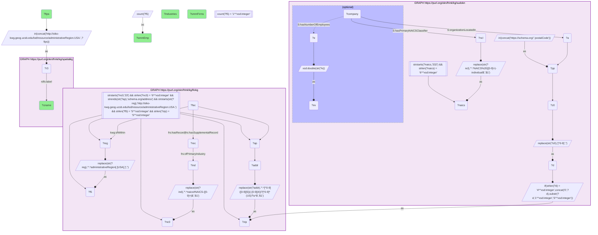

_45 row(s)_

#### Query 9

_2026-07-30T03:39:05+00:00 · `fiokg`, `ruralkg`, `spatialkg`_

```sparql
PREFIX frs: <http://w3id.org/fio/v1/epa-frs#>
PREFIX kwg: <http://stko-kwg.geog.ucsb.edu/lod/ontology/>
PREFIX st: <http://sail.ua.edu/ruralkg/settlementtype/>
PREFIX rdfs: <http://www.w3.org/2000/01/rdf-schema#>
SELECT ?fips ?cname ?n332 ?pop ?rucc (100000*?n332/?pop AS ?facPer100k)
WHERE {
  {
    SELECT ?fips (COUNT(DISTINCT ?fac) AS ?n332) WHERE {
      GRAPH <https://purl.org/okn/frink/kg/fiokg> {
        ?rec frs:ofPrimaryIndustry ?ind .
        BIND(REPLACE(STR(?ind),'^.*naics#NAICS-([0-9]+)$','$1') AS ?naics)
        FILTER(STRSTARTS(?naics,'332') && STRLEN(?naics)=6)
        ?fac frs:hasRecord|frs:hasSupplementalRecord ?rec ; kwg:sfWithin ?reg .
        FILTER(STRSTARTS(STR(?reg),'http://stko-kwg.geog.ucsb.edu/lod/resource/administrativeRegion.USA.'))
        BIND(REPLACE(STR(?reg),'^.*administrativeRegion[.]USA[.]','') AS ?fips)
        FILTER(STRLEN(?fips)=5)
      }
    } GROUP BY ?fips
  }
  FILTER(?n332 >= 20)
  BIND(IRI(CONCAT('http://stko-kwg.geog.ucsb.edu/lod/resource/administrativeRegion.USA.',?fips)) AS ?r3)
  GRAPH <https://purl.org/okn/frink/kg/ruralkg> {
    ?cs st:censusCounty ?r3 ; st:population ?pop ; st:hasRUCC ?ru .
    BIND(REPLACE(STR(?ru),'^.*RUCC_2013_','') AS ?rucc)
  }
  GRAPH <https://purl.org/okn/frink/kg/spatialkg> { ?r3 rdfs:label ?cname }
}
ORDER BY DESC(?facPer100k) LIMIT 45
```

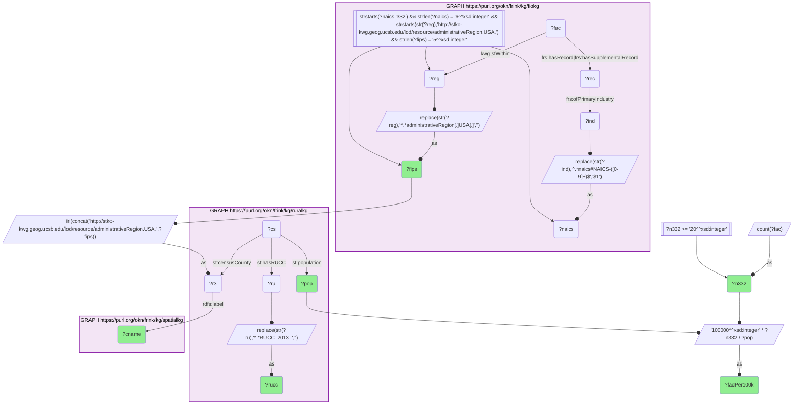

_45 row(s)_

#### Query 10

_2026-07-30T03:39:21+00:00 · `fiokg`, `ruralkg`, `spoke-okn`_

```sparql
PREFIX sp: <https://purl.org/okn/frink/kg/spoke-okn/schema/>
PREFIX rdf: <http://www.w3.org/1999/02/22-rdf-syntax-ns#>
PREFIX frs: <http://w3id.org/fio/v1/epa-frs#>
PREFIX kwg: <http://stko-kwg.geog.ucsb.edu/lod/ontology/>
PREFIX st: <http://sail.ua.edu/ruralkg/settlementtype/>
PREFIX xsd: <http://www.w3.org/2001/XMLSchema#>
SELECT ?var ?tier (COUNT(DISTINCT ?loc) AS ?counties) (AVG(?num) AS ?mean)
WHERE {
  {
    SELECT ?fips (COUNT(DISTINCT ?fac) AS ?n332) WHERE {
      GRAPH <https://purl.org/okn/frink/kg/fiokg> {
        ?rec frs:ofPrimaryIndustry ?ind .
        BIND(REPLACE(STR(?ind),'^.*naics#NAICS-([0-9]+)$','$1') AS ?naics)
        FILTER(STRSTARTS(?naics,'332') && STRLEN(?naics)=6)
        ?fac frs:hasRecord|frs:hasSupplementalRecord ?rec ; kwg:sfWithin ?reg .
        FILTER(STRSTARTS(STR(?reg),'http://stko-kwg.geog.ucsb.edu/lod/resource/administrativeRegion.USA.'))
        BIND(REPLACE(STR(?reg),'^.*administrativeRegion[.]USA[.]','') AS ?fips)
        FILTER(STRLEN(?fips)=5)
      }
    } GROUP BY ?fips
  }
  BIND(IRI(CONCAT('http://stko-kwg.geog.ucsb.edu/lod/resource/administrativeRegion.USA.',?fips)) AS ?r3)
  GRAPH <https://purl.org/okn/frink/kg/ruralkg> { ?cs st:censusCounty ?r3 ; st:population ?pop }
  BIND(100000*?n332/?pop AS ?intens)
  BIND(IF(?intens>=15,"A_high", IF(?intens>=5,"B_mid","C_low")) AS ?tier)
  BIND(IRI(CONCAT('https://purl.org/okn/frink/kg/spoke-okn/location/',?fips)) AS ?loc)
  GRAPH <https://purl.org/okn/frink/kg/spoke-okn> {
    ?stmt rdf:predicate sp:PREVALENCEIN_SpL ; rdf:object ?loc ; sp:variable ?var ; sp:value ?v .
  }
  VALUES ?var { "rural" "poor or fair health" "premature age-adjusted mortality" "life expectancy" "diabetes prevalence" "adult obesity" "adult smoking" "frequent mental distress" "injury deaths" "drug overdose deaths" "primary care physicians" "mental health providers" "broadband access" "some college" "unemployment" "uninsured" "children in poverty" "social associations" "voter turnout" "severe housing problems" "food insecurity" "air pollution - particulate matter" "preventable hospital stays" "65 and older" "Overall(Socioeconomic Status,Household Characteristics,Racial & Ethnic Minority Status,Housing Type & Transportation)" }
  BIND(xsd:double(REPLACE(STR(?v),'^([0-9]+[.]?[0-9]*).*$','$1')) AS ?num)
}
GROUP BY ?var ?tier ORDER BY ?var ?tier
```

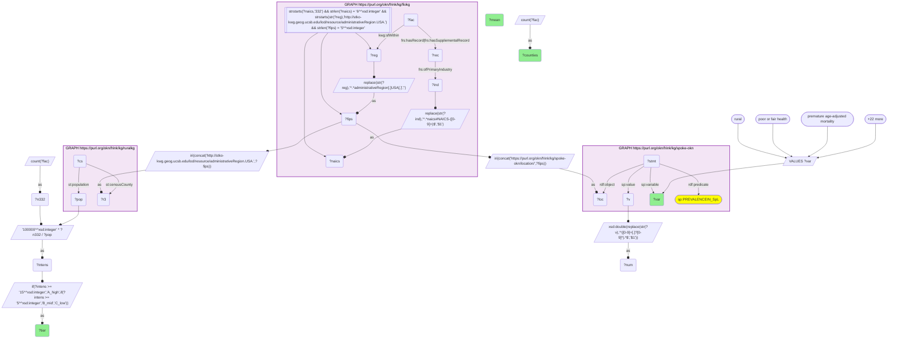

_75 row(s)_

#### Query 11

_2026-07-30T03:39:43+00:00 · `securechainkg`_

```sparql
PREFIX sc: <https://w3id.org/secure-chain/>
PREFIX schema: <http://schema.org/>
SELECT ?name ?eco (COUNT(DISTINCT ?dependent) AS ?dependentPkgs)
WHERE {
  GRAPH <https://purl.org/okn/frink/kg/securechainkg> {
    ?target sc:hasSoftwareVersion ?tv ; schema:name ?name .
    OPTIONAL { ?target sc:ecosystem ?eco }
    ?dv sc:dependsOn ?tv .
    ?dependent sc:hasSoftwareVersion ?dv .
    FILTER(?dependent != ?target)
  }
}
GROUP BY ?name ?eco ORDER BY DESC(?dependentPkgs) LIMIT 60
```

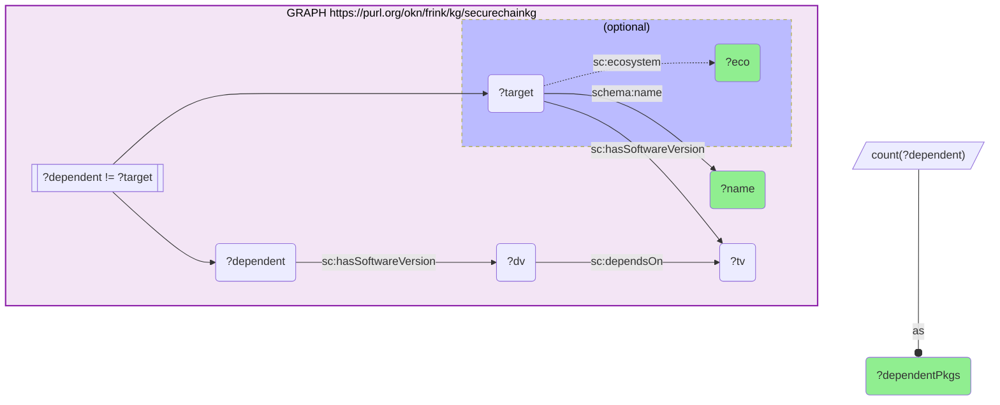

_60 row(s)_

#### Query 12

_2026-07-30T03:39:54+00:00 · `securechainkg`_

```sparql
PREFIX sc: <https://w3id.org/secure-chain/>
PREFIX schema: <http://schema.org/>
SELECT ?name (COUNT(DISTINCT ?cve) AS ?cves) (COUNT(DISTINCT ?vulnVer) AS ?vulnVersions) (COUNT(DISTINCT ?tv) AS ?versions)
WHERE {
  GRAPH <https://purl.org/okn/frink/kg/securechainkg> {
    ?target schema:name ?name ; sc:hasSoftwareVersion ?tv .
    OPTIONAL { ?tv sc:vulnerableTo ?cve BIND(?tv AS ?vulnVer) }
  }
  VALUES ?name { "numpy" "requests" "pandas" "serde" "matplotlib" "scipy" "click" "pyyaml" "tqdm" "pydantic" "tokio" "scikit-learn" "pillow" "six" "torch" "typing-extensions" "setuptools" "jinja2" "aiohttp" "urllib3" "django" "lxml" "flask" "sqlalchemy" "boto3" "psutil" "certifi" "cryptography" "opencv-python" "regex" "httpx" "networkx" }
}
GROUP BY ?name ORDER BY DESC(?cves)
```

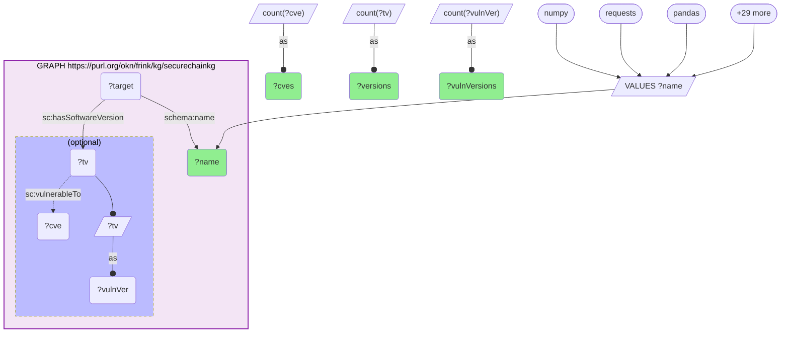

_32 row(s)_

#### Query 13

_2026-07-30T03:40:07+00:00 · `securechainkg`_

```sparql
PREFIX sc: <https://w3id.org/secure-chain/>
PREFIX S: <http://asu.edu/semantics/SUDOKN/>
PREFIX schema: <http://schema.org/>
PREFIX rdfs: <http://www.w3.org/2000/01/rdf-schema#>
SELECT ?naics ?nm (COUNT(DISTINCT ?hw) AS ?hwProducts) (COUNT(DISTINCT ?hv) AS ?hwVersions)
       (COUNT(DISTINCT ?cve) AS ?cves) (COUNT(DISTINCT ?cwe) AS ?vulnTypes)
WHERE {
  {
    SELECT DISTINCT ?nm ?naics WHERE {
      GRAPH <https://purl.org/okn/frink/kg/securechainkg> {
        ?m S:hasPrimaryNAICSClassifier ?nc ; rdfs:label ?l .
        BIND(REPLACE(STR(?nc),'^.*/naics-([0-9]+)[.]0-inst$','$1') AS ?naics)
        BIND(LCASE(REPLACE(STR(?l),'[^A-Za-z0-9]','')) AS ?nm)
      }
    }
  }
  GRAPH <https://purl.org/okn/frink/kg/securechainkg> {
    ?hw a sc:Hardware ; schema:manufacturer ?org .
    ?org schema:name ?n2 .
    BIND(LCASE(REPLACE(STR(?n2),'[^A-Za-z0-9]','')) AS ?nm)
    OPTIONAL {
      ?hw sc:hasHardwareVersion ?hv .
      OPTIONAL { ?hv sc:vulnerableTo ?cve . OPTIONAL { ?cve sc:vulnerabilityType ?cwe } }
    }
  }
}
GROUP BY ?naics ?nm ORDER BY DESC(?cves)
```

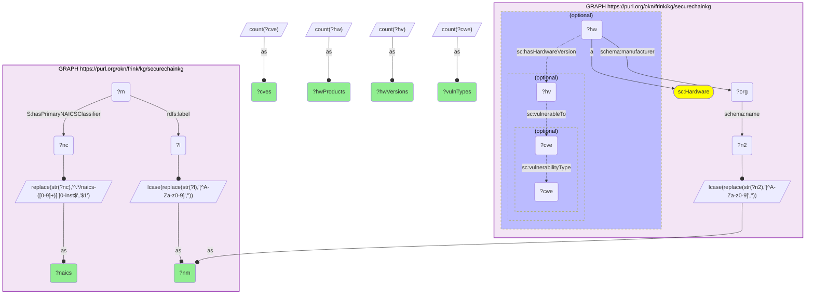

_21 row(s)_

#### Query 14

_2026-07-30T03:40:17+00:00 · `securechainkg`_

```sparql
PREFIX sc: <https://w3id.org/secure-chain/>
PREFIX schema: <http://schema.org/>
SELECT ?industrialPkg (COUNT(DISTINCT ?upstream) AS ?upstreamHubs) (GROUP_CONCAT(DISTINCT ?upName; separator=", ") AS ?hubs)
WHERE {
  GRAPH <https://purl.org/okn/frink/kg/securechainkg> {
    ?p a sc:Software ; schema:name ?industrialPkg ; sc:hasSoftwareVersion ?pv .
    ?pv sc:dependsOn ?uv .
    ?upstream sc:hasSoftwareVersion ?uv ; schema:name ?upName .
    FILTER(?upstream != ?p)
    FILTER(?upName IN ("numpy","requests","pandas","scipy","matplotlib","setuptools","pyyaml","pillow","lxml","urllib3","cryptography","jinja2","aiohttp","torch","scikit-learn","opencv-python","six","certifi","psutil","typing-extensions","pyserial","django","sqlalchemy","tqdm","click","pydantic"))
  }
  VALUES ?industrialPkg { "pymodbus" "python-snap7" "pylogix" "pycomm3" "ezdxf" "cadquery" "ifcopenshell" "trimesh" "numpy-stl" "meshio" "canopen" "python-can" "asyncua" "opcua" "pyads" "bacpypes" "shapely" "pyvista" "vtk" "open3d" "scapy" "dxfgrabber" "pygcode" }
}
GROUP BY ?industrialPkg ORDER BY DESC(?upstreamHubs)
```

```mermaid
graph TD
classDef projected fill:lightgreen;
classDef literal fill:orange;
classDef iri fill:yellow;
  q13v1("?hubs"):::projected 
  q13v3("?industrialPkg"):::projected 
  q13v8("?p")
  q13v10("?pv")
  q13v9("?upName")
  q13v7("?upstream")
  q13v2("?upstreamHubs"):::projected 
  q13v11("?uv")
  subgraph q13graph0["GRAPH https://purl.org/okn/frink/kg/securechainkg"]
    style q13graph0 fill:#f3e5f5,stroke:#8e24aa,stroke-width:2px,color:#000;
    q13graph0c13(["aiohttp"]):::literal 
    q13graph0c18(["certifi"]):::literal 
    q13graph0c25(["click"]):::literal 
    q13graph0c11(["cryptography"]):::literal 
    q13graph0c22(["django"]):::literal 
    q13graph0c28(["sc:Software"]):::iri 
    q13graph0c12(["jinja2"]):::literal 
    q13graph0c9(["lxml"]):::literal 
    q13graph0c5(["matplotlib"]):::literal 
    q13graph0c1(["numpy"]):::literal 
    q13graph0c16(["opencv-python"]):::literal 
    q13graph0c3(["pandas"]):::literal 
    q13graph0c8(["pillow"]):::literal 
    q13graph0c19(["psutil"]):::literal 
    q13graph0c26(["pydantic"]):::literal 
    q13graph0c21(["pyserial"]):::literal 
    q13graph0c7(["pyyaml"]):::literal 
    q13graph0c2(["requests"]):::literal 
    q13graph0c15(["scikit-learn"]):::literal 
    q13graph0c4(["scipy"]):::literal 
    q13graph0c6(["setuptools"]):::literal 
    q13graph0c17(["six"]):::literal 
    q13graph0c23(["sqlalchemy"]):::literal 
    q13graph0c14(["torch"]):::literal 
    q13graph0c24(["tqdm"]):::literal 
    q13graph0c20(["typing-extensions"]):::literal 
    q13graph0c10(["urllib3"]):::literal 
    q13graph0f0[["?upstream != ?p && ?upName in ('numpy', 'requests', 'pandas', 'scipy', 'matplotlib', 'setuptools', 'pyyaml', 'pillow', 'lxml', 'urllib3', 'cryptography', 'jinja2', 'aiohttp', 'torch', 'scikit-learn', 'opencv-python', 'six', 'certifi', 'psutil', 'typing-extensions', 'pyserial', 'django', 'sqlalchemy', 'tqdm', 'click', 'pydantic')"]]
    q13graph0c1 --o q13graph0f0
    q13graph0c2 --o q13graph0f0
    q13graph0c3 --o q13graph0f0
    q13graph0c4 --o q13graph0f0
    q13graph0c5 --o q13graph0f0
    q13graph0c6 --o q13graph0f0
    q13graph0c7 --o q13graph0f0
    q13graph0c8 --o q13graph0f0
    q13graph0c9 --o q13graph0f0
    q13graph0c10 --o q13graph0f0
    q13graph0c11 --o q13graph0f0
    q13graph0c12 --o q13graph0f0
    q13graph0c13 --o q13graph0f0
    q13graph0c14 --o q13graph0f0
    q13graph0c15 --o q13graph0f0
    q13graph0c16 --o q13graph0f0
    q13graph0c17 --o q13graph0f0
    q13graph0c18 --o q13graph0f0
    q13graph0c19 --o q13graph0f0
    q13graph0c20 --o q13graph0f0
    q13graph0c21 --o q13graph0f0
    q13graph0c22 --o q13graph0f0
    q13graph0c23 --o q13graph0f0
    q13graph0c24 --o q13graph0f0
    q13graph0c25 --o q13graph0f0
    q13graph0c26 --o q13graph0f0
    q13graph0f0 --> q13v7
    q13graph0f0 --> q13v8
    q13graph0f0 --> q13v9
    q13v8 --"a"--> q13graph0c28
    q13v8 --"sc:hasSoftwareVersion"--> q13v10
    q13v8 --"schema:name"--> q13v3
    q13v10 --"sc:dependsOn"--> q13v11
    q13v7 --"sc:hasSoftwareVersion"--> q13v11
    q13v7 --"schema:name"--> q13v9
  end
  q13bind0[/"VALUES ?industrialPkg"/]
  q13bind0-->q13v3
  q13bind00(["pymodbus"])
  q13bind00 --> q13bind0
  q13bind01(["python-snap7"])
  q13bind01 --> q13bind0
  q13bind02(["pylogix"])
  q13bind02 --> q13bind0
  q13bind0more([+20 more])
  q13bind0more --> q13bind0
  q13bind1[/"count(?upstream)"/]
  q13bind1 --as--o q13v2
  q13bind2[/"group_concat(?upName)"/]
  q13bind2 --as--o q13v1
```

_13 row(s)_

#### Query 15

_2026-07-30T03:40:25+00:00 · `securechainkg`_

```sparql
PREFIX sc: <https://w3id.org/secure-chain/>
PREFIX schema: <http://schema.org/>
SELECT ?eco (COUNT(DISTINCT ?sw) AS ?software) (COUNT(DISTINCT ?sv) AS ?versions) WHERE {
  GRAPH <https://purl.org/okn/frink/kg/securechainkg> {
    ?sw a sc:Software ; sc:ecosystem ?eco .
    OPTIONAL { ?sw sc:hasSoftwareVersion ?sv }
  }
} GROUP BY ?eco ORDER BY DESC(?software)
```

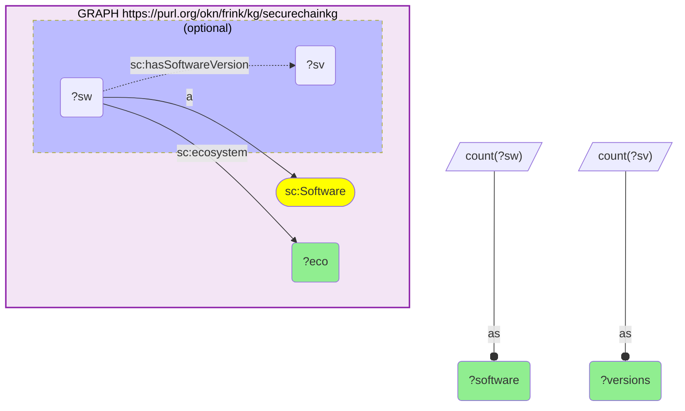

_6 row(s)_

#### Query 16

_2026-07-30T03:41:00+00:00 · `securechainkg`_

```sparql
PREFIX sc: <https://w3id.org/secure-chain/>
PREFIX schema: <http://schema.org/>
SELECT ?name ?eco (COUNT(DISTINCT ?dependent) AS ?dependentPkgs) (GROUP_CONCAT(DISTINCT ?lic; separator="|") AS ?copyleft)
WHERE {
  {
    SELECT ?target ?lic WHERE {
      GRAPH <https://purl.org/okn/frink/kg/securechainkg> {
        ?target sc:hasSoftwareVersion ?tv0 . ?tv0 schema:license ?l .
        BIND(REPLACE(REPLACE(STR(?l),'^.*[/#]',''),'[.]html$','') AS ?lic)
        FILTER(REGEX(?lic,'^(A?GPL|LGPL|EUPL|SSPL|CDDL|MS-RL|OSL)','i'))
      }
    }
  }
  GRAPH <https://purl.org/okn/frink/kg/securechainkg> {
    ?target schema:name ?name ; sc:hasSoftwareVersion ?tv .
    OPTIONAL { ?target sc:ecosystem ?eco }
    ?dv sc:dependsOn ?tv . ?dependent sc:hasSoftwareVersion ?dv .
    FILTER(?dependent != ?target)
  }
}
GROUP BY ?name ?eco ORDER BY DESC(?dependentPkgs) LIMIT 20
```

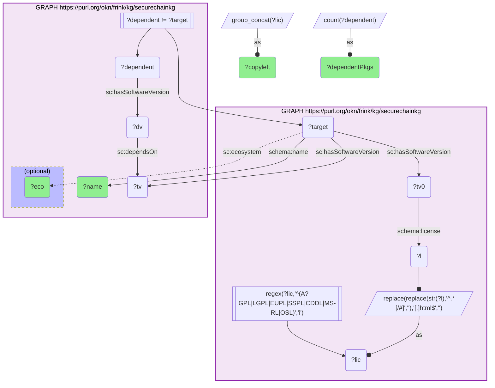

_20 row(s)_

#### Query 17

_2026-07-30T03:41:13+00:00 · `securechainkg`_

```sparql
PREFIX sc: <https://w3id.org/secure-chain/>
SELECT (COUNT(DISTINCT ?v) AS ?cves) (COUNT(DISTINCT ?cwe) AS ?vulnTypes) (COUNT(DISTINCT ?sv) AS ?vulnerableSoftwareVersions)
WHERE {
  GRAPH <https://purl.org/okn/frink/kg/securechainkg> {
    ?v a sc:Vulnerability .
    OPTIONAL { ?v sc:vulnerabilityType ?cwe }
    OPTIONAL { ?sv a sc:SoftwareVersion ; sc:vulnerableTo ?v }
  }
}
```

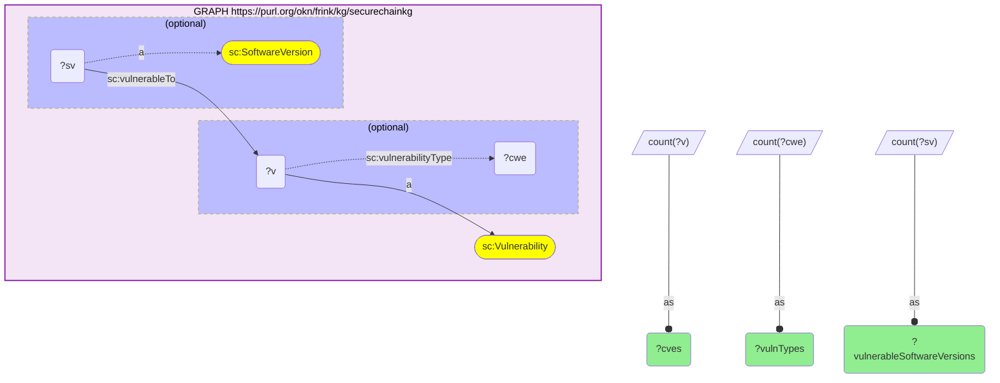

_1 row(s)_

#### Query 18

_2026-07-30T03:41:27+00:00 · `fiokg`_

```sparql
PREFIX frs: <http://w3id.org/fio/v1/epa-frs#>
PREFIX kwg: <http://stko-kwg.geog.ucsb.edu/lod/ontology/>
SELECT (COUNT(DISTINCT ?fips) AS ?counties332) (COUNT(DISTINCT ?fac) AS ?facilities332)
WHERE {
  GRAPH <https://purl.org/okn/frink/kg/fiokg> {
    ?rec frs:ofPrimaryIndustry ?ind .
    BIND(REPLACE(STR(?ind),'^.*naics#NAICS-([0-9]+)$','$1') AS ?naics)
    FILTER(STRSTARTS(?naics,'332') && STRLEN(?naics)=6)
    ?fac frs:hasRecord|frs:hasSupplementalRecord ?rec ; kwg:sfWithin ?reg .
    FILTER(STRSTARTS(STR(?reg),'http://stko-kwg.geog.ucsb.edu/lod/resource/administrativeRegion.USA.'))
    BIND(REPLACE(STR(?reg),'^.*administrativeRegion[.]USA[.]','') AS ?fips)
    FILTER(STRLEN(?fips)=5)
  }
}
```

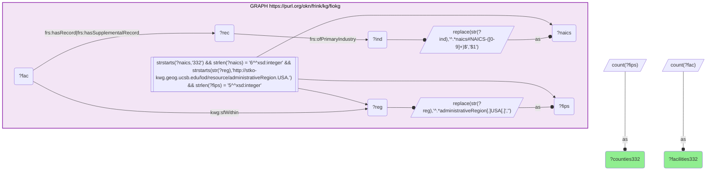

_1 row(s)_

#### Query 19

_2026-07-30T03:41:48+00:00 · `fiokg`, `spatialkg`, `sudokn`_

```sparql
PREFIX S: <http://asu.edu/semantics/SUDOKN/>
PREFIX frs: <http://w3id.org/fio/v1/epa-frs#>
PREFIX kwg: <http://stko-kwg.geog.ucsb.edu/lod/ontology/>
PREFIX rdfs: <http://www.w3.org/2000/01/rdf-schema#>
PREFIX xsd: <http://www.w3.org/2001/XMLSchema#>
SELECT DISTINCT ?stateFips ?stateName ?smmFirms ?smmEmployment ?facilities332
WHERE {
  {
    SELECT ?stateFips (COUNT(DISTINCT ?fac) AS ?facilities332) WHERE {
      GRAPH <https://purl.org/okn/frink/kg/fiokg> {
        ?rec frs:ofPrimaryIndustry ?ind .
        BIND(REPLACE(STR(?ind),'^.*naics#NAICS-([0-9]+)$','$1') AS ?naics)
        FILTER(STRSTARTS(?naics,'332') && STRLEN(?naics)=6)
        ?fac frs:hasRecord|frs:hasSupplementalRecord ?rec ; kwg:sfWithin ?reg .
        FILTER(STRSTARTS(STR(?reg),'http://stko-kwg.geog.ucsb.edu/lod/resource/administrativeRegion.USA.'))
        BIND(REPLACE(STR(?reg),'^.*administrativeRegion[.]USA[.]','') AS ?f5)
        FILTER(STRLEN(?f5)=5)
        BIND(SUBSTR(?f5,1,2) AS ?stateFips)
      }
    } GROUP BY ?stateFips
  }
  GRAPH <https://purl.org/okn/frink/kg/spatialkg> {
    ?sr a kwg:AdministrativeRegion_1 ; kwg:hasFIPS ?stateFips ; rdfs:label ?stateName .
  }
  {
    SELECT ?stateName (COUNT(DISTINCT ?company) AS ?smmFirms) (SUM(?ev) AS ?smmEmployment) WHERE {
      GRAPH <https://purl.org/okn/frink/kg/sudokn> {
        ?company S:hasPrimaryNAICSClassifier ?nc ;
                 S:organizationLocatedIn/S:locatedInState/rdfs:label ?stateName ;
                 S:hasNumberOfEmployees ?e .
        BIND(REPLACE(STR(?nc),'^.*NAICS%20([0-9]+)-individual$','$1') AS ?naics)
        FILTER(STRSTARTS(?naics,'332') && STRLEN(?naics)=6)
        FILTER(REGEX(STR(?e),'^[0-9]+$'))
        BIND(xsd:double(STR(?e)) AS ?ev)
      }
    } GROUP BY ?stateName
  }
}
ORDER BY DESC(?facilities332)
```

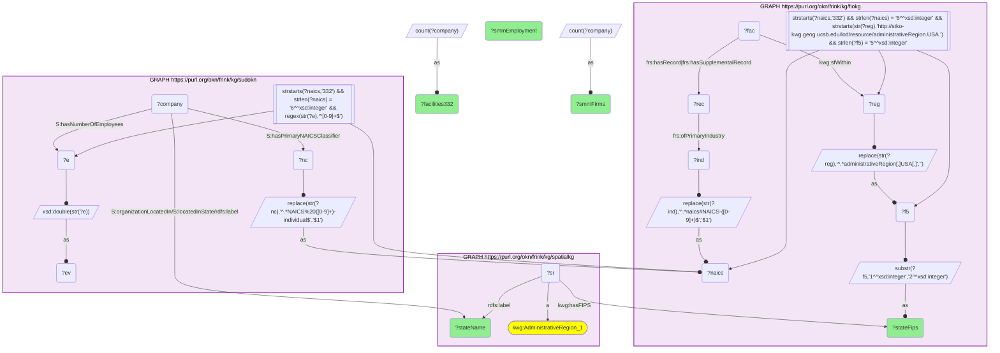

_49 row(s)_

#### Query 20

_2026-07-30T03:42:33+00:00 · `fiokg`, `spoke-okn`_

```sparql
PREFIX sp: <https://purl.org/okn/frink/kg/spoke-okn/schema/>
PREFIX rdf: <http://www.w3.org/1999/02/22-rdf-syntax-ns#>
PREFIX frs: <http://w3id.org/fio/v1/epa-frs#>
PREFIX kwg: <http://stko-kwg.geog.ucsb.edu/lod/ontology/>
PREFIX xsd: <http://www.w3.org/2001/XMLSchema#>
SELECT ?var ?tier (COUNT(DISTINCT ?loc) AS ?counties) (AVG(?num) AS ?mean)
WHERE {
  {
    SELECT ?fips (COUNT(DISTINCT ?fac) AS ?n332) WHERE {
      GRAPH <https://purl.org/okn/frink/kg/fiokg> {
        ?rec frs:ofPrimaryIndustry ?ind .
        BIND(REPLACE(STR(?ind),'^.*naics#NAICS-([0-9]+)$','$1') AS ?naics)
        FILTER(STRSTARTS(?naics,'332') && STRLEN(?naics)=6)
        ?fac frs:hasRecord|frs:hasSupplementalRecord ?rec ; kwg:sfWithin ?reg .
        FILTER(STRSTARTS(STR(?reg),'http://stko-kwg.geog.ucsb.edu/lod/resource/administrativeRegion.USA.'))
        BIND(REPLACE(STR(?reg),'^.*administrativeRegion[.]USA[.]','') AS ?fips)
        FILTER(STRLEN(?fips)=5)
      }
    } GROUP BY ?fips
  }
  {
    SELECT ?fips (COUNT(DISTINCT ?f2) AS ?nAll) WHERE {
      GRAPH <https://purl.org/okn/frink/kg/fiokg> {
        ?f2 a frs:FRS-Facility ; kwg:sfWithin ?reg2 .
        FILTER(STRSTARTS(STR(?reg2),'http://stko-kwg.geog.ucsb.edu/lod/resource/administrativeRegion.USA.'))
        BIND(REPLACE(STR(?reg2),'^.*administrativeRegion[.]USA[.]','') AS ?fips)
        FILTER(STRLEN(?fips)=5)
      }
    } GROUP BY ?fips
  }
  BIND(?n332/?nAll AS ?sh)
  BIND(IF(?sh>=0.02,"A_dependent", IF(?sh>=0.008,"B_moderate","C_marginal")) AS ?tier)
  BIND(IRI(CONCAT('https://purl.org/okn/frink/kg/spoke-okn/location/',?fips)) AS ?loc)
  GRAPH <https://purl.org/okn/frink/kg/spoke-okn> {
    ?stmt rdf:predicate sp:PREVALENCEIN_SpL ; rdf:object ?loc ; sp:variable ?var ; sp:value ?v .
  }
  VALUES ?var { "rural" "poor or fair health" "premature age-adjusted mortality" "life expectancy" "diabetes prevalence" "adult obesity" "adult smoking" "frequent mental distress" "injury deaths" "drug overdose deaths" "primary care physicians" "mental health providers" "broadband access" "some college" "unemployment" "uninsured" "children in poverty" "social associations" "voter turnout" "severe housing problems" "food insecurity" "air pollution - particulate matter" "preventable hospital stays" "Overall(Socioeconomic Status,Household Characteristics,Racial & Ethnic Minority Status,Housing Type & Transportation)" }
  BIND(xsd:double(REPLACE(STR(?v),'^([0-9]+[.]?[0-9]*).*$','$1')) AS ?num)
}
GROUP BY ?var ?tier ORDER BY ?var ?tier
```

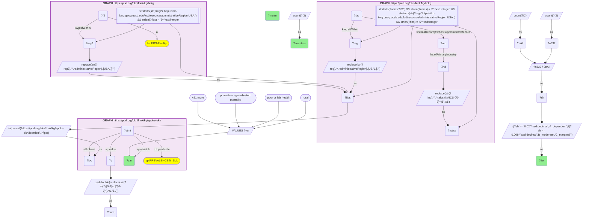

_72 row(s)_

#### Query 21

_2026-07-30T03:43:05+00:00 · `fiokg`, `sudokn`, `spatialkg`_

```sparql
PREFIX S: <http://asu.edu/semantics/SUDOKN/>
PREFIX frs: <http://w3id.org/fio/v1/epa-frs#>
PREFIX kwg: <http://stko-kwg.geog.ucsb.edu/lod/ontology/>
PREFIX rdfs: <http://www.w3.org/2000/01/rdf-schema#>
PREFIX xsd: <http://www.w3.org/2001/XMLSchema#>
SELECT ?naics ?fips ?cname (COUNT(DISTINCT ?company) AS ?firms) (SUM(?ev) AS ?emp)
WHERE {
  {
    SELECT ?zip (SAMPLE(?f5) AS ?fips) WHERE {
      GRAPH <https://purl.org/okn/frink/kg/fiokg> {
        ?rec frs:ofPrimaryIndustry ?ind .
        BIND(REPLACE(STR(?ind),'^.*naics#NAICS-([0-9]+)$','$1') AS ?nc0)
        FILTER(STRSTARTS(?nc0,'33') && STRLEN(?nc0)=6)
        ?fac frs:hasRecord|frs:hasSupplementalRecord ?rec ; kwg:sfWithin ?reg ; ?ap ?addr .
        FILTER(STRENDS(STR(?ap),'schema.org/address'))
        FILTER(STRSTARTS(STR(?reg),'http://stko-kwg.geog.ucsb.edu/lod/resource/administrativeRegion.USA.'))
        BIND(REPLACE(STR(?reg),'^.*administrativeRegion[.]USA[.]','') AS ?f5)
        FILTER(STRLEN(?f5)=5)
        BIND(REPLACE(STR(?addr),'^.*[^0-9]([0-9]{5})(-[0-9]{4})?[^0-9]*(US)?\\s*$','$1') AS ?zip)
        FILTER(STRLEN(?zip)=5)
      }
    } GROUP BY ?zip HAVING(COUNT(DISTINCT ?f5)=1)
  }
  GRAPH <https://purl.org/okn/frink/kg/sudokn> {
    BIND(IRI(CONCAT('https://schema.org/','postalCode')) AS ?pp)
    ?company S:hasPrimaryNAICSClassifier ?ncl ; S:organizationLocatedIn ?a .
    ?a ?pp ?z0 .
    BIND(REPLACE(STR(?ncl),'^.*NAICS%20([0-9]+)-individual$','$1') AS ?naics)
    BIND(REPLACE(STR(?z0),'[^0-9]','') AS ?d)
    BIND(IF(STRLEN(?d)=4, CONCAT('0',?d), SUBSTR(?d,1,5)) AS ?zip)
    OPTIONAL { ?company S:hasNumberOfEmployees ?e FILTER(REGEX(STR(?e),'^[0-9]+$')) BIND(xsd:double(STR(?e)) AS ?ev) }
  }
  VALUES ?naics { "332811" "332111" "332722" "332911" "332912" "332996" "332813" "332721" }
  BIND(IRI(CONCAT('http://stko-kwg.geog.ucsb.edu/lod/resource/administrativeRegion.USA.',?fips)) AS ?r3)
  GRAPH <https://purl.org/okn/frink/kg/spatialkg> { ?r3 rdfs:label ?cname }
}
GROUP BY ?naics ?fips ?cname
HAVING(COUNT(DISTINCT ?company) >= 6)
ORDER BY ?naics DESC(?firms)
```

```mermaid
graph TD
classDef projected fill:lightgreen;
classDef literal fill:orange;
classDef iri fill:yellow;
  q20v27("?a")
  q20v18("?addr")
  q20v15("?ap")
  q20v3("?cname"):::projected 
  q20v26("?company")
  q20v22("?d")
  q20v29("?e")
  q20v1("?emp"):::projected 
  q20v28("?ev")
  q20v17("?f5")
  q20v21("?fac")
  q20v4("?fips"):::projected 
  q20v2("?firms"):::projected 
  q20v19("?ind")
  q20v5("?naics"):::projected 
  q20v14("?nc0")
  q20v24("?ncl")
  q20v25("?pp")
  q20v12("?r3")
  q20v20("?rec")
  q20v16("?reg")
  q20v23("?z0")
  q20v13("?zip")
  q20f0[["sample(?zip) >= '6^^xsd:integer'"]]
  q20f1[["count(?f5) = '1^^xsd:integer'"]]
  subgraph q20graph0["GRAPH https://purl.org/okn/frink/kg/fiokg"]
    style q20graph0 fill:#f3e5f5,stroke:#8e24aa,stroke-width:2px,color:#000;
    q20graph0f2[["strstarts(?nc0,'33') && strlen(?nc0) = '6^^xsd:integer' && strends(str(?ap),'schema.org/address') && strstarts(str(?reg),'http://stko-kwg.geog.ucsb.edu/lod/resource/administrativeRegion.USA.') && strlen(?f5) = '5^^xsd:integer' && strlen(?zip) = '5^^xsd:integer'"]]
    q20graph0f2 --> q20v14
    q20graph0f2 --> q20v15
    q20graph0f2 --> q20v16
    q20graph0f2 --> q20v17
    q20graph0f2 --> q20v13
    q20v20 --"frs:ofPrimaryIndustry"--> q20v19
    q20graph0bind0[/"replace(str(?ind),'^.*naics#NAICS-(#91;0-9#93;+)$','$1')"/]
    q20v19 --o q20graph0bind0
    q20graph0bind0 --as--o q20v14
    q20v21 --"frs:hasRecord|frs:hasSupplementalRecord"--> q20v20
    q20v21 --"kwg:sfWithin"--> q20v16
    q20v21 -->q20v15--> q20v18
    q20graph0bind1[/"replace(str(?reg),'^.*administrativeRegion#91;.#93;USA#91;.#93;','')"/]
    q20v16 --o q20graph0bind1
    q20graph0bind1 --as--o q20v17
    q20graph0bind2[/"replace(str(?addr),'^.*#91;^0-9#93;(#91;0-9#93;{5})(-#91;0-9#93;{4})?#91;^0-9#93;*(US)?\s*$','$1')"/]
    q20v18 --o q20graph0bind2
    q20graph0bind2 --as--o q20v13
  end
  subgraph q20graph1["GRAPH https://purl.org/okn/frink/kg/sudokn"]
    style q20graph1 fill:#f3e5f5,stroke:#8e24aa,stroke-width:2px,color:#000;
    q20graph1bind3[/"iri(concat('https://schema.org/','postalCode'))"/]
    q20graph1bind3 --as--o q20v25
    q20v26 --"S:organizationLocatedIn"--> q20v27
    q20v26 --"S:hasPrimaryNAICSClassifier"--> q20v24
    q20v27 -->q20v25--> q20v23
    q20graph1bind4[/"replace(str(?ncl),'^.*NAICS%20(#91;0-9#93;+)-individual$','$1')"/]
    q20v24 --o q20graph1bind4
    q20graph1bind4 --as--o q20v5
    q20graph1bind5[/"replace(str(?z0),'#91;^0-9#93;','')"/]
    q20v23 --o q20graph1bind5
    q20graph1bind5 --as--o q20v22
    q20graph1bind6[/"if(strlen(?d) = '4^^xsd:integer',concat('0',?d),substr(?d,'1^^xsd:integer','5^^xsd:integer'))"/]
    q20v22 --o q20graph1bind6
    q20graph1bind6 --as--o q20v13
    subgraph q20optionalgraph10["(optional)"]
    style q20optionalgraph10 fill:#bbf,stroke-dasharray: 5 5,color:#000;
      q20v26 -."S:hasNumberOfEmployees".-> q20v29
      q20graph1bind7[/"xsd:double(str(?e))"/]
      q20v29 --o q20graph1bind7
      q20graph1bind7 --as--o q20v28
    end
  end
  q20bind8[/"VALUES ?naics"/]
  q20bind8-->q20v5
  q20bind80(["332811"])
  q20bind80 --> q20bind8
  q20bind81(["332111"])
  q20bind81 --> q20bind8
  q20bind82(["332722"])
  q20bind82 --> q20bind8
  q20bind8more([+5 more])
  q20bind8more --> q20bind8
  q20bind9[/"iri(concat('http://stko-kwg.geog.ucsb.edu/lod/resource/administrativeRegion.USA.',?fips))"/]
  q20v4 --o q20bind9
  q20bind9 --as--o q20v12
  subgraph q20graph2["GRAPH https://purl.org/okn/frink/kg/spatialkg"]
    style q20graph2 fill:#f3e5f5,stroke:#8e24aa,stroke-width:2px,color:#000;
    q20v12 --"rdfs:label"--> q20v3
  end
  q20bind10[/"count(?f5)"/]
  q20bind10 --as--o q20v1
```

_50 row(s)_
