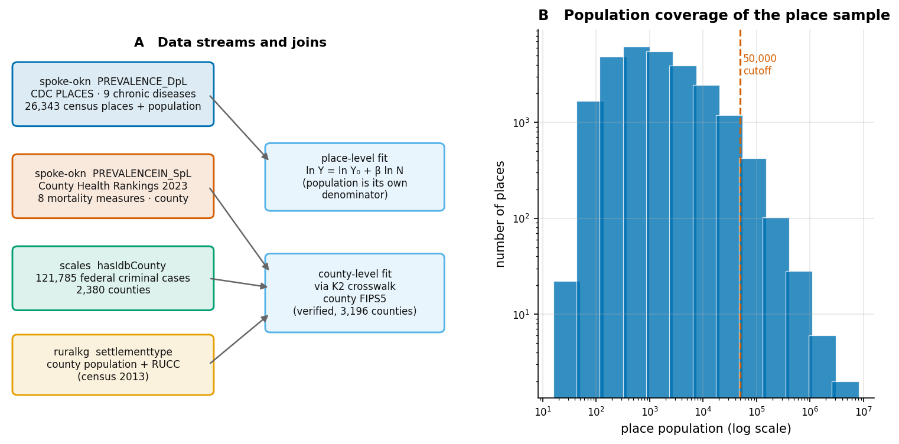
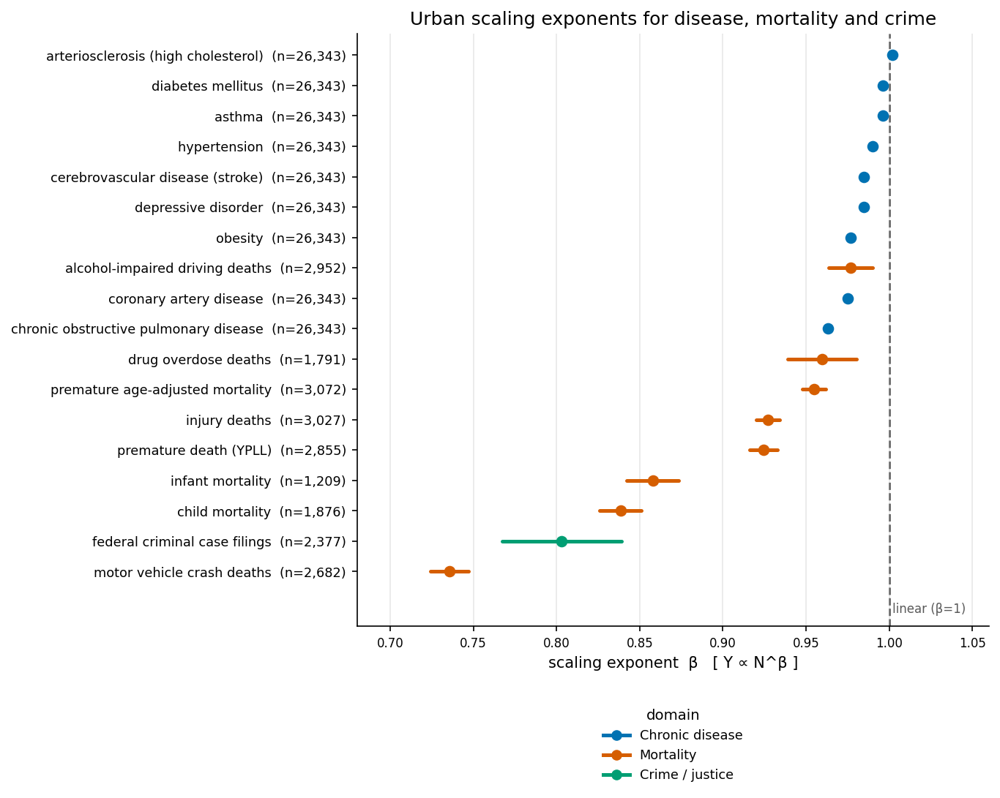
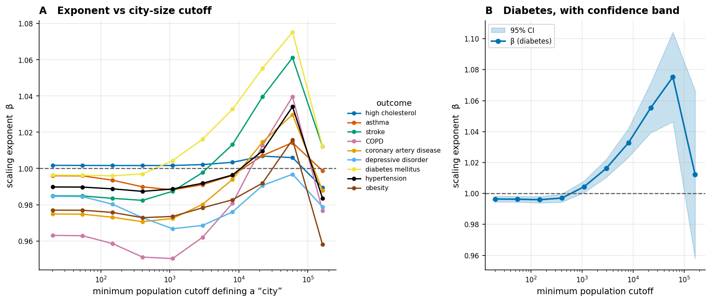
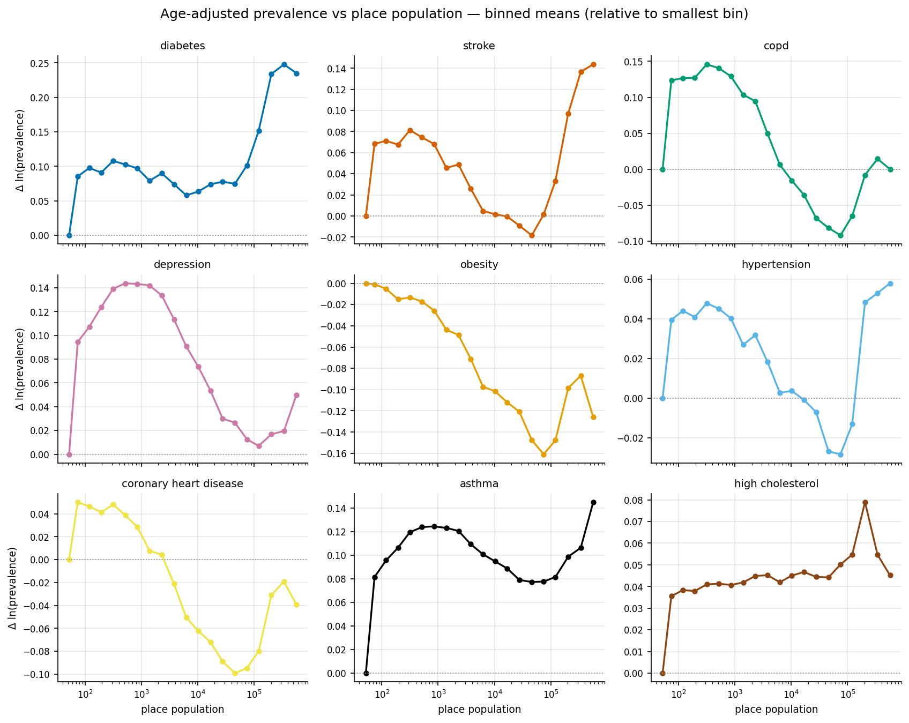
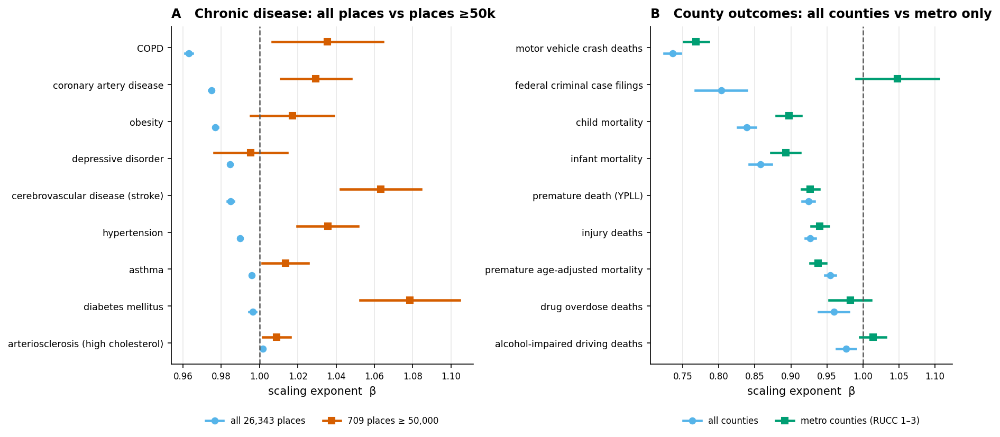

# Urban Scaling of Disease, Mortality and Crime in the United States
### Power-law scaling analysis of 18 health and justice outcomes across US census places and counties, on the OKN federated SPARQL endpoint

**Date:** 2026-07-26 · **Endpoint:** OKN federated SPARQL · **Model:** claude-opus-5

> **Framing (non-negotiable).** Cross-sectional ecological analysis of US **census places** (n = 26,343) and **counties** (up to 3,072 per outcome, from 3,196 joinable county nodes), using model-based small-area health estimates, county vital-statistics summaries and federal court records. Level of inference is **population-level association between settlement size and outcome burden** — not individual risk, and not causal. Every exponent below describes how a *count* co-varies with population **across places at one point in time**; it does not describe what happens to a given city as it grows. Keep this caveat attached to every downstream claim.

**Abbreviations.** β = scaling exponent in Y ∝ N^β; N = population; Y = outcome count; CI = confidence interval; OLS = ordinary least squares; CDC PLACES = CDC Population Level Analysis and Community Estimates; CHR = County Health Rankings; YPLL = years of potential life lost (before age 75); RUCC = Rural–Urban Continuum Code; FIPS = Federal Information Processing Standards (geographic code); CBSA = Core Based Statistical Area; IDB = Integrated Database (federal court records); MAUP = modifiable areal unit problem; KG = knowledge graph; MRP = multilevel regression and poststratification; NCD = non-communicable disease.

---

## 1. Executive summary

Across 18 outcomes assembled from 3 OKN knowledge graphs, **there is no single urban scaling law for health**. The outcomes separate into three regimes. The separation is not a matter of statistical power: the place-level exponents are estimated to within a few thousandths and the county-level ones to within roughly one to four hundredths, so the differences between regimes are far larger than the uncertainty on any individual estimate.

**Mortality scales robustly sublinearly.** Larger US counties have systematically *fewer* deaths than proportionality predicts, and this is the one result that survives every robustness test applied. Premature death (YPLL) scales as β = **0.924**, child mortality at 0.839, infant mortality at 0.858, and motor-vehicle crash deaths most steeply of all at β = **0.736** — a county ten times larger has roughly **45.6%** fewer road deaths per capita. Six of the eight mortality measures keep the same direction and significance when the sample is restricted to metropolitan counties; the two exceptions, drug-overdose and alcohol-impaired driving deaths, lose significance in the smaller sample rather than changing direction. This is the classic "urban health advantage," and it is the finding a reader should take away with most confidence.

**Chronic-disease scaling depends entirely on the minimum size required of a "city".** Fitted over all 26,343 census places, the nine chronic conditions look mildly sublinear or linear (β = 0.963–1.002). Restricted to the 709 places above 50,000 people — closer to what the urban-scaling literature means by a "city" — six of the nine flip to **superlinear**: diabetes rises from β = 0.996 to **1.078**, stroke from 0.985 to **1.063**. A threshold ladder (Figure 3) shows the exponent climbing as the size cutoff rises — substantially, though not monotonically. The exponent here is a property of the *size cutoff used to define a city*, not of the urban system, and we grade all six of these outcomes Tier C accordingly.

**Crime is the weakest result, and it does not reproduce the canonical superlinearity.** Federal criminal case filings scale at β = **0.803** over all counties but at **1.048** (CI 0.990–1.105, indistinguishable from linear) among metropolitan counties. Federal caseload is a poor proxy for crime — it is driven by prosecutorial jurisdiction, border districts and tribal-land coverage — and its rate regression explains under 5% of variance. We report it as a bounded null, not as a refutation of the literature's β ≈ 1.16 for local violent crime.

The overarching quantitative caution: **population size explains very little of the variance in outcome rates**. Across all 18 series the rate-regression R² ranges from 0.0005 to 0.439; only motor-vehicle deaths exceed 0.30. Scaling exponents can be precise and still describe a weak relationship, and the two properties are routinely conflated.

## 2. Sources used

| KG | Version | Updated | Role in this study | Join key / confidence |
|---|---|---|---|---|
| `spoke-okn` | v0.0.6 | 2026-03-16 | CDC PLACES age-adjusted prevalence for 9 chronic conditions across 26,343 census places, each carrying its own `total_population`; County Health Rankings 2023 mortality measures on county nodes | place node IRI (state+place FIPS) carries its own denominator; county node IRI = 5-digit county FIPS. High confidence |
| `ruralkg` | v0.2.7 | 2026-06-08 | County population denominators (census 2013) and Rural–Urban Continuum Codes used to define the metropolitan subsample | `settlementtype:censusCounty` → KWG `administrativeRegion.USA.{FIPS5}`. High confidence — crosswalk K2, verified 3,196 counties |
| `scales` | v0.0.22 | 2026-03-18 | 121,785 federal criminal case filings attributed to a county of origin, aggregated to per-county counts | `scales:hasIdbCounty` numeric IDB code → zero-padded 5-digit FIPS. Moderate confidence — see §3 |

No other knowledge graph contributed a number to this report. Graphs inspected during scoping but not used (`nikg`, single-city Philadelphia incident data; `biohealth`; `spatialkg`) have no logged query and therefore no row here.

## 3. Design & rules

The analysis estimates the urban scaling exponent β in **Y ∝ N^β**, where N is settlement population and Y is the *count* of an outcome. β = 1 means the outcome is a fixed share of population; β > 1 (superlinear) means larger settlements bear disproportionately more; β < 1 (sublinear) disproportionately less.

Two design choices deserve a reader's attention. First, **the OKN sources supply rates, not counts**, so counts are reconstructed as rate × population. This makes population appear on both sides of the regression, which mechanically forces the count-regression R² close to 1 — a well-known trap. We therefore report the **rate-regression R²** (of ln(Y/N) on ln N, whose slope is exactly β − 1) as the honest measure of explanatory power, and never quote the count R². Second, **`spoke-okn` place records carry their own population field**, so the place-level analysis needs no cross-graph join at all; only the county-level arms join to `ruralkg`, using the federation's pre-verified K2 county-FIPS crosswalk rather than a hand-built key.

Because the endpoint is QLever and supports `math:log`, all regressions were computed from **sufficient statistics aggregated server-side** — n, Σx, Σy, Σx², Σxy, Σy² per outcome — rather than by extracting 237,087 rows. The closed form is algebraically exact; the practical limit is that the endpoint returns each sum at six significant figures, which propagates ~10⁻⁴ into β (quantified in §6.3). That is immaterial for the county arms, whose standard errors are 4–40 times larger, but it is a non-trivial fraction of the place-arm standard errors and is carried as limitation 7.

The crime arm carries a structural caveat that no statistic can repair. `scales` records **federal** district-court cases; the vast majority of US crime is prosecuted in state courts. Federal caseload therefore reflects federal enforcement priorities and district geography — immigration cases concentrate on the southern border, and federal jurisdiction over tribal land inflates counts in otherwise small counties. We keep the arm because it is the only cross-county justice measure in the federation, and grade it accordingly.

Inventory rebuilt live from the logged queries:

| Arm | Unit | Outcomes | Units analysed | Population range |
|---|---|---|---|---|
| Chronic disease | census place | 9 | 26,343 per outcome | 50 – 8,175,111 |
| Mortality | county | 8 | 1,209 – 3,072 per outcome | ~100 – ~9.8 M |
| Crime / justice | county | 1 | 2,377 | ~100 – ~9.8 M |

> ***Figure 1. Study design and population coverage (spoke-okn, ruralkg, scales).*** **(A)** The four data streams and how they reach the two regression arms; the place arm is self-contained within `spoke-okn` because CDC PLACES records carry `total_population`, while the county arms join to `ruralkg` population via the verified K2 county-FIPS crosswalk. **(B)** Distribution of the 26,343 census places by population (log–log), with the 50,000 cutoff used in §5.2 marked. Provenance: `spoke-okn` `PREVALENCE_DpL` / `PREVALENCEIN_SpL`, `ruralkg` `settlementtype`, `scales` `hasIdbCounty`.

The place sample spans more than five orders of magnitude of population, but panel (B) shows the mass sits between 100 and 10,000 — only 709 places exceed 50,000. Any exponent fitted over the whole range is therefore dominated by small settlements, which is precisely the sensitivity §5.2 exploits.

## 4. Confidence tiers

Tiers grade **how stable an exponent is under a change in the definition of a city**, not how precisely it was measured — every exponent here is precise. Each outcome was re-fitted on a restricted sample (places ≥ 50,000; or metropolitan counties, RUCC 1–3) and compared with the full-sample fit.

| Tier | Requirement | Interpretation |
|---|---|---|
| **A** | Same direction and significant in both the full and restricted samples | The scaling behaviour is a robust property of the outcome |
| **B** | Direction stable but statistical significance changes between samples | Suggestive; the restricted sample is underpowered or the effect is marginal |
| **C** | Direction **reverses** between samples (sublinear ↔ superlinear) | The exponent is an artefact of the city definition; no stable scaling law |

Two honest caveats about this scheme. The restricted samples are 10–37× smaller than the full ones, so their standard errors are 6–18× wider; a Tier B grade can therefore reflect lost statistical power rather than a genuinely marginal effect. And the tiers are assigned by whether each sample's CI crosses 1, not by a formal test of whether β differs *between* samples — no such test was performed. Distribution across the 18 series: **Tier A = 7**, **Tier B = 5**, **Tier C = 6**. Every Tier A result is a mortality measure except one; every Tier C result is a chronic disease. That split is the report's central finding.

## 5. Findings by axis

### 5.1 Primary signal — the exponent spectrum

Fitted over the full sample, the 18 outcomes span β = 0.736 to 1.002. Only one outcome is classified superlinear in the full sample — high cholesterol, β = 1.0017 (CI 1.0012–1.0023) — and it exceeds linearity by less than a fifth of a percent. With n = 26,343 a deviation that small is comfortably detectable, so the classification is statistically correct but substantively negligible; we read it as linear throughout the discussion.

> ***Figure 2. Urban scaling exponents with 95% confidence intervals (spoke-okn, ruralkg, scales).*** Each outcome's β from OLS of ln(count) on ln(population), full sample; point = estimate, bar = 95% CI, dashed line = linear scaling (β = 1). Colour encodes domain. Sample size n is given per row. Provenance: chronic disease from `spoke-okn` `PREVALENCE_DpL` (CDC PLACES); mortality from `spoke-okn` `PREVALENCEIN_SpL` (County Health Rankings 2023) joined to `ruralkg` population; crime from `scales` `hasIdbCounty` counts joined to `ruralkg` population.

The ordering is informative. The steepest sublinear scaling belongs to **motor-vehicle crash deaths** (β = 0.736) and **federal criminal filings** (β = 0.803) — both plausibly geographic rather than epidemiological, reflecting rural road exposure and federal district structure respectively. Child and infant mortality follow (0.839, 0.858), then the broad mortality measures near 0.92–0.96, then the chronic diseases clustered tightly just below 1. The chronic-disease cluster's tightness against β = 1 is exactly what one expects when the outcome is a near-constant fraction of the population — and it is what the next axis dismantles.

### 5.2 City definition — the exponent is not a fixed property

Re-fitting each chronic condition on progressively larger minimum-population cutoffs produces a systematic drift, not noise.

> ***Figure 3. Scaling exponent as a function of the minimum-population cutoff defining a "city" (spoke-okn).*** **(A)** β for each of the nine chronic conditions, re-fitted on the subsample of places at or above each cutoff (cutoffs are e-folding band boundaries; x-axis logarithmic). **(B)** Diabetes alone with its 95% confidence band, showing the drift is far larger than the sampling uncertainty until the final cutoff, where only 139 places remain. Dashed line = β = 1. Provenance: `spoke-okn` `PREVALENCE_DpL`; sufficient statistics aggregated per e-folding population band and cumulated from the top, so every cutoff is an exact refit rather than an interpolation.

All nine curves rise substantially between the lowest and the highest usable cutoff, and **eight** of the nine cross β = 1 at some cutoff — only depression stays below 1 throughout. None rises monotonically, however: each dips across part of the small-place range — asthma from 0.996 to 0.988, depression from 0.985 to 0.967 — before climbing, so the curves are V-shaped in the cutoff rather than steadily increasing. Diabetes moves from 0.996 across all places to 1.075 at a ~60,000 cutoff (and 1.078 in the separate ≥50,000 refit reported in §5.4) — a swing far outside any single fit's confidence interval. The drop at the last cutoff reflects n falling to 139 places and should not be read as a reversal. Note also that the rungs are **nested subsamples**, not ten independent observations, so the ladder is one coherent piece of evidence rather than ten. The practical implication is blunt: **an analyst who defines "city" as population ≥ 50,000 will report superlinear chronic-disease scaling, and one who includes all census places will report sublinear scaling, from identical data.**

### 5.3 Functional form — the relationship is not a power law

The drift in §5.2 has a direct explanation: the log–log relationship is curved, so no single exponent describes it.

> ***Figure 4. Binned mean log-prevalence against place population, nine chronic conditions (spoke-okn).*** Each panel plots the mean of ln(age-adjusted prevalence) within half-log-unit population bins, expressed relative to the smallest bin so panels are comparable; x-axis logarithmic; bins with n < 20 places are omitted. Provenance: `spoke-okn` `PREVALENCE_DpL`, grouped server-side by `FLOOR(ln(population)×2)`.

Diabetes and stroke trace a clear **U-shape**: prevalence declines gently through small and mid-sized places, reaches a minimum somewhere around 30,000–100,000, then rises sharply among the largest cities, and both have positive fitted curvature (diabetes significantly so, stroke marginally). Hypertension and asthma show the same late upturn in the binned means, but their fitted *global* curvature is significantly **negative** — so for those two the upturn is a local feature of the large-city tail, not the shape of the whole curve, and calling them U-shaped would misdescribe the fit. Obesity and depression decline over most of the range. A quadratic term in ln N is statistically significant for six of nine conditions; with n = 26,343 that test is close to vacuous on its own, and the global quadratic disagrees in sign with the size-stratified fits for several conditions. The stratified estimates in §5.2 are therefore the primary evidence and the quadratic is reported only as a test *against* the power-law form, not as a source of local exponents.

### 5.4 Robustness — restricted samples

> ***Figure 5. Full sample versus restricted sample (spoke-okn, ruralkg, scales).*** **(A)** Chronic disease: all 26,343 places (circles) against the 709 places ≥ 50,000 (squares). **(B)** County outcomes: all counties (circles) against metropolitan counties only, RUCC 1–3 (squares). Bars are 95% CIs; dashed line = β = 1. CIs in the full-sample chronic-disease arm are narrower than the plotting symbol. Provenance: as Figure 2, with the RUCC restriction taken from `ruralkg` `settlementtype:hasRUCC`.

Panel (A) is the Tier C result made visual: every chronic condition moves right, and six cross the line. Panel (B) is the Tier A result: the mortality measures barely move, holding their direction and significance, with only drug-overdose and alcohol-impaired driving deaths losing significance in the smaller metropolitan sample. Federal criminal filings move furthest of all — from clearly sublinear to indistinguishable from linear — which is consistent with the jurisdictional confound in §3 rather than with a genuine scaling effect.

## 6. Domain analyses

### 6.1 Mortality — the urban health advantage

The six mortality measures at Tier A form the report's most defensible claim. Reading β − 1 as a rate elasticity — a comparison between counties, not a change within one — a county ten times larger than another has on average a **16.0% lower premature-death rate**, **31.1% lower child mortality**, **27.9% lower infant mortality**, and **45.6% lower motor-vehicle death rate**. The gradient is steepest for causes with a strong exposure component (road deaths) and for outcomes sensitive to healthcare access (infant and child mortality), and shallowest for the broad age-adjusted mortality measure. This ordering is consistent with a services-and-access explanation — larger counties concentrate hospitals, trauma centres and specialist care, and have less per-capita exposure to high-speed rural road travel — but no covariate measuring access or road exposure was entered into any model here, so that reading is a hypothesis suggested by the ordering, not a result of it.

Two of the eight CHR measures are **excluded from the count-scaling interpretation** and reported only as rate elasticities: *alcohol-impaired driving deaths* is a proportion (share of driving deaths), not a population rate, so multiplying by population does not yield a count; and *infant mortality* uses live births rather than population as its denominator, making its reconstructed count approximate. *Child mortality* has the same denominator caveat in weaker form. These are flagged rather than dropped because their direction is consistent with the rest of the family.

### 6.2 Chronic disease — a definition-dependent result

We ran the scaling fit for all nine conditions available in CDC PLACES via `spoke-okn`; none was skipped. The full-sample result (mild sublinearity) and the restricted-sample result (superlinearity for six of nine) are both reported because neither is privileged — the honest statement is that chronic-disease scaling in these data is **not identified** without a prior commitment to what counts as a city.

One mechanism deserves flagging as a limitation rather than a finding. CDC PLACES estimates are **model-based small-area estimates** produced by multilevel regression and poststratification, which borrow strength from demographic and socioeconomic covariates. Where those covariates themselves vary with settlement size, some of the apparent size gradient may be induced by the estimation model rather than observed. This does not affect the *relative* comparison between cutoffs in §5.2 — the same estimates are used throughout — but it does mean the absolute exponents should not be treated as if they came from direct measurement.

### 6.3 Method verification

The sufficient-statistics approach was checked against a direct fit on extracted rows. For diabetes in the 139 places above 162,755 population, a client-side OLS on the raw (population, prevalence) pairs gives β = 1.012098 (SE 0.027505); the sufficient-statistics route on the same rows gives β = 1.012098 (SE 0.027505), agreeing to 6.4 × 10⁻¹⁵. The independently aggregated SPARQL band-ladder gives β = 1.012227, differing by 1.3 × 10⁻⁴ — attributable to the endpoint returning sums at six significant figures, and negligible against a standard error of 0.027.

## 7. Discussion

The three regimes point to different mechanisms, and the report's structure is an argument that they should not be pooled into a single "urban scaling law for health."

Mortality's robust sublinearity is most readily interpreted as an **infrastructure and access pattern** (untested here, since no such covariate entered the models). It behaves like the classic sublinear urban quantities — road length, infrastructure per capita — rather than like the superlinear socioeconomic ones, and it is insensitive to how the urban unit is drawn, which is what one expects of an effect operating through service provision rather than through interaction density.

Chronic disease's instability is best read as a **measurement result rather than a substantive one**. The U-shape in Figure 4 suggests two opposing gradients: a socioeconomic gradient making mid-sized suburban places healthier than small rural ones, and a large-city gradient — deprivation, segregation, the concentration of poverty in central cities — accompanying the rise in prevalence above roughly 100,000. Census places cut through functional metropolitan areas, separating central cities from their suburbs; a metropolitan-area analysis would pool them and could plausibly show neither pattern.

This yields three testable predictions. First, **re-running the chronic-disease arm on CBSA-aggregated metropolitan areas should attenuate the superlinearity** seen above 50,000, because the central-city/suburb split is what generates it. Second, **conditioning on median household income or the Gini index — both present in `spoke-okn`'s SDoH layer — should absorb most of the large-city rise** in diabetes and stroke. Third, **an infectious-disease outcome, if one were added to the federation at place level, should show superlinearity that is stable across cutoffs**, since contact-driven transmission is the mechanism the superlinear literature actually describes, and chronic disease is not.

## 8. Comparison with prior work

Claims were checked against the primary literature retrieved through the PubMed and Paperclip MCP connectors. The full per-claim record, with citations, is in `Urban-Scaling_literature_comparison.md`.

| # | Claim | Concordance |
|---|---|---|
| 1 | All-cause / premature mortality scales sublinearly with city size in the US (β ≈ 0.92–0.96) | **SUPPORTED** — Bilal et al. analysed 742 metropolitan areas across the Americas and found more populated cities had lower mortality, with the sublinear pattern driven specifically by US cities; our county-level β = 0.924 for YPLL sits in the same regime [1]. Direction agrees; magnitude is not comparable, since they fit metropolitan areas ≥100,000 and we fit counties across the full size range — a unit difference this report elsewhere argues can move exponents |
| 2 | Non-communicable chronic disease burden is sublinear-to-linear in the US, not superlinear | **PARTIALLY SUPPORTED** — Bilal et al. report NCD deaths as generally sublinear in the US, matching our full-sample fits; but our restricted-sample fits turn superlinear, and the scoping review of 102 studies characterises NCDs as heterogeneous and outcome-dependent rather than settled in either direction [1][2] |
| 3 | Scaling exponents are not universal constants but depend materially on how cities are delimited | **PARTIALLY SUPPORTED** — Arcaute et al. and Cottineau et al. showed exponents depend non-trivially on how cities are *constructed* from census areal data, by rebuilding systems of cities from commuting and density thresholds [3][4]. Our ladder changes only the inclusion cutoff on a fixed census-place geography — sample truncation, not re-aggregation — so it is an analogous sensitivity rather than the same operation |
| 4 | The population–outcome relationship departs from a single power law, with a regime change separating rural from urban settlements | **PARTIALLY SUPPORTED** — Sutton et al. found a segmented power law with a consistent breakpoint best described 92 of 117 indicators in England and Wales, and Hanley et al. found four distinct regimes with rural-to-urban transitions [5][6]. Both are **density**-space analyses in England and Wales with a segmented functional form; ours is population-space, US, and curved rather than segmented. The shared claim is that one exponent does not fit — the breakpoints are not comparable, and two of our four apparent U-shapes have significantly negative fitted curvature (§5.3) |
| 5 | Crime scales superlinearly with city size (β ≈ 1.16) | **UNRESOLVED** — the literature reports superlinear scaling for serious and property crime across many countries [7][8], but our federal-court proxy (β = 0.803 overall, 1.048 in metro counties) cannot test it: federal filings measure prosecutorial jurisdiction, not local crime. We report a bounded null, not a contradiction |
| 6 | Motor-vehicle / traffic death scaling is steeply sublinear | **PARTIALLY SUPPORTED** — our β = 0.736 is the steepest gradient in the study, but the scoping review found traffic-related injuries show no clear pattern and differ by context and injury type, so a single steep exponent is not the settled literature position [2] |
| 7 | Larger cities show a protective effect for chronic disease in older populations | **UNRESOLVED** — Sutton et al. report a "protective urban effect" when stratifying dementia and ischaemic heart disease by age 70+ [5]. We cannot corroborate it: our coronary and stroke fits are age-adjusted across all adults rather than stratified to 70+, and both are **Tier C** rows whose direction reverses under restriction (0.975 → 1.029; 0.985 → 1.063) — §6.2 declares chronic-disease scaling not identified, so it cannot be evidence for this claim |
| 8 | Cross-sectional scaling exponents describe differences between cities, not the trajectory of a growing city | **SUPPORTED** — Marquis and Barthelemy argue cross-sectional scaling laws reflect population heterogeneity across cities rather than individual city dynamics, which is the basis of this report's framing caveat [9] |
| 9 | Suicide and self-harm mortality are more common in smaller settlements | **UNRESOLVED** — the scoping review reports suicides as more common in smaller cities [2], but `spoke-okn` carries no county-level suicide-rate variable, so this analysis could not test it |
| 10 | Population size is a weak predictor of outcome *rates* even when the exponent is precisely estimated | **PARTIALLY SUPPORTED** — the underlying mechanism is not new: spurious correlation from a shared denominator dates to Pearson (1897), and Arcaute et al. argue directly that population alone poorly predicts a city's state [3]. What we found no source doing is **reporting the rate-regression R² alongside a published scaling exponent** as a routine diagnostic; our values of 0.0005–0.439 are offered as a reporting recommendation, not a discovery |

Claims 1, 2 and 5 were checked against full article text; the remainder were assessed from abstracts and, for claims 3 and 4, from the papers' reported conclusions. Four labels were downgraded during review (claims 3, 4, 7 and 10) after checking whether the cited work performed the same operation as this analysis — in each case it did not, and the reasons are in the Concordance cells.

**Where the KG evidence diverges from the literature.** Two divergences are matters of **scope**, not error. Our crime result (claim 5) diverges because `scales` measures a different object than the literature's police-recorded crime — a data-coverage limitation of the federation, not a contradiction of prior findings, and the honest response is the UNRESOLVED label rather than a claim of refutation. Our chronic-disease result (claim 2) diverges from itself depending on the cutoff, which the literature (claims 3, 4) predicts it should. We found **no evidence of an error in the underlying graphs**: the one genuine data-quality observation is that `spoke-okn`'s `PREVALENCEIN_SpL` stores County Health Rankings values in two different string encodings — bare numerics and `value(quartile)` pairs — within the same predicate, which silently drops five of eight mortality measures from any query that assumes a single format. That is a parsing hazard rather than a factual error, and is documented in the reproducibility record.

## 9. Full ranked results

The complete table of 18 fitted series — with exponents, confidence intervals, rate elasticities, honest R², restricted-sample refits and tier assignments — is in `Urban-Scaling_results.xlsx` (sheet *Ranked Results*) and `data/ranked_results.csv`. The threshold-ladder refits and the per-band sufficient statistics are in the same workbook.

Sort by any column, filter with the search box, or use the drop-downs to isolate a tier, a domain or a geographic level. The `sources (n)` column shows how many federation graphs each row depends on: `spoke-okn` supplies every outcome measurement, `ruralkg` the county population denominators and RUCC classification, and `scales` the crime counts.

<!-- RESULTS_TABLE -->

The ranking makes the tier structure legible: the six Tier C rows are all chronic diseases whose direction reverses between samples, and they cluster tightly around β ≈ 0.96–1.00 in the full sample — close enough to linearity that a reader seeing only the full-sample column would reasonably conclude "chronic disease scales linearly," which §5.2 shows to be an artefact. The Tier A block, by contrast, spans β = 0.736 to 1.002 and holds its ordering under restriction.

## 10. Summary of findings & limitations

**Findings recap.** Mortality in US counties scales **sublinearly** with population, robustly and across every measure tested: premature death at β = 0.924, child mortality at 0.839, motor-vehicle crash deaths at 0.736. This is the study's Tier A result and it corroborates the published finding that larger US cities have lower mortality. Chronic-disease scaling is **not identified** without a prior minimum size for a "city": the same nine CDC PLACES conditions give β = 0.963–1.002 across all 26,343 census places but β = 0.995–1.078 across the 709 places above 50,000, with six of nine reversing direction, and eight of nine crossing β = 1 somewhere on the threshold ladder. Crime, measured through federal court filings, gives β = 0.803 overall and 1.048 among metropolitan counties, and is too confounded by federal jurisdiction to test the literature's superlinear finding. Across all 18 series, population explains between 0.0005 and 0.439 of the variance in outcome rates.

**Limitations.**

1. **Ecological, cross-sectional, non-causal.** These are associations between settlement size and outcome burden across units at one time. No individual-level inference and no claim about what happens to a city as it grows is supported; claim 8 in §8 makes this explicit against the literature.
2. **Census places and counties are not functional cities.** The urban-scaling literature fits metropolitan areas. Neither administrative unit used here corresponds to a functional urban system, and §5.2 demonstrates the consequences directly. A CBSA-level re-analysis was not possible because the federation carries no county→CBSA crosswalk; the RUCC metropolitan restriction is a proxy, not a substitute.
3. **CDC PLACES prevalence is modelled, not measured.** Estimates come from multilevel regression and poststratification using demographic and socioeconomic covariates, so part of any size gradient may be model-induced. Only age-adjusted estimates are available, so crude prevalence scaling could not be examined.
4. **Rates converted to counts.** Counts are reconstructed as rate × population, putting population on both sides of the regression. We report rate-regression R² throughout for this reason, but the reconstruction is exact only where the rate's denominator is total population — which fails for infant mortality (live births), partly for child mortality, and entirely for alcohol-impaired driving deaths (a proportion), as flagged in §6.1.
5. **Federal criminal filings are a poor crime proxy.** Most US crime is prosecuted in state courts. Border districts and federal jurisdiction over tribal land distort the geography, and the rate regression explains under 5% of variance.
6. **Mismatched vintages.** CDC PLACES populations are 2010 census, `ruralkg` populations are 2013, and County Health Rankings values are 2023. Population changes over that span introduce noise into the county denominators; it is unlikely to be systematic with respect to size but is not zero.
7. **Six-significant-figure aggregates.** The endpoint returns summed statistics at six significant figures, contributing ~10⁻⁴ error to β (quantified in §6.3). Against the county-arm standard errors (0.004–0.029) this is negligible; against the place-arm standard errors (0.0003–0.001) it is 10–35% of the SE, and comparable to the entire margin by which high cholesterol is classified superlinear. Place-arm exponents should therefore be read to three decimals, not more. Note also that the sufficient statistics in `data/` are computed on *centred* variables (x = ln N − 8, y = ln Y − 5), so they cannot be used to recover means directly.
8. **Selective coverage of mortality measures — the most serious threat to the headline finding.** The eight County Health Rankings measures cover 1,209–3,072 counties, not all 3,196; counties are suppressed where death counts are too small to report reliably. Suppression is by construction correlated with small population, so the smallest counties are missing precisely from the tail that would most influence the fit, and the direction of the resulting bias is toward apparent sublinearity — the same direction as our Tier A result. We could not quantify it because the suppressed counties' values are unavailable by definition. Any reader treating sublinear mortality as established should treat this as the first thing to rule out.
9. **Classical standard errors only.** All fits use unweighted OLS with classical standard errors. Residual variance plainly differs across five orders of magnitude of population, and no heteroskedasticity-robust or weighted alternative was computed. The reported CIs — especially the very narrow place-arm ones — are therefore likely optimistic, which matters most for marginal calls such as high cholesterol.
10. **Threshold-ladder rungs are nested.** Each rung is a subsample of the one below, so the ladder is a single coherent piece of evidence, not ten independent tests; and truncating the range of a curved relationship changes the fitted slope by construction (§5.3). The ladder demonstrates sensitivity to the size cutoff — it does not by itself establish that any particular cutoff is correct.
11. **No infectious-disease outcome.** The superlinear scaling reported in the literature is largely for contact-driven infectious conditions, none of which is available at place level in the federation, so the study cannot test the mechanism most central to the superlinear literature.

## 11. Reproducibility

Everything needed to replicate this analysis — the originating prompt, the replicator specification, every supporting SPARQL query verbatim with its row count, the verified quantities, and pinned KG versions — is in [Urban-Scaling_reproducibility.md](Urban-Scaling_reproducibility.md), with analysis scripts in `scripts/` and intermediate extracts in `data/`.

## 12. References

> Retrieved via the **PubMed** MCP connector. Full-text verification via the **Paperclip** MCP connector.

1. Bilal U, et al. Scaling of mortality in 742 metropolitan areas of the Americas. *Sci Adv*. 2021. PMID:34878846 · [doi:10.1126/sciadv.abl6325](https://doi.org/10.1126/sciadv.abl6325) — full-text-verified ([PMC8654292](https://pmc.ncbi.nlm.nih.gov/articles/PMC8654292/))
2. McCulley EM, et al. Urban Scaling of Health Outcomes: a Scoping Review. *J Urban Health*. 2022. PMID:35513600 · [doi:10.1007/s11524-021-00577-4](https://doi.org/10.1007/s11524-021-00577-4) — full-text-verified ([PMC9070109](https://pmc.ncbi.nlm.nih.gov/articles/PMC9070109/))
3. Arcaute E, et al. Constructing cities, deconstructing scaling laws. *J R Soc Interface*. 2015. PMID:25411405 · [doi:10.1098/rsif.2014.0745](https://doi.org/10.1098/rsif.2014.0745)
4. Cottineau C, et al. Diverse cities or the systematic paradox of urban scaling laws. *Computers, Environment and Urban Systems*. 2017. [doi:10.1016/j.compenvurbsys.2016.04.006](https://doi.org/10.1016/j.compenvurbsys.2016.04.006)
5. Sutton J, et al. Comprehensive indicators and fine granularity refine density scaling laws in rural-urban systems. *Sci Rep*. 2026. PMID:41741585 · [doi:10.1038/s41598-026-40238-7](https://doi.org/10.1038/s41598-026-40238-7)
6. Hanley QS, et al. Rural to urban population density scaling of crime and property transactions in English and Welsh Parliamentary Constituencies. *PLoS One*. 2016. [doi:10.1371/journal.pone.0149546](https://doi.org/10.1371/journal.pone.0149546)
7. Bettencourt LMA, et al. Growth, innovation, scaling, and the pace of life in cities. *Proc Natl Acad Sci U S A*. 2007. PMID:17438298 · [doi:10.1073/pnas.0610172104](https://doi.org/10.1073/pnas.0610172104) — full-text-verified ([PMC1852329](https://pmc.ncbi.nlm.nih.gov/articles/PMC1852329/))
8. Oliveira M. More crime in cities? On the scaling laws of crime and the inadequacy of per capita rankings. *Crime Science*. 2021. [doi:10.1186/s40163-021-00155-8](https://doi.org/10.1186/s40163-021-00155-8)
9. Marquis U, Barthelemy M. On the Meaning of Urban Scaling. *arXiv* (preprint — not peer-reviewed). 2026. [doi:10.48550/arXiv.2603.30021](https://doi.org/10.48550/arXiv.2603.30021)
10. Proto-OKN federated SPARQL endpoint (FRINK), queried 2026-07-25/26 via the `mcp-okn` MCP server; knowledge-graph versions pinned in §2.
