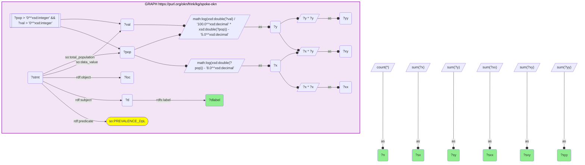
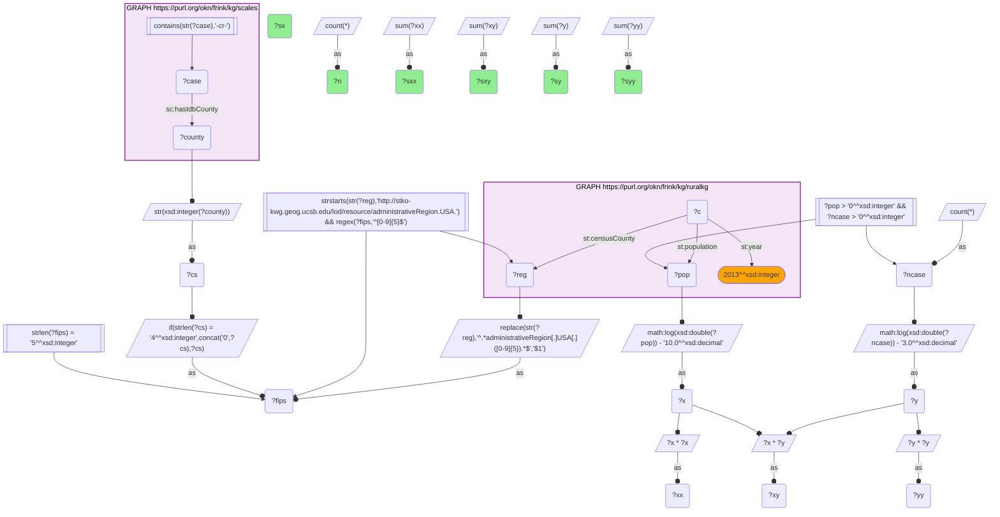
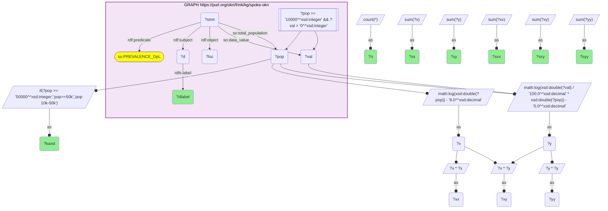
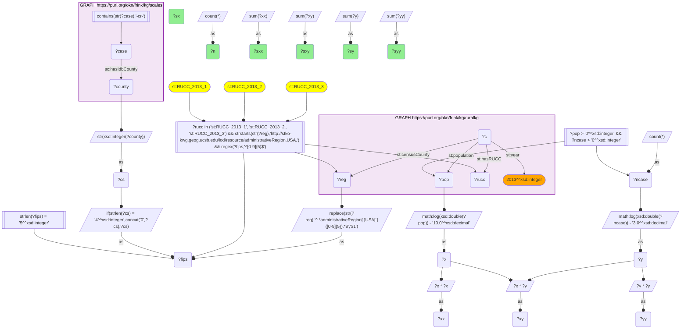
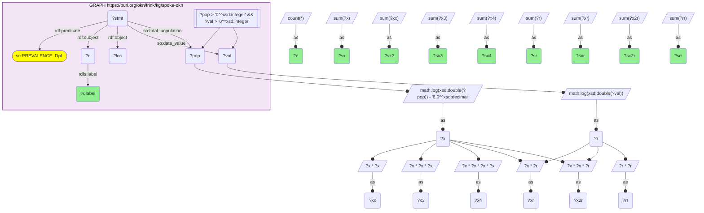
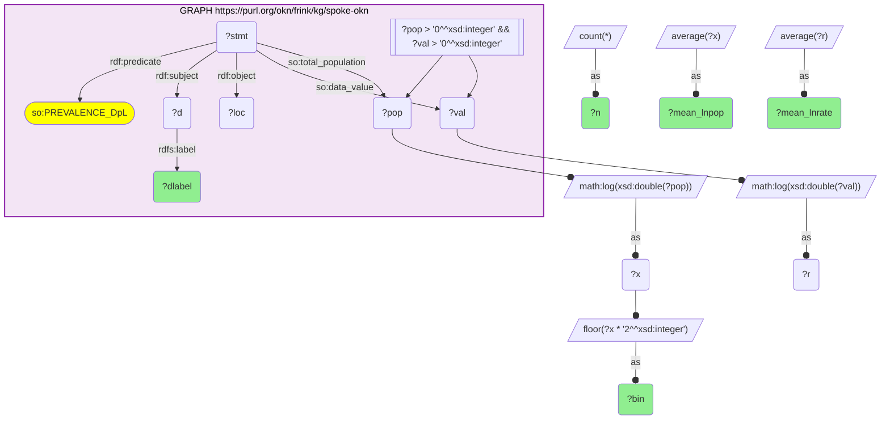
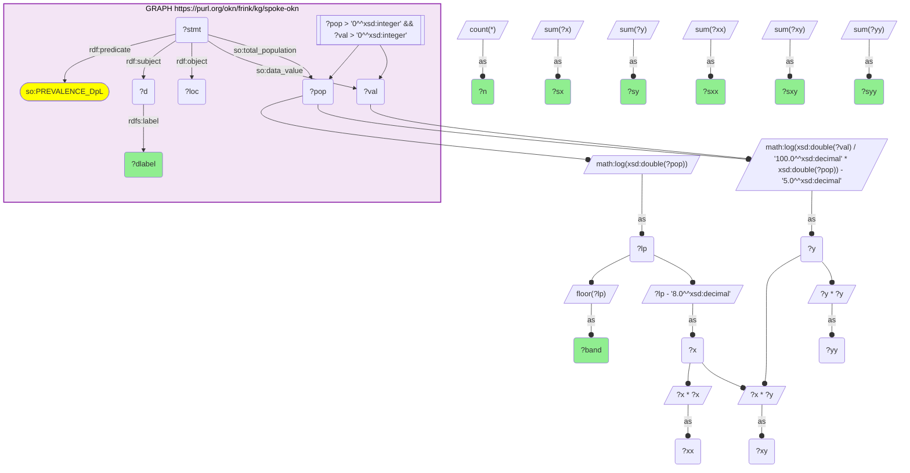
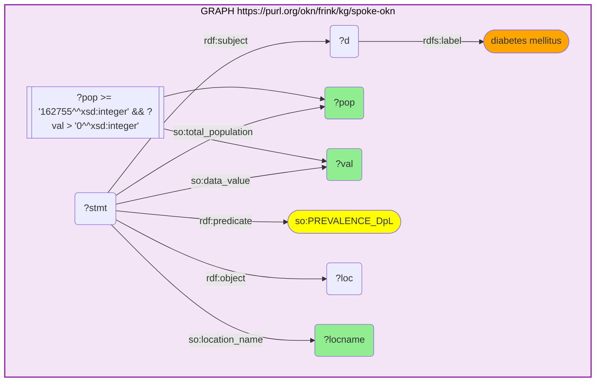

```mermaid
graph TD
classDef projected fill:lightgreen;
classDef literal fill:orange;
classDef iri fill:yellow;
  q3v26("?c")
  q3v24("?fips")
  q3v23("?loc")
  q3v6("?n"):::projected 
  q3v16("?pop")
  q3v15("?rate")
  q3v25("?reg")
  q3v28("?s")
  q3v7("?slabel"):::projected 
  q3v27("?stmt")
  q3v5("?sx"):::projected 
  q3v3("?sxx"):::projected 
  q3v2("?sxy"):::projected 
  q3v4("?sy"):::projected 
  q3v1("?syy"):::projected 
  q3v22("?v")
  q3v20("?x")
  q3v21("?xx")
  q3v19("?xy")
  q3v18("?y")
  q3v17("?yy")
  q3f0[["?rate > '0^^xsd:integer' && ?pop > '0^^xsd:integer'"]]
  q3f0 --> q3v15
  q3f0 --> q3v16
  q3f1[["strstarts(str(?reg),'http://stko-kwg.geog.ucsb.edu/lod/resource/administrativeRegion.USA.') && regex(?fips,'^#91;0-9#93;{5}$')"]]
  q3f1 --> q3v25
  q3f1 --> q3v24
  subgraph q3graph0["GRAPH https://purl.org/okn/frink/kg/ruralkg"]
    style q3graph0 fill:#f3e5f5,stroke:#8e24aa,stroke-width:2px,color:#000;
    q3graph0c2(["2013^^xsd:integer"]):::literal 
    q3v26 --"st:year"--> q3graph0c2
    q3v26 --"st:censusCounty"--> q3v25
    q3v26 --"st:population"--> q3v16
  end
  q3bind0[/"replace(str(?reg),'^.*administrativeRegion#91;.#93;USA#91;.#93;(#91;0-9#93;{5}).*$','$1')"/]
  q3v25 --o q3bind0
  q3bind0 --as--o q3v24
  q3bind1[/"iri(concat('https://purl.org/okn/frink/kg/spoke-okn/location/',?fips))"/]
  q3v24 --o q3bind1
  q3bind1 --as--o q3v23
  subgraph q3graph1["GRAPH https://purl.org/okn/frink/kg/spoke-okn"]
    style q3graph1 fill:#f3e5f5,stroke:#8e24aa,stroke-width:2px,color:#000;
    q3graph1c8(["alcohol-impaired_driving_deaths"]):::literal 
    q3graph1c3(["child_mortality"]):::literal 
    q3graph1c6(["drug_overdose_deaths"]):::literal 
    q3graph1c10(["so:PREVALENCEIN_SpL"]):::iri 
    q3graph1c4(["infant_mortality"]):::literal 
    q3graph1c5(["injury_deaths"]):::literal 
    q3graph1c7(["motor_vehicle_crash_deaths"]):::literal 
    q3graph1c2(["premature_age-adjusted_mortality"]):::literal 
    q3graph1c1(["premature_death"]):::literal 
    q3graph1f2[["?slabel in ('premature_death', 'premature_age-adjusted_mortality', 'child_mortality', 'infant_mortality', 'injury_deaths', 'drug_overdose_deaths', 'motor_vehicle_crash_deaths', 'alcohol-impaired_driving_deaths')"]]
    q3graph1c1 --o q3graph1f2
    q3graph1c2 --o q3graph1f2
    q3graph1c3 --o q3graph1f2
    q3graph1c4 --o q3graph1f2
    q3graph1c5 --o q3graph1f2
    q3graph1c6 --o q3graph1f2
    q3graph1c7 --o q3graph1f2
    q3graph1c8 --o q3graph1f2
    q3graph1f2 --> q3v7
    q3v27 --"rdf:predicate"--> q3graph1c10
    q3v27 --"rdf:subject"--> q3v28
    q3v27 --"rdf:object"--> q3v23
    q3v27 --"so:value"--> q3v22
    q3v28 --"rdfs:label"--> q3v7
  end
  q3bind2[/"xsd:double(if(contains(?v,'('),strbefore(?v,'('),?v))"/]
  q3v22 --o q3bind2
  q3bind2 --as--o q3v15
  q3bind3[/"math:log(xsd:double(?pop)) - '10.0^^xsd:decimal'"/]
  q3v16 --o q3bind3
  q3bind3 --as--o q3v20
  q3bind4[/"math:log(?rate * xsd:double(?pop)) - '10.0^^xsd:decimal'"/]
  q3v15 --o q3bind4
  q3v16 --o q3bind4
  q3bind4 --as--o q3v18
  q3bind5[/"?x * ?x"/]
  q3v20 --o q3bind5
  q3bind5 --as--o q3v21
  q3bind6[/"?x * ?y"/]
  q3v20 --o q3bind6
  q3v18 --o q3bind6
  q3bind6 --as--o q3v19
  q3bind7[/"?y * ?y"/]
  q3v18 --o q3bind7
  q3bind7 --as--o q3v17
  q3bind8[/"count(*)"/]
  q3bind8 --as--o q3v6
  q3bind9[/"sum(?x)"/]
  q3bind9 --as--o q3v5
  q3bind10[/"sum(?y)"/]
  q3bind10 --as--o q3v4
  q3bind11[/"sum(?xx)"/]
  q3bind11 --as--o q3v3
  q3bind12[/"sum(?xy)"/]
  q3bind12 --as--o q3v2
  q3bind13[/"sum(?yy)"/]
  q3bind13 --as--o q3v1
```

```mermaid
graph TD
classDef projected fill:lightgreen;
classDef literal fill:orange;
classDef iri fill:yellow;
  q6v27("?c")
  q6v24("?fips")
  q6v23("?loc")
  q6v6("?n"):::projected 
  q6v16("?pop")
  q6v15("?rate")
  q6v26("?reg")
  q6v25("?rucc")
  q6v29("?s")
  q6v7("?slabel"):::projected 
  q6v28("?stmt")
  q6v5("?sx"):::projected 
  q6v3("?sxx"):::projected 
  q6v2("?sxy"):::projected 
  q6v4("?sy"):::projected 
  q6v1("?syy"):::projected 
  q6v22("?v")
  q6v20("?x")
  q6v21("?xx")
  q6v19("?xy")
  q6v18("?y")
  q6v17("?yy")
  q6c1(["st:RUCC_2013_1"]):::iri 
  q6c2(["st:RUCC_2013_2"]):::iri 
  q6c3(["st:RUCC_2013_3"]):::iri 
  q6f0[["?rate > '0^^xsd:integer' && ?pop > '0^^xsd:integer'"]]
  q6f0 --> q6v15
  q6f0 --> q6v16
  q6f1[["?rucc in ('st:RUCC_2013_1', 'st:RUCC_2013_2', 'st:RUCC_2013_3') && strstarts(str(?reg),'http://stko-kwg.geog.ucsb.edu/lod/resource/administrativeRegion.USA.') && regex(?fips,'^#91;0-9#93;{5}$')"]]
  q6c1 --o q6f1
  q6c2 --o q6f1
  q6c3 --o q6f1
  q6f1 --> q6v25
  q6f1 --> q6v26
  q6f1 --> q6v24
  subgraph q6graph0["GRAPH https://purl.org/okn/frink/kg/ruralkg"]
    style q6graph0 fill:#f3e5f5,stroke:#8e24aa,stroke-width:2px,color:#000;
    q6graph0c2(["2013^^xsd:integer"]):::literal 
    q6v27 --"st:year"--> q6graph0c2
    q6v27 --"st:censusCounty"--> q6v26
    q6v27 --"st:hasRUCC"--> q6v25
    q6v27 --"st:population"--> q6v16
  end
  q6bind0[/"replace(str(?reg),'^.*administrativeRegion#91;.#93;USA#91;.#93;(#91;0-9#93;{5}).*$','$1')"/]
  q6v26 --o q6bind0
  q6bind0 --as--o q6v24
  q6bind1[/"iri(concat('https://purl.org/okn/frink/kg/spoke-okn/location/',?fips))"/]
  q6v24 --o q6bind1
  q6bind1 --as--o q6v23
  subgraph q6graph1["GRAPH https://purl.org/okn/frink/kg/spoke-okn"]
    style q6graph1 fill:#f3e5f5,stroke:#8e24aa,stroke-width:2px,color:#000;
    q6graph1c8(["alcohol-impaired_driving_deaths"]):::literal 
    q6graph1c3(["child_mortality"]):::literal 
    q6graph1c6(["drug_overdose_deaths"]):::literal 
    q6graph1c10(["so:PREVALENCEIN_SpL"]):::iri 
    q6graph1c4(["infant_mortality"]):::literal 
    q6graph1c5(["injury_deaths"]):::literal 
    q6graph1c7(["motor_vehicle_crash_deaths"]):::literal 
    q6graph1c2(["premature_age-adjusted_mortality"]):::literal 
    q6graph1c1(["premature_death"]):::literal 
    q6graph1f2[["?slabel in ('premature_death', 'premature_age-adjusted_mortality', 'child_mortality', 'infant_mortality', 'injury_deaths', 'drug_overdose_deaths', 'motor_vehicle_crash_deaths', 'alcohol-impaired_driving_deaths')"]]
    q6graph1c1 --o q6graph1f2
    q6graph1c2 --o q6graph1f2
    q6graph1c3 --o q6graph1f2
    q6graph1c4 --o q6graph1f2
    q6graph1c5 --o q6graph1f2
    q6graph1c6 --o q6graph1f2
    q6graph1c7 --o q6graph1f2
    q6graph1c8 --o q6graph1f2
    q6graph1f2 --> q6v7
    q6v28 --"rdf:predicate"--> q6graph1c10
    q6v28 --"rdf:subject"--> q6v29
    q6v28 --"rdf:object"--> q6v23
    q6v28 --"so:value"--> q6v22
    q6v29 --"rdfs:label"--> q6v7
  end
  q6bind2[/"xsd:double(if(contains(?v,'('),strbefore(?v,'('),?v))"/]
  q6v22 --o q6bind2
  q6bind2 --as--o q6v15
  q6bind3[/"math:log(xsd:double(?pop)) - '10.0^^xsd:decimal'"/]
  q6v16 --o q6bind3
  q6bind3 --as--o q6v20
  q6bind4[/"math:log(?rate * xsd:double(?pop)) - '10.0^^xsd:decimal'"/]
  q6v15 --o q6bind4
  q6v16 --o q6bind4
  q6bind4 --as--o q6v18
  q6bind5[/"?x * ?x"/]
  q6v20 --o q6bind5
  q6bind5 --as--o q6v21
  q6bind6[/"?x * ?y"/]
  q6v20 --o q6bind6
  q6v18 --o q6bind6
  q6bind6 --as--o q6v19
  q6bind7[/"?y * ?y"/]
  q6v18 --o q6bind7
  q6bind7 --as--o q6v17
  q6bind8[/"count(*)"/]
  q6bind8 --as--o q6v6
  q6bind9[/"sum(?x)"/]
  q6bind9 --as--o q6v5
  q6bind10[/"sum(?y)"/]
  q6bind10 --as--o q6v4
  q6bind11[/"sum(?xx)"/]
  q6bind11 --as--o q6v3
  q6bind12[/"sum(?xy)"/]
  q6bind12 --as--o q6v2
  q6bind13[/"sum(?yy)"/]
  q6bind13 --as--o q6v1
```

# Urban Scaling of Disease, Mortality and Crime — Reproducibility Record

- **Date:** 2026-07-26
- **Model:** claude-opus-5
- **SPARQL endpoint:** https://apps.okn.us/federation/sparql
- **Generated by:** mcp-okn v0.1.0
- **Skills:** okn-bioanalysis v0.1.1 · okn-report-style v0.1.3
- **Elapsed time:** 2026-07-26 06:49–06:58 UTC (9m 5s)
- **Contents:** 11 queries

## Prompt

Identify scaling laws for cities, e.g., how do diseases, mortality, crime scale with city size? Use the /okn-report-style to report the results. Use the /okn-bioanalysis skill to compare the results with literature.

## Notes

This record was REGENERATED on 2026-07-26 so its header pins the skill versions. The 11 supporting queries were replayed VERBATIM against the same endpoint under a fresh log scope; every row count reproduced the original record exactly (9, 3, 8, 1, 18, 8, 1, 9, 225, 117, 139), so no quantity reported in the study changes. Two consequences of the replay a reader should know: each query's timestamp below is the REPLAY time (08:00–08:03 UTC), while the header's elapsed window is the ORIGINAL study window (06:49–06:58 UTC, 9m 5s) — that is what the analysis actually took. Knowledge-graph versions are pinned in the specification's "Knowledge graph versions" section (and in report §2) rather than beside the graph IRIs above, which the tool renders without versions.

## Knowledge graphs used

- `spoke-okn` — <https://purl.org/okn/frink/kg/spoke-okn>
- `ruralkg` — <https://purl.org/okn/frink/kg/ruralkg>
- `scales` — <https://purl.org/okn/frink/kg/scales>

## Replicator specification

### Knowledge graph versions
Pinned at the time of the analysis (`get_kg_version`), and unchanged by the 2026-07-26 replay:
- `spoke-okn` — v0.0.6, updated 2026-03-16
- `ruralkg` — v0.2.7, updated 2026-06-08
- `scales` — v0.0.22, updated 2026-03-18

### Model and estimand
Urban scaling exponent `beta` in `Y = Y0 * N^beta`, fitted as OLS of `ln(Y)` on `ln(N)`, where `N` is
settlement population and `Y` is the outcome COUNT. `beta > 1` superlinear, `beta < 1` sublinear,
`beta = 1` proportional. The rate elasticity is `beta - 1` (elasticity of the per-capita rate w.r.t.
population).

### Counts are reconstructed, not observed
Every OKN source supplies a RATE, not a count. Counts are reconstructed as `rate * N`:
- chronic disease: `Y = (data_value / 100) * total_population` (data_value is age-adjusted prevalence %)
- county mortality: `Y = rate * population`
- crime: `Y` is a true count (number of federal criminal case filings), no reconstruction.

CONSEQUENCE (must be carried): because `Y = rate * N`, the variable `ln(N)` appears on BOTH sides of
the count regression, so the count-regression R^2 is mechanically near 1 and is meaningless as a
goodness-of-fit measure. Report instead the RATE-regression R^2 — the R^2 of `ln(Y/N)` on `ln(N)`,
whose slope is exactly `beta - 1`. Both are emitted by `scripts/fit_lib.py` as `R2_count` and
`R2_rate`; only `R2_rate` is reported in the study.

### Estimation from server-side sufficient statistics
The federation endpoint is QLever, which supports `math:log` but NOT `math:log10`. All regressions are
computed from six sufficient statistics aggregated INSIDE SPARQL — `n, SUM(x), SUM(y), SUM(x^2),
SUM(x*y), SUM(y^2)` where `x = ln(N) - c_x` and `y = ln(Y) - c_y` — rather than by extracting the
237,087 underlying rows. Centring constants (`c_x = 8`, `c_y = 5` for places; `10`/`10` for counties)
do not change the slope; they exist only to keep `SUM(x^2)` and `(SUM x)^2 / n` the same order of
magnitude and avoid catastrophic cancellation. Closed form:

```
Sxx = sxx - sx^2/n ;  Sxy = sxy - sx*sy/n ;  Syy = syy - sy^2/n
beta = Sxy / Sxx
SSE  = Syy - beta*Sxy ;  se(beta) = sqrt( (SSE/(n-2)) / Sxx )
95% CI = beta +/- t(0.975, n-2) * se
R2_rate = (Sxy - Sxx)^2 / (Sxx * (Syy - 2*Sxy + Sxx))
```

VERIFIED: for diabetes across the 139 places with population >= 162,755, a direct client-side OLS on
the extracted raw rows gives beta = 1.012098 (se 0.027505); the sufficient-statistic route on the same
rows gives beta = 1.012098 (se 0.027505), agreeing to 6.4e-15. The independently aggregated SPARQL
band-ladder gives beta = 1.012227, a drift of 1.3e-4 caused by the endpoint returning sums at six
significant figures — negligible against se = 0.027. Raw extract retained at
`data/verify_diabetes_largest.csv`.

### Data selection rules
- Chronic disease (9 conditions): `spoke-okn` reified `PREVALENCE_DpL` statements; require
  `so:data_value > 0` and `so:total_population > 0`. Exactly one row per (condition, place);
  n = 26,343 places per condition; population range 50 – 8,175,111. Only "Age-adjusted prevalence"
  is available — crude prevalence is not in the graph.
- Mortality (8 measures): `spoke-okn` reified `PREVALENCEIN_SpL` statements whose SDoH node label is
  one of `premature_death`, `premature_age-adjusted_mortality`, `child_mortality`, `infant_mortality`,
  `injury_deaths`, `drug_overdose_deaths`, `motor_vehicle_crash_deaths`,
  `alcohol-impaired_driving_deaths` (County Health Rankings 2023).
  PARSING HAZARD — `so:value` uses TWO encodings within the same predicate: a bare numeric
  (`"0.22390330169"`) and a value+quartile pair (`"7.9270081504(1.0)"`). A query that assumes one
  format silently drops five of the eight measures. Parse as
  `IF(CONTAINS(?v,"("), STRBEFORE(?v,"("), ?v)`. Query 2 below is the defective first attempt
  (3 of 8 measures returned); Query 3 is its corrected replacement and is the one used.
- Crime: `scales` cases with `sc:hasIdbCounty`, restricted to criminal dockets by
  `CONTAINS(STR(?case), "-cr-")` (121,785 cases over 2,380 counties), aggregated to per-county counts.
  The IDB county code is a numeric literal (e.g. `2110.0`) equal to the 5-digit FIPS with any leading
  zero dropped; rebuild as `IF(STRLEN(STR(xsd:integer(?county)))=4, CONCAT("0",...), ...)`.
- County population: `ruralkg` `settlementtype:population` with `settlementtype:year 2013`, one row
  per county.

### Cross-KG join
`spoke-okn` x `ruralkg` uses the federation's PRE-VERIFIED crosswalk **K2-county-fips**
(`get_join_strategy("spoke-okn","ruralkg")`, verified 2026-07-12, 3,196 counties): `ruralkg`
`settlementtype:censusCounty` -> KWG `administrativeRegion.USA.{FIPS5}`; the 5-digit FIPS is extracted
by regex and the `spoke-okn` node IRI is REBUILT as
`https://purl.org/okn/frink/kg/spoke-okn/location/{FIPS5}`. Per the crosswalk's own optimisation note,
the query MUST drive from the small typed `ruralkg` side as a DISTINCT sub-SELECT and construct the
other graph's IRI — scanning `spoke-okn` with an unbound pattern exceeds the endpoint's operation
limit (HTTP 429). The place-level arm requires NO cross-KG join: `spoke-okn` PLACES records carry
their own `total_population`.

### Robustness arms (all pre-specified, none post hoc)
1. Population thresholds, places: `pop >= 10,000` (n = 2,845 in the 10k–50k band) and `pop >= 50,000`
   (n = 709).
2. Threshold ladder: sufficient statistics aggregated per e-folding band `FLOOR(ln(pop))`, then
   CUMULATED from the largest band downward, so every cutoff is an EXACT refit (sums are additive),
   not an interpolation. Fits with n < 60 are suppressed.
3. Metropolitan restriction, counties: `ruralkg` `settlementtype:hasRUCC` in
   `{RUCC_2013_1, RUCC_2013_2, RUCC_2013_3}`.
4. Curvature test: quadratic `ln(rate) = a + b*ln(N) + c*ln(N)^2` from the extended moment set
   `n, Sx, Sx2, Sx3, Sx4, Sr, Sxr, Sx2r, Srr`; normal-equation condition number 48.5 (well conditioned).
   Reported ONLY as a test against the pure power-law form — the global quadratic and the size-stratified
   fits disagree in sign for several conditions, which is itself evidence that no single smooth low-order
   curve fits, so local exponents are NOT read off the quadratic.

### Tier assignment
Tiers grade STABILITY under a change of city definition, not precision. Each outcome is re-fitted on
its restricted sample (places >= 50,000; or metro counties) and compared with the full-sample fit:
- **A** — same direction AND significant in both samples.
- **B** — direction stable but significance changes between samples.
- **C** — direction REVERSES (sublinear <-> superlinear); the exponent is an artefact of the city definition.
Distribution: A = 7, B = 5, C = 6 across the 18 series.

### Verified quantities
- 26,343 census places x 9 chronic conditions = 237,087 place-condition observations.
- 3,196 `spoke-okn` county nodes, fully contained in `ruralkg`'s county set (crosswalk K2).
- 121,785 federal criminal case filings across 2,380 counties; 2,377 counties after joining population.
- Mortality measures cover 1,209–3,072 counties each (CHR suppresses small-count counties).
- Diabetes beta: 0.996 (all places) -> 1.078 (places >= 50,000). Stroke: 0.985 -> 1.063.
- Premature death (YPLL) beta = 0.924 (CI 0.916–0.933); motor-vehicle crash deaths beta = 0.736
  (CI 0.724–0.747); federal criminal filings beta = 0.803 (CI 0.767–0.839) -> 1.048 (CI 0.990–1.105) metro.

### Limitations that constrain reuse
1. Ecological, cross-sectional, non-causal; describes differences BETWEEN settlements at one time, not
   the trajectory of any city as it grows.
2. Census places and counties are NOT functional cities. No county->CBSA crosswalk exists in the
   federation, so a true metropolitan-area re-analysis was not possible; the RUCC restriction is a proxy.
3. CDC PLACES prevalence is MODEL-BASED (multilevel regression and poststratification using demographic
   and socioeconomic covariates), so part of any size gradient may be model-induced rather than observed.
4. Rate->count reconstruction is exact only where the rate's denominator is total population. It FAILS
   for `alcohol-impaired_driving_deaths` (a proportion of driving deaths, not a population rate) and is
   approximate for `infant_mortality` (live-birth denominator) and `child_mortality` (child denominator).
   These three are reported as rate elasticities and flagged in the report.
5. Federal criminal filings are a poor crime proxy: most US crime is prosecuted in state courts, and
   federal caseload geography is distorted by border districts and tribal-land jurisdiction.
6. Vintage mismatch: CDC PLACES populations are 2010 census, `ruralkg` populations 2013, CHR values 2023.
7. Endpoint returns summed statistics at six significant figures, contributing ~1e-4 error to beta.
8. CHR county suppression is correlated with small population and could bias mortality exponents toward
   the sublinear direction by an unquantified amount.
9. No infectious-disease outcome is available at place level, so the mechanism most central to the
   superlinear scaling literature could not be tested.

### Scripts
`scripts/fit_lib.py` (sufficient-statistic OLS + rate R^2), `scripts/build_tables.py` (tiering, stats.json),
`scripts/make_fig1.py` / `scripts/make_figures.py` (figures), `scripts/build_xlsx.py` (workbook),
`scripts/build_html.py` (renders the HTML from the Markdown). Extracts in `data/`.

## SPARQL queries

#### Query 1

_2026-07-26T08:00:22+00:00 · `spoke-okn`_

```sparql
PREFIX rdf: <http://www.w3.org/1999/02/22-rdf-syntax-ns#>
PREFIX rdfs: <http://www.w3.org/2000/01/rdf-schema#>
PREFIX so: <https://purl.org/okn/frink/kg/spoke-okn/schema/>
PREFIX math: <http://www.w3.org/2005/xpath-functions/math#>
PREFIX xsd: <http://www.w3.org/2001/XMLSchema#>
# Urban scaling of chronic-disease burden across US census places (CDC PLACES via spoke-okn).
# Y = estimated cases = age-adjusted prevalence(%) /100 * total population ; N = total population
# Returns exact OLS sufficient statistics for ln(Y) = ln(Y0) + beta*ln(N), centred to avoid cancellation.
SELECT ?dlabel (COUNT(*) AS ?n) (SUM(?x) AS ?sx) (SUM(?y) AS ?sy)
       (SUM(?xx) AS ?sxx) (SUM(?xy) AS ?sxy) (SUM(?yy) AS ?syy)
WHERE {
  GRAPH <https://purl.org/okn/frink/kg/spoke-okn> {
    ?stmt rdf:subject ?d ; rdf:predicate so:PREVALENCE_DpL ; rdf:object ?loc ;
          so:data_value ?val ; so:total_population ?pop .
    ?d rdfs:label ?dlabel .
    FILTER(?pop > 0 && ?val > 0)
    BIND(math:log(xsd:double(?pop)) - 8.0 AS ?x)
    BIND(math:log(xsd:double(?val)/100.0 * xsd:double(?pop)) - 5.0 AS ?y)
    BIND(?x*?x AS ?xx) BIND(?x*?y AS ?xy) BIND(?y*?y AS ?yy)
  }
}
GROUP BY ?dlabel
```



_9 row(s)_

#### Query 2

_2026-07-26T08:00:45+00:00 · `ruralkg`, `spoke-okn`_

```sparql
PREFIX rdf: <http://www.w3.org/1999/02/22-rdf-syntax-ns#>
PREFIX rdfs: <http://www.w3.org/2000/01/rdf-schema#>
PREFIX so: <https://purl.org/okn/frink/kg/spoke-okn/schema/>
PREFIX st: <http://sail.ua.edu/ruralkg/settlementtype/>
PREFIX math: <http://www.w3.org/2005/xpath-functions/math#>
PREFIX xsd: <http://www.w3.org/2001/XMLSchema#>
# Urban scaling of county mortality (County Health Rankings 2023 via spoke-okn SDoH)
# against county population (ruralkg census), joined on the verified K2 county-FIPS crosswalk.
SELECT ?slabel (COUNT(*) AS ?n) (SUM(?x) AS ?sx) (SUM(?y) AS ?sy)
       (SUM(?xx) AS ?sxx) (SUM(?xy) AS ?sxy) (SUM(?yy) AS ?syy)
WHERE {
  { SELECT DISTINCT ?fips ?pop WHERE {
      GRAPH <https://purl.org/okn/frink/kg/ruralkg> {
        ?c st:censusCounty ?reg ; st:population ?pop ; st:year 2013 .
      }
      FILTER(STRSTARTS(STR(?reg),'http://stko-kwg.geog.ucsb.edu/lod/resource/administrativeRegion.USA.'))
      BIND(REPLACE(STR(?reg),'^.*administrativeRegion[.]USA[.]([0-9]{5}).*$','$1') AS ?fips)
      FILTER(REGEX(?fips,'^[0-9]{5}$'))
  } }
  BIND(IRI(CONCAT('https://purl.org/okn/frink/kg/spoke-okn/location/', ?fips)) AS ?loc)
  GRAPH <https://purl.org/okn/frink/kg/spoke-okn> {
    ?stmt rdf:subject ?s ; rdf:predicate so:PREVALENCEIN_SpL ; rdf:object ?loc ; so:value ?v .
    ?s rdfs:label ?slabel .
    FILTER(?slabel IN ("premature_death","premature_age-adjusted_mortality","child_mortality",
                       "infant_mortality","injury_deaths","drug_overdose_deaths",
                       "motor_vehicle_crash_deaths","alcohol-impaired_driving_deaths"))
  }
  BIND(xsd:double(STRBEFORE(?v,"(")) AS ?rate)
  FILTER(?rate > 0 && ?pop > 0)
  BIND(math:log(xsd:double(?pop)) - 10.0 AS ?x)
  BIND(math:log(?rate * xsd:double(?pop)) - 12.0 AS ?y)
  BIND(?x*?x AS ?xx) BIND(?x*?y AS ?xy) BIND(?y*?y AS ?yy)
}
GROUP BY ?slabel
```


_3 row(s)_

#### Query 3

_2026-07-26T08:01:00+00:00 · `ruralkg`, `spoke-okn`_

```sparql
PREFIX rdf: <http://www.w3.org/1999/02/22-rdf-syntax-ns#>
PREFIX rdfs: <http://www.w3.org/2000/01/rdf-schema#>
PREFIX so: <https://purl.org/okn/frink/kg/spoke-okn/schema/>
PREFIX st: <http://sail.ua.edu/ruralkg/settlementtype/>
PREFIX math: <http://www.w3.org/2005/xpath-functions/math#>
PREFIX xsd: <http://www.w3.org/2001/XMLSchema#>
# Urban scaling of county mortality (County Health Rankings 2023 via spoke-okn SDoH) vs county
# population (ruralkg census 2013), joined on the verified K2 county-FIPS crosswalk.
# Handles both spoke-okn value encodings: "rate(quartile)" and bare "rate".
SELECT ?slabel (COUNT(*) AS ?n) (SUM(?x) AS ?sx) (SUM(?y) AS ?sy)
       (SUM(?xx) AS ?sxx) (SUM(?xy) AS ?sxy) (SUM(?yy) AS ?syy)
WHERE {
  { SELECT DISTINCT ?fips ?pop WHERE {
      GRAPH <https://purl.org/okn/frink/kg/ruralkg> {
        ?c st:censusCounty ?reg ; st:population ?pop ; st:year 2013 .
      }
      FILTER(STRSTARTS(STR(?reg),'http://stko-kwg.geog.ucsb.edu/lod/resource/administrativeRegion.USA.'))
      BIND(REPLACE(STR(?reg),'^.*administrativeRegion[.]USA[.]([0-9]{5}).*$','$1') AS ?fips)
      FILTER(REGEX(?fips,'^[0-9]{5}$'))
  } }
  BIND(IRI(CONCAT('https://purl.org/okn/frink/kg/spoke-okn/location/', ?fips)) AS ?loc)
  GRAPH <https://purl.org/okn/frink/kg/spoke-okn> {
    ?stmt rdf:subject ?s ; rdf:predicate so:PREVALENCEIN_SpL ; rdf:object ?loc ; so:value ?v .
    ?s rdfs:label ?slabel .
    FILTER(?slabel IN ("premature_death","premature_age-adjusted_mortality","child_mortality",
                       "infant_mortality","injury_deaths","drug_overdose_deaths",
                       "motor_vehicle_crash_deaths","alcohol-impaired_driving_deaths"))
  }
  BIND(xsd:double(IF(CONTAINS(?v,"("), STRBEFORE(?v,"("), ?v)) AS ?rate)
  FILTER(?rate > 0 && ?pop > 0)
  BIND(math:log(xsd:double(?pop)) - 10.0 AS ?x)
  BIND(math:log(?rate * xsd:double(?pop)) - 10.0 AS ?y)
  BIND(?x*?x AS ?xx) BIND(?x*?y AS ?xy) BIND(?y*?y AS ?yy)
}
GROUP BY ?slabel
```



_8 row(s)_

#### Query 4

_2026-07-26T08:01:14+00:00 · `scales`, `ruralkg`_

```sparql
PREFIX st: <http://sail.ua.edu/ruralkg/settlementtype/>
PREFIX sc: <http://schemas.scales-okn.org/rdf/scales#>
PREFIX math: <http://www.w3.org/2005/xpath-functions/math#>
PREFIX xsd: <http://www.w3.org/2001/XMLSchema#>
# Urban scaling of federal criminal case filings (SCALES, by IDB county of origin)
# vs county population (ruralkg census 2013), joined on 5-digit county FIPS.
SELECT (COUNT(*) AS ?n) (SUM(?x) AS ?sx) (SUM(?y) AS ?sy)
       (SUM(?xx) AS ?sxx) (SUM(?xy) AS ?sxy) (SUM(?yy) AS ?syy)
WHERE {
  { SELECT ?fips (COUNT(*) AS ?ncase) WHERE {
      GRAPH <https://purl.org/okn/frink/kg/scales> {
        ?case sc:hasIdbCounty ?county .
        FILTER(CONTAINS(STR(?case), "-cr-"))
      }
      BIND(STR(xsd:integer(?county)) AS ?cs)
      BIND(IF(STRLEN(?cs)=4, CONCAT("0",?cs), ?cs) AS ?fips)
      FILTER(STRLEN(?fips)=5)
  } GROUP BY ?fips }
  { SELECT DISTINCT ?fips ?pop WHERE {
      GRAPH <https://purl.org/okn/frink/kg/ruralkg> {
        ?c st:censusCounty ?reg ; st:population ?pop ; st:year 2013 .
      }
      FILTER(STRSTARTS(STR(?reg),'http://stko-kwg.geog.ucsb.edu/lod/resource/administrativeRegion.USA.'))
      BIND(REPLACE(STR(?reg),'^.*administrativeRegion[.]USA[.]([0-9]{5}).*$','$1') AS ?fips)
      FILTER(REGEX(?fips,'^[0-9]{5}$'))
  } }
  FILTER(?pop > 0 && ?ncase > 0)
  BIND(math:log(xsd:double(?pop)) - 10.0 AS ?x)
  BIND(math:log(xsd:double(?ncase)) - 3.0 AS ?y)
  BIND(?x*?x AS ?xx) BIND(?x*?y AS ?xy) BIND(?y*?y AS ?yy)
}
```



_1 row(s)_

#### Query 5

_2026-07-26T08:01:31+00:00 · `spoke-okn`_

```sparql
PREFIX rdf: <http://www.w3.org/1999/02/22-rdf-syntax-ns#>
PREFIX rdfs: <http://www.w3.org/2000/01/rdf-schema#>
PREFIX so: <https://purl.org/okn/frink/kg/spoke-okn/schema/>
PREFIX math: <http://www.w3.org/2005/xpath-functions/math#>
PREFIX xsd: <http://www.w3.org/2001/XMLSchema#>
# Robustness: place-level chronic-disease scaling restricted to larger places, to test whether
# the sublinear result is driven by very small settlements (city-definition / MAUP sensitivity).
SELECT ?dlabel ?band (COUNT(*) AS ?n) (SUM(?x) AS ?sx) (SUM(?y) AS ?sy)
       (SUM(?xx) AS ?sxx) (SUM(?xy) AS ?sxy) (SUM(?yy) AS ?syy)
WHERE {
  GRAPH <https://purl.org/okn/frink/kg/spoke-okn> {
    ?stmt rdf:subject ?d ; rdf:predicate so:PREVALENCE_DpL ; rdf:object ?loc ;
          so:data_value ?val ; so:total_population ?pop .
    ?d rdfs:label ?dlabel .
    FILTER(?pop >= 10000 && ?val > 0)
  }
  BIND(IF(?pop >= 50000, "pop>=50k", "pop 10k-50k") AS ?band)
  BIND(math:log(xsd:double(?pop)) - 8.0 AS ?x)
  BIND(math:log(xsd:double(?val)/100.0 * xsd:double(?pop)) - 5.0 AS ?y)
  BIND(?x*?x AS ?xx) BIND(?x*?y AS ?xy) BIND(?y*?y AS ?yy)
}
GROUP BY ?dlabel ?band
```



_18 row(s)_

#### Query 6

_2026-07-26T08:01:55+00:00 · `ruralkg`, `spoke-okn`_

```sparql
PREFIX rdf: <http://www.w3.org/1999/02/22-rdf-syntax-ns#>
PREFIX rdfs: <http://www.w3.org/2000/01/rdf-schema#>
PREFIX so: <https://purl.org/okn/frink/kg/spoke-okn/schema/>
PREFIX st: <http://sail.ua.edu/ruralkg/settlementtype/>
PREFIX math: <http://www.w3.org/2005/xpath-functions/math#>
PREFIX xsd: <http://www.w3.org/2001/XMLSchema#>
# Robustness: county mortality scaling restricted to METRO counties (RUCC 2013 codes 1-3),
# the closest available proxy for functional urban areas within the federation.
SELECT ?slabel (COUNT(*) AS ?n) (SUM(?x) AS ?sx) (SUM(?y) AS ?sy)
       (SUM(?xx) AS ?sxx) (SUM(?xy) AS ?sxy) (SUM(?yy) AS ?syy)
WHERE {
  { SELECT DISTINCT ?fips ?pop WHERE {
      GRAPH <https://purl.org/okn/frink/kg/ruralkg> {
        ?c st:censusCounty ?reg ; st:population ?pop ; st:year 2013 ; st:hasRUCC ?rucc .
      }
      FILTER(?rucc IN (<http://sail.ua.edu/ruralkg/settlementtype/RUCC_2013_1>,
                       <http://sail.ua.edu/ruralkg/settlementtype/RUCC_2013_2>,
                       <http://sail.ua.edu/ruralkg/settlementtype/RUCC_2013_3>))
      FILTER(STRSTARTS(STR(?reg),'http://stko-kwg.geog.ucsb.edu/lod/resource/administrativeRegion.USA.'))
      BIND(REPLACE(STR(?reg),'^.*administrativeRegion[.]USA[.]([0-9]{5}).*$','$1') AS ?fips)
      FILTER(REGEX(?fips,'^[0-9]{5}$'))
  } }
  BIND(IRI(CONCAT('https://purl.org/okn/frink/kg/spoke-okn/location/', ?fips)) AS ?loc)
  GRAPH <https://purl.org/okn/frink/kg/spoke-okn> {
    ?stmt rdf:subject ?s ; rdf:predicate so:PREVALENCEIN_SpL ; rdf:object ?loc ; so:value ?v .
    ?s rdfs:label ?slabel .
    FILTER(?slabel IN ("premature_death","premature_age-adjusted_mortality","child_mortality",
                       "infant_mortality","injury_deaths","drug_overdose_deaths",
                       "motor_vehicle_crash_deaths","alcohol-impaired_driving_deaths"))
  }
  BIND(xsd:double(IF(CONTAINS(?v,"("), STRBEFORE(?v,"("), ?v)) AS ?rate)
  FILTER(?rate > 0 && ?pop > 0)
  BIND(math:log(xsd:double(?pop)) - 10.0 AS ?x)
  BIND(math:log(?rate * xsd:double(?pop)) - 10.0 AS ?y)
  BIND(?x*?x AS ?xx) BIND(?x*?y AS ?xy) BIND(?y*?y AS ?yy)
}
GROUP BY ?slabel
```



_8 row(s)_

#### Query 7

_2026-07-26T08:02:13+00:00 · `scales`, `ruralkg`_

```sparql
PREFIX st: <http://sail.ua.edu/ruralkg/settlementtype/>
PREFIX sc: <http://schemas.scales-okn.org/rdf/scales#>
PREFIX math: <http://www.w3.org/2005/xpath-functions/math#>
PREFIX xsd: <http://www.w3.org/2001/XMLSchema#>
# Robustness: federal criminal case-filing scaling restricted to METRO counties (RUCC 1-3).
SELECT (COUNT(*) AS ?n) (SUM(?x) AS ?sx) (SUM(?y) AS ?sy)
       (SUM(?xx) AS ?sxx) (SUM(?xy) AS ?sxy) (SUM(?yy) AS ?syy)
WHERE {
  { SELECT ?fips (COUNT(*) AS ?ncase) WHERE {
      GRAPH <https://purl.org/okn/frink/kg/scales> {
        ?case sc:hasIdbCounty ?county .
        FILTER(CONTAINS(STR(?case), "-cr-"))
      }
      BIND(STR(xsd:integer(?county)) AS ?cs)
      BIND(IF(STRLEN(?cs)=4, CONCAT("0",?cs), ?cs) AS ?fips)
      FILTER(STRLEN(?fips)=5)
  } GROUP BY ?fips }
  { SELECT DISTINCT ?fips ?pop WHERE {
      GRAPH <https://purl.org/okn/frink/kg/ruralkg> {
        ?c st:censusCounty ?reg ; st:population ?pop ; st:year 2013 ; st:hasRUCC ?rucc .
      }
      FILTER(?rucc IN (<http://sail.ua.edu/ruralkg/settlementtype/RUCC_2013_1>,
                       <http://sail.ua.edu/ruralkg/settlementtype/RUCC_2013_2>,
                       <http://sail.ua.edu/ruralkg/settlementtype/RUCC_2013_3>))
      FILTER(STRSTARTS(STR(?reg),'http://stko-kwg.geog.ucsb.edu/lod/resource/administrativeRegion.USA.'))
      BIND(REPLACE(STR(?reg),'^.*administrativeRegion[.]USA[.]([0-9]{5}).*$','$1') AS ?fips)
      FILTER(REGEX(?fips,'^[0-9]{5}$'))
  } }
  FILTER(?pop > 0 && ?ncase > 0)
  BIND(math:log(xsd:double(?pop)) - 10.0 AS ?x)
  BIND(math:log(xsd:double(?ncase)) - 3.0 AS ?y)
  BIND(?x*?x AS ?xx) BIND(?x*?y AS ?xy) BIND(?y*?y AS ?yy)
}
```



_1 row(s)_

#### Query 8

_2026-07-26T08:02:31+00:00 · `spoke-okn`_

```sparql
PREFIX rdf: <http://www.w3.org/1999/02/22-rdf-syntax-ns#>
PREFIX rdfs: <http://www.w3.org/2000/01/rdf-schema#>
PREFIX so: <https://purl.org/okn/frink/kg/spoke-okn/schema/>
PREFIX math: <http://www.w3.org/2005/xpath-functions/math#>
PREFIX xsd: <http://www.w3.org/2001/XMLSchema#>
# Curvature test: sufficient statistics for a QUADRATIC fit of ln(prevalence rate) on ln(N),
# i.e. is the scaling exponent itself a function of city size (deviation from a pure power law)?
SELECT ?dlabel (COUNT(*) AS ?n) (SUM(?x) AS ?sx) (SUM(?xx) AS ?sx2) (SUM(?x3) AS ?sx3)
       (SUM(?x4) AS ?sx4) (SUM(?r) AS ?sr) (SUM(?xr) AS ?sxr) (SUM(?x2r) AS ?sx2r) (SUM(?rr) AS ?srr)
WHERE {
  GRAPH <https://purl.org/okn/frink/kg/spoke-okn> {
    ?stmt rdf:subject ?d ; rdf:predicate so:PREVALENCE_DpL ; rdf:object ?loc ;
          so:data_value ?val ; so:total_population ?pop .
    ?d rdfs:label ?dlabel .
    FILTER(?pop > 0 && ?val > 0)
  }
  BIND(math:log(xsd:double(?pop)) - 8.0 AS ?x)
  BIND(math:log(xsd:double(?val)) AS ?r)
  BIND(?x*?x AS ?xx) BIND(?x*?x*?x AS ?x3) BIND(?x*?x*?x*?x AS ?x4)
  BIND(?x*?r AS ?xr) BIND(?x*?x*?r AS ?x2r) BIND(?r*?r AS ?rr)
}
GROUP BY ?dlabel
```



_9 row(s)_

#### Query 9

_2026-07-26T08:02:40+00:00 · `spoke-okn`_

```sparql
PREFIX rdf: <http://www.w3.org/1999/02/22-rdf-syntax-ns#>
PREFIX rdfs: <http://www.w3.org/2000/01/rdf-schema#>
PREFIX so: <https://purl.org/okn/frink/kg/spoke-okn/schema/>
PREFIX math: <http://www.w3.org/2005/xpath-functions/math#>
PREFIX xsd: <http://www.w3.org/2001/XMLSchema#>
# Binned means of ln(prevalence) against ln(population), half-log-unit bins, for figures.
SELECT ?dlabel ?bin (COUNT(*) AS ?n) (AVG(?x) AS ?mean_lnpop) (AVG(?r) AS ?mean_lnrate)
WHERE {
  GRAPH <https://purl.org/okn/frink/kg/spoke-okn> {
    ?stmt rdf:subject ?d ; rdf:predicate so:PREVALENCE_DpL ; rdf:object ?loc ;
          so:data_value ?val ; so:total_population ?pop .
    ?d rdfs:label ?dlabel .
    FILTER(?pop > 0 && ?val > 0)
  }
  BIND(math:log(xsd:double(?pop)) AS ?x)
  BIND(math:log(xsd:double(?val)) AS ?r)
  BIND(FLOOR(?x*2) AS ?bin)
}
GROUP BY ?dlabel ?bin
```



_225 row(s)_

#### Query 10

_2026-07-26T08:02:51+00:00 · `spoke-okn`_

```sparql
PREFIX rdf: <http://www.w3.org/1999/02/22-rdf-syntax-ns#>
PREFIX rdfs: <http://www.w3.org/2000/01/rdf-schema#>
PREFIX so: <https://purl.org/okn/frink/kg/spoke-okn/schema/>
PREFIX math: <http://www.w3.org/2005/xpath-functions/math#>
PREFIX xsd: <http://www.w3.org/2001/XMLSchema#>
# Sufficient statistics per e-folding population band, so cumulative "population >= T"
# scaling fits can be reconstructed exactly for any band boundary (city-definition sensitivity).
SELECT ?dlabel ?band (COUNT(*) AS ?n) (SUM(?x) AS ?sx) (SUM(?y) AS ?sy)
       (SUM(?xx) AS ?sxx) (SUM(?xy) AS ?sxy) (SUM(?yy) AS ?syy)
WHERE {
  GRAPH <https://purl.org/okn/frink/kg/spoke-okn> {
    ?stmt rdf:subject ?d ; rdf:predicate so:PREVALENCE_DpL ; rdf:object ?loc ;
          so:data_value ?val ; so:total_population ?pop .
    ?d rdfs:label ?dlabel .
    FILTER(?pop > 0 && ?val > 0)
  }
  BIND(math:log(xsd:double(?pop)) AS ?lp)
  BIND(FLOOR(?lp) AS ?band)
  BIND(?lp - 8.0 AS ?x)
  BIND(math:log(xsd:double(?val)/100.0 * xsd:double(?pop)) - 5.0 AS ?y)
  BIND(?x*?x AS ?xx) BIND(?x*?y AS ?xy) BIND(?y*?y AS ?yy)
}
GROUP BY ?dlabel ?band
```



_117 row(s)_

#### Query 11

_2026-07-26T08:03:00+00:00 · `spoke-okn`_

```sparql
PREFIX rdf: <http://www.w3.org/1999/02/22-rdf-syntax-ns#>
PREFIX rdfs: <http://www.w3.org/2000/01/rdf-schema#>
PREFIX so: <https://purl.org/okn/frink/kg/spoke-okn/schema/>
PREFIX xsd: <http://www.w3.org/2001/XMLSchema#>
# Verification extract: raw (population, prevalence) rows for diabetes in the largest places,
# used to confirm the server-side sufficient-statistic OLS reproduces a direct client-side fit.
SELECT ?locname ?pop ?val
WHERE {
  GRAPH <https://purl.org/okn/frink/kg/spoke-okn> {
    ?d rdfs:label "diabetes mellitus" .
    ?stmt rdf:subject ?d ; rdf:predicate so:PREVALENCE_DpL ; rdf:object ?loc ;
          so:data_value ?val ; so:total_population ?pop ; so:location_name ?locname .
    FILTER(?pop >= 162755 && ?val > 0)
  }
}
```



_139 row(s)_
