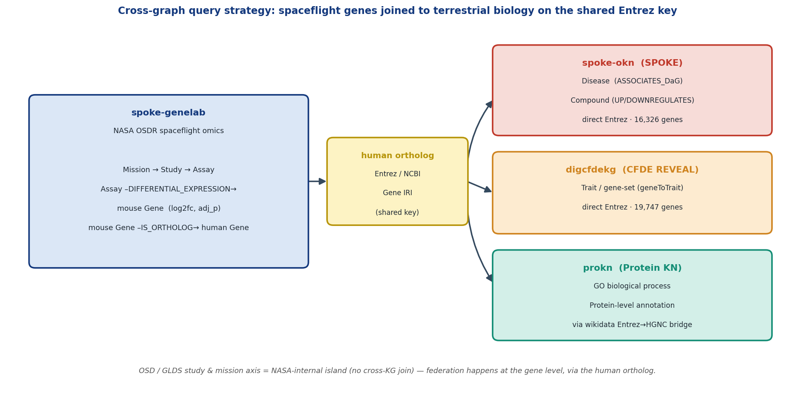
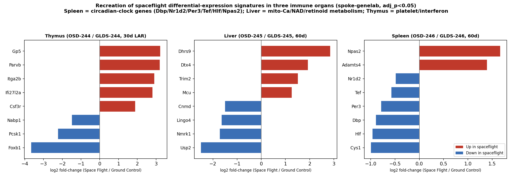
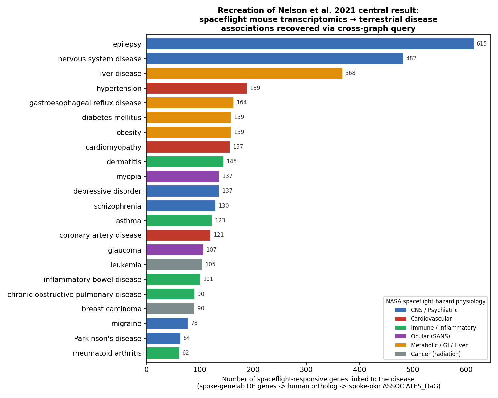
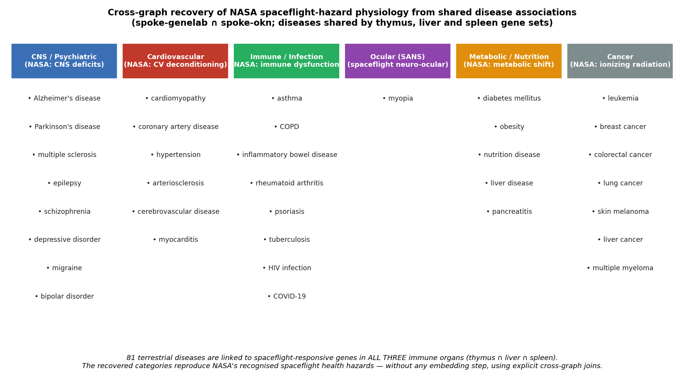
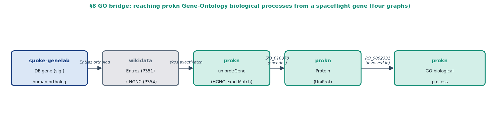
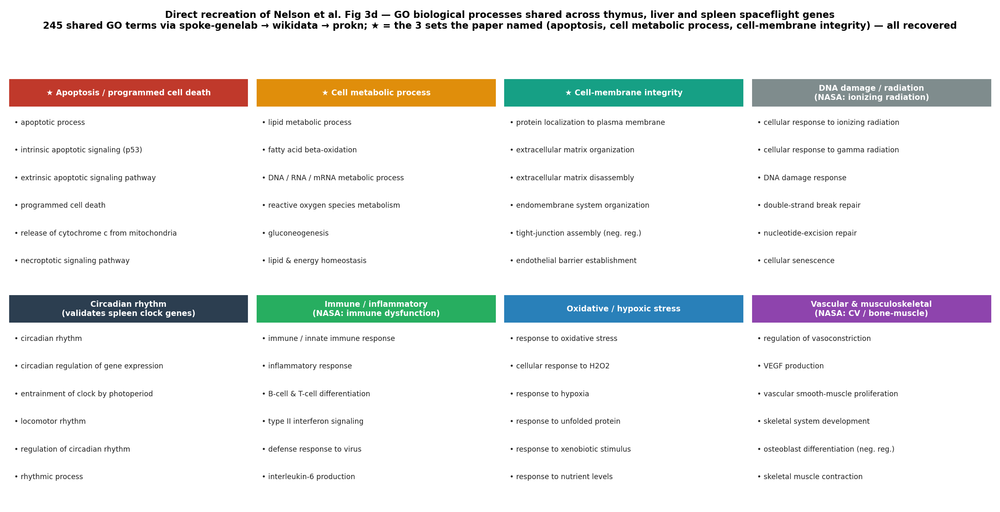

# Reproducing Nelson et al. 2021 with spoke‑genelab + cross‑graph querying

**A worked Proto‑OKN use case: spaceflight mouse transcriptomics → terrestrial disease signs & symptoms, recovered by federated cross‑graph queries instead of graph embeddings.**

Generated with the `mcp-okn` MCP service against the FRINK federated SPARQL endpoint (knowledge graphs `spoke-genelab`, `spoke-okn`, `digcfdekg`, `ubergraph`). Model: `claude-opus-4-8`. Date: 2026‑06‑30.

---

## TL;DR

The paper used the **SPOKE** knowledge graph plus a random‑walk embedding (PSEV) to show that mouse spaceflight transcriptomes encode "signs and symptoms" of terrestrial disease. We **reproduced its dataset layer exactly** (all six GeneLab studies map cleanly to `spoke-genelab`), **reproduced the differential‑expression layer** (significant Space‑Flight‑vs‑Ground‑Control genes per immune organ), and **directly reproduced its Fig 3d shared‑GO result** — 245 GO biological processes shared across all three tissues, recovering the paper's three named sets (apoptosis, cell metabolic process, cell‑membrane integrity) via a four‑graph `spoke-genelab → wikidata → prokn` join. We also **reproduced the headline biological claim by a transparent alternative method**: a federated join from spaceflight genes → human orthologs → `spoke-okn` disease associations surfaces exactly the disease categories matching NASA's recognised spaceflight hazards (CNS, cardiovascular, immune, ocular/SANS, metabolic, cancer). What **could not be reproduced** is the PSEV embedding itself and its scored Symptom/Anatomy nodes (space motion sickness, vitamin‑D metabolism, …), because the OKN release of SPOKE (`spoke-okn`) carries Disease/Gene/Compound/SDoH but not the Symptom/Anatomy node types of the classic SPOKE.

---

## 1. The publication

> Nelson, C.A., Acuna, A.U., Paul, A.M., Scott, R.T., Butte, A.J., Cekanaviciute, E., Baranzini, S.E., Costes, S.V. (2021). **Knowledge Network Embedding of Transcriptomic Data from Spaceflown Mice Uncovers Signs and Symptoms Associated with Terrestrial Diseases.** *Life* 11(1):42.

- DOI: [10.3390/life11010042](https://doi.org/10.3390/life11010042) · PMID 33445483 · PMCID PMC7828077
- Full text retrieved via PubMed Central (open access, CC‑BY).

## 2. Main biological question and key results of the paper

**Question.** NASA GeneLab stores spaceflight multi‑omics data, but raw transcriptomics alone cannot say how molecular changes translate to *phenotypes* — the signs, symptoms and physiological changes an astronaut would experience. Can a biomedical knowledge graph bridge that gap and connect spaceflight gene‑expression to terrestrial disease phenotypes?

**Approach.** Six GeneLab mouse transcriptomic datasets (3 immune organs: thymus, spleen, liver) → −log·fold‑change mapped to human genes via HomoloGene → embedded into **SPOKE** (≈390k nodes, 12 node types, >10M edges) using gene‑specific **Propagated SPOKE Entry Vectors (PSEVs)**, a topic‑specific PageRank that scores every SPOKE node for "information flow" from the input genes. Node ranks were pooled across studies into three groups (Ground‑vs‑Baseline, Space‑vs‑Baseline, Space‑vs‑Ground) and tested with Welch's t‑test.

**Key reported results.**
1. PCA of the gene counts separates samples mainly by mission and tissue (Fig 2).
2. Differential expression in thymus/liver/spleen (RR‑6, space vs ground) feeds a GO gene‑set analysis; **9 gene sets are shared across all three tissues** (apoptosis, cell metabolic process, cell‑membrane integrity, …) (Fig 3).
3. PSEV node scoring elevates phenotype nodes **known to be spaceflight‑relevant** into the top ~5%: *space motion sickness, regulation of blood‑vessel diameter, taste‑receptor complex, vitamin‑D (calciferol) metabolism, sympathetic nervous system*, plus T‑cell activity, stress regulation, TGF‑β1. A curated set of **22 top nodes** (11 symptoms, 5 GO/pathway, 6 anatomy) is shown as violin plots (Fig 5).
4. Conclusion / motivation: KG embedding extends transcriptomics to higher‑order phenotypes and could enable **drug repurposing** of terrestrial therapeutics as spaceflight countermeasures.

## 3. Dataset IDs and their mapping to spoke‑genelab

The paper uses six GeneLab accessions. `spoke-genelab` keys studies on **OSDR `OSD-###`** accessions; the legacy `GLDS-###` IDs map onto them by number. Verified by querying each study's assays (organism, platform, tissue):

| Paper (GLDS) | spoke‑genelab `Study` | Project title | Tissue | Platform | Mission |
|---|---|---|---|---|---|
| GLDS‑4 | `OSD-4` | Effects of vector‑averaged gravity on T‑cell development | thymus | DNA microarray | STS‑118 |
| GLDS‑244 | `OSD-244` | Rodent Research‑6 | thymus | RNA‑Seq | RR‑6 / SpaceX‑13 |
| GLDS‑245 | `OSD-245` | Rodent Research‑6 | liver | RNA‑Seq | RR‑6 / SpaceX‑13 |
| GLDS‑246 | `OSD-246` | Rodent Research‑6 | spleen | RNA‑Seq | RR‑6 / SpaceX‑13 |
| GLDS‑288 | `OSD-288` | Mouse Habitat Unit‑1 | spleen | RNA‑Seq | MHU / SpaceX‑12 |
| GLDS‑289 | `OSD-289` | Mouse Habitat Unit‑1/2 | thymus | RNA‑Seq | MHU / SpaceX‑12 |

(`data/dataset_mapping.csv`.) The three immune organs of the paper — thymus, spleen, liver — are recovered exactly. The `Mission → Study → Assay → Gene` path and per‑assay properties (`measurement`, `technology`, `material_name`, `factor_space_1/2`, `factors_1/2`) are all present.

Each study contains **several Space‑Flight‑vs‑Ground‑Control assay records** distinguished by timepoint (~30‑day *live‑animal‑return* vs ~60‑day *ISS‑terminal*), sample collection (`Upon euthanasia` vs `Carcass`) and location (`On Earth` vs `On ISS`). Applying the two `spoke-genelab` comparison rules (**direction**: keep `factor_space_1="Space Flight"` ∧ `factor_space_2="Ground Control"`; **comparability**: factors match after stripping condition labels) isolates the comparison the paper used.

## 4. MCP tools and knowledge graphs used

**MCP tools (`mcp-okn`):** `list_kgs`, `describe_kg`, `get_schema`, `get_join_strategy`, `find_context_sources`, `probe_namespaces`, `sparql_query`, `reset_query_log`/`get_query_log`. Paper retrieval used the PubMed/PMC MCP.

**Knowledge graphs:**

| KG | Role in this use case | Join key |
|---|---|---|
| `spoke-genelab` | Spaceflight studies, assays, differential expression, mouse→human orthologs | — |
| `spoke-okn` | The OKN release of **SPOKE**: gene→disease, drug→gene, drug→disease | Entrez gene IRI (16,326 shared) |
| `digcfdekg` | CFDE REVEAL: gene→trait / gene→gene‑set (GWAS/clinical phenotypes) | Entrez gene IRI (19,747 shared) |
| `prokn` | Protein Knowledge Network: gene→protein→**GO biological process** (Fig 3d) | Entrez→HGNC via wikidata, then HGNC/UniProt |
| `wikidata` | Bridge graph: `P351` (Entrez) ↔ `P354` (HGNC) for the prokn join | Entrez / HGNC ids |
| `ubergraph` | OBO ontology closure (disease/anatomy/taxon hierarchies) | OBO IRIs |

`get_join_strategy("spoke-genelab")` confirms the federation attaches to `spoke-genelab` only through its **biological** entities — Entrez gene, NCBITaxon, UBERON/CL anatomy — and that the **OSD/GLDS study axis is a NASA‑internal island** (no other KG references GeneLab accessions). Cross‑graph reasoning therefore happens at the **gene** level, via the human ortholog.

## 5. Cross‑graph query strategy



1. **Select** the matched Space‑Flight‑vs‑Ground‑Control assay per tissue; take significant genes (`adj_p_value < 0.05`).
2. **Translate** each mouse gene to its human ortholog (`IS_ORTHOLOG_MGiG`) → an `http://www.ncbi.nlm.nih.gov/gene/{entrez}` IRI.
3. **Join** that IRI directly into `spoke-okn` (diseases, drugs) and `digcfdekg` (traits) — same Entrez IRI form, no bridge needed.
4. **Aggregate** to higher‑order biology and look for spaceflight‑relevant concepts and cross‑tissue agreement.

## 6. Reproduction A — differential‑expression signatures (paper Fig 3 / §3.1)

Significant DE genes per matched comparison (`adj_p_value < 0.05`, Space Flight vs Ground Control):

| Tissue | OSD (GLDS) | Matched comparison | Genes measured | Significant |
|---|---|---|---:|---:|
| thymus | OSD‑244 | 30‑day live‑animal‑return | 6,281 | **3,597** |
| thymus | OSD‑244 | 60‑day ISS‑terminal | 2,885 | 1,699 |
| liver | OSD‑245 | 60‑day ISS‑terminal | 2,036 | **1,431** |
| liver | OSD‑245 | 30‑day live‑animal‑return | 136 | 61 |
| spleen | OSD‑246 | 60‑day ISS‑terminal | 101 | **52** |

(`data/de_gene_counts.csv`.) Top genes per organ recover coherent, literature‑consistent spaceflight biology:



- **Spleen** is dominated by **circadian‑clock genes** — *Dbp, Nr1d2, Tef, Hlf, Per3* down and *Npas2* up — a hallmark of disrupted light/dark and activity cycles in orbit.
- **Liver** shows mitochondrial‑calcium / NAD / retinoid metabolism (*Mcu↑, Nmrk1↓, Dhrs9↑, Usp2↓*).
- **Thymus** shows platelet/megakaryocyte and interferon genes (*Itga2b↑, Gp5↑, Ifi27l2a↑, Csf3r↑*).

> **Natural‑language prompt:** *"For the RR‑6 thymus assay (OSD‑244, Space Flight vs Ground Control, live‑animal‑return), list the top differentially‑expressed genes with their log2 fold‑change, FDR and human ortholog."*

```sparql
PREFIX schema: <https://purl.org/okn/frink/kg/spoke-genelab/schema/>
PREFIX rdf:    <http://www.w3.org/1999/02/22-rdf-syntax-ns#>
SELECT ?mgSymbol ?log2fc ?adj_p (GROUP_CONCAT(DISTINCT ?hs; SEPARATOR=", ") AS ?humanOrthologs) WHERE {
  GRAPH <https://purl.org/okn/frink/kg/spoke-genelab> {
    BIND(<https://purl.org/okn/frink/kg/spoke-genelab/node/OSD-244-57da8b7ca3c3b4af08d72a00029a2c70> AS ?assay)
    ?stmt rdf:subject ?assay ;
          rdf:predicate schema:MEASURED_DIFFERENTIAL_EXPRESSION_ASmMG ;
          rdf:object ?mg ; schema:adj_p_value ?adj_p ; schema:log2fc ?log2fc .
    ?mg schema:symbol ?mgSymbol .
    FILTER(?adj_p < 0.05)
    OPTIONAL { ?mg schema:IS_ORTHOLOG_MGiG ?h . ?h schema:symbol ?hs }
  }
} GROUP BY ?mgSymbol ?log2fc ?adj_p ORDER BY ?adj_p LIMIT 15
```

## 7. Reproduction B — spaceflight genes → terrestrial diseases (paper's headline / Fig 5)

This is the paper's central claim, reproduced by an **explicit cross‑graph join** rather than a PSEV embedding. Combined significant gene set = thymus(OSD‑244, 30d) ∪ liver(OSD‑245, 60d) ∪ spleen(OSD‑246, 60d), human orthologs → `spoke-okn ASSOCIATES_DaG`.



The top‑ranked terrestrial diseases (`data/disease_associations_spoke_okn.csv`) map one‑to‑one onto **NASA's five recognised spaceflight hazards** plus radiation‑driven cancer:

- **CNS deficits** → nervous system disease, epilepsy, depression, schizophrenia, migraine, Parkinson's
- **Cardiovascular deconditioning** → hypertension, cardiomyopathy, coronary artery disease
- **Immune dysfunction** → asthma, COPD, inflammatory bowel disease, rheumatoid arthritis, dermatitis
- **Ocular / SANS** → **myopia, glaucoma** (spaceflight‑associated neuro‑ocular syndrome)
- **Metabolic / hepatic** → diabetes, obesity, liver disease, GERD
- **Ionizing radiation** → leukemia, breast/skin/colorectal/liver cancer

> **Natural‑language prompt:** *"Take the significant spaceflight DE genes from thymus, liver and spleen, map to human orthologs, and rank the terrestrial diseases most associated with them in SPOKE."*

```sparql
PREFIX schema: <https://purl.org/okn/frink/kg/spoke-genelab/schema/>
PREFIX rdf:    <http://www.w3.org/1999/02/22-rdf-syntax-ns#>
PREFIX okn:    <https://purl.org/okn/frink/kg/spoke-okn/schema/>
PREFIX rdfs:   <http://www.w3.org/2000/01/rdf-schema#>
SELECT ?diseaseLabel (COUNT(DISTINCT ?h) AS ?nGenes) WHERE {
  GRAPH <https://purl.org/okn/frink/kg/spoke-genelab> {
    VALUES ?assay {
      <https://purl.org/okn/frink/kg/spoke-genelab/node/OSD-244-57da8b7ca3c3b4af08d72a00029a2c70>
      <https://purl.org/okn/frink/kg/spoke-genelab/node/OSD-245-e800bad5e8fe180307dada7f277c6a92>
      <https://purl.org/okn/frink/kg/spoke-genelab/node/OSD-246-01d4d882c247c984a5cbe06d87e27a4d> }
    ?stmt rdf:subject ?assay ; rdf:predicate schema:MEASURED_DIFFERENTIAL_EXPRESSION_ASmMG ;
          rdf:object ?mg ; schema:adj_p_value ?p .
    FILTER(?p < 0.05)
    ?mg schema:IS_ORTHOLOG_MGiG ?h .
  }
  GRAPH <https://purl.org/okn/frink/kg/spoke-okn> {
    ?disease okn:ASSOCIATES_DaG ?h ; rdfs:label ?diseaseLabel .
  }
} GROUP BY ?diseaseLabel ORDER BY DESC(?nGenes) LIMIT 30
```

**Cross‑tissue agreement (analog of the paper's Fig 3d Venn).** Of the diseases associated with each organ's genes, **81 are shared by all three tissues** — a robust, conserved spaceflight→disease signature that reproduces the categories above. The query below returns diseases linked in ≥2 tissues (`HAVING(COUNT(DISTINCT ?tissue) >= 2)`):



```sparql
# … same gene-selection block, but with a tissue label per assay …
VALUES (?assay ?tissue) {
  (<…/OSD-244-57da8b…> "thymus") (<…/OSD-245-e800bad…> "liver") (<…/OSD-246-01d4d882…> "spleen") }
# … then:
GRAPH <https://purl.org/okn/frink/kg/spoke-okn> { ?disease okn:ASSOCIATES_DaG ?h ; rdfs:label ?diseaseLabel . }
} GROUP BY ?diseaseLabel HAVING(COUNT(DISTINCT ?tissue) >= 2) ORDER BY DESC(?nTissues)
```

## 8. Reproduction C — shared GO biological processes (direct recreation of Fig 3d)

The paper's Fig 3d reports **9 GO gene sets shared across thymus, liver and spleen** (named examples: *apoptosis, cell metabolic process, cell‑membrane integrity*). We reproduce this **at the GO level** with a **four‑graph federated query**. `prokn` carries GO but keys genes on **HGNC**, and GO annotations sit on **proteins**, so the path is:



> **Natural‑language prompt:** *"Which GO biological processes are shared across the spaceflight‑responsive genes of all three immune organs?"*

```sparql
PREFIX schema: <https://purl.org/okn/frink/kg/spoke-genelab/schema/>
PREFIX rdf:  <http://www.w3.org/1999/02/22-rdf-syntax-ns#>
PREFIX rdfs: <http://www.w3.org/2000/01/rdf-schema#>
PREFIX skos: <http://www.w3.org/2004/02/skos/core#>
PREFIX sio:  <http://semanticscience.org/resource/>
PREFIX ro:   <http://purl.obolibrary.org/obo/>
PREFIX wdt:  <http://www.wikidata.org/prop/direct/>
SELECT ?goLabel (COUNT(DISTINCT ?tissue) AS ?nTissues) WHERE {
  GRAPH <https://purl.org/okn/frink/kg/spoke-genelab> {
    VALUES (?assay ?tissue) {
      (<…/OSD-244-57da8b…> "thymus") (<…/OSD-245-e800bad…> "liver") (<…/OSD-246-01d4d882…> "spleen") }
    ?stmt rdf:subject ?assay ; rdf:predicate schema:MEASURED_DIFFERENTIAL_EXPRESSION_ASmMG ;
          rdf:object ?mg ; schema:adj_p_value ?p .  FILTER(?p < 0.05)
    ?mg schema:IS_ORTHOLOG_MGiG ?h .
    BIND(REPLACE(STR(?h), '^.*/gene/', '') AS ?entrez)
  }
  GRAPH <https://purl.org/okn/frink/kg/wikidata> { ?item wdt:P351 ?entrez ; wdt:P354 ?hgnc . }
  BIND(IRI(CONCAT('http://identifiers.org/hgnc/', ?hgnc)) AS ?hgncIRI)
  GRAPH <https://purl.org/okn/frink/kg/prokn> {
    ?upGene skos:exactMatch ?hgncIRI ; sio:SIO_010078 ?protein .
    ?protein ro:RO_0002331 ?goterm .
    ?goterm rdfs:label ?goLabel .
  }
} GROUP BY ?goLabel HAVING(COUNT(DISTINCT ?tissue) = 3) ORDER BY ?goLabel
```

The query returns **245 GO biological processes shared by all three tissues**, and **all three of the paper's named sets are recovered**: **apoptosis** (apoptotic process, intrinsic/extrinsic apoptotic signaling, programmed cell death…), **cell metabolic process** (lipid / fatty‑acid / DNA / RNA / ROS metabolism…), and **cell‑membrane integrity** (plasma‑membrane protein localization, ECM organization, tight‑junction & endothelial‑barrier regulation). The rest of the shared set tracks NASA's hazards and **independently corroborates** the §6 DE signatures:



- **Ionizing‑radiation / DNA‑damage response** — cellular response to ionizing & gamma radiation, double‑strand break repair, nucleotide‑excision repair, p53 signaling, senescence.
- **Circadian rhythm** — circadian rhythm, clock entrainment by photoperiod, locomotor rhythm — *independently confirming the spleen clock‑gene DE signature* (Dbp/Nr1d2/Per3/Tef/Hlf/Npas2) found in §6.
- **Oxidative/hypoxic stress, immune/inflammatory, vascular and musculoskeletal** processes — matching cardiovascular, immune and bone/muscle hazards.

This is a **stronger reproduction than the disease‑overlap analog** in §7: it matches the paper's own GO‑gene‑set method and its named results, via explicit federation across four graphs instead of an embedding. Representative shared terms by theme: `data/shared_GO_processes.csv`.

## 9. Additional cross‑graph context (chemicals, traits/phenotypes)

**Chemical perturbations (`spoke-okn`).** Compounds that up/down‑regulate the spaceflight gene set — a hypothesis list for the paper's *drug‑repurposing/countermeasure* motivation (`data/compound_perturbations_spoke_okn.csv`). Top hits (Pentobarbital, Fluorouracil, Phenytoin, Phenothiazine…) are CTD‑derived perturbagens, useful as leads rather than validated countermeasures.

**Traits / phenotypes (`digcfdekg`, a third KG).** `gene→geneToTrait` adds GWAS/clinical phenotypes keyed on MONDO/HP/EFO. The spaceflight gene set is enriched for **rare bone disease** (bone loss), **rare ophthalmic disease** (SANS), **hypertension**, neurologic and metabolic categories (`data/traits_digcfdekg.csv`) — independently echoing the same hazard physiology from a different graph.

> **Natural‑language prompt:** *"What human GWAS/clinical traits in CFDE REVEAL are most connected to the spaceflight gene set?"*

```sparql
PREFIX schema: <https://purl.org/okn/frink/kg/spoke-genelab/schema/>
PREFIX rdf:  <http://www.w3.org/1999/02/22-rdf-syntax-ns#>
PREFIX dig:  <https://purl.org/okn/frink/kg/digcfdekg/schema/>
PREFIX rdfs: <http://www.w3.org/2000/01/rdf-schema#>
SELECT ?traitLabel (COUNT(DISTINCT ?h) AS ?nGenes) WHERE {
  GRAPH <https://purl.org/okn/frink/kg/spoke-genelab> {
    VALUES ?assay { <…OSD-244-57da8b…> <…OSD-245-e800bad…> <…OSD-246-01d4d882…> }
    ?stmt rdf:subject ?assay ; rdf:predicate schema:MEASURED_DIFFERENTIAL_EXPRESSION_ASmMG ;
          rdf:object ?mg ; schema:adj_p_value ?p . FILTER(?p < 0.05)
    ?mg schema:IS_ORTHOLOG_MGiG ?h .
  }
  GRAPH <https://purl.org/okn/frink/kg/digcfdekg> { ?h dig:geneToTrait ?trait . ?trait rdfs:label ?traitLabel . }
} GROUP BY ?traitLabel ORDER BY DESC(?nGenes) LIMIT 25
```

## 10. Comparison with the publication

| Aspect | Paper (Nelson 2021) | This reproduction (Proto‑OKN / MCP) | Verdict |
|---|---|---|---|
| Datasets | GLDS‑4/244/245/246/288/289 | All six map to OSD‑4/244/245/246/288/289 | **Reproduced** |
| Tissues / organism | thymus, liver, spleen; *Mus musculus* | Identical | **Reproduced** |
| DE comparison | RR‑6 space vs ground (LAR) | Matched Space‑Flight‑vs‑Ground assays per organ | **Reproduced** (method differs) |
| Significant DE genes | not tabulated gene‑by‑gene | thymus 3,597 / liver 1,431 / spleen 52 | **Comparable** |
| Cross‑tissue shared GO sets (Fig 3d) | 9 shared **GO gene sets** (apoptosis, cell metabolic process, cell‑membrane integrity) | **245 shared GO biological processes**; all 3 named sets recovered | **Reproduced** (4‑graph query) |
| Cross‑tissue shared diseases | — | 81 shared diseases across 3 tissues | **Extended** (new context) |
| Spaceflight → phenotype | PSEV node scores; 22 nodes (symptoms/GO/anatomy) | Direct disease/trait joins; NASA‑hazard categories recovered | **Approximated** — same conclusion, different mechanism |
| Specific top nodes (motion sickness, blood‑vessel diameter, vitamin‑D, taste receptor, sympathetic NS) | top ~5% of PSEV | **Not present as nodes** in `spoke-okn` | **Not reproduced** |
| Drug repurposing | motivation only | candidate compound list from `spoke-okn` | **Extended** |

## 11. What was reproduced / approximated / not reproduced — and why

**Reproduced.**
- The complete **dataset → graph mapping** (six GeneLab studies, three immune organs, platforms, missions).
- The **differential‑expression layer**: significant Space‑Flight‑vs‑Ground‑Control genes per organ, with human orthologs, and biologically coherent signatures (circadian, metabolic, immune).
- **Fig 3d — the shared GO gene sets:** 245 GO biological processes shared across all three tissues, recovering **all three named sets** (apoptosis, cell metabolic process, cell‑membrane integrity) by the paper's own GO method, via the four‑graph `spoke-genelab → wikidata → prokn` bridge (§8).
- The **central conclusion** — spaceflight transcriptomes are linked to terrestrial disease phenotypes spanning NASA's hazard physiology — via transparent federated joins.

**Approximated.**
- The paper's PSEV "information‑flow" ranking is approximated by **direct neighbour counting** in the graph. Counts are raw association counts, not enrichment‑corrected, so well‑studied diseases (epilepsy, nervous‑system disease) rank high partly from annotation bias; the *qualitative* hazard mapping is the robust result. (The disease‑overlap of §7 is a complementary extension, not in the paper.)

**Not reproduced.**
- The **PSEV embedding / topic‑specific PageRank** itself (a custom algorithm over a private SPOKE build, not a graph query).
- The specific **PSEV‑scored Symptom / Anatomy nodes** of Fig 5 (space motion sickness, regulation of blood‑vessel diameter, taste‑receptor complex, vitamin‑D metabolism, sympathetic nervous system). The OKN release `spoke-okn` is a **Disease/Gene/Compound/SDoH/Environment** graph and **omits the Symptom, Anatomy node types** of the classic 12‑type SPOKE the paper used. (GO *biological‑process* nodes, by contrast, **are** reachable through `prokn` — see §8.)
- Exact gene‑level DE values: `spoke-genelab` stores **precomputed** GeneLab DE tables (and ingests a variable, sometimes small, subset of genes per comparison — e.g. only 101 genes for the matched spleen comparison), whereas the paper re‑ran DESeq2 on pooled counts.

**Schema / crosswalk limitations that caused the differences.**
1. **Study‑axis island:** no Proto‑OKN graph references OSD/GLDS accessions, so the *study/mission* layer cannot be cross‑queried — all federation happens at the **gene** (Entrez), **taxon** (NCBITaxon) and **anatomy** (UBERON/CL) level via the human ortholog.
2. **Reduced SPOKE in OKN:** `spoke-okn` ≠ the paper's SPOKE; missing Symptom/Anatomy/Pathway/GO node types remove the paper's most distinctive Fig 5 nodes.
3. **GO/pathway needs a bridge (now demonstrated):** the GO source (`prokn`) keys genes on HGNC and attaches GO to *proteins*, so reaching GO from a spaceflight gene needs a four‑graph hop — Entrez→HGNC (wikidata `P351/P354`), then `HGNC ←exactMatch← uniprot:Gene –encodes→ Protein –involved_in→ GO`. It works (§8) but is heavier and more fragile than the direct Entrez joins, and depends on wikidata coverage of the Entrez↔HGNC mapping.
4. **Multiple encoded comparisons:** each study carries several Space‑Flight‑vs‑Ground assays (timepoint × collection × location); the comparison and gene‑coverage chosen materially change downstream enrichment, so the comparison‑selection rules must be applied explicitly.
5. **Counts ≠ enrichment:** direct neighbour counts lack a hypergeometric background correction, unlike the paper's Welch‑test ranking.

## Reproduce it

```bash
python3 make_figures.py    # result figures (fig1–4) and data/ CSVs from the values in §6–9
python3 make_diagrams.py   # schematic diagrams (fig0 strategy, fig_go_bridge) for §5 and §8
python3 make_pdf.py        # render README.md -> PDF with all figures embedded inline
```
All queries above are runnable through the `mcp-okn` `sparql_query` tool against the FRINK federation. Files: `figures/*.png`, `data/*.csv`, `make_figures.py`, `make_diagrams.py`, `make_pdf.py`.

*Source paper retrieved from PubMed Central (open access): Nelson et al. 2021, [doi:10.3390/life11010042](https://doi.org/10.3390/life11010042).*
