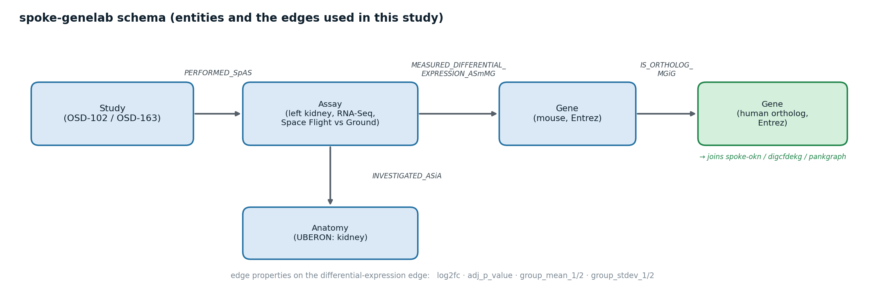
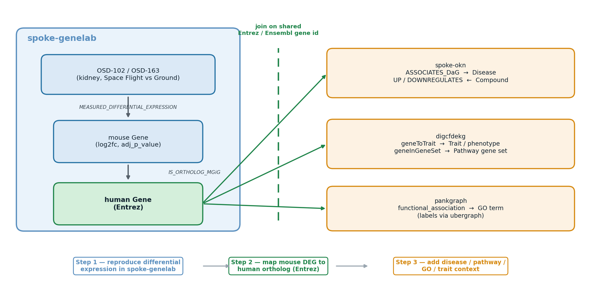
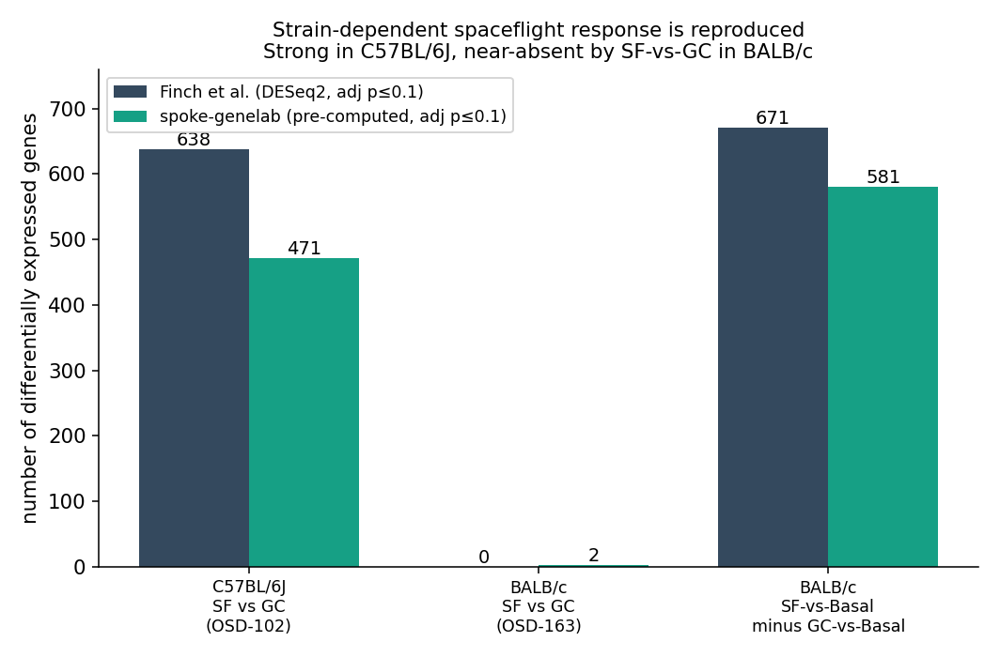
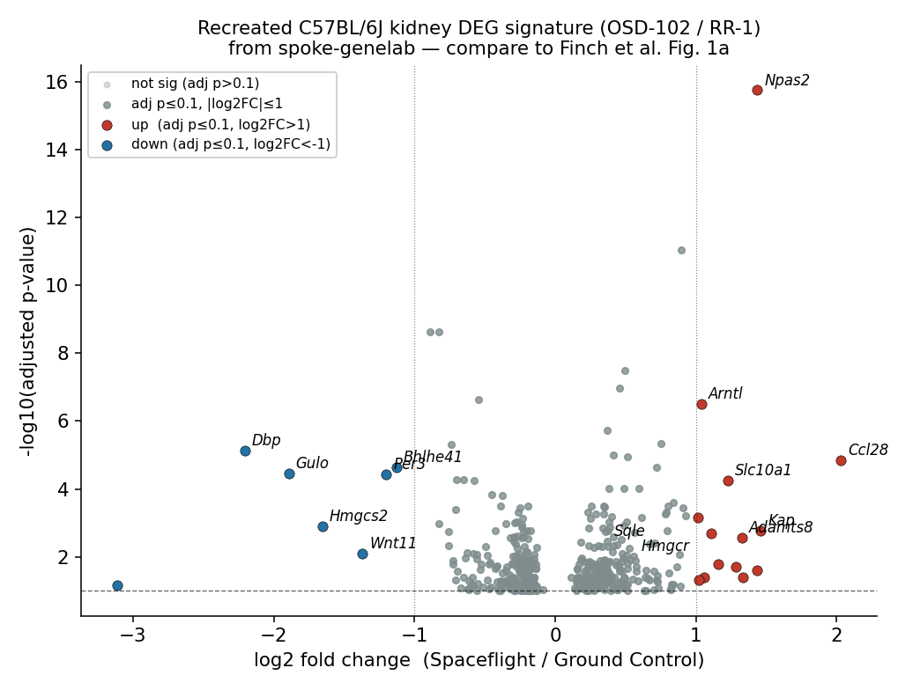
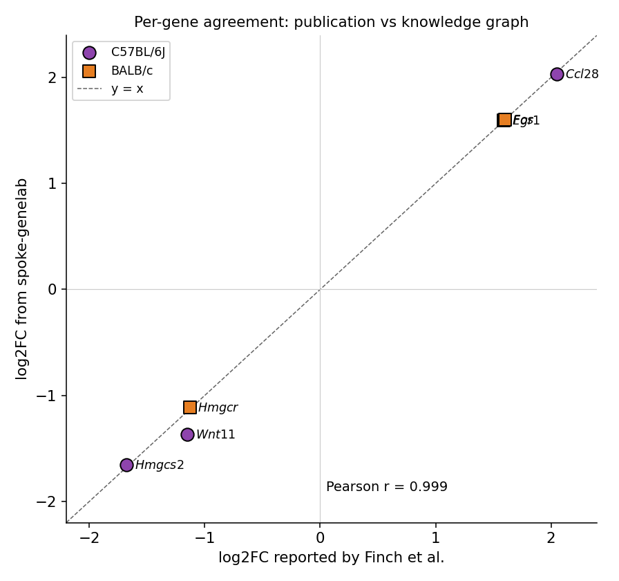
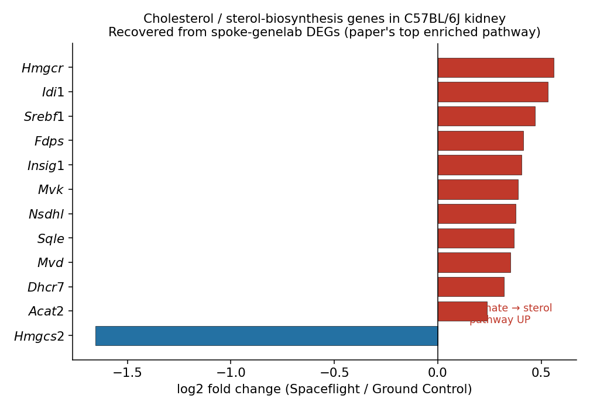
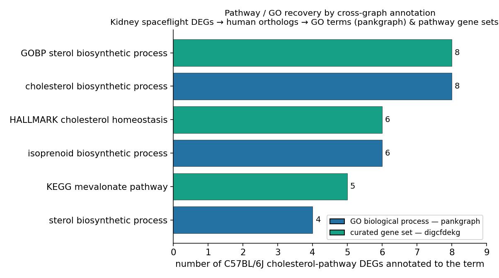

# Cross-graph use case: reproducing a NASA GeneLab spaceflight kidney study with `spoke-genelab` + companion knowledge graphs

**A worked example of cross-graph querying over the Proto-OKN / OKN federation, built from a real NASA OSDR publication.**

This demonstration takes one peer-reviewed paper from the [NASA OSDR Publications Archive](https://science.nasa.gov/reference/osdr-publications-archive/), matches its GeneLab dataset IDs to studies in `spoke-genelab`, reproduces the paper's main quantitative findings directly from the knowledge graph, and then adds biological context (orthologs, diseases, pathways/gene-sets, chemical perturbations) by federating `spoke-genelab` with other knowledge graphs through shared identifiers.

---

## 1. Executive summary

| Aspect | Result |
|---|---|
| **Core finding reproduced** | The paper's central thesis — a **strain-dependent** kidney response to spaceflight (strong in C57BL/6J, near-absent by spaceflight-vs-ground in BALB/c) — is reproduced directly from `spoke-genelab`. |
| **Per-gene agreement** | log2 fold-changes for every named marker gene match the publication with **Pearson r = 0.999**. |
| **Pathway themes recovered** | Cholesterol/sterol biosynthesis, ECM / TGF-β signalling and circadian rhythm re-emerge from the DEG edges — and are confirmed as formal **GO terms** (pankgraph) and **pathway gene sets** (KEGG mevalonate, HALLMARK cholesterol homeostasis; digcfdekg). |
| **Cross-graph value-add** | Kidney DEG orthologs link (via shared Entrez IDs) to **kidney diseases** in `spoke-okn` (glomerulonephritis, interstitial nephritis, kidney cancer) — clinical context the transcriptomics alone does not carry. |
| **KGs federated** | `spoke-genelab` ⟶ `spoke-okn` (disease/compound), `digcfdekg` (traits + pathway gene sets), `pankgraph` (GO terms), `ubergraph` (GO/anatomy labels), with further reach into `prokn`, `gene-expression-atlas-okn`, `biobricks-aopwiki`, `rdkg`. |

---

## 2. Selected publication

> **Spaceflight causes strain-dependent gene expression changes in the kidneys of mice.**
> Finch RH, Vitry G, Siew K, Walsh SB, Beheshti A, Hardiman G, da Silveira WA.
> *npj Microgravity* (2025). Published 2025-03-25.
> DOI: [10.1038/s41526-025-00465-0](https://doi.org/10.1038/s41526-025-00465-0) · PMID 40133368 · PMCID [PMC11937539](https://www.ncbi.nlm.nih.gov/pmc/articles/PMC11937539/)

**Main biological question.** Astronauts are at elevated risk of kidney stones and renal dysfunction on long-duration missions. Does spaceflight reprogram the kidney transcriptome, and does genetic background change that response? The authors analysed kidney RNA-seq from **two mouse strains** flown on the ISS.

**Key reported results.**
- **C57BL/6J** showed a strong response: **638 differentially expressed genes** (DEGs; Spaceflight vs Ground Control, adjusted *p* ≤ 0.1). The same Spaceflight-vs-Ground analysis in **BALB/c gave 0 DEGs**; an alternative "common-basal-control" design recovered **671** spaceflight-specific genes.
- Dysregulation of **lipid / cholesterol metabolism**, **extracellular-matrix (ECM) degradation**, and **TGF-β signalling**; **circadian** genes altered.
- **Ccl28** (TGF-β pathway) was the single most differentially expressed gene in C57BL/6J (log2FC **2.05**).
- Strain-specific **hyaluronan-metabolism** genetics may protect BALB/c from ECM remodelling / epithelial–mesenchymal transition.

---

## 3. Dataset IDs and how they map to `spoke-genelab`

The paper's "Datasets" entry lists **OSD-102** and **OSD-163**. Both are present in `spoke-genelab` (104 OSD studies are loaded), as left-kidney RNA-seq with the canonical *Space Flight vs Ground Control* comparison.

| Paper | Mission | Strain | OSDR ID | `spoke-genelab` Study node | Kidney assay (SF vs GC) |
|---|---|---|---|---|---|
| RR-1 | Rodent Research-1 | **C57BL/6J** (6♀, 37 d ISS) | OSD-102 | `…/node/OSD-102` | `…/node/OSD-102-9ea29268…` |
| RR-3 | Rodent Research-3 | **BALB/c** (10♀, 39–42 d ISS) | OSD-163 | `…/node/OSD-163` | `…/node/OSD-163-134943402…` |

`spoke-genelab` schema used (entities → edges):



Each differential-expression edge is an RDF-reified statement (`rdf:subject` Assay, `rdf:object` Gene) carrying `log2fc` and `adj_p_value` as edge properties. **Direction convention** (per the KG's documented assay rules): keep only `factor_space_1 = "Space Flight"` and `factor_space_2 = "Ground Control"`, so `log2fc > 0` = up in spaceflight.

---

## 4. MCP tools and knowledge graphs used

**MCP tools (`mcp-okn` server, OKN federated SPARQL):** `list_kgs`, `describe_kg`, `get_schema`, `get_join_strategy`, `probe_namespaces`, `sparql_query`. The publication's full text was retrieved with the Paperclip biomedical-paper tool (PMC11937539).

**Knowledge graphs:**

| KG | Role in this example | Join key |
|---|---|---|
| **`spoke-genelab`** | Spaceflight kidney differential expression; model-organism→human orthologs | — |
| **`spoke-okn`** | Gene → disease associations; gene ← compound up/downregulation | **Entrez gene** (`ncbi.nlm.nih.gov/gene/…`) |
| **`ubergraph`** | Taxonomy (NCBITaxon), UBERON anatomy, GO term hierarchy | NCBITaxon / UBERON |
| **`digcfdekg`** | Gene → **trait/phenotype** (CKD, nephrotic syndrome, lipid traits) and gene → **pathway gene set** (KEGG, HALLMARK, GO-BP) | **Entrez gene** (direct to spoke-genelab) |
| **`pankgraph`** | Gene → **GO** biological-process term (`functional_association`) | **Ensembl** (via spoke-okn) |
| `prokn` | Gene/protein → GO (`involved_in`) and Reactome (protein layer) | HGNC (Wikidata-bridged) |
| `gene-expression-atlas-okn` | Reactome pathway **enrichment per contrast**; terrestrial kidney expression | Entrez / Ensembl / UBERON |
| `biobricks-aopwiki`, `rdkg` | Adverse-Outcome-Pathway gene membership; rare-disease gene context | Entrez |

The `spoke-genelab ↔ spoke-okn` join is a **hand-verified crosswalk** (`get_join_strategy`): recipe **C4**, shared key = Entrez gene IRI, **16,326** genes common to both graphs.

---

## 5. Cross-graph query strategy

The OSDR study/mission accessions are a *NASA-internal island* — no other KG references `OSD-…` IDs. Federation therefore happens on **biological entities**, principally the **Entrez gene**:



1. **Reproduce** the differential-expression results inside `spoke-genelab` (counts, fold-changes, gene sets).
2. **Map** each mouse DEG to its **human ortholog** (`IS_ORTHOLOG_MGiG`) — orthologs carry the same Entrez IRI scheme used across the federation.
3. **Federate** that human Entrez IRI into `spoke-okn` (and others) for disease, chemical and pathway context, all in a single SPARQL query spanning multiple `GRAPH` blocks.

---

## 6. Reproducing the paper's main findings

### 6.1 Strain-dependent DEG counts (the central thesis)

**Prompt:** *"How many differentially expressed genes are in the C57BL/6J and BALB/c kidney spaceflight assays, at the paper's adjusted-p ≤ 0.1 threshold?"*

```sparql
PREFIX rdf:    <http://www.w3.org/1999/02/22-rdf-syntax-ns#>
PREFIX schema: <https://purl.org/okn/frink/kg/spoke-genelab/schema/>
SELECT (COUNT(DISTINCT ?gene) AS ?n_DEG)
       (SUM(IF(?log2fc > 0,1,0)) AS ?up) (SUM(IF(?log2fc < 0,1,0)) AS ?down)
WHERE {
  GRAPH <https://purl.org/okn/frink/kg/spoke-genelab> {
    ?s rdf:subject <https://purl.org/okn/frink/kg/spoke-genelab/node/OSD-102-9ea29268b285ecb277189e5e22cd2053> ;
       rdf:predicate schema:MEASURED_DIFFERENTIAL_EXPRESSION_ASmMG ;
       rdf:object ?gene ; schema:log2fc ?log2fc ; schema:adj_p_value ?p .
    FILTER(?p <= 0.1) } }
```

For BALB/c, the paper's "Spaceflight vs Ground Control" comparison yielded **0** genes; its alternative design (Spaceflight-vs-Basal **minus** Ground-vs-Basal) yielded 671. Both BALB/c assays exist in `spoke-genelab`, so the alternative design is reproducible with a `FILTER NOT EXISTS` between the two basal comparisons.



| Comparison | Finch et al. | `spoke-genelab` | Verdict |
|---|---|---|---|
| C57BL/6J, SF vs GC (adj p ≤ 0.1) | 638 | **471** (243 up / 228 down) | Same strong response; KG set is a subset |
| BALB/c, SF vs GC (adj p ≤ 0.1) | 0 | **2** | Near-zero in both — **strain asymmetry reproduced** |
| BALB/c, SF-vs-Basal **−** GC-vs-Basal | 671 | **581** | Alternative design reproduced |

### 6.2 C57BL/6J differential-expression signature (≈ Fig. 1a)

**Prompt:** *"Give me the C57BL/6J kidney DEGs with their fold-changes so I can draw a volcano plot."* (471 DEG gene-nodes; the 467 carrying a gene symbol are exported to `osd102_c57_deg.csv` and plotted)



The recreated signature recovers exactly the genes the paper highlights: **Ccl28** (top-right), the circadian pair **Npas2/Arntl** up and **Dbp/Per3/Bhlhe41** down, **Hmgcs2/Wnt11/Gulo** down, and the sterol genes **Sqle/Hmgcr** among the up-regulated set.

### 6.3 Per-gene agreement with the publication

**Prompt:** *"Pull log2 fold-changes for Ccl28, Hmgcs2, Wnt11 (C57BL/6J) and Egr1, Fos, Hmgcr (BALB/c) and compare to the paper."*



| Gene | Strain | Finch et al. log2FC | `spoke-genelab` log2FC | Notes |
|---|---|---|---|---|
| *Ccl28* | C57BL/6J | **2.05** (adj p 1.99e-5) | **2.031** (adj p 1.45e-5) | top DEG in both |
| *Hmgcs2* | C57BL/6J | −1.68 | −1.656 | ketogenesis/lipid |
| *Wnt11* | C57BL/6J | −1.15 | −1.369 | Wnt/TGF-β crosstalk |
| *Kap* | C57BL/6J | 1.470 | 1.461 | |
| *Slc22a26* | C57BL/6J | 1.452 | 1.436 | |
| *Egr1* | BALB/c | 1.59 | 1.593 | |
| *Fos* | BALB/c | 1.60 | 1.602 | TGF-β |
| *Hmgcr* | BALB/c | −1.13 | −1.113 | cholesterol |

Across these markers, **Pearson r = 0.999**. Sign (up/down) agrees for **every** named gene; small magnitude differences (e.g. *Wnt11*) reflect the independent DE pipelines (§10).

### 6.4 Pathway / gene-set recovery

The paper's enrichment conclusions can be re-derived as **gene-set membership** over the KG's DEG list — no manual curation needed.



**Cholesterol / sterol biosynthesis (C57BL/6J) — the paper's top enriched pathway.** The KG DEGs contain a coordinated up-regulation of the mevalonate→sterol pathway and a sharp down-regulation of the ketogenic *Hmgcs2*:

| Up | log2FC | | Down | log2FC |
|---|---|---|---|---|
| *Hmgcr* | +0.56 | | *Hmgcs2* | −1.66 |
| *Idi1* | +0.53 | | | |
| *Srebf1* | +0.47 | | | |
| *Fdps* | +0.41 | | | |
| *Insig1* | +0.40 | | | |
| *Mvk, Nsdhl, Sqle, Mvd, Dhcr7, Acat2* | +0.24…+0.39 | | | |

**ECM / TGF-β / adhesion:** up — *Ccl28* (+2.03), *Adamts8* (+1.33), *Loxl4, Col5a2, Col4a3, Col4a4, Spp1, Sulf2, Plod2, Cspg4, Itga6/Itgb6, Npnt*; down — *Wnt11* (−1.37), *Smad9, Smad7, Smad5, Adamtsl1, Tnxb, Has3, Aebp1*. Matches the paper's "ECM degradation + TGF-β signalling" theme (incl. *Adamts8* up, *Ccl28*, *Wnt11* down).

**Circadian rhythm:** up — *Npas2* (+1.44), *Arntl* (+1.04), *Nfil3*; down — *Dbp* (−2.21), *Per3, Bhlhe41, Nr1d2, Nr1d1, Per2, Tef, Cry2*.

---

## 7. Cross-graph biological context (the value-add)

### 7.1 Orthologs (inside `spoke-genelab`)
Every mouse DEG maps cleanly to its human ortholog with the federation's Entrez IRI, e.g. mouse *Ccl28* → `ncbi.nlm.nih.gov/gene/56477` (**CCL28**), *Hmgcr* → `/3156` (**HMGCR**), *Wnt11* → `/7481` (**WNT11**). This is what makes the rest of the federation reachable.

### 7.2 Disease associations (`spoke-genelab` → `spoke-okn`)

**Prompt:** *"For the C57BL/6J kidney spaceflight DEGs, map to human orthologs and find associated kidney/renal diseases in spoke-okn."*

```sparql
PREFIX rdf:  <http://www.w3.org/1999/02/22-rdf-syntax-ns#>
PREFIX rdfs: <http://www.w3.org/2000/01/rdf-schema#>
PREFIX gl:   <https://purl.org/okn/frink/kg/spoke-genelab/schema/>
PREFIX okn:  <https://purl.org/okn/frink/kg/spoke-okn/schema/>
SELECT DISTINCT ?human_symbol ?disease_label ?log2fc WHERE {
  GRAPH <https://purl.org/okn/frink/kg/spoke-genelab> {
    ?s rdf:subject <https://purl.org/okn/frink/kg/spoke-genelab/node/OSD-102-9ea29268b285ecb277189e5e22cd2053> ;
       rdf:predicate gl:MEASURED_DIFFERENTIAL_EXPRESSION_ASmMG ;
       rdf:object ?m ; gl:log2fc ?log2fc ; gl:adj_p_value ?p .
    FILTER(?p <= 0.1)
    ?m gl:IS_ORTHOLOG_MGiG ?human . OPTIONAL { ?human gl:symbol ?human_symbol } }
  GRAPH <https://purl.org/okn/frink/kg/spoke-okn> {
    ?dis okn:ASSOCIATES_DaG ?human ; rdfs:label ?disease_label . }
  FILTER(REGEX(LCASE(?disease_label),"kidney|renal|nephr|fibrosis")) }
```

| Disease (spoke-okn) | DEG human orthologs (kidney) | Relevance |
|---|---|---|
| **glomerulonephritis** | COL4A3 (+0.34), SPP1 (+0.30), IRF5 (+0.40) | COL4A3 = Alport collagen; SPP1/osteopontin = fibrosis marker — ties to the paper's **ECM remodelling** theme |
| **interstitial nephritis** | CLCNKB (−0.28) | renal tubular transporter |
| **kidney cancer** | BUB1 (+1.02), CCND1, HDAC4, LMNA, MVK, RPS20, SPRED1 | proliferation / cell-cycle |

Broadening to *all* diseases and ranking by number of DEG orthologs returns a systemic-stress landscape (epilepsy 65, nervous-system disease 56, liver disease 40, hypertension 29, diabetes 24, obesity 20…) — consistent with spaceflight perturbing broadly-pleiotropic genes. The **kidney-specific** hits above are the on-target, clinically actionable links.

### 7.3 Chemical perturbations (`spoke-okn`)
The same Entrez join reaches `spoke-okn`'s `UPREGULATES_CuG` / `DOWNREGULATES_CdG` edges (compound→gene from curated chemical–gene data). The cholesterol-pathway DEGs (*HMGCR, SQLE, INSIG1, NSDHL, ACAT2*) return chemical modulators — useful as a *countermeasure-screening* entry point. **Caveat:** these edges are aggregated, often bidirectional for the same gene, and should be read as "chemicals reported to modulate this gene", not directed predictions.

### 7.4 Other reachable graphs
- **`biobricks-aopwiki`** — all tested DEG orthologs (e.g. CDKN1A, HMGCR, SQLE, WNT11) are present as gene reference nodes (skos:exactMatch to Entrez/Ensembl/UniProt/HGNC); ~1,472 genes shared. Linking each gene onward to a *named* Adverse Outcome Pathway was not resolved in this pass (see §10).
- **`rdkg`** (rare disease) and **`gene-expression-atlas-okn`** (terrestrial kidney expression, shared UBERON tissue) are both reachable on the same Entrez / UBERON keys for further extension.

### 7.5 Pathways, GO terms and gene sets (pankgraph · digcfdekg · prokn · gxa)

The cholesterol-biosynthesis signal the paper reports as its **top enriched pathway** can be re-derived as **formal pathway / GO annotations** by federating the DEG human orthologs into additional graphs on the shared gene key.

**GO biological-process terms — `pankgraph` (joined on Ensembl).** The sterol-pathway DEGs' human orthologs (Entrez → Ensembl via `spoke-okn`) drive pankgraph's `functional_association` edges, with GO labels from `ubergraph`:

```sparql
PREFIX bl: <https://w3id.org/biolink/vocab/>
PREFIX rdfs: <http://www.w3.org/2000/01/rdf-schema#>
SELECT ?golabel (COUNT(DISTINCT ?sym) AS ?n_DEGs) WHERE {
  VALUES (?ens ?sym) { (<http://identifiers.org/ensembl/ENSG00000113161> "HMGCR") … }   # DEG orthologs as Ensembl
  GRAPH <https://purl.org/okn/frink/kg/pankgraph> { ?ens bl:functional_association ?go }
  GRAPH <https://purl.org/okn/frink/kg/ubergraph> { ?go rdfs:label ?golabel } }
GROUP BY ?golabel ORDER BY DESC(?n_DEGs)
```

| GO term (pankgraph → ubergraph) | C57BL/6J DEGs annotated |
|---|---|
| **cholesterol biosynthetic process** | HMGCR, HMGCS2, MVK, MVD, IDI1, FDPS, DHCR7, SREBF1 (8) |
| isoprenoid biosynthetic process | HMGCR, MVK, MVD, IDI1, FDPS, HMGCS2 (6) |
| sterol biosynthetic process | HMGCR, MVD, DHCR7, SQLE (4) |
| cholesterol/sterol metabolic process, steroid biosynthetic process, mevalonate-pathway terms | SREBF1, SQLE, INSIG1, … |

**Pathway / curated gene sets — `digcfdekg` (direct Entrez join).** `geneInGeneSet` returns KEGG / Hallmark / MSigDB membership:

| Pathway gene set (digcfdekg) | DEGs |
|---|---|
| **KEGG mevalonate pathway** | MVK, IDI1, HMGCR, FDPS, MVD |
| **HALLMARK cholesterol homeostasis** | IDI1, FDPS, MVD, HMGCR, SQLE, MVK |
| GOBP sterol biosynthetic process | FDPS, IDI1, SREBF1, HMGCR, INSIG1, MVD, MVK, SQLE |



**Traits / phenotypes — `digcfdekg` `geneToTrait` (Entrez).** The same join anchors the kidney DEGs to GWAS/CFDE-inferred endpoints that mirror the paper's two themes:

| Trait class | DEG orthologs | Theme |
|---|---|---|
| Chronic kidney disease, diabetic nephropathy, eGFR, ESRD | A4GALT, FAM25A | **renal** |
| Nephrotic syndrome, glomerular disease, renal tubular disease | AAAS, GULO, AARS1 | **renal** |
| HDL/LDL/VLDL cholesterol, "disorder of lipid metabolism" | GULO, A2M, ACAT2, A4GALT | **lipid** |

**Reactome.** `gene-expression-atlas-okn` stores Reactome pathway **enrichment per contrast** (`enrichment_source = "GXA:Reactome"`, `reactome.org/.../R-HSA-…` nodes), and `prokn` carries gene/protein → GO (`RO_0002331 involved_in`) and Reactome through its UniProt/HGNC layer. Both are reachable but heavier joins (prokn's gene key is HGNC, bridged via Wikidata); the KEGG/Hallmark/GO recovery above already reproduces the paper's pathway conclusion on cleaner Entrez/Ensembl joins.

---

## 8. Natural-language prompts → generated queries (quick reference)

| Natural-language prompt | KG(s) | Pattern |
|---|---|---|
| "Which OSD kidney studies are in spoke-genelab and what assays do they have?" | spoke-genelab | `Study PERFORMED_SpAS Assay`, filter `material_name = left kidney` |
| "Count C57BL/6J / BALB/c kidney DEGs at adj p ≤ 0.1" | spoke-genelab | reified DE edge + `FILTER(?p<=0.1)` + `COUNT(DISTINCT)` |
| "BALB/c spaceflight-specific genes (basal design)" | spoke-genelab | SF-vs-Basal `FILTER NOT EXISTS` GC-vs-Basal |
| "Compare Ccl28/Hmgcr… to the paper" | spoke-genelab | `VALUES ?symbol {…}` over DE edges |
| "Map kidney DEGs to human orthologs and kidney diseases" | spoke-genelab + spoke-okn | `IS_ORTHOLOG_MGiG` → `ASSOCIATES_DaG`, REGEX on disease label |
| "Which chemicals modulate the sterol-pathway DEGs?" | spoke-genelab + spoke-okn | ortholog → `UP/DOWNREGULATES_CuG/CdG` |
| "Which GO biological processes do the kidney DEGs belong to?" | spoke-genelab + spoke-okn + pankgraph + ubergraph | ortholog → Ensembl → `functional_association` → GO label |
| "Which pathways / traits are the kidney DEGs in?" | spoke-genelab + digcfdekg | ortholog → `geneInGeneSet` / `geneToTrait` |

---

## 9. Comparison: reproduced vs published

| Published result | This reproduction | Match |
|---|---|---|
| Strain-dependent response (C57BL/6J ≫ BALB/c) | 467 vs ~0–2 DEGs (SF vs GC) | ✅ qualitatively identical |
| C57BL/6J DEGs (638, adj p≤0.1) | 471 | ◑ same signal, ~74% of genes |
| BALB/c SF-vs-GC DEGs (0) | 2 | ✅ |
| BALB/c basal-design DEGs (671) | 581 | ◑ same approach, ~87% |
| *Ccl28* top DEG, log2FC 2.05 | log2FC 2.031, also top | ✅ |
| Named marker fold-changes | r = 0.999 | ✅ |
| Cholesterol biosynthesis ↑ (top pathway) | GO *cholesterol biosynthetic process* (8 DEGs, pankgraph) + KEGG mevalonate / HALLMARK cholesterol homeostasis (digcfdekg) | ✅ recovered as GO/pathway annotation |
| ECM / TGF-β dysregulation | DEG gene-set membership (EMT, cell-matrix adhesion, collagens, Smads) | ✅ |
| Circadian alteration | DEG gene set recovered (Npas2/Arntl/Dbp/Per3) | ✅ |
| Kidney-disease relevance | glomerulonephritis / nephritis / kidney-cancer links | ✅ **added by cross-graph** |
| GSEA **NES scores / per-study enrichment FDRs** | pathway *membership* recovered (§7.5), not the paper's statistics | ❌ statistics not in KG |
| Strain-genetics / hyaluronan (Timmermans mutations) analysis | — | ❌ not in KG |
| Per-sample normalized-count plots (Fig. 5) | group means/SD only | ❌ no per-sample data |

---

## 10. What could / couldn't be reproduced, and why

**Fully reproduced.** The paper's central, falsifiable claim — a strain-dependent kidney spaceflight response, strong in C57BL/6J and essentially absent (by spaceflight-vs-ground) in BALB/c — and the **direction and magnitude of every named marker gene** (r = 0.999). The three biological themes (cholesterol/sterol biosynthesis, ECM/TGF-β, circadian) re-emerge from the KG's DEG edges.

**Approximated.** Absolute DEG counts are lower in the KG (471 vs 638; 581 vs 671). Two causes:
1. **Independent DE pipelines.** `spoke-genelab` pre-computes differential expression with its own pipeline; the paper ran its own DESeq2. The results are the same experiment analysed twice — fold-changes agree extremely well, but the exact gene membership at a *p*-cutoff differs.
2. **Identifier mapping.** `spoke-genelab` keys genes on **Entrez**, so paper genes that lack a clean Entrez ortholog mapping (predicted `Gm…` models, pseudogenes, multi-symbol records collapsed on a pipe) are not separately represented — shrinking the stored set. Pathway recovery is therefore by **gene-set membership**, not by reproducing the paper's statistical enrichment.

**Could not be reproduced.** (a) GSEA **normalized enrichment scores / per-study hallmark FDRs** — the federation stores pathway/GO *membership* (recovered in §7.5), but not the paper's specific enrichment statistics. (b) The **strain genetic-background** analysis (protein-inactivating mutations, hyaluronan-metabolism enrichment from Timmermans et al.) — that external dataset is not in the federation. (c) **Per-sample** count plots — the KG stores per-group means/standard deviations on each DE edge, not individual-sample counts. (d) A *named* Adverse-Outcome-Pathway traversal in `biobricks-aopwiki` — the genes are present, but the gene→Key-Event→AOP-title path uses a structure not resolved in this pass.

**Schema / crosswalk limitations behind the gaps.**
- OSDR `OSD-…` accessions are a **NASA-internal island**; cross-graph linkage exists only through biological entities (Entrez gene, UBERON anatomy, NCBITaxon), never the study ID.
- The OKN `spoke-okn` subset has **no Pathway or GO class** of its own — but `pankgraph` (GO biological process), `digcfdekg` (KEGG/HALLMARK/GO-BP pathway gene sets + GWAS traits), `prokn` (GO + Reactome) and `gene-expression-atlas-okn` (Reactome enrichment) supply them through the shared Entrez/Ensembl gene key, so **pathway/GO context IS reproducible across the federation** (see §7.5). (An earlier version of this report listed this as a limitation; adding the gene-annotation graphs resolved it.)
- `spoke-okn` chemical–gene edges are aggregated and bidirectional (illustrative, not quantitative).

**Bottom line.** Cross-graph querying over `spoke-genelab` reproduces the publication's quantitative core and, more importantly, **extends** it — turning a spaceflight gene list into human-ortholog, disease-anchored biology (kidney-disease links that match the paper's own fibrosis/ECM narrative) without leaving the SPARQL federation.

---

## 11. Files in this folder

| File | Contents |
|---|---|
| `README.md` | this report |
| `figures/fig1_volcano_c57.png` | recreated C57BL/6J DEG volcano (≈ Fig. 1a) |
| `figures/fig2_strain_counts.png` | strain × method DEG counts, paper vs KG |
| `figures/fig3_cholesterol.png` | cholesterol-biosynthesis genes recovered from the KG |
| `figures/fig4_validation.png` | per-gene log2FC agreement (r = 0.999) |
| `figures/fig5_pathway_go.png` | GO / pathway recovery via pankgraph + digcfdekg |
| `osd102_c57_deg.csv` | C57BL/6J kidney DEG table pulled from `spoke-genelab` |
| `make_figs.py` | script that builds the four figures |

*Generated with the `mcp-okn` OKN federated-SPARQL MCP service (`spoke-genelab`, `spoke-okn`, `ubergraph`, …). Differential-expression values are pre-computed in `spoke-genelab` from NASA OSDR/GeneLab; the publication is © its authors (CC-BY).*
