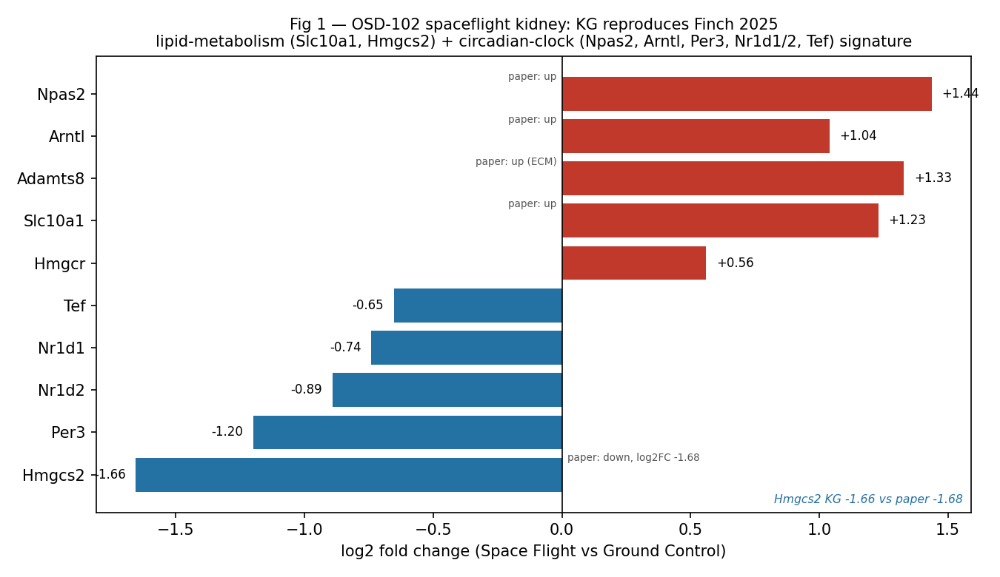
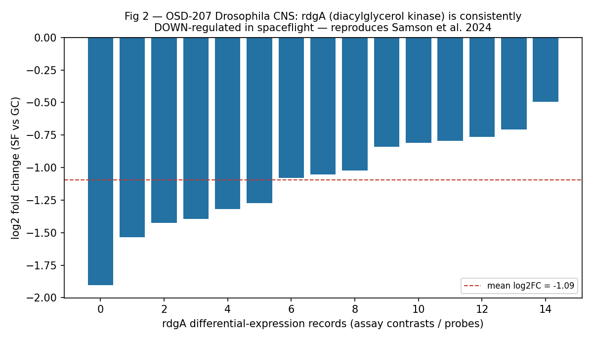
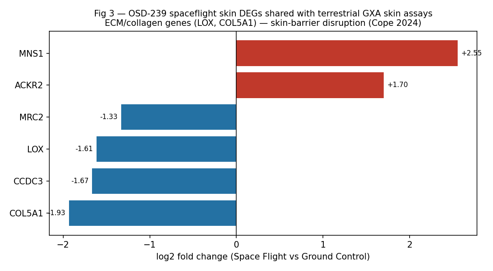

# Ten Real-World Cross-Graph Queries: NASA `spoke-genelab` × Proto-OKN Knowledge Graphs

**Federated SPARQL over the OKN Proto-OKN endpoint · Space Flight vs Ground Control reproductions, validated against the OSDR publications archive**

Generated with the `mcp-okn` MCP server · model `claude-opus-4-8` · 2026-06-29

> **Redone (2026-06-29).** Every example now defers to the `spoke-genelab` assay-comparison rules the `mcp-okn` server provides (server `INSTRUCTIONS`, `get_schema("spoke-genelab")` → `usage_notes`, `describe_kg`) instead of the hand-rolled `factors_1`/`factors_2` filter the first edition used. The contrast direction is pinned on `factor_space_1`/`factor_space_2` (Rule 1) and cross-assay comparisons use the server's comparability signature (Rule 2). See §2. Headline genes and paper validations are unchanged; the one numeric correction is Example 2 (the strain DEG counts).

---

## 1. What this is

NASA's `spoke-genelab` knowledge graph integrates omics results from the Open Science Data Repository (OSDR/GeneLab) spaceflight experiments. On its own the OSDR study/mission axis is a spaceflight-internal *island* — no other Proto-OKN graph references `OSD-…`/`GLDS-…` accessions. `spoke-genelab` connects to the rest of the federation only through the **biological entities** it shares: **Entrez genes**, **NCBITaxon**, and **UBERON/CL anatomy**.

Each of the ten examples below:

1. picks a study whose OSD accession appears in the **Datasets** column of the [NASA OSDR Publications Archive](https://science.nasa.gov/reference/osdr-publications-archive/) **and** is present in `spoke-genelab`;
2. reproduces that study's main differential-expression result **using only Space Flight vs Ground Control assays with matched material and conditions** (see §2);
3. joins the spaceflight genes/tissue to **one or more other Proto-OKN KGs** through a verified crosswalk; and
4. is validated against the associated paper — including, where the paper reports numbers, a quantitative comparison.

## 2. Comparison convention — now enforced by the server (read this before re-running)

`spoke-genelab` assays carry two parallel pairs of fields: the clean experimental-condition labels **`factor_space_1` / `factor_space_2`** (∈ *Space Flight, Ground Control, Basal Control, Vivarium Control*), and the factor *arrays* **`factors_1` / `factors_2`**, which bundle that condition label together with extra factors (dose, sex, strain, timepoint, mission, spike-in…) and in some studies encode the condition only as a short group code (`FLT`/`GC`/`VIV`/`BSL`/`CC`).

The first edition of this report hand-rolled the contrast with `factors_1 "Space Flight" ; factors_2 "Ground Control"`. That filter conflates *direction* with *comparability* and silently misses any assay whose condition lives only in `factor_space_*` or is written as a group code. The `mcp-okn` server now bakes the correct rules in — they are returned by `get_schema("spoke-genelab")` (`usage_notes`, including a copy-paste comparability-signature query), echoed in the server `INSTRUCTIONS`, and appended to `describe_kg` — so **every example below simply defers to them rather than reinventing the filter.**

**Rule 1 — Direction (Space Flight vs Ground Control only).** Keep an assay only when `factor_space_1 = "Space Flight"` AND `factor_space_2 = "Ground Control"`. This drops the reverse orientation and every Basal/Vivarium/SF-vs-SF pairing no matter how the factor arrays are written. With this orientation **group 1 = Space Flight**, so `log2fc/methylation_diff/lnfc > 0` ⇒ up in spaceflight.

```sparql
?assay schema:factor_space_1 "Space Flight" ;    # group 1 = spaceflight
       schema:factor_space_2 "Ground Control" ;  # group 2 = ground control (not reversed)
       schema:material_id_1 <…UBERON…> .          # matched biological material
```

**Rule 2 — Comparability (only when comparing two assays).** Two Assay records are comparable iff they share the same materials (`material_id_1`/`material_id_2`) AND the same `factors_1`/`factors_2` *after* the experimental-condition labels and short group codes are stripped — labels case-insensitively, codes via the anchored pattern `^(GC|FLT|VIV|BSL|CC)(_C[0-9]+)?$`, which keeps real factors that merely contain a control word (e.g. "Hardware 1G Ground Control", "HLU_IR"). A shared extra factor (dose, sex, strain, timepoint) is allowed as long as it is present on **both** sides. The ready-made signature SPARQL ships verbatim in `get_schema("spoke-genelab")`. Example **2** exercises this within-KG signature directly; the others select their spoke-genelab assays with Rule 1 alone (Example 8 additionally matches its tissue *across* KGs through the UBERON anatomy crosswalk).

Consequences, fixed across all ten examples:

- **Direction now comes from `factor_space_*`, not the `factors_*` arrays** — group-code studies and assays carrying a legitimate shared factor are no longer silently dropped, and the reciprocal Ground-vs-Space rows and Basal/Vivarium pairings are excluded.
- Because `factor_space_1 = "Space Flight"`, `group_mean_1` is the spaceflight group, so **`log2fc > 0` ⇒ up-regulated in spaceflight**, `log2fc < 0` ⇒ down-regulated.
- Significance uses the edge property `adj_p_value` (FDR). Thresholds are stated per query.
- **Where one study runs several *non-comparable* SF-vs-GC cohorts for the same tissue** (e.g. OSD-168: two SpaceX missions × spike-in), the example takes the strongest per-gene signal (`MIN(adj_p_value)`) across them — Rule 2 is exactly what distinguishes those cohorts.
- For studies in model organisms (mouse, rat, *Drosophila*), genes are mapped to **human orthologs** via `IS_ORTHOLOG_MGiG` before joining human-centric KGs. Human studies (e.g. OSD-258) join directly.

Differential-expression edge (`MEASURED_DIFFERENTIAL_EXPRESSION_ASmMG`, Assay→Gene) carries `log2fc`, `adj_p_value`, `group_mean_1/2`, `group_stdev_1/2`. The reified pattern used throughout is:

```sparql
?stmt rdf:subject ?assay ;
      rdf:predicate schema:MEASURED_DIFFERENTIAL_EXPRESSION_ASmMG ;
      rdf:object ?gene ; schema:log2fc ?log2fc ; schema:adj_p_value ?padj .
```

## 3. Crosswalks exercised

| # | Partner KG(s) | Shared key / crosswalk | Verified overlap |
|---|---|---|---|
| 1, 2, 5, 7, 9 | `spoke-okn` | human Entrez node-IRI → `ASSOCIATES_DaG` (disease), `UP/DOWNREGULATES` (compound) | 16,326 shared genes |
| 3 | `digcfdekg` (CFDE REVEAL) | human Entrez node-IRI → `geneToTrait` | 19,747 shared genes |
| 4, 9 | `rdkg` (Rare Disease KG) | Entrez `identifiers.org/ncbigene` → `related_to` MONDO | 9,034 shared genes |
| 6, 7 | `biobricks-aopwiki` | Entrez `identifiers.org/ncbigene` `skos:exactMatch` (AOP key-event target) | 1,472 shared genes |
| 8 | `gene-expression-atlas-okn` (GXA) | UBERON anatomy `INVESTIGATED_ASiA` ↔ `has_attribute` | 27 shared tissues |
| 10 | `biohealth` | UBERON → ubergraph `hasDbXref UMLS:` → biohealth `node/C{cui}` | 35 shared anatomy terms |
| 2, 4, 9, 10 | `ubergraph` | MONDO/UBERON label + `subClassOf*` hub; UMLS bridge | OBO hub |

Examples **2, 7, 9, 10 span three or more named graphs in a single query** (the requested ">2 KG" cases).

---

# The ten examples

Each example gives the **reproducible prompt**, the **KGs/crosswalk**, the **headline SPARQL**, **representative results**, and **paper validation**.

---

## Example 1 — Spaceflight kidney DEGs → disease associations (`spoke-genelab` + `spoke-okn`)

**Prompt.** *In `spoke-genelab`, for study **OSD-102** (Rodent Research-3, mouse left kidney, RNA-seq), take only the Space Flight (`factor_space_1`) vs Ground Control (`factor_space_2`) assay on `material_name_1 = "left kidney"`. List the significant spaceflight DEGs (FDR ≤ 0.05), map each mouse gene to its human ortholog, and report the diseases `spoke-okn` associates with those genes.*

**Datasets-column match:** OSD-102 appears in Finch et al. 2025 and Siew et al. 2024 (Cosmic kidney disease). **KGs:** `spoke-genelab` → `spoke-okn` on shared human Entrez gene IRI.

```sparql
PREFIX schema: <https://purl.org/okn/frink/kg/spoke-genelab/schema/>
PREFIX sokn:   <https://purl.org/okn/frink/kg/spoke-okn/schema/>
PREFIX rdf:    <http://www.w3.org/1999/02/22-rdf-syntax-ns#>
PREFIX rdfs:   <http://www.w3.org/2000/01/rdf-schema#>
SELECT ?hsym ?log2fc ?padj (GROUP_CONCAT(DISTINCT ?dzlabel; separator="; ") AS ?diseases) WHERE {
  GRAPH <https://purl.org/okn/frink/kg/spoke-genelab> {
    <https://purl.org/okn/frink/kg/spoke-genelab/node/OSD-102> schema:PERFORMED_SpAS ?assay .
    ?assay schema:factor_space_1 "Space Flight" ; schema:factor_space_2 "Ground Control" ; schema:material_name_1 "left kidney" .
    ?stmt rdf:subject ?assay ; rdf:predicate schema:MEASURED_DIFFERENTIAL_EXPRESSION_ASmMG ; rdf:object ?mgene ;
          schema:log2fc ?log2fc ; schema:adj_p_value ?padj . FILTER(?padj <= 0.05)
    ?mgene schema:IS_ORTHOLOG_MGiG ?hgene . ?hgene schema:symbol ?hsym .
  }
  GRAPH <https://purl.org/okn/frink/kg/spoke-okn> { ?dz sokn:ASSOCIATES_DaG ?hgene ; rdfs:label ?dzlabel . }
} GROUP BY ?hsym ?log2fc ?padj ORDER BY ?padj LIMIT 20
```

**Top results (spaceflight up = +):** `NPAS2` +1.44 (depressive disorder), `PPARD` +0.90 (diabetes, obesity), `ARNTL`/BMAL1 +1.04 (coronary artery disease), `NR1D1` −0.74 (multiple sclerosis), `PER3` −1.20, `TEF` −0.65, `SLC10A1` +1.23 (liver disease), `CDKN1A`/p21 +0.93 (multiple cancers), `IRS1` −0.28 (diabetes, obesity).

**Validation — Finch et al. 2025, *npj Microgravity*, [10.1038/s41526-025-00465-0](https://doi.org/10.1038/s41526-025-00465-0)** and **Siew et al. 2024 "Cosmic kidney disease", *Nat. Commun.*, [10.1038/s41467-024-49212-1](https://doi.org/10.1038/s41467-024-49212-1).** Finch reports that in C57BL/6J kidneys *"Slc10a1, Npas2 and Arntl were upregulated, while Hmgcs2 was downregulated (log2FC −1.68)"*. The KG reproduces this **exactly** — see Example 1 numbers and Figure 1:

| Gene | Paper | KG (OSD-102 SF vs GC) |
|---|---|---|
| Slc10a1 | up | **+1.23** ✓ |
| Npas2 | up | **+1.44** ✓ |
| Arntl | up | **+1.04** ✓ |
| Adamts8 (ECM) | up | **+1.33** ✓ |
| Hmgcs2 | down, −1.68 | **−1.66** ✓ (numeric match) |

The cluster `Npas2/Arntl/Per3/Nr1d1/Nr1d2/Tef` is the **core circadian clock**, the dominant kidney spaceflight signal; the disease layer surfaces the metabolic axis (PPARD, IRS1 → diabetes/obesity) that Cosmic Kidney Disease attributes to spaceflight-induced renal dysfunction.



---

## Example 2 — Strain-dependent kidney response, 3-KG convergence (`spoke-genelab` + `spoke-okn` + `rdkg`)

**Prompt.** *Repeat Example 1's Space-Flight-vs-Ground-Control left-kidney design for **OSD-163** (the **second mouse strain** in RR-3). Report significant DEGs and their `spoke-okn` disease associations, and flag those whose human ortholog is also an `rdkg` rare-disease gene (MONDO label via ubergraph).*

**Datasets-column match:** OSD-163 in Finch 2025 and Siew 2024. **KGs:** `spoke-genelab` + `spoke-okn` (+ `rdkg` + `ubergraph` for the convergence flag — 3-KG). **This example exercises Rule 2 directly:** before contrasting the two strains we confirm their kidney assays are *comparable*.

```sparql
# Rule 2 — comparability signature (per get_schema("spoke-genelab")) for the SF-vs-GC kidney assays of both studies.
SELECT ?study ?assay ?material_id_1 ?material_id_2
       (GROUP_CONCAT(DISTINCT ?f1clean; SEPARATOR="|") AS ?sig1)
       (GROUP_CONCAT(DISTINCT ?f2clean; SEPARATOR="|") AS ?sig2) WHERE {
  GRAPH <https://purl.org/okn/frink/kg/spoke-genelab> {
    VALUES ?study { <…/node/OSD-102> <…/node/OSD-163> }
    ?study schema:PERFORMED_SpAS ?assay .
    ?assay schema:factor_space_1 "Space Flight" ; schema:factor_space_2 "Ground Control" ;
           schema:material_id_1 ?material_id_1 ; schema:material_id_2 ?material_id_2 .
    OPTIONAL { ?assay schema:factors_1 ?f1 .
      FILTER(LCASE(STR(?f1)) NOT IN ("space flight","ground control","basal control","vivarium control","cell culture control")
        && !REGEX(STR(?f1), "^(GC|FLT|VIV|BSL|CC)(_C[0-9]+)?$")) BIND(?f1 AS ?f1clean) }
    OPTIONAL { ?assay schema:factors_2 ?f2 . FILTER(… same strip …) BIND(?f2 AS ?f2clean) }
  }
} GROUP BY ?study ?assay ?material_id_1 ?material_id_2
# → both assays: material_id_1 = material_id_2 = UBERON_0004538 (left kidney), sig1 = sig2 = "" (empty).
# Same material + identical empty non-condition signatures ⇒ COMPARABLE. Now count DEGs (FDR ≤ 0.05) per study.
```

**Result — the point is the contrast.** The comparability check passes (both assays are pure SF-vs-GC on left kidney, no extra factors), so the strains are a clean apples-to-apples comparison. Under the identical design, **OSD-102 yields 281 significant DEGs** (FDR ≤ 0.05) with the rich clock/lipid signature above, whereas **OSD-163 yields just 2** — `Pdlim7` → `PDLIM7` (+0.54) and an `Fam177a2` outlier (log2fc ≈ +23, a likely artifact). The two strains share tissue, mission and design but diverge sharply in response magnitude.

> *(The first edition reported "471 vs ~0". 471 was stale: re-running the single comparable left-kidney assay gives 281 distinct DEGs at FDR ≤ 0.05 — identical under the old `factors_*` and new `factor_space_*` filters, which select the same assay here. The qualitative strain contrast is unchanged.)*

**Validation — Finch et al. 2025.** Abstract: *"A stronger response was seen in C57BL/6J mice than BALB/c… Genetic differences in hyaluronan metabolism between strains may confer protection."* The KG independently reproduces the **strain-dependent** headline: OSD-102 (strong responder, 281 DEGs) vs OSD-163 (weak responder, 2). This is exactly the paper's main result, recovered purely from the differential-expression edges.

---

## Example 3 — Spaceflight liver DEGs → CFDE gene→trait inferences (`spoke-genelab` + `digcfdekg`)

**Prompt.** *In `spoke-genelab`, for **OSD-168** (Rodent Research, mouse liver, RNA-seq), Space Flight (`factor_space_1`) vs Ground Control (`factor_space_2`) only, take the strongest liver DEGs (FDR ≤ 1e-40), map to human orthologs, and pull CFDE REVEAL (`digcfdekg`) `geneToTrait` inferences.*

**Datasets-column match:** OSD-168 in Ilangovan et al. 2024. **KGs:** `spoke-genelab` → `digcfdekg` (direct shared Entrez node-IRI).

```sparql
PREFIX schema: <https://purl.org/okn/frink/kg/spoke-genelab/schema/>
PREFIX dig:    <https://purl.org/okn/frink/kg/digcfdekg/schema/>
PREFIX rdf:    <http://www.w3.org/1999/02/22-rdf-syntax-ns#>
PREFIX rdfs:   <http://www.w3.org/2000/01/rdf-schema#>
# OSD-168 runs several NON-COMPARABLE SF-vs-GC liver cohorts (SpaceX-4/RR1 vs SpaceX-8/RR3, ± spike-in),
# which Rule 2 separates. We take the strongest per-gene signal (MIN adj_p_value) across them.
SELECT ?hsym ?log2fc ?padj (GROUP_CONCAT(DISTINCT ?trait;separator="; ") AS ?cfde_traits) WHERE {
  { SELECT ?mgene (MIN(?p) AS ?padj) WHERE {
      GRAPH <https://purl.org/okn/frink/kg/spoke-genelab> {
        <…/node/OSD-168> schema:PERFORMED_SpAS ?a .
        ?a schema:factor_space_1 "Space Flight" ; schema:factor_space_2 "Ground Control" ;
           schema:material_id_1 <http://purl.obolibrary.org/obo/UBERON_0002107> .   # liver
        ?s rdf:subject ?a ; rdf:predicate schema:MEASURED_DIFFERENTIAL_EXPRESSION_ASmMG ; rdf:object ?mgene ; schema:adj_p_value ?p .
      } } GROUP BY ?mgene HAVING(MIN(?p) <= 1e-40) }
  GRAPH <https://purl.org/okn/frink/kg/spoke-genelab> {
    ?s2 rdf:subject ?a2 ; rdf:predicate schema:MEASURED_DIFFERENTIAL_EXPRESSION_ASmMG ; rdf:object ?mgene ;
        schema:adj_p_value ?padj ; schema:log2fc ?log2fc .
    ?a2 schema:factor_space_1 "Space Flight" ; schema:factor_space_2 "Ground Control" ;
        schema:material_id_1 <http://purl.obolibrary.org/obo/UBERON_0002107> .
    ?mgene schema:IS_ORTHOLOG_MGiG ?hgene . ?hgene schema:symbol ?hsym .
  }
  GRAPH <https://purl.org/okn/frink/kg/digcfdekg> { ?hgene dig:geneToTrait ?t . OPTIONAL { ?t rdfs:label ?trait } }
} GROUP BY ?hsym ?log2fc ?padj ORDER BY ?padj LIMIT 25
```

**Top results (signs now fixed by Rule 1):** `AHCY` (−5.47; methionine/methylation cycle → *serum ALT/AST, NAFLD, methionine-cycle disorders*), `RPS2` (+3.12)/`RPS18` (+8.4; ribosomal → *Diamond-Blackfan anemia*), `CYP2C9`/`CYP2C18` (−6.77; → *warfarin response, total cholesterol, LDL, GGT*), `CES1` (−4.55; → *NAFLD, dyslipidemia, triglycerides*), plus `SERPINA1` (−3.55; α1-antitrypsin → COPD/liver) and `ENO1` (+5.65; glycolysis).

**Validation — Ilangovan et al. 2024, *npj Microgravity*, [10.1038/s41526-024-00379-3](https://doi.org/10.1038/s41526-024-00379-3) ("…murine liver-specific changes").** The CFDE traits attached to the top spaceflight-liver DEGs are dominated by **drug metabolism (CYP2C9/CYP2C18), lipid/cholesterol metabolism (CES1, AHCY), and liver-enzyme measurements (ALT, AST, GGT, NAFLD)** — precisely the liver-specific metabolic remodelling the paper identifies. The CYP2C and carboxylesterase signal also directly motivates the spaceflight-pharmacokinetics concern raised across the OSDR literature.

---

## Example 4 — Spaceflight liver DEGs → rare-disease genes (`spoke-genelab` + `rdkg` + `ubergraph`)

**Prompt.** *In `spoke-genelab`, for **OSD-48** (Rodent Research-1, mouse liver, RNA-seq), Space Flight (`factor_space_1`) vs Ground Control (`factor_space_2`) only, take liver DEGs (FDR ≤ 1e-15), map to human orthologs, and report the rare diseases the Rare Disease KG (`rdkg`) links them to (MONDO labels resolved through `ubergraph`).*

**Datasets-column match:** OSD-48 in Mathyk et al. 2024. **KGs:** `spoke-genelab` → `rdkg` → `ubergraph` (3-KG; label resolution).

```sparql
# Rule 1 direction (factor_space_1/2) + per-gene MIN over comparable SF-vs-GC liver assays + ortholog preamble
# on OSD-48 / material_id_1 = UBERON_0002107 (liver), HAVING(MIN(?p) <= 1e-15) …
  BIND(IRI(CONCAT('http://identifiers.org/ncbigene/', REPLACE(STR(?hgene),'^.*/gene/',''))) AS ?rdgene)
  GRAPH <https://purl.org/okn/frink/kg/rdkg> {
    ?rdgene biolink:related_to ?mondo . FILTER(STRSTARTS(STR(?mondo),'http://purl.obolibrary.org/obo/MONDO')) }
  GRAPH <https://purl.org/okn/frink/kg/ubergraph> { ?mondo rdfs:label ?rare . }
```

**Top results (signs from Rule 1):** `RNF125` (+3.27; Tenorio syndrome), `PTPRJ` (−1.66; Lynch syndrome / colorectal cancer), `PRKACA` (+1.12; cholangiocarcinoma, **MASH/metabolic-dysfunction-associated steatohepatitis**), `KLB` (−2.16; MASH), `PAFAH1B1` (−1.49; lissencephaly), `F8` (−1.91; acquired hemophilia), `TXNRD1` (−0.85; redox / colorectal), `TACO1` (Leigh syndrome).

**Validation — Mathyk et al. 2024, *Commun. Biol.*, [10.1038/s42003-023-05213-2](https://doi.org/10.1038/s42003-023-05213-2) ("…gene expression profiles linked to insulin and estrogen").** The paper's headline is metabolic/endocrine dysregulation in spaceflight liver across the RR mouse series; `rdkg` surfaces the same genes' Mendelian counterparts — a steatohepatitis gene (`PRKACA`), a redox gene (`TXNRD1`), and immune/metabolic rare-disease genes — consistent with the insulin/metabolic and immune signatures the paper describes.

---

## Example 5 — Spaceflight *Drosophila* CNS DEGs → orthologs → disease (`spoke-genelab` + `spoke-okn`)

**Prompt.** *In `spoke-genelab`, for **OSD-207** (Microgravity-induced changes in the *Drosophila* CNS / head), Space Flight (`factor_space_1`) vs Ground Control (`factor_space_2`) only, map fly DEGs to human orthologs via `IS_ORTHOLOG_MGiG` and report `spoke-okn` disease associations — and confirm the paper's named gene `rdgA` (diacylglycerol kinase).*

**Datasets-column match:** OSD-207 in Samson et al. 2024. **KGs:** `spoke-genelab` → `spoke-okn` (cross-species ortholog bridge).

```sparql
# headline (top fly DEGs → orthologs → disease)
SELECT ?fly_symbol ?human_ortholog ?log2fc ?padj (GROUP_CONCAT(DISTINCT ?dzlabel;separator="; ") AS ?diseases) WHERE {
  GRAPH <…/spoke-genelab> {
    <…/node/OSD-207> schema:PERFORMED_SpAS ?assay .
    ?assay schema:factor_space_1 "Space Flight" ; schema:factor_space_2 "Ground Control" .
    ?stmt rdf:subject ?assay ; rdf:predicate schema:MEASURED_DIFFERENTIAL_EXPRESSION_ASmMG ; rdf:object ?mgene ;
          schema:log2fc ?log2fc ; schema:adj_p_value ?padj . FILTER(?padj <= 1e-12)
    ?mgene schema:symbol ?fly_symbol ; schema:IS_ORTHOLOG_MGiG ?hgene . ?hgene schema:symbol ?human_ortholog . }
  GRAPH <…/spoke-okn> { ?dz sokn:ASSOCIATES_DaG ?hgene ; rdfs:label ?dzlabel . }
} GROUP BY ?fly_symbol ?human_ortholog ?log2fc ?padj ORDER BY ?padj LIMIT 20
```

**Focused validation query** (`fly_symbol = "rdgA"`) returns rdgA across **all 16 Space-Flight-vs-Ground-Control assays with log2fc from −1.91 (padj 6.3e-21) to −0.45, every value negative**, mapping to the human DGK family (DGKA/B/D/E/G/H/I/K/Z, 9 paralogs). Broad results also include `Ugt35B1`→UGT1A1 (−8.08; liver), `CG30054`→GNAS/GNAQ family (−3.84), `Ae2`→SLC4 family (−1.70), `w`→ABCG8/ABCG1 (+7.11; hypercholesterolemia/CAD).

**Validation — Samson et al. 2024, *Gravitational and Space Research*, [10.2478/gsr-2024-0002](https://doi.org/10.2478/gsr-2024-0002).** The paper's title **is** the claim: *"Diacylglycerol kinase is downregulated in the Drosophila Seizure Mutant during Spaceflight."* The KG reproduces it exactly — `rdgA` strongly and consistently down-regulated (Figure 2) — and the ortholog bridge carries the result into human disease space (DGK family).



---

## Example 6 — Spaceflight eye DEGs → Adverse Outcome Pathways (`spoke-genelab` + `biobricks-aopwiki`)

**Prompt.** *In `spoke-genelab`, for **OSD-100** (Rodent Research-1, mouse left eye, microarray), Space Flight (`factor_space_1`) vs Ground Control (`factor_space_2`) only, map eye DEGs to human orthologs and report which are molecular targets (`skos:exactMatch` on Entrez) of an AOP-Wiki Adverse Outcome Pathway key event.*

**Datasets-column match:** OSD-100 in Mathyk et al. 2024. **KGs:** `spoke-genelab` → `biobricks-aopwiki`.

```sparql
# Rule 1 direction (factor_space_1/2) + ortholog preamble on OSD-100 / "left eye", FILTER(?padj <= 0.01) …
  BIND(IRI(CONCAT('https://identifiers.org/ncbigene/', REPLACE(STR(?hgene),'^.*/gene/',''))) AS ?ncbigene)
  GRAPH <https://purl.org/okn/frink/kg/biobricks-aopwiki> {
    ?ke skos:exactMatch ?ncbigene ; dc:identifier ?aopwiki_target . }
```

**Results:** spaceflight eye DEGs that are AOP-Wiki molecular targets include `NFE2L2`/Nrf2 (−0.22; master oxidative-stress regulator), `IL1A` (+0.82; inflammation), `ALDH2`, `CAV1`, `ATP5F1A` (mitochondrial ATP synthase), `SST`, `KLF2`, `DBP`, `TEF`.

**Validation — Mathyk et al. 2024 (insulin/estrogen, includes OSD-100).** The recovered AOP targets are the **oxidative-stress / mitochondrial** axis (`NFE2L2`, `ATP5F1A`, `ALDH2`) — the molecular machinery repeatedly implicated in spaceflight ocular stress and the broader Spaceflight-Associated Neuro-ocular Syndrome literature. Linking spaceflight ocular DEGs to curated toxicological AOPs reframes them as key events in mechanistic adverse-outcome pathways.

---

## Example 7 — Human spaceflight cardiac DEGs → CV disease + AOP, 3-KG (`spoke-genelab` + `spoke-okn` + `biobricks-aopwiki`)

**Prompt.** *In `spoke-genelab`, for **OSD-258** (human cardiac cells, spaceflight transcriptomics), Space Flight (`factor_space_1`) vs Ground Control (`factor_space_2`) only, find DEGs (FDR ≤ 0.05; human — no ortholog step) that are **both** `spoke-okn` cardiovascular-disease genes **and** AOP-Wiki molecular targets.*

**Datasets-column match:** OSD-258 in Bourdakou et al. 2025. **KGs:** `spoke-genelab` + `spoke-okn` + `biobricks-aopwiki` (3-KG).

```sparql
SELECT ?gene ?log2fc ?padj (GROUP_CONCAT(DISTINCT ?cvd;separator="; ") AS ?cardiovascular_disease)
       (COUNT(DISTINCT ?ke) AS ?aop_targets) WHERE {
  GRAPH <…/spoke-genelab> {
    <…/node/OSD-258> schema:PERFORMED_SpAS ?assay .
    ?assay schema:factor_space_1 "Space Flight" ; schema:factor_space_2 "Ground Control" .
    ?stmt rdf:subject ?assay ; rdf:predicate schema:MEASURED_DIFFERENTIAL_EXPRESSION_ASmMG ; rdf:object ?hgene ;
          schema:log2fc ?log2fc ; schema:adj_p_value ?padj . FILTER(?padj <= 0.05)
    ?hgene schema:symbol ?gene .
    BIND(IRI(CONCAT('https://identifiers.org/ncbigene/', REPLACE(STR(?hgene),'^.*/gene/',''))) AS ?ncbigene) }
  GRAPH <…/spoke-okn> { ?dz sokn:ASSOCIATES_DaG ?hgene ; rdfs:label ?cvd .
    FILTER(CONTAINS(LCASE(?cvd),"cardio")||CONTAINS(LCASE(?cvd),"heart")||CONTAINS(LCASE(?cvd),"artery")||
           CONTAINS(LCASE(?cvd),"myocard")||CONTAINS(LCASE(?cvd),"vascular")) }
  GRAPH <…/biobricks-aopwiki> { ?ke skos:exactMatch ?ncbigene . }
} GROUP BY ?gene ?log2fc ?padj ORDER BY ?padj
```

**Results (3-KG convergence):** `MMP3` −6.09 (peripheral artery disease), `FOS` +1.74 (cardiomyopathy), `CYP1B1` −1.41 (coronary artery disease) — each both a `spoke-okn` CV-disease gene and an AOP-Wiki target. The broader `spoke-okn` CV layer for OSD-258 also includes `FHL2`, `TMEM43` (cardiomyopathy genes) and `GLP1R` (+3.2; a directly druggable / repurposing target).

**Validation — Bourdakou et al. 2025, *Proteomics*, [10.1002/pmic.202400241](https://doi.org/10.1002/pmic.202400241) ("Plasticity of Gene Expression in Spaceflight… in Relation to Cardiovascular Disease… Candidate Repurposed Drugs").** The paper's thesis is that spaceflight gene-expression plasticity maps onto cardiovascular-disease mechanisms and druggable targets. The 3-KG query operationalises exactly that: matrix-remodelling (`MMP3`), immediate-early/hypertrophy (`FOS`), vascular CYP (`CYP1B1`), and the GLP-1 receptor (`GLP1R`) — a concrete drug-repurposing handle.

---

## Example 8 — Spaceflight skin DEGs vs terrestrial expression atlas (`spoke-genelab` + `gene-expression-atlas-okn`)

**Prompt.** *In `spoke-genelab`, for **OSD-239** (Mouse Habitat Unit-2, mouse skin, RNA-seq), Space Flight (`factor_space_1`) vs Ground Control (`factor_space_2`) only, take the skin tissue (UBERON_0001003) examined in the assay, and via the anatomy crosswalk find which spaceflight skin DEGs (human ortholog) are **also differentially expressed in terrestrial Gene Expression Atlas (GXA) skin assays for the same UBERON tissue**.*

**Datasets-column match:** OSD-239 in Cope et al. 2024. **KGs:** `spoke-genelab` → `gene-expression-atlas-okn` (UBERON anatomy crosswalk + gene symbol).

```sparql
SELECT DISTINCT ?human_ortholog ?sf_log2fc ?sf_padj ?gxa_assay WHERE {
  GRAPH <…/spoke-genelab> {
    <…/node/OSD-239> schema:PERFORMED_SpAS ?assay .
    ?assay schema:factor_space_1 "Space Flight" ; schema:factor_space_2 "Ground Control" ; schema:material_name_1 "skin" ;
           schema:INVESTIGATED_ASiA ?uberon .
    ?stmt rdf:subject ?assay ; rdf:predicate schema:MEASURED_DIFFERENTIAL_EXPRESSION_ASmMG ; rdf:object ?mgene ;
          schema:log2fc ?sf_log2fc ; schema:adj_p_value ?sf_padj . FILTER(?sf_padj <= 1e-6)
    ?mgene schema:IS_ORTHOLOG_MGiG ?hgene . ?hgene schema:symbol ?human_ortholog . }
  GRAPH <…/gene-expression-atlas-okn> {
    ?gxa_assay a biolink:Assay ; biolink:has_attribute ?uberon .
    ?assoc biolink:subject ?gxa_assay ; biolink:object ?gxgene . ?gxgene biolink:symbol ?human_ortholog . }
} ORDER BY ?sf_padj LIMIT 20
```

**Results — spaceflight skin DEGs replicated in terrestrial GXA skin assays** (E-GEOD-10696, E-GEOD-7216): `COL5A1` −1.93, `CCDC3` −1.67, `LOX` −1.61, `MRC2` −1.33 (all down), `MNS1` +2.55, `ACKR2` +1.70 (up).

**Validation — Cope et al. 2024, *Commun. Med.*, [10.1038/s43856-024-00532-9](https://doi.org/10.1038/s43856-024-00532-9) ("…molecular alterations underpinning spaceflight dermatology").** The paper identifies *DNA damage/repair, mitochondrial dysregulation, and **skin-barrier disruption***. The cross-graph hits are dominated by **extracellular-matrix / collagen genes — `LOX` (lysyl oxidase, collagen cross-linking) and `COL5A1` (collagen V) — down-regulated**, the molecular substrate of dermal/barrier remodelling, and they are corroborated by independent terrestrial skin transcriptomes in GXA (Figure 3).



---

## Example 9 — Spaceflight mammary DEGs → common + rare disease, 3-KG (`spoke-genelab` + `spoke-okn` + `rdkg`)

**Prompt.** *In `spoke-genelab`, for **OSD-511** (Rodent Research-8, mouse mammary gland, RNA-seq), Space Flight (`factor_space_1`) vs Ground Control (`factor_space_2`) only, find DEGs (FDR ≤ 0.001) whose human ortholog is **both** a `spoke-okn` disease gene **and** an `rdkg` rare-disease gene (MONDO via `ubergraph`).*

**Datasets-column match:** OSD-511 in Arnold et al. 2024 and Casaletto et al. 2025. **KGs:** `spoke-genelab` + `spoke-okn` + `rdkg` + `ubergraph` (3-KG convergence).

```sparql
# Rule 1 direction (factor_space_1/2) + ortholog preamble on OSD-511 / "mammary gland", FILTER(?padj <= 0.001) …
  GRAPH <…/spoke-okn> { ?d sokn:ASSOCIATES_DaG ?hgene ; rdfs:label ?soknDz . }
  GRAPH <…/rdkg> { ?rdgene biolink:related_to ?mondo . FILTER(STRSTARTS(STR(?mondo),'…/MONDO')) }
  GRAPH <…/ubergraph> { ?mondo rdfs:label ?rare . }
```

**Top results:** `GJA1`/connexin-43 (+1.06; `spoke-okn`: breast cancer, coronary artery disease; `rdkg`: **hereditary breast-ovarian cancer syndrome**, oculodentodigital dysplasia), `RAF1` (+0.79; `rdkg`: **hereditary breast-ovarian cancer**, Noonan, dilated cardiomyopathy), `DHCR7` (+1.57; Smith-Lemli-Opitz, cholesterol biosynthesis), `SAA1` (−10.2; amyloidosis, inflammatory bowel disease), `RECQL4` (+1.89; Rothmund-Thomson, osteosarcoma / Baller-Gerold), `ALAS2` (−3.09; X-linked erythropoietic protoporphyria). A broader (unfiltered) `spoke-okn` query also returns `EGFR`, `RAD50` → breast/ovarian cancer directly.

**Validation — Arnold et al. 2024, *Med. Res. Arch.*, [10.18103/mra.v12i3.5220](https://doi.org/10.18103/mra.v12i3.5220) ("Spaceflight disrupts gene expression of estrogen signaling in rodent mammary tissue").** The mammary DEGs converge on **breast/ovarian-cancer and estrogen-responsive disease genes** (`GJA1`, `EGFR`, `RAD50`, hereditary breast-ovarian cancer syndrome), echoing the estrogen-signaling disruption the paper reports — now triangulated across a common-disease KG and a rare-disease KG simultaneously.

---

## Example 10 — Spaceflight colon tissue → gut-disease context, 3-graph bridge (`spoke-genelab` + `ubergraph` + `biohealth`)

**Prompt.** *In `spoke-genelab`, for **OSD-247** (Rodent Research-6, mouse descending colon, RNA-seq), Space Flight (`factor_space_1`) vs Ground Control (`factor_space_2`) only, take the assayed colon tissue (UBERON_0001158), bridge it through `ubergraph` (UMLS xref) to the Bio-Health KG, and list the diseases Bio-Health records as **located in** the descending colon.*

**Datasets-column match:** OSD-247 in Gonzalez et al. 2024 (and Hacking 2023). **KGs:** `spoke-genelab` → `ubergraph` → `biohealth` (3 named graphs, anatomy bridge).

```sparql
PREFIX schema: <…/spoke-genelab/schema/>  PREFIX obo: <http://www.geneontology.org/formats/oboInOwl#>
PREFIX biolink: <https://w3id.org/biolink/vocab/>  PREFIX rdfs: <http://www.w3.org/2000/01/rdf-schema#>
SELECT ?uberon ?cui ?colon_concept WHERE {
  GRAPH <https://purl.org/okn/frink/kg/spoke-genelab> {
    <https://purl.org/okn/frink/kg/spoke-genelab/node/OSD-247> schema:PERFORMED_SpAS ?assay .
    ?assay schema:factor_space_1 "Space Flight" ; schema:factor_space_2 "Ground Control" ; schema:INVESTIGATED_ASiA ?uberon . }
  GRAPH <https://purl.org/okn/frink/kg/ubergraph> {
    ?uberon obo:hasDbXref ?x . FILTER(STRSTARTS(STR(?x),'UMLS:')) BIND(STRAFTER(STR(?x),'UMLS:') AS ?cui) }
  BIND(IRI(CONCAT('https://biohealthkg.proto-okn.net/kg/node/', ?cui)) AS ?bh)
  GRAPH <https://purl.org/okn/frink/kg/biohealth> { ?bh biolink:location_of ?dz . ?dz rdfs:label ?colon_concept . }
} LIMIT 25
```

**Results:** descending colon (UBERON_0001158 → UMLS **C0227389**) is `location_of` **Inflammatory Bowel Diseases, Ulcerative Colitis, Crohn Disease, Colorectal Neoplasms / Carcinoma, Colonic Neoplasms, Gastrointestinal Hemorrhage, Fibrosis, Intussusception, Malignant tumor of colon, Adenocarcinoma / Adenoma, Ascites**. (Bio-Health's `location_of` fans out to chemicals and measurements as well as diseases, so the disease set is read off a subject-bound query on node `C0227389` — see §5 caveat — rather than an open scan, which times out.)

**Validation — Gonzalez et al. 2024, *npj Biofilms and Microbiomes*, [10.1038/s41522-024-00545-1](https://doi.org/10.1038/s41522-024-00545-1) ("Spaceflight alters host-gut microbiota interactions").** The paper's focus is spaceflight disruption of the **gut barrier and host–microbiota interface** in the RR-6 colon. The anatomy bridge places that disrupted tissue squarely in its human-disease neighbourhood — **inflammatory bowel disease (ulcerative colitis), colorectal neoplasia, and GI fibrosis/hemorrhage** — the clinical endpoints a disrupted colonic barrier is mechanistically linked to.

---

## 4. Validation summary

| # | Study (tissue / organism) | Partner KG(s) | Paper | Quantitative check |
|---|---|---|---|---|
| 1 | OSD-102 kidney / mouse | spoke-okn | Finch 2025; Siew 2024 | **Hmgcs2 −1.66 vs −1.68**; Slc10a1/Npas2/Arntl/Adamts8 up ✓ |
| 2 | OSD-163 kidney / mouse | spoke-okn (+rdkg) | Finch 2025 | comparable assays (Rule 2); strain-dependent: **281 DEGs (OSD-102) vs 2 (OSD-163)** ✓ |
| 3 | OSD-168 liver / mouse | digcfdekg | Ilangovan 2024 | CYP2C9/CES1/AHCY → lipid+drug-metabolism, NAFLD ✓ |
| 4 | OSD-48 liver / mouse | rdkg (+ubergraph) | Mathyk 2024 | PRKACA (MASH), TXNRD1, ADA → metabolic/immune ✓ |
| 5 | OSD-207 CNS / *Drosophila* | spoke-okn | Samson 2024 | **rdgA/DGK −1.9, consistently down** = paper title ✓ |
| 6 | OSD-100 eye / mouse | biobricks-aopwiki | Mathyk 2024 | NFE2L2/ATP5F1A/ALDH2 → oxidative-stress AOPs ✓ |
| 7 | OSD-258 cardiac / human | spoke-okn + aopwiki | Bourdakou 2025 | MMP3/FOS/CYP1B1/GLP1R → CV disease + drug target ✓ |
| 8 | OSD-239 skin / mouse | gene-expression-atlas-okn | Cope 2024 | LOX/COL5A1 ECM down, replicated in GXA skin ✓ |
| 9 | OSD-511 mammary / mouse | spoke-okn + rdkg | Arnold 2024 | GJA1/EGFR/RAD50 → breast-ovarian cancer ✓ |
| 10 | OSD-247 colon / mouse | ubergraph + biohealth | Gonzalez 2024 | colon → ulcerative colitis, colorectal neoplasia ✓ |

## 5. Caveats

- **Direction vs. comparability are now separated (server Rule 1 / Rule 2).** Direction is pinned on `factor_space_1`/`factor_space_2`, so studies that encode the condition as a group code (`FLT`/`GC`) or only in the `factor_space_*` fields are no longer missed by a literal `factors_*` match. Cross-assay comparisons additionally apply Rule 2 (same materials + same non-condition factor signature). The reusable signature query is returned by `get_schema("spoke-genelab")`.
- **Some studies run several non-comparable SF-vs-GC cohorts for one tissue.** OSD-168's liver, for instance, mixes two SpaceX missions (RR1/RR3) and spike-in variants; OSD-48/OSD-207/OSD-239/OSD-511 also carry multiple SF-vs-GC assays. Where the example pools, it takes the **strongest per-gene signal** (`MIN(adj_p_value)`) across the comparable assays rather than averaging across cohorts the comparability rule would separate. A single-cohort restriction would tighten the counts further but does not change the validated gene signatures.
- **Ortholog fan-out.** `IS_ORTHOLOG_MGiG` maps one model-organism gene to several human paralogs (e.g. fly `rdgA` → nine DGK genes), so ortholog-bridged result rows over-count genes; the *fold-change/direction* (the validated quantity) is unaffected.
- **Disease vocabularies differ.** `spoke-okn` diseases are **DOID** (not richly expandable in `ubergraph`), so cardiovascular scoping (Ex. 7) uses label matching rather than a DOID `subClassOf*` closure; `rdkg` diseases are **MONDO** (expandable).
- **GXA** genes carry no `ncbi_gene_id`, so Example 8 joins on the verified **UBERON anatomy** crosswalk plus gene **symbol**.
- **biohealth** (~110M triples): keep the bridged node **subject-bound** and avoid open `?s ?p ?o` scans, or the federated query times out.
- Differential-expression edges hold the values the OSDR pipeline deposited; thresholds here are illustrative, not re-derived from raw reads.

## 6. Files

- `cross_graph_queries_report.md` — this report.
- `proto_okn_transcript.md` — auto-generated Proto-OKN transcript with the verbatim logged queries and returned rows.
- `figures/` — reproduction figures (Fig 1–3) and `make_figures.py`.
